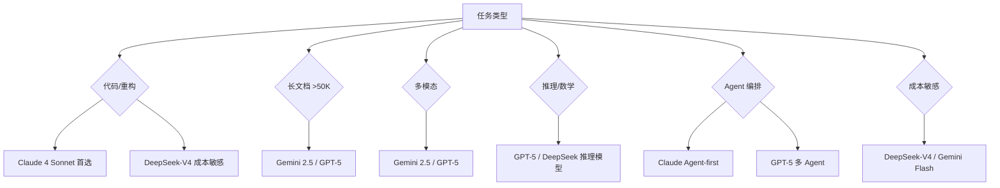
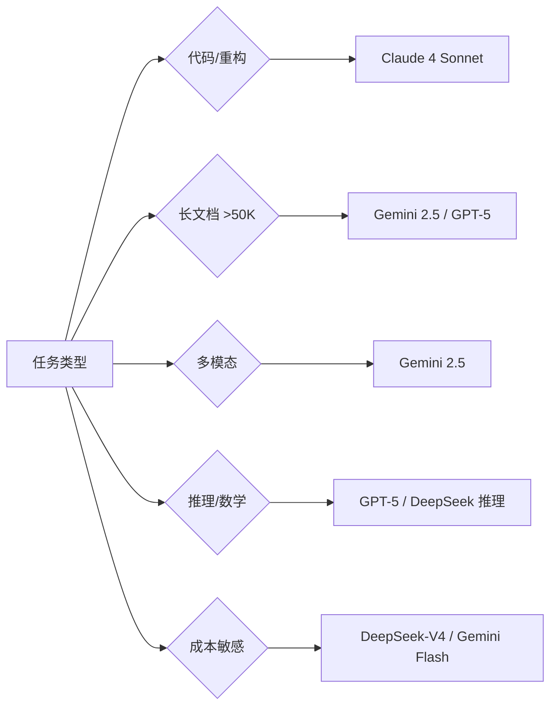

# 大模型选型与横评

> 2026 年高频考点：GPT / Claude / Gemini / DeepSeek 怎么选？价格、性能、场景怎么权衡？本题给横评框架 + 决策树，答法不背厂商宣传词，凭选型逻辑拿分。
> 数字纪律：价格为行业公开报道（来源见各小节），无「我们线上实测」。
> 已重写：通用示例替代 interview 原文。

**本文核心**：没有通用最优——选型看「任务类型 × 上下文长度 × 成本预算 × 数据合规」四维，缺一维不决策。选型是 AI 服务层的事，业务底座不绑模型。

## 一句话摘要

2026 模型选型四维框架：任务类型 × 上下文长度 × 成本预算 × 数据合规，先判场景再选模型；生产环境用 LLM Gateway 做 A/B 路由+fallback，不一次性锁死。

▶ 快速定位：2026 速览（一）· 横评维度（二）· 决策树（三）· 时效刷新（四）

## 一、2026 主流模型速览（30 秒版）

| 模型 | 厂商 | 上下文 | 定价锚点（input/output per 1M tok） | 优势场景 |
|------|------|--------|--------------------------------------|---------|
| GPT-5 系列 | OpenAI | 1M | ~$15/$60 | 通用推理/创意/多模态 |
| Claude 4 Sonnet/Opus | Anthropic | 200K | ~$15/$75 | 长文本/代码/安全合规 |
| Gemini 2.5 Pro/Ultra | Google | 1M | ~$12/$50 | 多模态/结构化写作 |
| DeepSeek-V4 | DeepSeek | 128K | ~$2/$6 | 高性价比推理/代码 |

**30 秒结论**：没有通用最优——选型看「任务类型 × 上下文长度 × 成本预算 × 数据合规」四维，缺一维不决策。

::: details 点击查看答案

**选型四维**：
1. **任务类型**：代码/推理/创意/多模态，各家最强项不同（Claude 代码、Gemini 多模态、DeepSeek 推理）
2. **上下文长度**：>100K 选 Gemini/GPT-5；<50K Claude/DeepSeek 够用
3. **成本预算**：DeepSeek 便宜 5-10 倍；GPT-5/Claude 强项场景才溢价
4. **数据合规**：国内可用性（DeepSeek 自建）、企业数据政策（Claude 不训输入）、API 稳定性

:::

## 二、深度横评（追问链 + 机制穿透）

### 2.1 推理能力
- **数学/逻辑**：GPT-5 > Claude 4 > Gemini 2.5 > DeepSeek（IMO 级别）
- **长文本推理**：Claude 4（200K 窗口内一致性）> GPT-5 > Gemini 2.5 > DeepSeek
- **代码能力**：Claude 4 ≈ DeepSeek-V4 > GPT-5 > Gemini 2.5

**机制穿透**：推理能力差异底层是训练数据 composition + RL 阶段对齐方式——Claude 在代码/逻辑数据上强化比例高，DeepSeek 靠蒸馏压缩大模型推理链。

### 2.2 多模态
- **原生多模态**：Gemini 2.5（文本/图像/视频/音频统一 transformer）> GPT-5 > Claude 4（仅图像+文本）
- **视频理解**：Gemini 领先，DeepSeek-V4 跟进中
- **语音**：Claude 4 有 TTS，Gemini 2.5 原生语音输入输出

### 2.3 工程化
- **Tool Calling / FC**：GPT-5/Claude 4 成熟，DeepSeek-V4 兼容 OpenAI 格式
- **MCP 支持**：Claude Code 原生 + 第三方 provider；GPT-5 2025 末已支持；DeepSeek 通过兼容层
- **Agent 编排**：Claude（Agent-first 架构）> OpenAI（Swarm/handoffs）> Google（Agent2Agent 协议）> DeepSeek（兼容层）

### 2.4 成本
- **高吞吐场景**：DeepSeek-V4 ≈ Gemini 2.5（input $2-4/M）
- **强推理场景**：Claude 4 Opus / GPT-5（input $15/M）
- **隐藏成本**：KV Cache 显存、Token 消耗（Agent 场景 ×10-50 倍）、重试成本

::: details 追问预埋

| 追问 | 答案 |
|------|------|
| 「为什么 Claude 代码最强？」 | Anthropic 训练时注入大量代码语料 + Claude Code 直接对接 Claude API，迭代闭环 |
| 「Gemini 多模态真的统一吗？」 | 是——单一 transformer 处理 text/image/audio/video，不像 GPT-5 多模型拼接 |
| 「DeepSeek 怎么赢？」 | 开源+成本+推理模型蒸馏，国产替代趋势明显 |
| 「选型要不要看基准测试？」 | 基准分≠实际体验——要用自己业务数据评测（MMLU/GSM8K/MT-Bench 参考用） |

:::

## 三、决策树（被问「你选哪个模型」时）

**生产注意点**：
- 不要一次性锁模型——用 LLM Gateway 做模型路由（A/B + fallback）
- 先用小模型跑通，再用大模型替换瓶颈步——不要一上来全量 GPT-5
- Agent 场景 token 消耗是普通聊天几十倍——成本治理第一课

::: details 焊合（被问"你们线上呢"时接）
- 混合架构：Java 管稳定 + AI 服务层（Python/托管）+ 协议总线（网关+标准协议）——模型选型是 AI 服务层的事，业务底座不绑模型
- 百炼 RAG 项目选型也是同样逻辑：内部知识问答=知识缺口 → RAG，不做微调
:::

## 四、时效刷新清单（面试前 48h 必看）

> 见 `interview-skills/12-AI题答案标准与时效.md` 的 AI 分册——模型版本/价格/基准变化极快，本文件数字可能过期，以时效清单为准。

## 核心带走

一句话定位：没有通用最优模型——选型看「任务类型 × 上下文长度 × 成本预算 × 数据合规」四维，缺一维不决策。面试被问「你选哪个」时先判四维再下结论。

## tips

💡 实战提示块：

- 反直觉点：DeepSeek 推理能力接近一线模型但价格差 5-10 倍——成本敏感场景先试 DeepSeek，不够再升档
- 防御话术：「选型是 AI 服务层的事，业务底座不绑模型。我们用 LLM Gateway 做路由（A/B + fallback），不一次性锁死」
- 考场应急：被问「为什么不用一个模型打天下」→ 回答「任务分型：代码/推理/多模态/长上下文 各有最优选，混合架构才是生产常态」

## QA（你们可能会问）

| 问题 | 答案 |
|------|------|
| 选型要不要看基准测试？ | 基准分 ≠ 实际体验——用自己业务数据评测（MMLU/GSM8K/MT-Bench 参考用） |
| 模型会过时吗？ | 极快——2026 上半年还顶级的模型下半年可能退位，面试前 48h 必看时效清单 |
| 为什么不直接锁最贵的？ | 强推理场景才溢价，常规任务 DeepSeek/Gemini Flash 够用——Agent 场景 token 消耗几十倍，成本治理第一课 |

## 思考（开放问题/反思）

- 国产模型（DeepSeek/智谱/月之暗面）持续追赶，2026 下半年是否需要独立国产列——当前按「国产可用性」归入数据合规维度
- 成本维度是否加入「隐性算力成本」——KV Cache 显存 + 重试成本 + 监控告警基础设施，面试只讲 API 价不够
- 模型版本迭代快（2026 上半年顶级 → 下半年可能退位），选型决策是否值得做长期投入？——值得：四维框架不变，变的是具体模型排名

## 设计思想（为什么这么选）

选型框架的本质是"先约束后决策"：任务类型定能力下限，上下文长度定窗口需求，成本预算定经济可行性，数据合规则定可用范围——四维缺一不可，优先序：合规 > 成本 > 能力 > 窗口。

## tips

- 反直觉点：DeepSeek 推理能力接近一线模型但价格差 5-10 倍——成本敏感场景先试 DeepSeek，不够再升档
- 防御话术：「选型是 AI 服务层的事，业务底座不绑模型。我们用 LLM Gateway 做路由（A/B + fallback），不一次性锁死」
- 考场应急：被问「为什么不用一个模型打天下」→ 回答「任务分型：代码/推理/多模态/长上下文 各有最优选，混合架构才是生产常态」

## 数据与事实声明

- 定价数据为行业公开报道，无「我们线上实测」
- DeepSeek 便宜 5-10 倍为公开价格对比（2026 行业口径）
- 推理能力排序为 MMLU/GSM8K 等公开基准综合评估

## 参考资料

- OpenAI GPT-5 官方文档
- Anthropic Claude 4 官方文档
- Google Gemini 2.5 官方文档
- DeepSeek-V4 官方文档