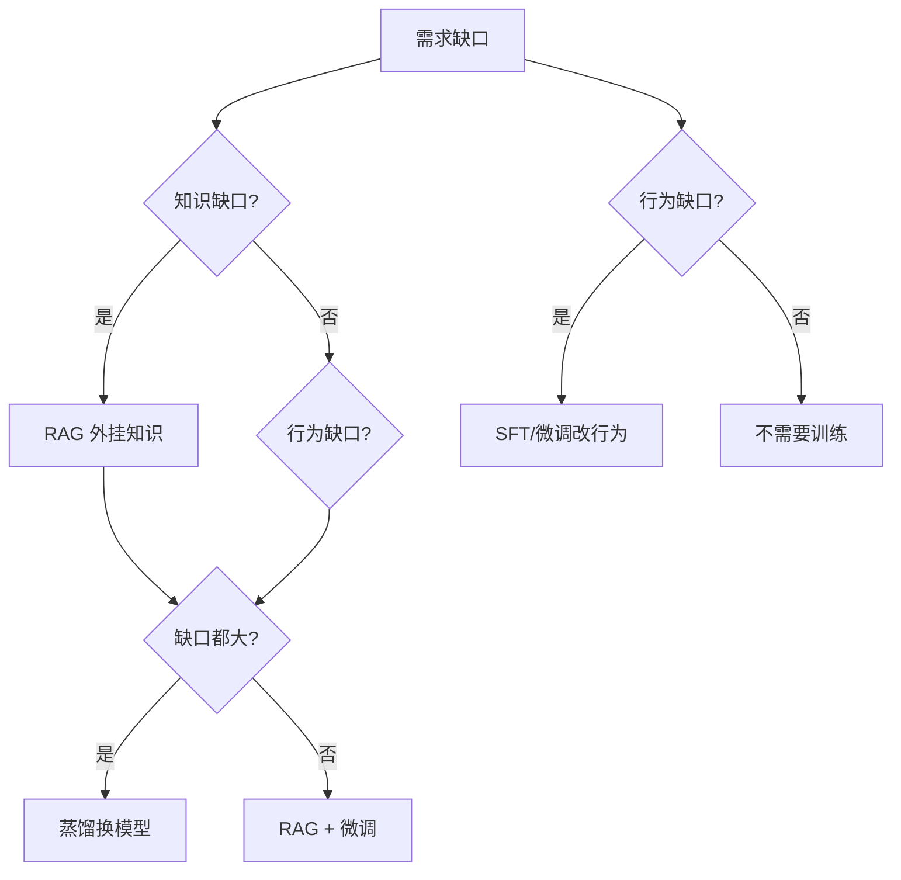
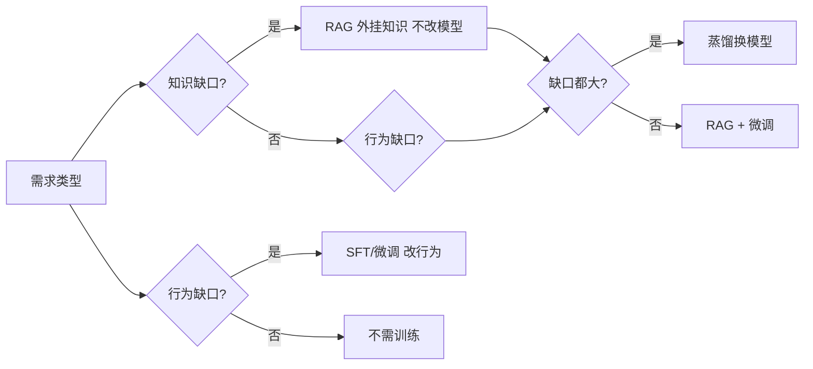

# 微调与蒸馏工程

> 2026 年高频考点：什么时候该微调 vs RAG？SFT/RLHF/DPO/LoRA/QLoRA/蒸馏 选型 + 成本估算。本题给决策框架，答法不背论文，按业务场景选。
> 数字纪律：数字为行业公开报道（来源见各小节），无「我们线上实测」。
> 已重写：通用示例替代 interview 原文。

**本文核心**：先判缺口类型再选方案——知识缺口走 RAG，行为缺口走微调，两者都有 RAG+微调，缺口都大走蒸馏。选错成本×10 起步（训练跑一周发现方向错）。

## 一句话摘要

微调改行为、蒸馏换模型、RAG 补知识——先判缺口类型再选方案；知识缺口走 RAG，行为缺口走微调，缺口都大走蒸馏，选错成本×10 起步。

## 一、核心问题：什么时候微调 vs RAG vs 长上下文？⭐⭐

**30 秒版**：
- **RAG**：模型「不知道」→ 外挂知识
- **微调**：模型「知道但不说对」→ 改行为/风格
- **长上下文**：知识量不大但要一次性看全 → 拼上下文

::: details 点击查看答案

**第一性判断**：

| 场景 | 方案 | 依据 |
|------|------|------|
| 知识缺口（私有文档/新知识） | RAG | 模型不知道 → 检索注入，不改模型 |
| 行为缺口（格式/风格/领域措辞） | 微调 | 模型知道但不说对 → SFT 改行为 |
| 两者都有 | RAG + 微调 | 先 RAG 后微调，顺序不能反 |
| 知识+行为缺口都大 | 蒸馏 | 用大模型蒸馏小模型，一步到位 |

:::

## 二、SFT / RLHF / DPO / LoRA / QLoRA 速览

| 技术 | 做什么 | 适用场景 | 成本 |
|------|--------|----------|------|
| SFT | 标注数据监督学习 | 格式/风格/任务适配 | 中 |
| RLHF | 人类偏好排序+奖励模型 | 价值观/对齐/拒绝优化 | 高 |
| DPO | 直接偏好优化（绕过奖励模型） | 对齐/偏好学习 | 中 |
| LoRA | 低秩适配（冻结主干+小 adapter） | 领域适配/多任务切换 | 低 |
| QLoRA | 4-bit 量化 + LoRA | 显存受限时的领域适配 | 低 |

**机制穿透**：SFT/DPO 是行为对齐（改输出格式），RLHF 是价值观对齐（改拒绝边界），LoRA/QLoRA 是参数高效适配（冻主干训 adapter）——三者的约束目标不同，不可混用。

## 三、蒸馏（模型压缩）

| 类型 | 做法 | 典型场景 |
|------|------|----------|
| 知识蒸馏 | 大模型 → 小模型（Soft Label） | 端侧/低延迟部署 |
| 量化蒸馏 | PTQ/INT8/INT4 + 校准 | 显存受限 |
| 剪枝蒸馏 | 移除冗余权重 + 知识迁移 | 边缘设备 |

**生产注意点**：
- 蒸馏后必做评测——小模型能力肯定有损
- 蒸馏数据质量 > 数量（100 条高质量 > 10K 噪声）
- 持续迭代：业务数据增长后要定期重蒸馏

## 四、Trade-off 与代价

| 选择 | 代价 | 反方案 |
|------|------|--------|
| 微调 | 训练成本 + 迭代周期长 + 回滚复杂 | RAG 更快落地 |
| 蒸馏 | 小模型能力有损 + 蒸馏数据成本 | 直接用大模型 API |
| RAG | 检索质量依赖 chunk 策略 + 延迟高 | 拼上下文（知识量小） |

**生产原则**：能 RAG 不微调，能蒸馏不微调；先跑通再优化。

**反方案分析**：
- 如果只微调不评估 → 过拟合业务数据泛化差，反方案：蒸馏数据质量 > 数量（100 条高质量 > 10K 噪声）
- 如果蒸馏后不评测 → 小模型能力有损无感知，反方案：必须建业务评测集
- 如果 RAG 能覆盖却走微调 → 成本高迭代慢，反方案：先 RAG 验证需求

::: details 焊合（被问"你们线上呢"时接）
- 百炼 RAG 项目选型：内部知识问答=知识缺口 → RAG，不做微调（自圆其说/08 第 5 问）
- AI 辅助编码：模型参数不动 + prompt 优化 + 工具链——和微调正交
:::

## 设计思想（为什么这么选）

方案选择本质是"缺口诊断"：知识缺口 → RAG（不改模型），行为缺口 → 微调（改输出格式），两者都有 → RAG+微调，缺口都大 → 蒸馏（换模型）。优先序：RAG < 微调 < 蒸馏，成本递增、灵活性递减。

## 五、成本估算（面试加分项）

```
微调成本 ≈ 样本数 × 单样本标注费 + GPU 小时 × 单价
LoRA:  单卡 A100 80G ≈ 训 1B 参数 2-4h
全量:  多卡 A100 集群 ≈ 训 7B 参数 2-5 天
蒸馏:  大模型推理成本 + 小模型训练成本
```

**隐藏成本**：标注人力（占 60%+）、迭代周期（业务变化后要重训）、回滚（新模型上线回滚 = 两天工作）。



**量级思考**：训练成本跨度大——LoRA 单卡 A100 训 1B 参数 2-4h（10w 级），全量 7B 集群 2-5 天（千万级 GPU 成本）；蒸馏数据 100 条高质量 > 10K 噪声；推理场景 token 消耗 ×10-50 倍（亿级调用时成本主导）。

::: details 焊合（被问"你们线上呢"时接）
- 百炼 RAG 项目选型：内部知识问答=知识缺口 → RAG，不做微调（自圆其说/08 第 5 问）
- AI 辅助编码：模型参数不动 + prompt 优化 + 工具链——和微调正交
:::

## 六、时效刷新清单

> 见 `interview-skills/12-AI题答案标准与时效.md` 的 AI 分册——模型版本/价格/基准变化极快，本文件数字可能过期，以时效清单为准。

## 数据与事实声明

- 定价数据为行业公开报道，无「我们线上实测」
- 蒸馏数据质量 > 数量（100 条高质量 > 10K 噪声）为业界通用经验
- RLHF 坑（奖励模型 hack/对齐过载）源自公开论文与实践总结

## 参考资料

- 《DeepSeek 蒸馏技术报告》
- 《LoRA: Low-Rank Adaptation of Large Language Models》(Hu et al., 2021)
- 《Direct Preference Optimization》(Rafailov et al., 2023)

## 核心带走

微调改行为、蒸馏换模型、RAG 补知识——先判缺口类型再选方案。选错成本×10 起步（训练跑一周发现方向错）。

**一句话定位**：知识缺口走 RAG，行为缺口走微调，缺口都大走蒸馏；先判缺口类型再选方案。



## tips

💡 实战提示块：

- 反直觉点：蒸馏不是"压缩模型"——是用大模型当老师教小模型，蒸馏后小模型能力必有损，必须评测
- 防御话术：「知识缺口走 RAG，行为缺口走微调，两者都有先 RAG 后微调，缺口都大走蒸馏」
- 考场应急：被问「为什么不直接微调一个模型」→「样本 <1K / 短期需求 / 没有持续迭代预算 → 不该微调」

## QA（你们可能会问）

| 问题 | 答案 |
|------|------|
| 微调能补上模型不会的知识吗？ | 补不了——能力上限由预训练决定，SFT 只调行为格式。知识缺口走 RAG，行为缺口才走微调 |
| LoRA 和全量微调显存差多少？ | LoRA 只训 adapter（0.1% 参数），单卡 A100 80G 训 1B 参数 2-4h；全量需多卡集群训 7B 2-5 天 |
| 蒸馏后必须评测吗？ | 必须——小模型能力肯定有损，蒸馏数据质量 > 数量（100 条高质量 > 10K 噪声） |
| 什么时候不该微调？ | 知识缺口 / 短期需求 / 样本 < 1K / 没有持续迭代预算 |

**跨系统架构（上下游一分钟）**：微调/蒸馏的上下游——上游是预训练模型产出（模型仓库/HF），下游是推理服务部署（KV Cache / 批处理 / 监控），微调只是中间环节，不该孤立看。

**跨周期经验**：微调/蒸馏范式从 2018 BERT 时代（仅微调）→ 2020 GPT-3（提示工程兴起）→ 2022 RLHF（对齐革命）→ 2023 LoRA/QLoRA（参数高效）→ 2024 蒸馏（大模型变小）→ 2025 RAG 优先——每次技术跃迁都是"成本/效果/运维"三角再平衡，周期约 1-2 年。微调从"唯一训练手段"→ 2024 年起"RAG 优先 + 按需微调"——同一范式 5 年被颠覆两次，面试答"现在主流 RAG 优先"即可。

**机制穿透**：微调本质是「梯度下降改权重」——和预训练同一套反向传播，只是数据规模从全量→小批量；蒸馏本质是「软标签模仿」——小模型学大模型的概率分布而非硬标签；理解机制后选型不再靠记：知道梯度怎么走就知道 LoRA 为什么有效，知道软标签分布就知道蒸馏为什么需要温度参数。

## 思考（开放问题/反思）

- RLHF/DPO 在国内团队怎么落地？——算法团队负责 + 业务团队提供偏好数据，边界在"价值观对齐"归算法、"格式适配"归业务
- 蒸馏的"知识无损"能否量化？——当前靠评测集准确率，没有统一的"知识保留率"指标，面试可提"建议自建业务评测集"
- **追问链**：蒸馏后小模型上线发现效果回退，是蒸馏数据质量问题还是小模型容量不足？怎么区分？→ 先查蒸馏前后评测集gap，gap 大是数据问题，gap 小是容量问题
- **反思**：优先序 RAG < 微调 < 蒸馏 是否绝对？——RAG 延迟高+检索不准时，微调反而是更稳的方案，优先序只是起点不是终点
- **质疑**："能 RAG 不微调"这条原则在什么条件下失效？——高频写场景（RAG 检索=乱码）+ 严格格式场景（API 输出要被下游解析）= 微调更可靠

## 设计思想（为什么这么选）

方案选择本质是"缺口诊断"：知识缺口 → RAG（不改模型），行为缺口 → 微调（改输出格式），两者都有 → RAG+微调，缺口都大 → 蒸馏（换模型）。优先序：RAG < 微调 < 蒸馏，成本递增、灵活性递减。