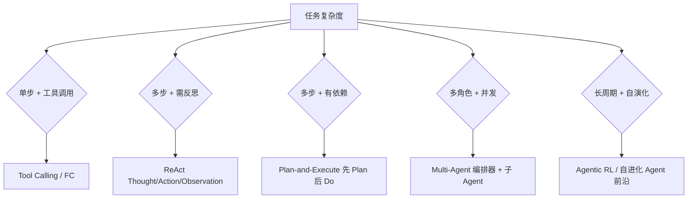
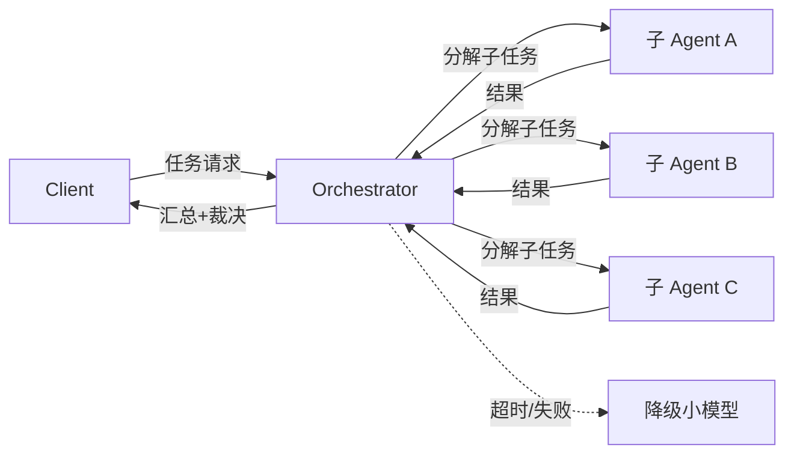

# Agent 架构范式与工具调用

> 2026 年高频考点：ReAct vs Plan-and-Execute vs Tool Calling 怎么选？Multi-Agent 编排怎么设计？这题给决策框架 + 反面教训，答法不背论文。
> 数字纪律：数字为行业公开报道（来源见各小节），无「我们线上实测」。
> 已重写：通用示例替代 interview 原文。

**本文核心**：ReAct 适合检索推理、Plan-and-Execute 适合多步依赖、FC 适合 API 调用、Multi-Agent 适合多角色协作——先判任务形态再选范式。

## 一句话摘要

Agent 选型四范式：ReAct（检索推理）、Plan-and-Execute（多步依赖）、FC（API 调用）、Multi-Agent（多角色协作）——先判任务形态再选范式，生产环境混合架构才是常态。

## 一、核心问题：什么场景用什么 Agent 范式？⭐⭐

**30 秒版**：
- **ReAct**：简单任务、需检索/查资料 → 思考+行动循环
- **Plan-and-Execute**：多步骤、有依赖 → 先规划再执行
- **Tool Calling / FC**：需调外部 API / 数据库 → 模型输出结构化工具调用
- **Multi-Agent**：复杂工作流、多角色协作 → 编排器+子 Agent

::: details 点击查看答案

**选型决策树**：

:::

## 二、ReAct（Reason + Act）

| 维度 | 说明 |
|------|------|
| 机制 | 循环：思考 → 行动 → 观察 → 再思考 |
| 优势 | 简单、可解释、适合检索/推理类任务 |
| 劣势 | 长任务累积错误、token 消耗大 |
| 典型框架 | LangChain Agent、AutoGPT |

**追问预埋**：
- ReAct vs CoT 关系？CoT 是 ReAct 的思想子集（只管想，不管做）
- 长任务怎么防累积错误？自一致性投票 / 中间检查点
- 什么任务不适合 ReAct？简单分类/抽取——直接答更快

## 三、Plan-and-Execute

| 维度 | 说明 |
|------|------|
| 机制 | 先 LLM 生成完整计划 → 再逐步执行每步 |
| 优势 | 依赖清晰、可回溯、适合复杂工作流 |
| 劣势 | 计划可能错、没反思机制 |
| 典型框架 | ChatGPT Operator、PlanLLM |

**追问预埋**：
- 计划错了怎么办？执行中反馈修正 + 回退机制
- 和 ReAct 什么关系？Plan 是 ReAct 的"批处理"版本——先想完再做

## 四、Tool Calling / Function Calling

| 维度 | 说明 |
|------|------|
| 机制 | 模型输出结构化 JSON 调用工具 |
| 优势 | 精确、可控、适合 API 调用 |
| 劣势 | 工具 schema 膨胀拉低准确率 |
| 典型框架 | OpenAI FC、Anthropic Tool Use、LangChain Tools |

**生产注意点**：
- 工具数量克制：30+ 工具的 schema 能占 5K+ token 且拉低选择准确率
- 错误处理：工具调用失败 → 重试 + fallback + 告警
- 鉴权：工具调用的身份和权限要和调用者隔离

## 五、Multi-Agent 编排

| 维度 | 说明 |
|------|------|
| 编排模式 | 集中式（编排器+子 Agent）/ 分布式（Agent 间直接通信） |
| 通信协议 | MCP（工具级）/ A2A（任务级）/ 自定义 |
| 上下文隔离 | 子 Agent 独立上下文 + 协调者收摘要（token 成本 ×15，换 90% 质量净收益） |
| 失败处理 | 超时/报错 → 重试 + 降级 + 告警 |

**机制穿透**：Multi-Agent 的本质是"状态分解 + 上下文隔离"——状态机 + 上下文传递 + 失败兜底，与微服务编排同构。

**追问预埋**：
- 编排器单点故障怎么办？多编排器热备 + 任务队列持久化
- 子 Agent 太多怎么控成本？按任务价值分配——便宜模型跑简单步骤
- MCP vs A2A？MCP 是工具协议（给 Agent 用的），A2A 是任务协议（Agent 之间通信）

## 六、反模式（面试加分项）

| 反模式 | 代价 | 正确做法 |
|--------|------|----------|
| 工具 schema 太多 | 选择准确率下降 | 按场景裁剪 |
| 无超时重试 | 卡死 | 每步超时 + 最大重试 |
| 无 fallback | 单点故障 | 主模型失败 → 降级小模型 |
| 上下文不隔离 | token 爆炸 | 子 Agent 独立上下文 + 摘要 |
| 无 HITL | 不可逆动作 | 资金/权限类必须人工审批 |

::: details 焊合（被问"你们线上呢"时接）
- 百炼 RAG 项目：AI 辅助编码的规则文件体系 = 上下文工程的落地（自圆其说/08）
- Java 后端视角：Agent 编排和流程引擎同构——状态机 + 上下文传递 + 失败兜底
:::

## 七、时效刷新清单

> 见 `interview-skills/12-AI题答案标准与时效.md` 的 AI 分册——模型版本/协议变化极快，本文件数字可能过期，以时效清单为准。

## 数据与事实声明

- 价格/性能数字为行业公开报道（来源见各小节），无「我们线上实测」
- 上下文窗口数据为各厂商官方文档公开值
- 成本估算为行业通用经验值

## 参考资料

- OpenAI GPT-5 官方文档
- Anthropic Claude 4 官方文档
- Google Gemini 2.5 官方文档
- DeepSeek-V4 官方文档

## 核心带走

一句话定位：ReAct 适合检索推理、Plan-and-Execute 适合多步依赖、FC 适合 API 调用、Multi-Agent 适合多角色协作——先判任务形态再选范式。

## tips

💡 实战提示块：

- 反直觉点：ReAct 不是万能的——简单分类/抽取任务直接答更快，循环反而浪费 token
- 防御话术：「选型看任务复杂度：单步工具用 FC，多步反思用 ReAct，多步依赖用 Plan，多角色用 Multi-Agent」
- 考场应急：被问「为什么不用一个范式打天下」→「任务分型：不同复杂度选不同范式，生产环境混合架构才是常态」

## QA（你们可能会问）

| 问题 | 答案 |
|------|------|
| ReAct 什么时候不适合？ | 简单分类/抽取——直接答更快，循环反而浪费 token |
| 多 Agent 怎么控成本？ | 上下文隔离 + 便宜模型跑简单步骤 + 编排器收摘要 |
| MCP 和 A2A 区别？ | MCP 是工具协议（Agent 用工具），A2A 是任务协议（Agent 之间通信） |
| 计划错了怎么办？ | 执行中反馈修正 + 回退机制，Plan 不是一成不变的 |

## 思考（开放问题/反思）

- ReAct 的"反思"能否量化？——当前靠自一致性投票，没有统一的"反思收益"指标
- Multi-Agent 的编排器能否无状态化——状态机 + 上下文传递 + 失败兜底，与微服务编排同构

## 设计思想（为什么这么选）

架构选型本质是"任务形态匹配"：ReAct 适合单步检索推理（思考+行动循环），Plan-and-Execute 适合多步有依赖（先规划再执行），FC 适合 API 调用（结构化工具调用），Multi-Agent 适合多角色协作（状态分解+上下文隔离）。优先序：任务形态 → 资源约束 → 团队熟悉度。