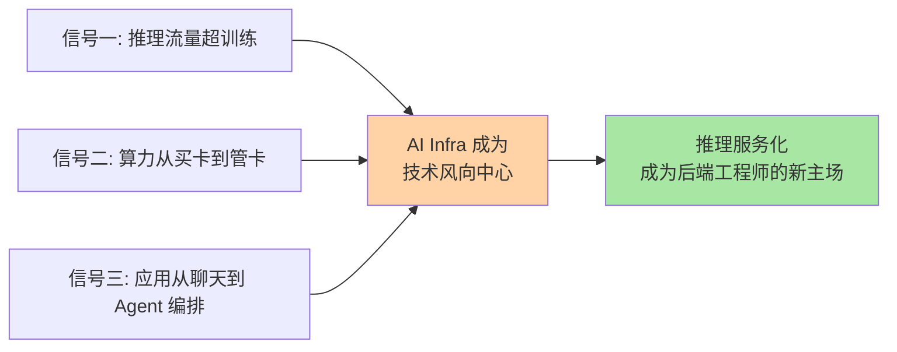
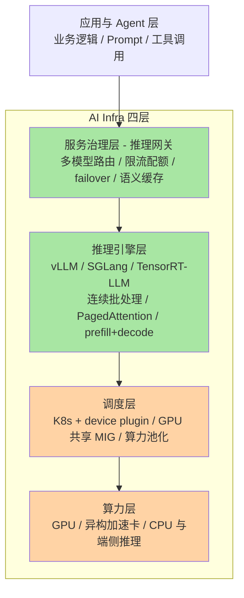
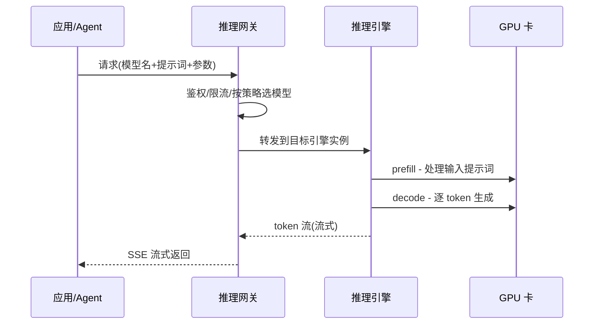

# AI Infra 是什么：把大模型跑起来的四层基础设施

> **一句话摘要**：AI Infra 是「让大模型跑起来、跑得快、跑得稳」的基础设施层——从 GPU 算力、调度系统、推理引擎到推理网关，它在 AI 时代扮演的角色，类似云计算时代「操作系统 + 中间件 + 网关」的组合。

> **本文核心**：AI Infra 的组织主线是**四层堆叠**——算力层（GPU 与异构芯片）→ 调度层（K8s 与 GPU 池化）→ 推理引擎层（vLLM/SGLang 等，解决「一块卡怎么榨出最多 token」）→ 服务治理层（推理网关，解决「一堆模型怎么对外变成稳定服务」）。**机制链**：模型权重躺在存储里 → 调度层把显存分给它 → 推理引擎把请求变成 token 流 → 网关把 token 流治理成可运营的服务。**与已有 AI 系列的边界**：《从零开始认识AI系列》讲模型与 Agent——大脑本身怎么思考、怎么动手；本系列讲「把大脑跑起来的电厂、道路与交通规则」。两套系列拼起来，才是一个后端工程师眼中完整的 AI 技术栈。

## 一句话摘要

后端工程师都熟悉一条分工线：应用代码跑在容器里，容器由 K8s 调度，流量进来先过网关，中间件把慢操作和状态管理接走。AI 时代这条分工线没有消失，只是每一层都被换了内核——跑在卡上的不再是普通进程而是模型权重与 KV 缓存，网关路由的不再是微服务实例而是不同能力的模型，调度的资源不只是 CPU/内存还有显存这种新层级。AI Infra 就是这条分工线的 AI 版：**它不训练模型，也不写业务 Prompt，它负责让模型以可控的成本、稳定的延迟对外服务**。这也是为什么 2026 年行业普遍把 AI Infra 视为技术风向的中心（业内认知）——模型能力每家都在快速拉平，拉开差距的越来越多是基础设施层的效率与稳定性。

## 5W 速记卡

| 维度 | 一句话 |
|---|---|
| What | 算力/调度/推理引擎/服务治理四层堆叠的基础设施层 |
| Why | 推理流量超训练、算力要从买卡变管卡、应用从聊天变 Agent 编排 |
| Who | 平台/Infra 团队建设，所有调用模型的应用受益 |
| When | 模型要对外提供服务的那一刻起就离不开它 |
| How | 权重进显存 → 引擎攒批出 token → 网关治理成服务 |

## 一、为什么 2026 被普遍视为 AI Infra 的元年

三个信号在同一时间点交汇，这不是营销话术，而是需求侧的结构变化：

**信号一：推理流量超过了训练，成为算力消耗的主力。** 训练是少数公司的事，推理是所有上线应用的事。随着 Agent 应用把「一次任务调用模型几十次」变成常态，推理侧的算力需求以更陡的曲线增长（公开报道口径）。推理的成本结构、延迟特征、扩容方式与训练完全不同——它需要的是一套专门的服务化基础设施，而不是把训练集群分几台出来跑跑看。

**信号二：算力供给从「买卡」进入「管卡」。** 当 GPU 从几块变成几千块，异构芯片（不同厂商的加速卡混部署）成为现实选项，如何把算力当成池子来调度、把碎片显存利用起来，就成了和当年「服务器池化」同构的问题。历史上云计算把服务器变成了水电煤，这一轮 AI Infra 要把算力变成水电煤。

**信号三：应用形态从「聊天」走向「Agent 编排」。** 聊天场景一个请求一个回复，Agent 场景一个任务几十次模型调用外加工具往返，对路由、限流、故障切换、成本核算的要求完全不在一个量级。支撑 Agent 稳定运行的，正是推理网关这一层的新物种。

## 二、全景：四层结构看懂 AI Infra

把 AI Infra 从下到上切四层，每一层只回答一个问题：

| 层 | 回答的问题 | 对应传统后端的概念 | 本系列篇目 |
|---|---|---|---|
| 算力层 | 卡从哪来、卡有多少 | 物理机/数据中心 | 篇 4 涉及 |
| 调度层 | 请求和模型怎么分到卡上 | K8s 调度 + 资源管理 | 篇 4 |
| 推理引擎层 | 一块卡怎么跑出最多 token | 应用运行时/虚拟机 | 篇 2 |
| 服务治理层 | 一堆模型怎么对外变成服务 | API 网关 + 中间件 | 篇 3 |

这套分层的底层逻辑与网络协议栈一脉相承：**每层只解决一个维度的矛盾，并对上层隐藏下层的复杂性**——这是理解全部四层最核心的设计思想。业务只跟网关对话，不用关心目标模型跑在哪种卡上；推理引擎只管把显存和算力的利用率打上去，不用关心流量从哪来。分层换来的是每一层独立演进的自由——这正是它没有退化成「一个巨型平台」的原因。回看云计算十余年的架构演进史，同样的分层故事在虚拟化、容器、服务网格上各重演了一遍：底层原理不变，被调度的对象在变。

### 一次推理请求的完整旅程

后续几篇会把这条链路上的每个环节拆开讲透：篇 2 讲引擎内部，篇 3 讲网关治理，篇 4 讲卡与调度。

## 三、量级演进视角：不同规模下的 AI Infra 形态

AI Infra 的架构选型对量级极其敏感，同一套方案在小规模是过度设计，在大规模是救命稻草。每一档的约束来源不同，思考方式也不同：

- **十万级日请求（或日均千万级 token）**：直接用云厂商 API + 少量自部署单实例推理就够了。这一档的核心问题是验证业务速度，而不是单位成本——约束来源是业务还没被证明，固定投入全是风险。
- **百万级日请求（或日均亿级 token）**：自部署推理进入划算区间，推理网关从「可选」变成「必选」——多模型路由、限流配额、成本核算都在这一档成为刚需。这一档的核心问题是成本曲线的交叉点管理，而不是功能有无——约束来源是 API 单价随量线性上涨，自部署的固定成本开始被摊薄。
- **亿级日请求以上（头部产品形态）**：算力池化、多引擎混部、异构卡统一调度成为标配，显存利用率和 token 成本每个百分点的优化都对应真实的大额账单。这一档的核心问题是每百万 token 的单位成本，而不是稳定性——稳定性已经是入场券。思考方式从「把功能跑通」切换为「把利用率打满」的成本驱动思维。

**一句话的量级 Trade-off 意识**：十万级用云 API 就够，百万级要网关加自部署，亿级必须做池化与混部——跳档自建是浪费，压档硬扛是事故。

## 四、与云原生的区别辨析

这是后端工程师最容易产生的错觉：「AI Infra 不就是 K8s 上多跑一种工作负载吗？」——调度层确实大量复用了云原生（K8s、容器、 Operator 模式），但两者在三个维度上有本质区别：

| 维度 | 传统云原生负载 | AI 推理负载 |
|---|---|---|
| 资源模型 | CPU/内存为主，可压缩、可超卖 | 显存是硬约束，超卖直接 OOM |
| 弹性特征 | 秒级扩容副本即可 | 扩容要先加载模型权重（几个 GB 到几百 GB），冷启动以分钟计 |
| 流量特征 | 请求-响应，毫秒级 | 长连接流式输出，首 token 延迟与吞吐是两个独立指标 |
| 故障模型 | 副本挂了重启即可 | 权重重新加载期间该卡完全不可用 |

所以正确的认知是：**云原生是 AI Infra 的地基，但 AI 推理在云原生之上长出了一整套新结构**——device plugin 机制扩展了资源模型，推理引擎重新定义了「进程内调度」，推理网关在应用网关之上叠加了模型语义。理解「哪些能复用、哪些必须新建」，是从后端转向 AI Infra 的第一道坎，篇 5 会把技能映射完整讲一遍。

## 五、与 Agent 工程化的区别辨析

《从零开始认识AI系列》与本系列的分工需要划清楚：Agent 工程化解决「大脑怎么干活」——规划、记忆、工具调用、多 Agent 协作，工作重心在模型之上、网关之上；AI Infra 解决「大脑怎么持续在线地运转」——算力、调度、引擎、网关。两者的接口就是那一次 HTTP 请求：Agent 框架发出的每一个模型调用，落到 Infra 侧就是一篇 2 的 prefill/decode 和一篇 3 的路由限流。**Agent 工程化管单次任务的智能密度，AI Infra 管海量任务的吞吐密度**——做 Agent 应用的人可以不懂 PagedAttention，但一个组织的 AI 平台团队必须懂，否则成本和稳定性失控只是时间问题。

## 六、典型使用场景

- **模型服务平台**：一个组织内有几十个微服务要调模型，统一走自建推理平台，网关层做鉴权、配额与成本分摊
- **多模型路由**：简单任务走小模型、复杂任务走大模型，按语义难度或业务标签自动分流，压低整体成本
- **弹性算力池**：白天在线推理优先占卡，凌晨跑批量离线任务，把昂贵的算力昼夜两用
- **Agent 生产环境**：Agent 应用放量后，推理侧需要独立的限流、failover 与观测，防止一次工具循环风暴打爆预算

## 七、误区与不适用

- **误区一：AI Infra = 买卡。** 卡只是算力层，没有调度、引擎与服务治理，一屋子卡的实际利用率会低到令人心疼（业内普遍认知：缺乏治理的自建集群利用率远低于规划值）——这也是历史上「重硬件轻软件」教训的重演
- **误区二：直接拿微服务网关当推理网关。** 传统网关按请求转发几毫秒就返回，推理请求是分钟级长连接流式输出，超时模型、重试策略、配额计量全都不同——能凑合跑，但长流量场景会踩坑
- **误区三：所有业务都该自建。** 自建的决策依据是量级与数据合规，不是「拥有感」。没到百万级日请求之前，自建四层的固定成本大概率跑不赢云 API
- **不适用场景**：纯实验性项目、日均千次以内的内部工具——云 API 加一个薄封装就是终态，别建平台

## 八、什么时候用/不用：一张决策卡

| 信号 | 建议 |
|---|---|
| 日均请求十万级以下、数据不敏感 | 云 API，不建 Infra（明确推荐起点） |
| 数据合规要求私有化，或日均亿级 token | 自部署推理引擎 + 网关 |
| 已有 K8s 平台与平台工程团队 | 复用调度层，优先补引擎层与网关层认知 |
| 团队没人懂 GPU 运维 | 从云厂商托管推理服务起步，把学习曲线外包 |

**决策原则**：AI Infra 的每一层都可以「买」（云服务）也可以「建」（自部署），选型时把两边的成本曲线画在同一张图上看交叉点，而不是凭感觉站队。本系列教的是「建」侧的原理，但「买」永远是合法选项。

## 九、你们可能会问

**Q1：AI Infra 和 MLOps 是一回事吗？**
不是。MLOps 管模型的全生命周期——训练实验、版本、评估、上线流程；AI Infra 管推理侧的运行时——算力、调度、引擎、网关。可以粗略理解为 MLOps 管「模型怎么迭代出来」，AI Infra 管「模型怎么长期跑下去」，两者在「部署上线」这个节点交汇。

**Q2：我是个后端工程师，不打算转 AI 岗，学这个有什么用？**
因为 AI Infra 恰恰是后端技能栈迁移成本最低的方向：K8s、网关、限流、池化、观测这些能力全部复用，只是换了一套被调度的对象。越来越多的业务后端会被要求「顺便把模型服务接了」——理解本系列内容的人，接的时候知道每一层在做什么、坑在哪。

**Q3：训练 Infra 和推理 Infra 为什么要分开看？**
两者的资源画像完全相反：训练是长时间独占大块算力、吞吐优先、可容忍高延迟；推理是持续随机的小请求、延迟敏感、显存高度碎片化。一套系统同时优化两个相反目标会两头不讨好，所以业界主流是分开建设（业内认知），只在算力层共享池子。

## 自测三问

1. AI Infra 四层分别回答什么问题？各自对应传统后端的哪个概念？
2. 为什么说 2026 年是 AI Infra 元年？三个信号分别是什么？
3. AI 推理负载与传统云原生负载在哪三个维度上本质不同？

## 💡 实战提示

- 💡 评估任何 AI 基础设施方案时，先问三个数：单卡吞吐（token/s）、P99 首 token 延迟、每百万 token 成本——三个数说不清的方案先放一放
- 💡 自建推理平台前先跑两周真实的量级画像：日均请求分布、输入输出 token 比例、峰谷比——量级画像决定架构，而不是反过来
- 💡 把「推理利用率」做成团队每周可见的指标——算力是烧钱的资源，没有观测就没有优化，这和当年盯 CPU 利用率是同一个道理
- 💡 网关层从第一天就记录每次调用的模型名、token 数与耗时——成本分摊与容量规划全靠这份明细，后补的历史数据是拿不回来的

## 追问思考与开放问题

**质疑者追问链**：为什么大厂都在自建 AI Infra，而不是继续买云 API？——第一层追问：是为了省钱吗？部分是，但更硬的理由是可控性：推理侧的延迟、容量与迭代节奏是业务命脉，交在第三方手里等于把命脉外包。——再追问：那可控性值多少钱？这没有标准答案，但有个可操作的判断：当 API 账单大到能养一个平台团队时，自建的固定成本就被覆盖了（业内认知的经验阈值）。——打破砂锅问到底：既不全买也不全建行不行？行，而且这是主流——核心流量自部署保可控，长尾与突发用 API 弹性兜底，推理网关恰好是承接这种混合策略的最佳位置（篇 3 展开）。

**一次排查的复盘叙事**：某业务线第一次把开源模型部署到线上， GPU 看门狗显示利用率长期趴在两成以下，业务方还在抱怨高峰期首字延迟飙高。排查了三天才发现是三个问题叠加：网关没有做请求攒批、长上下文请求反复把显存打爆触发重载、故障切换策略写成了「失败立即重试原始实例」形成雪崩放大。复盘的结论很一致：模型质量没有问题，是基础设施四层没有就位——这个案例后来成了团队内部讲 AI Infra 价值的活教材，也印证了本篇的核心判断：**模型决定上限，Infra 决定这个上限能不能稳定兑现**。

**设计思想层面的开放问题**：四层结构会不会被打破？值得讨论的两个方向——一是推理引擎向上吞噬网关能力（引擎内置路由与批处理 API），二是芯片层向下吞噬调度能力（卡内虚拟化直接对外提供算力切片）。中间层被上下游挤压是所有基础设施的长期宿命，分层边界未来怎么漂移，留给时间检验。

## Trade-off 与取舍分析

AI Infra 的每个架构选择都在「效率、可控性、复杂度」三角里做取舍：自建四层拿到可控性与单位成本优势，付出的是平台团队的人力固定成本与运维复杂度；云 API 拿到零运维与快速启动，付出的是长期单价与受制于人的风险；混合模式看似两全，实际是把路由与成本治理的复杂度转移到了网关层——没有免费的午餐，只有复杂度放到了哪一层的选择。理解这个三角，比记住任何具体产品名都重要。

## 📎 核心带走

- **核心一句话**：AI Infra = 算力 + 调度 + 推理引擎 + 服务治理的四层堆叠，负责让模型以可控成本、稳定延迟对外服务
- **机制链**：权重在存储 → 调度层分显存 → 引擎把请求变成 token 流（prefill/decode 攒批）→ 网关把 token 流治理成服务
- **失效点/边界**：跳档自建是浪费、压档硬扛是事故；云原生是地基但不是全部；模型决定上限，Infra 决定上限能否兑现

## 📌 数据与事实声明

- 写于 2026-09-17，L1 入门层概念篇
- 「推理流量超过训练成为算力主力」「自建集群利用率偏低」等为业内普遍认知与公开报道口径，未引用任何公司内部数据
- 具体产品能力与版本以各官方文档为准

## 📚 参考资料

| 类型 | 标题 | 来源 |
|---|---|---|
| 系列内 | 推理引擎与 vLLM（篇 2） | [2_推理引擎与vLLM-入门.md](2_推理引擎与vLLM-入门.md) |
| 系列内 | 推理网关与模型路由（篇 3） | [3_推理网关与模型路由-入门.md](3_推理网关与模型路由-入门.md) |
| 系列内 | GPU 调度与算力池化（篇 4） | [4_GPU调度与算力池化-入门.md](4_GPU调度与算力池化-入门.md) |
| 官方文档 | vLLM 文档 | docs.vllm.ai |
| 官方文档 | Kubernetes GPU 调度 | kubernetes.io/docs/tasks/manage-gpus |
| 相关系列 | 从零开始认识AI系列（模型与 Agent 概念） | [0_系列导读-全景.md](../从零开始认识AI系列/0_系列导读-全景.md) |
