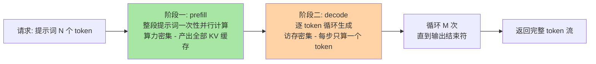
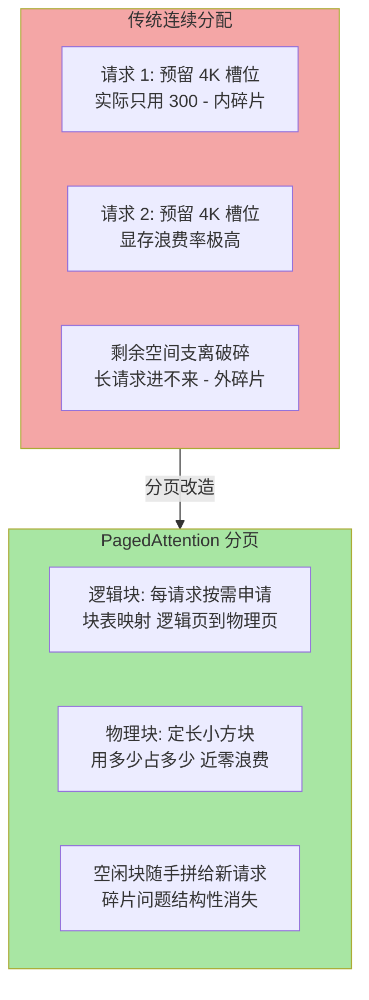
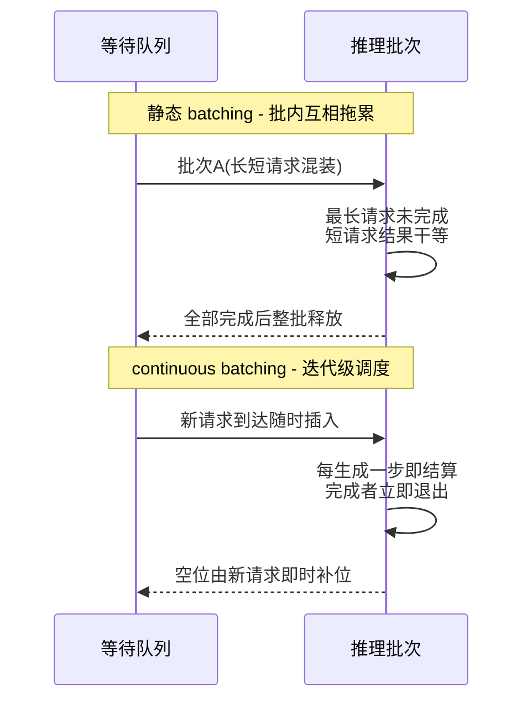

# 推理引擎与 vLLM：prefill、decode 与把 GPU 榨干的两件武器

> **一句话摘要**：推理引擎是跑在 GPU 上的「模型运行时」——它把「预测下一个 token」这件原语级的事，通过 prefill/decode 两阶段调度、显存分页管理和连续攒批，做到一块卡上吞吐最大、延迟最低。

> **本文核心**：推理之所以需要专门引擎，根源是 LLM 推理的两个底层特征——**自回归逐 token 生成**（一个请求内部天然串行）与 **KV 缓存吃显存**（每个请求都要在显存里留一块「草稿纸」）。vLLM 等引擎的全部设计思想都围绕这两点展开：**PagedAttention 解决草稿纸的碎片问题**（借操作系统虚拟内存的分页思想管理 KV 缓存），**continuous batching 解决攒批的等待问题**（不等人，每生成完一步就动态补位新请求）。**机制链**：请求进来 → prefill 一次性算完提示词的 KV → decode 逐 token 循环 → 显存分页随取随放 → 批次动态进出 → token 流吐给上层。

## 一句话摘要

把 PyTorch 模型直接写成推理服务能跑，但 GPU 利用率会低到难以接受（业内普遍认知：朴素实现下大量算力在空转）。推理引擎做的事情说穿了就是两件：**把显存管好**（KV 缓存是显存大户，管不好就碎片化、就 OOM）和**把批次攒好**（GPU 是并行机器，单请求喂不饱它）。这两件事分别对应 vLLM 的两大招牌：PagedAttention 与 continuous batching。理解了它们，你就理解了几乎所有现代推理引擎的公共底层原理——各家的差异更多在调度策略、图优化与配套生态，而不是这两条主线。

## 5W 速记卡

| 维度 | 一句话 |
|---|---|
| What | 跑在 GPU 上的模型运行时：管显存、攒批次、吐 token |
| Why | 自回归逐 token 生成 + KV 缓存吃显存，朴素实现喂不饱 GPU |
| Who | vLLM / SGLang / TensorRT-LLM / LMDeploy 等 |
| When | 任何要自部署模型对外服务、或想压低单位 token 成本的场景 |
| How | PagedAttention 管显存分页 + continuous batching 动态攒批 |

## 一、推理两阶段：prefill 与 decode

LLM 生成一句话的过程，拆开是两个性质完全不同的阶段：

### Prefill 与 Decode 的区别辨析

| 维度 | prefill（预填充） | decode（解码） |
|---|---|---|
| 干什么 | 一次性处理整段输入提示词 | 逐个生成输出 token |
| 并行度 | 输入内部天然可并行（一次矩阵运算算完） | 自回归串行——第 M 个 token 依赖第 M-1 个 |
| 性能瓶颈 | 算力（GPU 的计算单元） | 访存（把显存里的权重搬进计算单元的带宽） |
| 用户感知 | 首 token 延迟（TTFT） | 每 token 间隔（TPOT）/打字机速度 |

这张表是本篇最重要的认知：**prefill 是算力密集型，decode 是访存密集型**。decode 阶段每生成一个 token，都要把整个模型的权重从显存完整读一遍，却只做一次很小的计算——好比开着一辆卡车（显存带宽）运一颗螺丝钉（一次计算），车厢里空得心疼。这就是为什么 GPU 利用率会成为推理侧的核心矛盾：**卡不是不快，是 decode 阶段的大量算力单元在陪跑**。

**再往下追问一层**：为什么不能把权重留在计算单元旁边？因为显存容量有限、工艺分层是物理现实，权重与计算的物理距离短期内消除不了——所以业界的解法不是消除搬运，而是**每次搬运时捎带更多计算**：把多个请求拼成一批，一次权重读取服务几十个请求，把卡车的车厢装满。这就是 batching 的底层原理，也是下一节的起点。

## 二、GPU 利用率为什么是核心问题

从机制上算一笔账（量级感知，数字为业内认知的常见量级）：一个 7B 参数模型以半精度存放约需十几个 GB 显存，decode 一步读一遍全部权重、只产出几十 KB 的计算量；而一块现代数据中心的 GPU，算力与显存带宽的比值在百倍以上量级——**decode 单请求的算力利用率是可怜的个位数百分比**，剩下九成的算力在等待数据到位。

- **单请求视角**：算力利用率低，但延迟体验尚可（用户在等打字机效果）
- **服务视角**：一个请求占一份 KV 缓存显存却只榨出一成算力，并发请求一多，显存先爆、算力还闲着——**成本与容量双双失控**

所以推理引擎的第一性原理是：**在延迟可接受的前提下，把每次权重搬运摊到尽量多的请求上**。所有主流引擎的优化，无论名字多花哨，本质都在回答「怎么把车厢装满」。

**量级 Trade-off 意识**：这一层的重要性随规模陡增——十万级日请求，裸跑与引擎的账单差距还能用「贵一点」掩盖；百万级日请求，引擎层的利用率差距直接决定这个服务是盈是亏；亿级 token/天以上，每提升一个百分点的吞吐都对应大额真金白银。这一档的核心问题是单位 token 成本，而不是「能不能跑」——约束来源是算力单价刚性，思考方式必须是成本驱动。

## 三、两件武器：PagedAttention 与 continuous batching

### 3.1 PagedAttention：给 KV 缓存装上「虚拟内存」

先看问题。每个请求的 KV 缓存要在显存里连续占用一块空间，且**长度事先不可知**——你不知道用户会问十个字还是一万字。朴素做法只能按最大长度预留，于是两种碎片同时出现：

- **内碎片**：预留了 4096 token 的位置，实际只用了 300 个，剩下的全在空转占坑
- **外碎片**：显存被切得七零八落，来了个长请求，找不到一整块连续空间，只能排队等待

PagedAttention 的设计思想直接师承操作系统：**把连续内存的难题用分页打碎**——KV 缓存切成固定大小的块，按需分配，用块表维护逻辑到物理的映射。这个借鉴堪称「老问题的新解法」的典范：操作系统六十年前解决的内存碎片问题，在 LLM 时代换了个对象原样重现，答案也原样有效。带来的收益是显存浪费大幅下降（公开论文口径：接近零浪费，对比传统实现的浪费率常在六到八成量级），同等显存能同时服务的请求数翻倍不止——**显存省下来的每一份，都直接变成吞吐**。

### 3.2 Continuous batching：不等人的攒批

传统静态 batching 的问题在于「等人齐」：攒一批请求一起算，**必须等整批里最慢的那个生成完**才能整批释放、整批换血——短请求被长请求拖死，GPU 在批次尾部大量空转。

continuous batching 把调度粒度从「一批」细化到「一次生成迭代」：**每算完一步就结算，完成者立刻退出，空位立刻由新请求补上**。类比食堂打饭：静态批是凑满一桌人才开饭、全桌吃完才翻台；连续批是座位随空随补，翻台率完全不同。这是纯调度层的改进，不动模型结构，却能把吞吐提升数倍（公开论文口径）——**性价比最高的一类优化往往不在算法层，而在调度层**。

两件武器的分工一句话说清：**PagedAttention 决定显存里能同时躺多少请求（容量），continuous batching 决定算力上同时跑多少请求（吞吐），前者给后者供弹药**。

## 四、主流引擎一览与选型

| 引擎 | 定位 | 上手成本 | 适合谁 |
|---|---|---|---|
| vLLM | 社区事实标准，PagedAttention + continuous batching 出身处 | 低 | 绝大多数自部署场景的默认起点 |
| SGLang | 结构化生成与复杂调度见长，RadixAttention 复用前缀 KV | 中 | 多轮对话、Agent 循环等前缀重复度高的场景 |
| TensorRT-LLM | 厂商深度优化，极致性能但绑定特定硬件 | 高 | 追求极限单位成本、且有专职优化人力的团队 |
| LMDeploy 等 | 轻量部署、端侧与边缘友好 | 低 | 资源受限或快速验证场景 |

**明确推荐**：从 vLLM 起步，不要犹豫——生态最全、文档最厚、坑都被前人踩过；当你的场景出现明显的前缀重复（比如同一个长系统提示词服务海量请求）再评估 SGLang；TensorRT-LLM 留给算力账单大到值得养专门优化人力的阶段。选型决策的顺序是**先跑通、再测速、后换引擎**，跳步的直接代价是稳定性问题查无出处。

## 五、与训练框架的区别辨析

最容易混的一对概念：PyTorch/训练框架 vs vLLM/推理引擎。训练框架回答「模型怎么被造出来」——反向传播、梯度更新、数据流水线，吃的是算力吞吐；推理引擎回答「模型怎么被高效地用起来」——KV 缓存、批次调度、延迟控制，吃的是访存效率与并发。技术上两者共享底层算子库（很多推理引擎直接加载训练框架保存的权重），但**优化的目标函数完全相反**：训练不怕延迟高（离线跑），推理对首 token 延迟斤斤计较（在线服务）。所以「直接拿训练代码起个服务」在原型期可行，放量后必然要迁到专门引擎——这不是工程洁癖，是两套性能模型的结构性差异。

## 六、典型使用场景

- **自部署模型服务**：私有化合规要求下把开源模型跑成内部 API，引擎层直接决定单位成本
- **多轮对话/Agent 后端**：前缀重复度高、会话数庞大，靠分页与连续攒批撑住并发
- **批量离线任务**：文档摘要、数据标注等离线吞吐场景，延迟不敏感、吞吐就是一切
- **压测与容量规划**：理解引擎参数（块大小、最大批、并行度）是做容量推演的前提

## 七、误区与不适用

- **误区一：引擎版本越新越好。** 新版本常伴随调度策略变化，线上环境的原则是先在灰度验证再全量，盲目追新翻车过的团队不少
- **误区二：只盯 GPU 利用率单一指标。** 利用率打满但首 token 延迟超标，用户体验照样崩——吞吐与延迟要成对观测，单指标优化是常见的踩坑点
- **误区三：把 KV 缓存当可丢弃的临时数据。** 多轮对话里丢弃 KV 意味着 prefill 重算全部历史，前缀缓存是省钱大头，不是边角料
- **不适用**：日均百次量级的内部玩具服务——直接裸跑推理脚本即可，引擎带来的复杂度（参数调优、版本管理）是纯负担

## 八、什么时候用/不用：选型决策卡

| 信号 | 建议 |
|---|---|
| 要自部署模型且并发上百 | 上 vLLM（明确推荐默认项） |
| 前缀重复度极高（长系统提示词/多轮） | 对比测试 SGLang 的前缀复用 |
| 算力账单巨大且有专人优化 | 评估 TensorRT-LLM |
| 只是自己本地玩票 | 裸脚本或轻量工具，不上引擎 |

决策原则一句话：**引擎层是「建侧」投入产出比最高的一层**——它不动你的业务代码，换来的吞吐与成本收益直接乘在每一笔 token 账单上。

## 九、你们可能会问

**Q1：为什么不用 CPU 推理，GPU 这么贵？**
CPU 能跑，但并行算力差两三个数量级（业内认知），延迟与吞吐都不满足在线服务要求。GPU 贵的本质是「贵在按量摊薄后反而便宜」——单位 token 成本才是真指标，这也是为什么引擎层的利用率优化如此值钱。

**Q2：PagedAttention 会损失精度或速度吗？**
块表寻址带来的是极小的常数开销，换来的是显存利用率的结构性提升，公开论文口径下综合吞吐大幅正收益。精度无损——它只是显存的管理方式，不碰计算过程。

**Q3：批是不是越大越好？**
不是。批越大单步计算越久，decode 的每 token 间隔被拉长，打字机体验变卡。好的引擎在做的是「在延迟预算内尽量装满」——这是一个在线的取舍问题，不是无脑堆大批。

## 自测三问

1. prefill 和 decode 各自的性能瓶颈是什么？对应的用户感知指标是什么？
2. PagedAttention 借鉴了操作系统的哪个机制？解决哪两种碎片？
3. continuous batching 相比静态 batching 改变了调度粒度的哪一点？

## 💡 实战提示

- 💡 上线前做两组压测画一条吞吐-延迟曲线：只看一个引擎的「最大吞吐」没有意义，你要找的是延迟预算内的工作点
- 💡 多轮对话场景优先开前缀缓存——系统提示词不变的部分不该每次重算，这是最容易拿到的免费收益
- 💡 升级引擎版本前先固定一套基准测试集（固定提示词、固定并发），否则调优效果全靠体感
- 💡 监控里给 KV 缓存使用率单独立项——它先于一切指标报警，显存耗尽的故障从来都是猝不及防的

## 追问思考与开放问题

**质疑者追问链**：引擎已经把利用率做得这么高，为什么线上还是经常看见 GPU 空转？——第一层追问：是引擎没用好吗？多数时候不是，是**流量形状**在作祟：请求长度参差、峰谷差悬殊，引擎再聪明也只能在到达的请求里攒批，无米下锅时算力只能干等。——再追问：那把多个小流量池拼成大池子不就行了？这正是算力池化的方向（篇 4 展开），但池化有自己的代价：隔离性变差、故障半径变大。——打破砂锅问到底：利用率的天花板到底在哪？业内认知的上限由访存带宽与算力的比值锁死，引擎层优化是在逼近天花板，突破天花板要靠下一代的硬件与架构（比如存算一体方向），那已不是软件层的战场。

**一次排查的复盘叙事**：某服务上线引擎后，压测吞吐漂亮，生产环境却每周固定时间出现显存耗尽告警。排查发现告警时段是每日批处理任务与在线流量撞车：批任务的超长输入在 prefill 阶段一次性吃掉大块 KV 显存，在线请求被挤到无块可分。复盘改了两件事：批任务迁移到谷时并限制单请求最大长度、开启 KV 缓存用量水位告警。当时总结的教训是：**引擎给了你精细管理显存的能力，但「什么流量允许进来」是流量治理的事，引擎不替你做这个决策**。

**设计思想的迁移价值**：分页与攒批这两个机制的价值远不止于推理——任何「资源长度不可预知 + 并发单元众多」的系统都在同构地面对这两个问题，数据库缓冲池、JVM 堆管理、线程池排队策略里都有它们的影子。学推理引擎最划算的收获，是把这些底层原理迁移回你熟悉的领域。

## Trade-off 与取舍分析

引擎层的每一步优化都在「吞吐、延迟、公平性」之间做取舍：批攒得大，吞吐涨但打字机体验变卡；分页管得细，显存省但块表寻址有常数开销；前缀缓存命中率越高，长会话越快，但缓存驱逐策略设计不当会让新老会话互相挤兑。没有全局最优解，只有场景约束下的局部最优——在线对话型场景偏延迟优先，离线批处理场景偏吞吐优先，同一套引擎靠参数配置演化出两种完全不同的性格，这正是「引擎是运行时」的应有之义。

## 📎 核心带走

- **核心一句话**：推理引擎 = 管显存（PagedAttention 分页治碎片）+ 攒批次（continuous batching 迭代级调度），把 decode 的访存瓶颈摊到尽量多的请求上
- **机制链**：prefill 算力密集一次算完 → decode 访存密集逐 token 循环 → 分页让显存装下更多请求 → 连续攒批让算力不被空耗
- **失效点/边界**：批越大延迟越差；利用率上限被硬件比值锁死；流量形状是引擎管不了的外部约束

## 📌 数据与事实声明

- 写于 2026-09-17，L1 入门层概念篇
- 文中利用率、浪费率、加速比等数字均为业内认知或公开论文口径的量级描述，非精确基准测试结果
- 各引擎能力以官方文档与当前版本为准，选型建议随生态演进而失效

## 📚 参考资料

| 类型 | 标题 | 来源 |
|---|---|---|
| 论文 | Efficient Memory Management for LLM Serving with PagedAttention（vLLM, SOSP 2023） | arxiv.org/abs/2309.06180 |
| 论文 | Efficient Interactive serving（continuous batching, Orca, OSDI 2022） | usenix.org/conference/osdi22 |
| 官方文档 | vLLM 文档 | docs.vllm.ai |
| 官方文档 | SGLang 文档 | docs.sglang.ai |
| 官方文档 | TensorRT-LLM | github.com/NVIDIA/TensorRT-LLM |
| 系列内 | 上一篇：AI Infra 是什么与全景 | [1_AIInfra是什么与全景-入门.md](1_AIInfra是什么与全景-入门.md) |
| 系列内 | 下一篇：推理网关与模型路由 | [3_推理网关与模型路由-入门.md](3_推理网关与模型路由-入门.md) |
