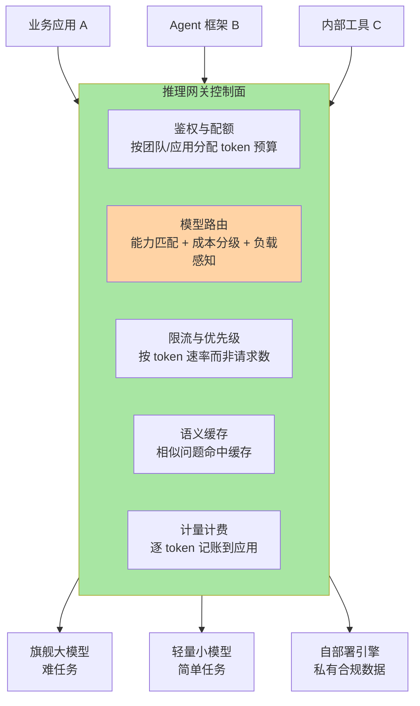
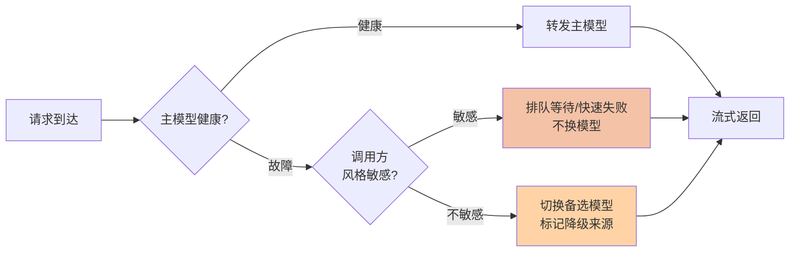

# 推理网关与模型路由：为什么 AI 世界需要一个新网关

> **一句话摘要**：推理网关是站在应用与模型之间的治理层——把「调哪个模型、怎么限流、挂了换谁、结果能不能缓存」从每个业务代码里抽出来，变成平台统一能力，角色相当于微服务世界的 API 网关，但内核完全重写。

> **本文核心**：推理网关存在的底层原理是**「模型调用的治理需求是通用的，而治理逻辑不该散落在每个业务里」**。它与后端熟悉的 API 网关同构，但有四个 AI 特有的内核差异——路由的依据从「服务名」变成「模型能力与成本」、计量从「请求数」变成「token 数」、响应从「毫秒级返回」变成「分钟级流式」、容错从「换个副本」变成「换个模型」。**机制链**：应用发请求（带模型名/能力描述）→ 网关鉴权与限流 → 按策略路由到模型 → 持续转发流式响应 → 逐 token 计量计费 → 失败时按链路降级换模型重试。

## 一句话摘要

后端工程师对网关的直觉是：统一入口、鉴权限流、路由转发、可观测。这四个词原封不动适用于推理网关——变的只是每个词的实现内核。当组织里的模型调用从「一个应用调一个模型」进化到「几十个应用调十几个模型」，散装治理的失控是必然的：成本没人说得清、限流各写各的、一个模型故障全线报警。推理网关把这团乱麻收敛成一个控制面：**业务只声明「我要什么能力」，网关决定「这次交给谁」**。这也是 2026 年推理网关成为 AI Infra 里产品化最快的方向之一的原因（业内认知）——它是四层中最接近「通用中间件」形态的一层，每个做多模型的组织都绕不开。

## 5W 速记卡

| 维度 | 一句话 |
|---|---|
| What | 应用与模型之间的统一治理层：路由/限流/failover/缓存/计量 |
| Why | 多模型多应用的调用治理散装必然失控，成本与稳定性双输 |
| Who | LiteLLM / Higress / Kong AI Gateway / 云厂商推理网关等 |
| When | 模型数量或调用方数量多到两张表记不住的时候 |
| How | 按「能力+成本+负载」路由，按 token 计量，按链路降级 |

## 一、为什么微服务网关不够用：四个内核差异

拿现成的 API 网关直接转发 `/v1/chat` 请求，能跑，但四个差异会让它在线上现出原形：

| 治理动作 | API 网关的世界 | 推理网关的世界 |
|---|---|---|
| 路由依据 | 服务名/路径 → 固定后端 | 能力描述/成本预算/负载 → 动态选模型 |
| 限流计量 | 请求数、QPS | token 数（输入输出分开计）、并发会话数 |
| 响应模式 | 毫秒级请求-响应 | 分钟级长连接、SSE 流式逐 token 吐出 |
| 故障切换 | 副本无状态，换实例重试 | 换模型可能改变答案风格，重试策略要懂语义 |

其中流式响应是对传统网关架构冲击最大的一条：传统网关按「请求-响应」建模，超时设几秒就算宽容；推理请求首 token 可能要等数秒、整体持续一分钟以上，**超时阈值、连接保持、重试语义全要重写**。这不是配置调优能弥合的差距，所以「AI 的网关」注定是新物种而不是旧网关的插件。

## 二、多模型路由：把「选模型」变成平台决策

多模型路由的底层逻辑很简单：**不同任务对模型能力的要求天差地别，而能力是昂贵的**——用旗舰大模型回答「把这句话翻译成英文」是用天价算力干小学生作业。路由层的价值就是把「哪个请求配哪个模型」从业务开发者的随手指定，升级为平台级的分流策略：

- **按难度分流**：简单任务走轻量模型，复杂推理走旗舰模型。难度判断可以是业务标签（请求分类字段），也可以是网关侧的轻量分类器（业内常见做法）
- **按数据边界分流**：涉及私有合规数据的请求只能路由到自部署模型，这是合规约束的硬路由，优先级高于一切成本考量
- **按负载分流**：某模型过载时把可迁移的请求导向备选模型，代价是答案风格可能不一致——所以路由策略必须区分「风格不敏感」与「风格敏感」的调用方

路由的取舍线画在**成本与一致性**之间：分流越激进，账单越好看，但同一个用户体验里混杂多个模型的风格差异就越明显。设计思想上是「把异构性藏到平台后面」——用户感知到的应该是一个稳定的智能体，而不是若干模型的拼接物。

## 三、限流、配额与 failover：把稳定性做成平台能力

**token 限流与配额**：推理服务的容量单位是「并发会话 × token 速率」而不是 QPS——一个长上下文请求和一个十词请求对系统的压力差着几个数量级。配额则回答组织问题：每个应用的 token 预算、超支后的降级策略（降级到小模型或直接拒绝）、月底的成本分摊报表。没有这一层，Agent 应用的一次工具循环风暴就能把预算打穿（业内反复发生的踩坑场景）。

**failover 的语义差异**：微服务 failover 换个副本就行，因为副本等价；模型之间不等价——换模型意味着答案风格甚至质量的变化。所以推理网关的 failover 链路必须由人预先定义：主模型故障时，风格敏感的调用方降级为排队等待，风格不敏感的调用方切换到备选模型。**降级不是纯技术决策，是产品决策的技术化表达**——这是网关层设计思想里最反直觉的一条。

## 四、语义缓存：便宜但危险的优化

传统缓存按 key 精确命中；语义缓存按「意思」命中——两个不同措辞的问题，embedding 相似度够高就返回同一份缓存答案。直觉上这是免费的吞吐收益（业内认知：FAQ 型场景命中率可观），但它引入了传统缓存没有的新风险：

- **相似不等于可替换**：「北京明天穿什么」和「北京明天会下雨吗」相似度极高，答案却可能不同——错误命中比不命中糟糕得多
- **答案时效性**：模型升级后，旧缓存答案还在用旧模型的口吻与知识回答，缓存成了「时间胶囊」

所以语义缓存的取舍原则是：**宁可低命中，不可错命中**——高风险场景（医疗、金融问答）不启用，低风险场景（FAQ、常识问答）设相似度阈值与短 TTL。它是一把需要安全锁的优化开关，不是默认开启的免费午餐。

## 五、量级演进视角：网关什么时候从可选变必选

- **十万级日请求**：一两个应用调一两个模型，应用内写死配置 + 一个薄封装就够，网关是过度设计。这一档的核心问题是跑通业务，而不是治理——约束来源是治理收益还没超过维护成本
- **百万级日请求**：模型与调用方数量上来了，成本分摊与限流配额变成真问题，网关从可选变必选。思考方式从「配置管理」切换为「平台治理」——这一档的核心问题是成本可归因，而不是流量转发
- **亿级 token/天以上**：网关承担混部调度的入口职能——按实时负载在自部署与云 API 之间动态分流，成为成本优化的大脑。约束来源是多供给方的价格与容量波动

一句话量级 Trade-off：十万级薄封装就够，百万级必须上网关，亿级网关升级为调度大脑——治理层的建设永远滞后半步于规模倒逼，超前建设同样浪费。

## 六、与 API 网关的区别辨析

把两者放一张表里收束（也是对本篇开头四个差异的总结视角）：

| 维度 | API 网关 | 推理网关 |
|---|---|---|
| 核心抽象 | 服务实例（等价副本） | 模型（不等价、有能力差异） |
| 计量单位 | 请求数/QPS | token（输入输出分计）+ 并发会话 |
| 连接模型 | 短连接请求-响应 | 长连接流式（SSE/WebSocket） |
| 缓存机制 | 精确 key 命中 | 语义相似命中（带正确性风险） |
| 降级语义 | 换等价副本 | 换不等价模型或排队（产品决策） |

结论不是「API 网关过时了」，而是**治理对象变了，治理内核必须重写**。工程实践上两者常共存：传统 API 治理继续走原网关，AI 流量走推理网关，各自演进互不牵制。

## 七、典型使用场景

- **多模型统一接入**：几十个应用接十几个模型，统一入口、统一鉴权、统一 SDK，换模型不改业务代码
- **成本治理**：按团队的 token 预算与配额管控，月底出分摊报表，超支自动降级
- **Agent 应用护航**：对 Agent 的循环调用设 token 速率与预算双闸，防止循环风暴打穿预算
- **混合供给调度**：自部署保底 + 云 API 弹性，网关按负载与成本动态分流

## 八、误区与不适用

- **误区一：网关只做转发。** 转发只是外壳，计量、配额、降级链路才是价值主体——只上转发等于装了个门框没装门
- **误区二：语义缓存默认全开。** 见第四节，错命中比不命中更糟，高风险场景慎用
- **误区三：failover 链路让网关自动选。** 模型不等价，自动换模型等于偷偷改产品行为——降级链路必须显式配置并标记降级来源
- **不适用**：单一模型、单一应用、日均千次以内——薄封装即可，网关的运维成本收不回来

## 九、什么时候用/不用：一张决策卡

| 信号 | 建议 |
|---|---|
| 应用或模型数量「两张表记不住」 | 上推理网关（明确推荐） |
| 多团队共用模型、要成本分摊 | 必须上网关，配额与报表是刚需 |
| 单应用单模型的内部工具 | 薄封装，不上网关 |
| 已有 API 网关想复用 | 评估其 AI 插件的流式与 token 计量能力，不达标就分开建 |

## 十、你们可能会问

**Q1：网关会不会成为延迟瓶颈？**
会增加个位数毫秒级的转发开销（业内认知的常规量级），相对推理请求秒级到分钟级的耗时是噪声。真正要防的是网关自身的可用性成为单点——部署架构上做高可用与旁路直连预案。

**Q2：语义缓存的相似度阈值怎么定？**
没有万能值，原则是按错误成本反推：错误答案代价越高的场景，阈值越保守甚至不启用。上线后用抽样人工评估校准，而不是拍脑袋定一个数就不动了。

**Q3：路由策略会不会把架构搞得太复杂？**
会，如果让每个调用方各自发明策略的话。网关的价值恰是把策略收敛到一处统一维护——复杂度守恒，问题是怎么让它待在正确的层。

## 自测三问

1. 推理网关与 API 网关的四个内核差异分别是什么？
2. 为什么模型间的 failover 不能照搬微服务的副本切换？
3. 语义缓存的主要风险是什么？取舍原则是什么？

## 💡 实战提示

- 💡 从第一天就按「应用 + 模型 + token 数 + 耗时」四元组记录每次调用——成本归因与容量规划的地基，历史数据补不回来
- 💡 Agent 调用方默认加「预算熔断」：单任务 token 超限自动截断——循环失控是 Agent 生产环境最常见的事故形态
- 💡 降级链路写进配置并演练——故障时才第一次测试降级链路，等于在火警当天才检查消防通道
- 💡 限流单位用 token 速率而非 QPS——请求大小差异高达几个数量级，按 QPS 限流形同虚设

## 追问思考与开放问题

**质疑者追问链**：为什么不让每个业务自己对接各家模型 SDK，非要在中间加一层？——第一层追问：少一层不是延迟更低、故障点更少吗？单看一条链路确实如此，但几十个业务各自对接时，重试策略、超时、计量口径各写各的，故障排查与成本审计会退化成考古。——再追问：那把 SDK 封装成公共库发下去，不就没有中间层了吗？库解决「怎么调」，解决不了「平台统一管控」——库里的策略每个业务可以绕过，网关里的策略绕不过。这就是控制面与端侧库的本质区别，也是微服务网关用十年验证过的结论。——打破砂锅问到底：网关会不会最终被引擎层吸收？值得跟踪的动向是云厂商把网关能力内置进托管推理服务——四层之间的边界漂移（篇 1 提过）在网关这一层发生得最快，长期形态未定论。

**一次排查的复盘叙事**：某平台上线推理网关一个月后，业务方抱怨「响应比直连慢」。排查数日无果，最后复盘发现「慢」的不是转发路径，而是网关新加的语义缓存：低阈值下相似请求互相污染，业务拿到「看似有理实则不对」的缓存答案，用户重问率飙升——表面是延迟问题，实际是正确性问题。当时定下的规矩沿用至今：缓存命中必须在响应头里显式标记，业务方有权按调用方关闭缓存。这次复盘的教训是：**网关每加一个「优化」，都要回答它改变了什么语义**。

**设计思想的收束**：推理网关的设计哲学可以压缩成一句话——「把模型的不等价性当作一等公民来治理」。路由按能力、降级按产品语义、缓存按风险分级，全都是这句话的推论。对照微服务治理「假设副本等价」的公理体系，你能清晰看到两个时代的治理逻辑是怎么分叉的。

## Trade-off 与取舍分析

网关层的取舍集中在「治理收益与链路成本」之间：治理越精细（配额、降级、缓存、路由策略），控制面越重，运维复杂度与误配置风险越高。语义缓存用正确性风险换吞吐；激进路由用体验一致性换成本；严格配额用业务灵活性换预算可控。反向的取舍同样成立——不过网关的团队最后都会发现：**不治理的代价不是零，是失控**，只是失控的账单来得晚一点、一次性来得更猛而已。

## 📎 核心带走

- **核心一句话**：推理网关 = 把「选模型、限流、容错、缓存」从业务收进统一控制面，治理内核围绕「模型不等价 + token 计量 + 流式长连接」三个 AI 特征重写
- **机制链**：鉴权配额 → 能力/成本/负载路由 → 流式转发逐 token 计量 → 按预定义链路降级 → 语义缓存按风险分级
- **失效点/边界**：错命中比不命中糟；自动换模型等于改产品行为；网关高可用自身要做单点预案

## 📌 数据与事实声明

- 写于 2026-09-17，L1 入门层概念篇
- 延迟开销、命中率等数字为业内认知的量级描述，非精确基准；各网关产品能力以官方文档为准
- 不涉及任何公司内部实践数据，场景描述为行业通识案例的抽象化改写

## 📚 参考资料

| 类型 | 标题 | 来源 |
|---|---|---|
| 官方文档 | LiteLLM（统一网关与代理） | docs.litellm.ai |
| 官方文档 | Higress（AI 网关能力） | higress.cn |
| 官方文档 | Kong AI Gateway | developer.konghq.com |
| 系列内 | 上一篇：推理引擎与 vLLM | [2_推理引擎与vLLM-入门.md](2_推理引擎与vLLM-入门.md) |
| 系列内 | 下一篇：GPU 调度与算力池化 | [4_GPU调度与算力池化-入门.md](4_GPU调度与算力池化-入门.md) |
