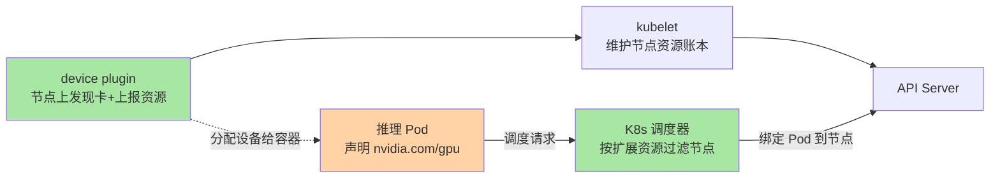
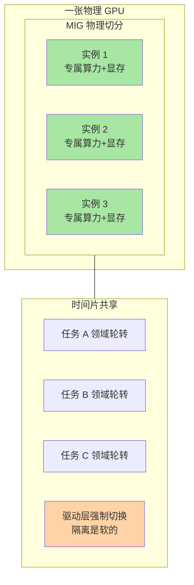

# GPU 调度与算力池化：显存为什么成了新的内存层级

> **一句话摘要**：当 GPU 从单机几块变成集群几千块，调度问题就从「把 Pod 分到有卡的机器」升级为「把算力与显存当成池子来运营」——K8s device plugin 是地基，GPU 共享（MIG/时间片）是前菜，算力池化是这一轮 AI Infra 的主菜。

> **本文核心**：GPU 调度的所有特殊性的根源是**显存成为了一级稀缺资源**——它像 CPU 寄存器之于普通进程一样贴近计算，但容量有限、不可压缩、超卖即 OOM。**机制链**：卡通过 device plugin 向 K8s 上报资源（让调度器「看得见」GPU）→ 调度器按显存与卡数分配 Pod → 硬件层或软件层决定多任务怎么共享一块卡（MIG 物理隔离/时间片轮转/池化远程调度）→ 碎片算力通过池化层回收复用。本篇要建立的直觉：**管理显存集群的思路，与当年管理内存的演进史（分区→分页→虚拟内存→池化）高度同构——理解了这条演进线，就理解了 GPU 调度的现在与未来。**

## 一句话摘要

后端工程师熟悉的资源管理心智是：CPU 可分时复用、内存可换页可超卖、磁盘天然共享。GPU 打破了其中两条直觉：**算力与显存强绑定在一张卡上，且显存不可压缩**——一个请求显存不够就是硬失败，没有任何 graceful degradation。于是「调度」这件事在 AI 集群里被重新定义：不仅要决定「任务跑在哪张卡」，还要决定「一张卡怎么被多个任务安全共享」「零散的闲置算力怎么攒起来用」。这就是本篇的三段内容：device plugin 解决「看得见」，共享机制解决「放得下」，算力池化解决「用得满」。

## 5W 速记卡

| 维度 | 一句话 |
|---|---|
| What | 把集群里的 GPU 从「绑死在单机的硬件」变成「可运营的算力池」的调度体系 |
| Why | 显存稀缺且不可压缩，整卡分配导致利用率低、碎片化严重 |
| Who | K8s device plugin / NVIDIA MIG / 各类 GPU 共享与池化方案 |
| When | GPU 数量上到几十块、多团队共享集群时就开始必需 |
| How | 资源上报 → 卡内共享（硬件切分/时间片/算力隔离）→ 集群级池化 |

## 一、地基：K8s device plugin 机制

K8s 原生只认 CPU 和内存，GPU 属于「扩展资源」。device plugin 的设计思想是**厂商自治**：NVIDIA 等厂商各自实现一个 DaemonSet 跑在每个节点上，负责发现本节点的卡、向 kubelet 上报资源清单、在 Pod 需要时把设备分配给容器。调度器看到的世界因此变成了：

```yaml
# Pod 申明 GPU 扩展资源（示例：申请 1 块整卡）
resources:
  limits:
    nvidia.com/gpu: 1
```

这个机制的底层原理值得停一停：**K8s 把「卡长什么样」的知识下沉给厂商插件，自己只维护「每个节点有几个、被谁用了」的账本**。这跟 CNI（网络）、CSI（存储）是同一套插件化设计哲学——平台定接口，厂商填实现。理解这一点，你就明白为什么 GPU 调度的生态碎片化是结构性的：接口统一，实现各自演进。

device plugin 解决的是「看得见、分得出」，但整卡粒度的分配立刻暴露两个大问题，引出下一节：

- **粒度太粗**：一个只跑 7B 小模型的服务也独占整卡（几十 GB 显存），大头闲置
- **碎片太碎**：A 团队要 1 卡、B 团队要 2 卡，机器上剩下的 0.5 张卡（空闲半卡算力）谁也用不了

把从上报到分配的整条链路画出来，各组件的模块边界一目了然：



## 二、一张卡怎么共享：MIG 与时间片

### 2.1 MIG：物理切分，硬件级隔离

MIG（Multi-Instance GPU）把一张物理卡在硬件层切成多个独立实例，每个实例有专属的算力单元与显存分区——**切完之后互相看不见，故障不串门，性能不受邻居干扰**。

### 2.2 时间片：逻辑复用，软件级轮转

时间片方式不改硬件，多个任务轮流转使用整卡算力，由驱动层强制切换。代价是**隔离是软的**：邻居任务如果行为恶劣（显存打爆、占用超时），其他任务跟着遭殃。



两者的取舍一句话讲清：**MIG 用灵活性换隔离性**（切分粒度固定、部分卡型才支持），**时间片用隔离性换灵活性**（任意卡可用、粒度任意、但软隔离）。在线生产服务偏 MIG（稳定性优先），开发测试与离线任务偏时间片（利用率优先）——同一套集群里两种模式并存是常态。

## 三、算力池化：把碎片攒起来

卡内共享解决「一张卡放得下」，但集群视角还有更深的浪费：**A 机器的卡满载排队、B 机器的卡在睡觉**——各自为政的分配让全局利用率上不去。算力池化的思路是把集群所有卡抽象成一个统一池子：任务不再绑定具体物理卡，由池化层实时匹配「哪里有空就跑哪里」，甚至把一块逻辑卡调度到多张物理卡上协同。

这里要引出本篇最重要的认知转变——**显存为什么成了新的内存层级**。回看单机内存的演进史：程序从「独占物理内存」到「虚拟内存按需分页」，再到分布式时代的内存池化——每一次演进的本质都是「解耦逻辑需求与物理占有」。显存正在原样重走这条路：模型与 KV 缓存对显存的需求是逻辑的，物理上不必绑死在某张卡的某个角落。篇 2 的 PagedAttention 在**卡内**做了分页，算力池化在**卡间**做调度——两层拼起来，「显存虚拟化」的图景就完整了。这也是业内对下一代 AI Infra 的共识方向之一（业内认知）：谁把显存池化做透，谁的算力账单就先降下来。

**量级 Trade-off 意识**：十万级日请求、几块卡的小集群，整卡分配加时间片就够，池化的运维复杂度纯亏；百万级日请求、几十到几百块卡，MIG 细分加简单的碎片回收开始有收益；千卡级、多团队共享、支撑亿级 token/天的集群，不池化的代价（整体利用率显著低于规划值，业内普遍认知）会大到无法忽视。这一档的核心问题是全局利用率，而不是单卡性能——约束来源是算力采购的固定成本刚性，思考方式必须是全局运营视角。

## 四、与 CPU 调度的区别辨析

| 维度 | CPU 调度 | GPU 调度 |
|---|---|---|
| 可分性 | 毫核级细粒度切分 | 整卡或卡内固定切分，粒度粗 |
| 超卖 | 内存可超卖、可换页 | 显存不可压缩，超卖即 OOM |
| 抢占 | 进程可随时被抢占调度 | 任务抢占常意味着显存清空重来（含权重重载） |
| 失败代价 | 重启进程秒级 | 重新拉起加载权重分钟级 |

一句话总结这张表：**CPU 调度处理的是「软」资源，GPU 调度处理的是「硬」资源**——不可压缩、重载昂贵、粒度粗大。所以 CPU 调度领域的很多成熟手段（弹性扩缩、抢占有道、超卖复用）在 GPU 侧都要重新发明，不能照搬。

## 五、典型使用场景

- **多团队共享集群**：平台团队统一管卡，按团队配额与优先级调度，MIG 保证在线服务互不干扰
- **昼夜混部**：白天在线推理优先，谷时把算力让给离线批量任务，池化层做动态腾挪
- **弹性推理扩容**：流量高峰从池子里临时借卡，加载好权重的热副本池减少冷启动
- **异构混管**：不同型号加速卡统一纳管，按模型兼容性路由到对应卡型

## 六、误区与不适用

- **误区一：池化是免费的午餐。** 池化引入了调度层的新故障面——远程显存访问的延迟、池化组件自身的可用性，收益与风险要一起算
- **误区二：MIG 切得越细越好。** 切分过细会让单实例显存放不下目标模型，验证显存需求再定切分粒度，这是踩过坑的团队的共同教训
- **误区三：把 GPU 当普通资源写进调度策略。** 忽略权重加载时间与拓扑亲和性（卡间通信带宽），调度结果看着合理、跑起来性能稀碎
- **不适用**：单机几张卡的个人/小团队场景——device plugin 之上的共享与池化都是多余的复杂度

## 七、什么时候用/不用：一张决策卡

| 信号 | 建议 |
|---|---|
| 单机 1-8 卡、单团队自用 | 整卡分配即可（明确推荐起点） |
| 多团队共享、在线服务稳定性敏感 | MIG 做卡内隔离 |
| 集群数百卡、利用率持续偏低 | 评估算力池化方案 |
| 在线与离线任务共存 | 时间片+优先级做昼夜混部 |

决策原则：**从最粗粒度开始，被浪费逼着细化，而不是一步到位上最复杂的方案**——调度体系复杂度每升一级，故障排查难度翻着涨。评估调度架构时把上下游一起看：上层引擎的显存画像、下层硬件的拓扑约束，中间这层的价值在于把两边的复杂性各自吸收，而不是互相穿透。

## 八、你们可能会问

**Q1：为什么 GPU 不能像内存一样随便超卖？**
内存可以换页到磁盘（慢但活），显存没有可用的「下一级存储」能低成本兜底——权重与 KV 缓存换出到主存再换回来，延迟高到推理请求直接超时。不可压缩 + 无兜底，决定了超卖即硬失败。

**Q2：池化后任务跨卡迁移，模型权重怎么办？**
权重文件在共享存储里，迁移意味着新卡重新加载（分钟级）。所以工程上的方向是「热副本池」与「迁移最小化」——把池化调度和权重缓存策略放在一起设计，而不是当成两个独立问题。

**Q3：调度器和推理引擎的批处理会不会打架？**
会打架，如果不分工的话。分界线是：调度器管「任务在哪张卡」（分钟级决策），引擎管「卡内请求怎么攒批」（毫秒级决策）——两层各管一个时间尺度，分层隔离正是篇 1 讲的四层设计思想的体现。

## 自测三问

1. device plugin 解决什么问题？它体现的插件化设计哲学是什么？
2. MIG 与时间片的取舍线在哪里？各自适合什么场景？
3. 为什么说显存正在重走内存的虚拟化演进之路？

## 💡 实战提示

- 💡 给 GPU 集群建「利用率周报」：按卡统计实际算力与显存水位——没有全局视野，池化的投资回报无从评估
- 💡 在线服务的 MIG 切分前先压测显存峰值：模型权重 + KV 缓存 + 框架开销都要算进去，切完放不下再重切是返工
- 💡 权重文件放共享存储并做本地缓存预热——调度灵活性的前提是「换卡的成本可接受」
- 💡 调度策略变更灰度到单节点先行——调度器的错误会同时放大到所有租户，全量直接上是高危动作

## 追问思考与开放问题

**质疑者追问链**：为什么 GPU 调度至今没有像 CPU 调度那样出现「事实标准」？——第一层追问：是技术不成熟吗？不完全是，更深层的原因是硬件迭代太快：切分粒度、互联拓扑每代都在变，软件层的抽象追着硬件跑，标准刚想定型就被下一代卡打破。——再追问：那碎片化要持续多久？参考 CPU 调度史，硬件形态稳定后标准才会收敛——下一代硬件若把「卡内虚拟化」做成原生能力，现在的软件池化层可能整层被吸收，这正是篇 1 说的「边界漂移」在调度层的上演。——打破砂锅问到底：终极形态是什么？业内一种有影响力的判断是算力彻底「水电煤化」——应用声明逻辑需求，物理卡完全不可见。判断依据不足以下定论，但方向上与显存虚拟化的演进线自洽。

**一次排查的复盘叙事**：某共享集群上线半年，各团队都在抱怨「申请的卡跑不满」，平台报表显示整体利用率却只有规划的一半。排查一周，复盘出三个叠加原因：一是各团队按峰值整卡申请、按均值使用，申请即占坑；二是不同型号卡被无差别混排，部分模型调度到不兼容卡型上反复失败重拉；三是失败的 Pod 反复重载权重，把相邻任务的网络与存储带宽也拖下水。当时定下的治理动作：按真实用量回收配额、调度器加卡型亲和性规则、权重预热纳入发布流程。这次复盘沉淀出的原则——**利用率问题从来不只是调度算法问题，是申请制度、兼容性、失败处理三条线的复合问题**——后来被写进了平台的容量管理规范。

**设计思想的迁移**：从「整卡独占」到「卡内切分」再到「集群池化」，这条路径与计算资源管理的历史同构——裸机→虚拟机→容器→ Serverless。调度架构的每一次重构，本质都是重新划定「逻辑需求」与「物理占有」之间的模块边界，并把上下游的耦合拆开。当你面对任何新的稀缺资源（显存今天，未来的专用加速器明天），先问一句：它走到演进线的哪一段了？这个视角比记住任何具体产品名都耐用。

## Trade-off 与取舍分析

GPU 调度每一层的机制都是一组取舍：MIG 拿隔离性换灵活性，时间片拿隔离噪声换利用率；池化拿运维复杂度与新增故障面换全局利用率；异构混管拿调度复杂度换采购议价能力与供给弹性。调度体系没有「最先进」只有「最匹配」——匹配团队的规模、匹配流量的形状、匹配故障容忍度。评估任何新调度方案时，把「它牺牲了什么」问到底，比听「它优化了什么」更重要。

## 📎 核心带走

- **核心一句话**：GPU 调度 = 让集群「看得见」卡（device plugin）→ 一张卡「放得下」多任务（MIG/时间片）→ 全局算力「用得满」（池化），根源约束是显存不可压缩
- **机制链**：厂商插件上报资源 → 调度器按卡/显存分配 → 硬件或软件层决定共享方式 → 池化层回收碎片跨机腾挪
- **失效点/边界**：超卖即 OOM；MIG 切分放不下就返工；池化的新故障面要用利用率收益来换

## 📌 数据与事实声明

- 写于 2026-09-17，L1 入门层概念篇
- 利用率、延迟等数字为业内认知的量级描述；MIG 支持的卡型与切分粒度以厂商官方文档为准
- 池化方案的形态与命名随厂商不同，本文只讲机制分类不点名具体内部实现

## 📚 参考资料

| 类型 | 标题 | 来源 |
|---|---|---|
| 官方文档 | Kubernetes 设备插件机制 | kubernetes.io/docs/concepts/extend-kubernetes/compute-storage-net/device-plugins |
| 官方文档 | NVIDIA GPU Operator 与 MIG | docs.nvidia.com/datacenter/cloud-native |
| 官方文档 | vLLM（显存分页，与调度衔接） | docs.vllm.ai |
| 系列内 | 上一篇：推理网关与模型路由 | [3_推理网关与模型路由-入门.md](3_推理网关与模型路由-入门.md) |
| 系列内 | 下一篇：AI Infra 收官与学习路径 | [5_AIInfra收官与学习路径-入门.md](5_AIInfra收官与学习路径-入门.md) |
