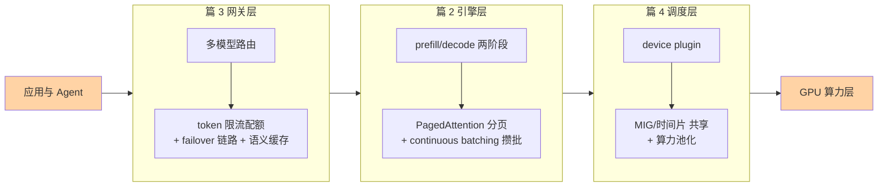
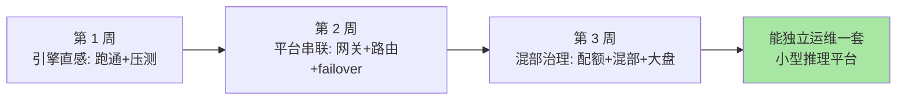

# AI Infra 收官：云原生技能怎么迁移，学习路径怎么走

> **一句话摘要**：这是系列的收官篇——把四层全景拼回一张图，逐项盘点云原生技能栈里「哪些直接迁移、哪些换内核、哪些全新学」，再给一条按周推进的学习路径，让「看得懂」变成「上手干」。

> **本文核心**：后端工程师进入 AI Infra 最大的优势不是重新学习，而是**迁移**——四层结构里的调度、网关、观测、成本治理能力都有直接的云原生对应物，真正全新的只有推理引擎的机制内核（prefill/decode/KV 缓存）与 GPU 硬件特性。**机制链（系列回顾）**：篇 1 建立四层全景与边界 → 篇 2 深入引擎层的两阶段与两件武器 → 篇 3 理解网关层的治理内核重写 → 篇 4 打开调度层的显存视角——四篇合起来，是一个推理请求从业务代码到硅片的完整旅程。

## 一句话摘要

学一个新领域最有效的问题不是「我要学多少新东西」，而是「我已经会的里面有多少还能用」。本篇用一张映射表回答这个问题：K8s 调度经验直接迁移到 GPU 调度的账本层，网关与限流经验迁移到推理网关的骨架，观测与成本治理经验原样复用——需要从零建立的，集中在「token 生产」这一段的机制直觉。**结论先行：后端工程师切入 AI Infra 的合理路径不是转行，而是扩容**——用两三周把机制直觉补上，剩下的靠真实项目里的排查与复盘自然生长。

## 5W 速记卡

| 维度 | 一句话 |
|---|---|
| What | 全系列收官：全景回顾 + 技能迁移映射 + 学习路径 |
| Why | 收尾不收场——把四篇知识变成可执行的上手计划 |
| Who | 有云原生与后端基础、想切入 AI Infra 方向的工程师 |
| When | 读完前四篇、准备动手搭第一个推理服务的时候 |
| How | 三周路径：引擎直感 → 平台串联 → 混部与治理 |

## 一、全景回顾：一张图收束四篇

四篇各留了一个「带走的直觉」：篇 1 的直觉是**分层与边界**（每层只回答一个问题）；篇 2 的直觉是**车厢装满**（访存瓶颈决定一切优化方向）；篇 3 的直觉是**模型不等价**（治理内核因此重写）；篇 4 的直觉是**显存不可压缩**（调度体系因此重新发明）。这四个直觉撑不住的时候，就回到对应篇目把机制链再走一遍。

## 二、与云原生技能栈的映射：迁移清单

这张表是本篇的主体——逐项盘点，态度诚实：

| 云原生技能 | AI Infra 对应物 | 迁移程度 |
|---|---|---|
| K8s 调度原理（节点过滤/打分/绑定） | GPU 调度的账本与绑定机制 | 直接迁移，叠加扩展资源知识 |
| API 网关（路由/鉴权/限流） | 推理网关骨架 | 骨架迁移，内核重写（token 计量/流式/降级语义） |
| 微服务观测（tracing/指标） | 推理链路观测（TTFT/TPOT/token 成本） | 方法论迁移，指标体系全新 |
| 容量规划与成本治理 | 算力预算与池化决策 | 方法论迁移，资源模型换显存 |
| 熔断降级（副本等价假设） | 模型 failover 链路（模型不等价） | 概念迁移，决策逻辑重学 |
| 中间件性能调优经验 | 引擎批处理与缓存调优 | 思维方式迁移，参数体系全新 |
| ——以下为全新学习区—— | | |
| —— | 推理两阶段机制（prefill/decode） | 全新 |
| —— | KV 缓存与显存管理 | 全新 |
| —— | GPU 硬件特性（显存层级/互联拓扑） | 全新 |

迁移程度「直接迁移」的部分，信心可以给足——那部分组织能力与个人经验是复用的资产；「全新」的部分集中在篇 2 与篇 4 的机制内核，这正是本系列用最大篇幅讲透的原因。**模块边界画清楚，学习投入才不会错配**——最贵的浪费是拿全新知识的学时去反复验证本可直接迁移的经验。把映射表当作个人架构能力的资产盘点表，每季度回看一次，新学的云原生能力能不能迁移过来、AI 侧的新机制值不值得投入，一目了然。

## 三、学习路径：三周上手计划

### 第一周：建立引擎直感（对应篇 2）

- 目标：在单机或云主机上把一个开源模型用 vLLM 跑起来，发出第一批流式请求
- 验证点：能说出这次部署的显存占用构成（权重 + KV 缓存 + 框架开销）；用固定提示词集压测一次，画出吞吐-延迟曲线
- 报错是学习素材：显存不足（OOM）的报错信息值得逐行读——它就是显存模型的实物教学

### 第二周：平台串联（对应篇 3 + 篇 4）

- 目标：在两个引擎实例前面架一个推理网关，配好多模型路由与 token 配额
- 验证点：故意停掉主模型，观察 failover 链路是否按预定义策略切换；发一批长上下文请求，观察限流与降级是否如期触发
- 上下游打通后，回看篇 1 的四层图——这时候每一层对你不再是名词，而是一次你亲手配过的配置项

### 第三周：混部与治理（对应篇 4 + 综合演练）

- 目标：模拟多团队共享场景——配额分组、优先级调度、昼夜错峰的批任务
- 验证点：观测面板上能看到按团队分摊的 token 成本；一次模拟的流量洪峰中，限流、降级、扩容依次工作
- 收官标准：能对着一张监控大盘，讲清楚「现在集群里每个数字在说什么、谁该为它负责」

**量级 Trade-off 意识**：路径深度要匹配目标的量级——十万级日请求的内部服务，前两周的内容就是全部所需；百万级日请求的平台，第三周的混部与治理是必修；亿级 token/天的生产集群，本系列只是地图，生产化深水区（长尾治理、多租户隔离）需要在岗积累。这一档的核心问题是「学多深才够用」，而不是「学得多全」——约束来源是团队真实量级，思考方式按需配深。

这条路径的取舍：**三周换「能上手」而不是「能精通」**——引擎调优的参数海洋、调度器的边界场景、池化方案的生产化，都是之后在真实项目里以月为单位积累的。路径的价值是把学习曲线最陡的第一段扶平，让后续的自学顺着惯性走。

## 四、与训练侧 Infra 的区别辨析

学习路径的另一个分岔口值得辨析清楚——推理侧与训练侧虽然同属 AI Infra，但知识体系并不互通：

| 维度 | 推理侧 Infra（本系列） | 训练侧 Infra |
|---|---|---|
| 核心矛盾 | 随机小请求的延迟与吞吐 | 长时间大任务的吞吐与容错 |
| 资源形态 | 显存碎片化、服务常驻 | 整机整卡独占、任务批处理 |
| 失败代价 | 单请求重试，影响小 | 千卡任务数周训练一朝崩，需断点续训 |
| 后端经验迁移度 | 高（网关/调度/治理全复用） | 中（分布式训练的原语全新） |

对后端背景的学习者，推理侧的迁移成本低得多——这也是本系列只圈定推理侧的取舍依据。想进训练侧的同学，把本系列当地基即可，分布式训练的并行策略、容错机制需要另起一个系列。

## 五、与《从零开始认识AI系列》的衔接

两套系列拼起来是完整的 AI 技术栈认知：AI 系列讲「大脑」——LLM 怎么预测、Agent 怎么规划与动手；本系列讲「身体的基础设施」——大脑怎么被批量、稳定、低成本地供能。推荐的融合用法：读完本系列后回到 AI 系列的 Agent 工程化部分（特性层），用 Infra 视角重新审视 Agent 的每一次模型调用——你会开始自然地追问「这个 Agent 的成本结构是什么、它故障时的降级链路在哪」，这种双向穿透是两个领域都真正学懂的标志。

## 六、典型使用场景

- **后端团队承接模型服务化**：团队已有 K8s 平台，业务要上模型服务——按第二节映射表盘点能力，按第三节路径补机制课
- **个人方向探索**：在现有岗位之外寻找 AI Infra 的切入口——先从公司内某个推理服务的观测与成本报表做起，小切口反哺学习
- **技术选型评估**：评估云厂商托管推理服务与自建方案的边界——用篇 1 的量级分档与决策卡做框架

## 七、误区与不适用

- **误区一：把三周路径当精通认证。** 它只覆盖入门直感，真实生产环境的坑（长尾延迟、异构兼容、成本漂移）必须靠线上实践填
- **误区二：跳过机制课直接堆参数。** 不懂 prefill/decode 就调批大小，等于不懂数据库就调 buffer pool——知其然不知其所以然的调优是玄学
- **误区三：学完就推倒重来。** 已有云原生平台的组织应该「扩建」而不是「重建」，把 AI 负载纳入既有平台治理，另起炉灶通常是政治成本高于技术成本的选择
- **不适用**：想深入训练侧 Infra 的同学——本系列只覆盖推理侧，训练集群的调度与容错是另一套知识体系，别用错地图

## 八、什么时候用/不用这张学习路径

| 信号 | 建议 |
|---|---|
| 有云原生基础、要承接推理平台 | 按三周路径走（明确推荐） |
| 纯算法背景、缺平台工程经验 | 先补 K8s 基础，再走路径，顺序不能反 |
| 只需要调用模型 API 的应用开发 | 不需要本系列——AI 系列的 Agent 部分就够了 |
| 目标是训练侧 Infra | 本系列作背景知识，另寻训练专题 |

## 九、你们可能会问

**Q1：三周时间从哪来？工作忙不完怎么办？**
路径按「每周 5-8 小时」设计，可以拉长到六周，关键是每个验证点都要亲手做——看十篇文章不如排一次错。挤不出来的另一个信号：当前工作离这条线太远，那就先把第一周做完再评估投入。

**Q2：学完这个系列能直接做 AI Infra 的活吗？**
「能在指导下干活」可以，「独立扛平台」不够。差距在生产化的深水区：多租户隔离、长尾延迟治理、故障演练——这些只能在真实平台里长出来，本系列给的是进入深水区前的浮力装备。

**Q3：行业变化这么快，现在学的东西会不会一年就过期？**
机制层的半衰期远长于产品层——prefill/decode 的物理约束、显存不可压缩的资源模型、治理内核的设计思想，这些是五年尺度的知识；具体引擎的参数与产品名一年就换几茬。从 2025 年到今天，引擎产品层已经换了几茬，机制层却纹丝没动——学的时候把重心压在机制层，产品层当作机制的当下例证——这也是本系列写作时的取舍标准。

## 自测三问

1. 对照技能映射表，你的经验里「直接迁移」「内核重写」「全新学习」各占哪些？
2. 三周路径的三个验证点分别是什么？为什么强调亲手做？
3. 判断一个 AI Infra 知识点「会不会快速过期」的标准是什么？

## 💡 实战提示

- 💡 上手第一周就把显存占用拆解成清单贴在工位上——权重、KV 缓存、框架开销三项，之后一切容量问题都回到这张清单
- 💡 每次压测固定「提示词集 + 并发梯度」并留档——可比的数据是调优的唯一凭据，体感不是
- 💡 在公司内找一个最小的真实场景练手（内部工具的模型调用改造）——真实流量的反馈密度是任何实验室环境给不了的
- 💡 建立自己的「机制-产品」双栏笔记：左边写不变的机制原理，右边写当天的产品实现——季度回顾时左边基本不用改，右边整栏重写，这就是知识半衰期的直观管理

## 追问思考与开放问题

**质疑者追问链**：AI Infra 会不会最终被云厂商完全托管，自建能力变得没价值？——第一层追问：历史上的数据库与大数据平台不都被托管化了吗？部分是，但算力成本占营收比重高的业务，托管溢价本身就是一笔无法接受的税——成本敏感度决定托管化的边界，这在业内认知里已是分档共识。——再追问：那小团队的自建能力是不是没意义了？不是没意义，是形态变了——小团队的自建越来越是「组装开源 + 掌握机制」而不是「从零造轮子」，机制理解恰恰是组装能力的前提，这正是本系列教机制不讲造轮子的原因。——打破砂锅问到底：三年后回看，今天这四层的边界还能认出几个？网关与引擎的吸收战、调度与硬件的边界漂移（篇 1、篇 3、篇 4 各埋了伏笔）都在进行时，值得每年回头校准一次自己的知识地图。

**一次复盘的复盘（元叙事）**：某团队按类似路径切入 AI Infra，第一年踩的最大坑不是技术，是**节奏**——上来就对标行业最先进的池化方案，三个月建成、半年后因为团队体量撑不起运维复杂度而回退到整卡分配。复盘时有人问：如果不建会怎样？答案是「几乎没差别」。这件事的教训值得每个切入者预演一遍：**基础设施的先进性要用得上才有价值，规划里写「我们暂时不用什么」和写「我们要用什么」同样重要**。运维复杂度是复利的负债，技术收益是复利的资产，账要两边一起算。

**设计思想的最后一课**：回看过去 5 年，容器与服务网络的演进把同一批底层原理换了三批产品名——本系列反复出现的母题正是「历史在新技术上重演」——分页之于 PagedAttention，虚拟化之于算力池化，网关治理之于推理网关。学习新领域最快的路，是识别出它处在哪个老问题的哪个阶段，然后借用那个阶段的全部答案。这个学习方法本身，就是比四层知识更耐久的设计思想。

## Trade-off 与取舍分析

收官篇自身的取舍也要诚实交代：本系列选择了「机制优先、产品为证」的写法，代价是具体产品的版本细节着墨少——读者上手时面对的最新版本特性可能文中没有；选择了「推理侧」的边界，代价是训练侧 Infra 的精彩世界只字未提；选择了「入门直感」的深度档位，代价是调优参数与生产化细节留给了后续特性层系列。把几个被否决的反方案摆出来看更清楚：为什么不用「产品评测优先」的写法——产品名一年几茬，评测文过期的速度比学习曲线爬完还快；为什么不面面俱到地四层平铺——入门层塞进所有细节的结果是每一层都只剩名词没有直觉；为什么不把训练侧硬塞进来求「完整」——两套资源画像相反的体系挤在一册里，两边的机制都会被讲浅。取舍的依据从头到尾只有一条：**入门层的使命是建立正确的直觉与地图，让后续的深入不再迷路**——覆盖的深度让位于方向感的建立，这是本系列一切写法的总取舍。

## 📎 核心带走

- **核心一句话**：后端切入 AI Infra 是扩容不是转行——调度/网关/观测/成本治理能力可迁移，引擎机制与 GPU 特性需补课，三周路径把最陡的学习曲线扶平
- **机制链（系列总链）**：应用发请求 → 网关路由限流（篇 3）→ 引擎攒批吐 token（篇 2）→ 调度分显存与卡（篇 4）→ 四层合力兑现服务（篇 1）
- **失效点/边界**：三周只换来入门直感；先进性用不上就是负债；机制层长半衰期、产品层快过期——重心要压对地方

## 📌 数据与事实声明

- 写于 2026-09-17，L1 入门层概念篇（系列收官）
- 托管化边界、行业分档共识等为业内认知口径；学习路径为经验框架，非权威认证标准
- 全系列不涉及任何公司内部数据与未公开实践

## 📚 参考资料

| 类型 | 标题 | 来源 |
|---|---|---|
| 系列内 | 篇 1：AI Infra 是什么与全景 | [1_AIInfra是什么与全景-入门.md](1_AIInfra是什么与全景-入门.md) |
| 系列内 | 篇 2：推理引擎与 vLLM | [2_推理引擎与vLLM-入门.md](2_推理引擎与vLLM-入门.md) |
| 系列内 | 篇 3：推理网关与模型路由 | [3_推理网关与模型路由-入门.md](3_推理网关与模型路由-入门.md) |
| 系列内 | 篇 4：GPU 调度与算力池化 | [4_GPU调度与算力池化-入门.md](4_GPU调度与算力池化-入门.md) |
| 相关系列 | 从零开始认识AI系列（模型与 Agent） | [0_系列导读-全景.md](../从零开始认识AI系列/0_系列导读-全景.md) |
| 官方文档 | vLLM 快速开始（第一周练手） | docs.vllm.ai |
| 官方文档 | Kubernetes GPU 调度（第二周参考） | kubernetes.io/docs/tasks/manage-gpus |
