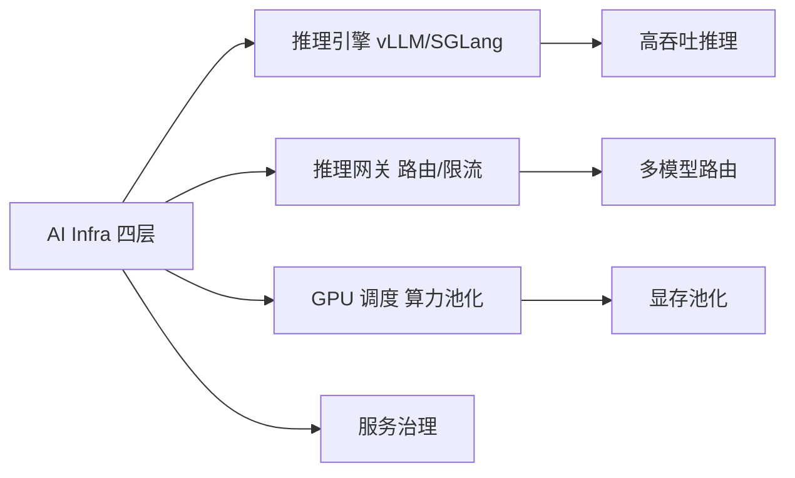

# 从零开始认识AIInfra系列

> AI 系列讲模型与 Agent（大脑），本系列讲把大脑跑起来的基础设施——算力、调度、推理引擎、服务治理。2026 年行业风向中心（互指 _internal/trend-radar/2026-09.md）。

## 这个目录讲什么

五篇建立后端工程师的 AI Infra 全景：四层架构是什么、推理引擎为什么长这样（prefill/decode 与 GPU 利用率）、推理网关与模型路由、GPU 调度与算力池化、收官与学习路径。面向有云原生基础的后端工程师，强调「哪些能力可迁移」。

**5W 速记卡**：
- **What**：AI Infra = 把 LLM/Agent 跑起来的基础设施（算力+调度+推理+网关）
- **Why**：2026 年推理是 AI 应用的核心瓶颈，不懂 Infra 就做不了生产架构
- **Who**：有云原生基础的后端工程师
- **When**：2026 年，GPU 调度/推理网关是热门面试题
- **Where**：vLLM / SGLang / 推理网关 / GPU 池化

**自测三问**：
1. 本文核心机制：AI Infra 四层 = 推理引擎→网关→调度→服务治理
2. 失效点：GPU 利用率低 → 推理成本高（prefill/decode 不平衡）
3. 与下篇衔接：AI Infra 全景 → 推理引擎（vLLM 深度）

---

## 文章导航

| 篇目 | 一句话重点 |
|---|---|
| 1_AIInfra是什么与全景 | 四层架构；与云原生/Agent 工程化的边界 |
| 2_推理引擎与vLLM | prefill/decode 两阶段；GPU 利用率是核心问题 |
| 3_推理网关与模型路由 | AI 的网关：路由/限流/failover/语义缓存 |
| 4_GPU调度与算力池化 | 显存是新内存层级；MIG 与池化 |
| 5_AIInfra收官与学习路径 | 能力迁移地图与学习路径 |

## 📌 维护说明

新增文章必须同步更新本导航表，并同步 docs/ai/index.md。

## 📌 数据与事实声明

- 写于 2026-09-17；引擎与组件能力以 vLLM/SGLang 等官方文档公开口径为准

## 📚 参考资料

|| 类型 | 标题 | 来源 |
||---|---|---|
|| 官方文档 | vLLM / SGLang | docs.vllm.ai · sgl-project.github.io |
|| 系列导航 | AI 域目录 | `docs/ai/index.md` |

