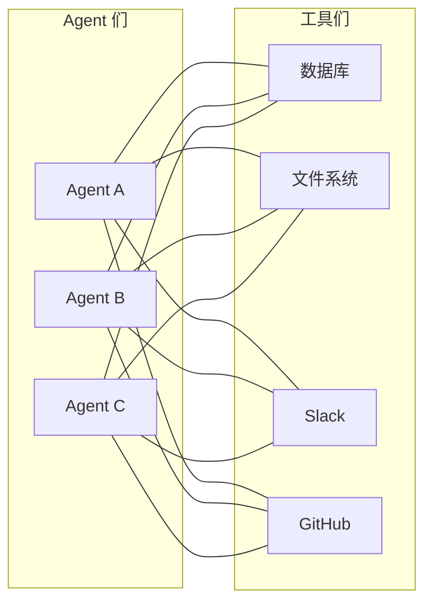
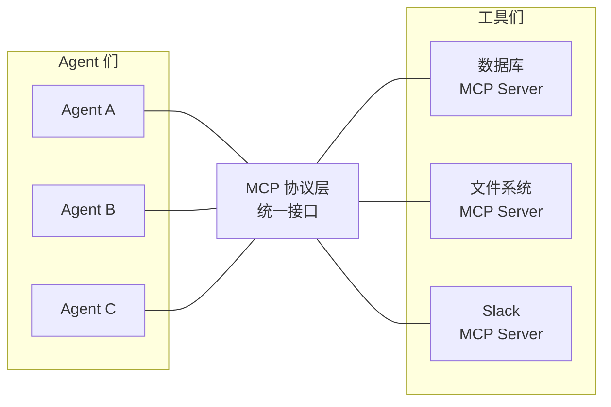
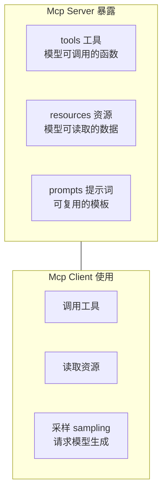
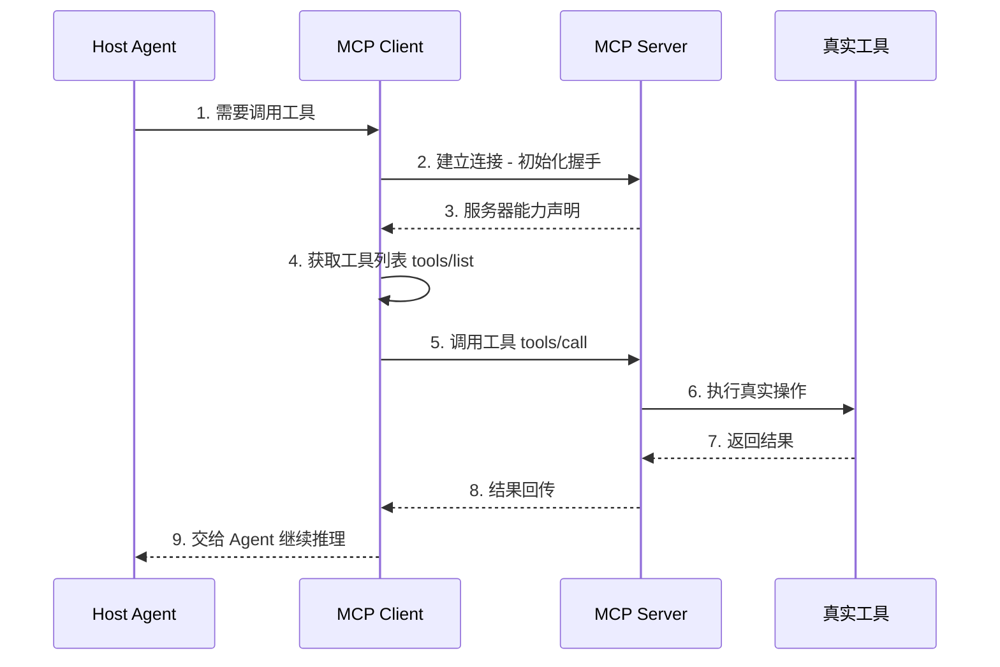
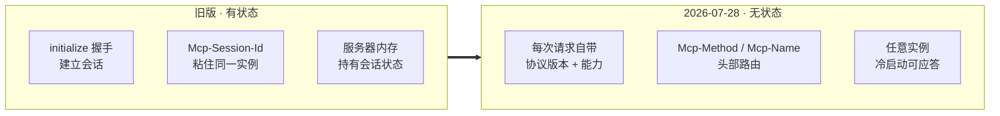
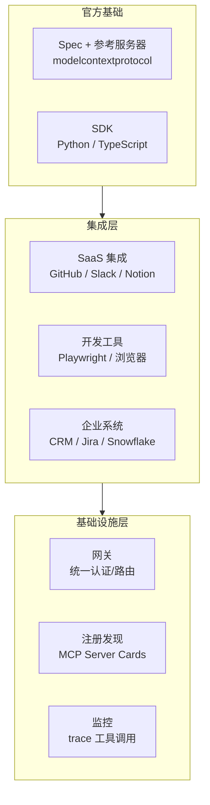

# MCP 协议与生态：工具的 USB-C

> 一句话摘要：MCP（Model Context Protocol）是 Anthropic 2024 年 11 月开源的"AI 工具接入标准"，解决"每个 Agent 对接每个工具都要写一遍适配器"的 N×M 问题。2026-07-28 规范重大更新：协议从有状态变为无状态，MCP 服务器从此可以跑在 serverless 和边缘。本篇讲协议架构、调用流程、2026 无状态化大更新、生态现状与 2026 Roadmap。

---

## 1. 背景：为什么需要 MCP

### 1.1 N×M 适配问题

没有 MCP 之前，让 Agent 接入工具是这样的：

**每个 Agent 都要为每个工具写一套适配器**。3 个 Agent × 4 个工具 = 12 个集成。N 个 Agent、M 个工具，就是 N×M 个集成。

**MCP 出现后**：工具写一次 MCP Server，任何支持 MCP 的 Agent 直接用。

**集成数从 N×M 变成 N+M**。这就是"工具的 USB-C"——USB 统一了外设接口，MCP 统一了 AI 工具接口。

---

## 2. MCP 是什么：核心架构

### 2.1 官方定义

> MCP 是一个开放协议，用于将 LLM 应用与外部数据源和工具连接起来。采用 **host-client-server** 架构。

**三个角色**：

| 角色 | 是什么 | 例子 |
|---|---|---|
| **Host（宿主）** | Agent 主程序 / LLM 应用 | Claude Desktop、IDE、自研 Agent |
| **Client（客户端）** | Host 内与 Server 通信的组件 | 每个 MCP 连接一个 Client |
| **Server（服务器）** | 暴露工具/资源/提示词的进程 | GitHub MCP Server、数据库 Server |

### 2.2 原语（Primitives）

MCP 定义了几个核心能力原语：

- **Tools**：模型可以调用的函数（查数据库、发消息、读文件）——最常用
- **Resources**：模型可以读取的数据（文件内容、查询结果）
- **Prompts**：可复用的提示词模板
- **Sampling**：服务器反向请求模型生成（双向）

### 2.3 传输层

| 传输方式 | 场景 | 特点 |
|---|---|---|
| **stdio** | 本地进程 | 子进程管道通信，最简单 |
| **Streamable HTTP** | 远程服务器 | HTTP 传输，支持服务端流式 |

---

## 3. 一次 MCP 调用流程

**关键点**：Host 完全不关心 Server 后面是什么——数据库、Slack、文件系统，对 Agent 来说都是"调用一个工具"。

---

## 4. ★ 2026-07-28 重大更新：协议无状态化

### 4.1 变化核心

2026-07-28 MCP 规范发布（GA SDK 同步落地），**移除了 initialize 握手和 Mcp-Session-Id 头**：

### 4.2 为什么重要

**旧版痛点**：客户端开一个会话，服务器把会话状态锁在内存里，后续请求必须回到同一实例——**无法水平扩展**。

**新版意义**：MCP 服务器可以：
- 跑在 **round-robin 负载均衡**后面（不需要 sticky session）
- 部署到 **serverless**（Lambda / Cloudflare Workers）
- 部署到**边缘**（Edge）
- 实例挂了**干净切换**

> "Stateful session affinity is exactly the kind of infrastructure tax that keeps a protocol stuck running on dedicated VMs while the rest of the web moved to elastic, ephemeral compute a decade ago. MCP just paid that tax off."
> —— 2026-08 行业分析

### 4.3 具体变更清单

| 变更 | 旧版 | 2026-07-28 |
|---|---|---|
| 握手 | initialize / initialized | **移除** |
| 会话 | Mcp-Session-Id（服务器持状态） | **移除** |
| 请求身份 | 会话 token 指服务器状态 | **每次请求自带**协议版本+客户端能力 |
| 路由 | 解析 JSON-RPC body | **Mcp-Method / Mcp-Name 头**（网关直接读头路由） |
| 缓存 | 无 | **ttlMs + cacheScope**（tools/list 等可声明有效期） |
| 交互式调用 | 流上暂停询问 | **Multi Round-Trip**（input_required 重试循环） |

### 4.4 服务器作者升级清单（官方建议）

1. 删掉 Mcp-Session-Id 的会话内存状态
2. 处理器从请求 `_meta` 读客户端能力（不是存储的会话对象）
3. list 响应设置诚实的 `ttlMs`（客户端才能受益于缓存契约）
4. MRTR 交互逻辑从开放流迁移到 `input_required` 重试循环

---

## 5. 生态现状（2026-08 实测数据）

### 5.1 GitHub 数据（gh CLI 实测 2026-08-18）

| 仓库 | Stars | 说明 |
|---|---|---|
| modelcontextprotocol/servers | 89,649★ | 官方参考服务器 |
| awesome-mcp-servers | 92,502★ | MCP 服务器精选清单 |
| microsoft/playwright-mcp | 36,226★ | 浏览器自动化 |
| github/github-mcp-server | 32,322★ | GitHub 官方集成 |
| DeusData/codebase-memory-mcp | 39,316★ | 代码库记忆 |
| headroomlabs-ai/headroom | 66,714★ | MCP 网关/基础设施 |

### 5.2 生态分层

### 5.3 生态轨迹（官方 Roadmap 综述）

- **2024 末**：本地起步，参考服务器偏数据/开发（数据库、文件、Git、搜索、fetch）
- **2025**：扩展到 SaaS 集成 + 企业内部服务器（CRM、Jira、内部 Wiki、Snowflake、HR、Slack、知识库）
- **2026**：不止公开集成——**企业防火墙内**，AI 系统连接真实业务数据的越来越多

---

## 6. MCP 2026 Roadmap：从集成标准到生产连接层

官方 Roadmap 12 项（含已落地的无状态化）：

| # | 方向 | 内容 | 状态 |
|---|---|---|---|
| 1 | **无状态传输** | 支持 LB / serverless / 边缘部署 | ✅ 2026-07-28 落地 |
| 2 | 服务器发现 | .well-known 暴露 MCP Server Cards | 🔜 |
| 3 | Tasks 原语 | call-now / fetch-later 异步任务 | 🔜 补生命周期 |
| 4 | 企业认证 | 对接 Okta / Google Workspace SSO | 🔜 |
| 5 | Triggers | Webhook 式事件通知 | 🔜 |
| 6 | 原生流式 | 结果增量输出（文本/音视频） | 🔜 |
| 7 | Skills Over MCP | 技能标准化 | 🔜 |
| 8 | MCP Apps | 扩展机制 | 🔜 |
| 9 | SDK v2 | Python / TypeScript | 🔜 |
| 10 | 更好客户端 | 渐进发现 + 工具搜索 | 🔜 |
| 11 | 编程式调用 | 代码组合工具 | 🔜 |
| 12 | Agent-Native Server | 为 Agent 设计的服务器 | 🔜 |

**大方向**：从"证明统一标准需要"→"让标准可靠到能进生产"。

---

## 7. MCP 与 Harness、Function Calling 的关系

| 层 | 回答的问题 | 上一篇/篇 5 |
|---|---|---|
| Function Calling（篇 5） | 模型怎么表达"我要调工具"（JSON Schema） | 模型层 |
| **MCP（本篇）** | 工具怎么标准化暴露给任何 Agent | **协议层** |
| Harness（篇 9） | 工具调用怎么安全执行、权限、循环 | 运行时层 |

> MCP 标准化"工具**怎么**暴露给模型"，但"这个调用**能不能**跑"由 Harness 强制——两个互补，不冲突。

---

## 8. 一句话总结 + 5W 速记卡 + 自测三问

### 8.1 一句话总结

> **MCP 是 AI 工具的 USB-C：Host-Client-Server 三角色 + tools/resources/prompts 原语，把 N×M 适配问题压成 N+M。2026-07-28 无状态化是里程碑——移除会话粘性后，MCP 服务器能上 serverless、能过负载均衡、能部署边缘。生态 89K-92K★ 官方仓，2026 Roadmap 12 项正把 MCP 从集成标准推向企业生产连接层。**

### 8.2 5W 速记卡

| W | 内容 |
|---|---|
| **What** | 连接 LLM 应用与外部工具/数据的开放协议 |
| **Why** | 解决 N×M 适配问题（工具的 USB-C） |
| **Who** | Anthropic 2024-11 开源，现为开放社区标准 |
| **When** | 2024-11 发布，2026-07-28 无状态化重大更新 |
| **How** | Host-Client-Server + stdio/HTTP 传输 |

### 8.3 自测三问

1. MCP 解决什么问题？（N×M → N+M）
2. 2026-07-28 无状态化具体移除了什么？（initialize 握手 + Mcp-Session-Id）
3. MCP 和 Harness 的分工？（MCP 管工具怎么暴露，Harness 管能不能跑）

---

## 下篇预告

MCP 标准化了工具接入，但还有一个更基本的问题：**模型怎么理解任务、怎么知道该用什么工具**——这取决于提示词和上下文怎么喂。

下一篇：[Prompt 与 Context](11_Prompt与Context.md)——提示工程 + Context Engineering，2026 年为什么说"上下文即产品"。

> 本系列阅读路径：篇 0 [系列导读](0_系列导读-全景.md) → 篇 1-3（地基+生态）→ 篇 4-7 四问拆法 → 篇 8 端到端 → 篇 9 Harness → 本篇 MCP → 篇 11 Prompt → 篇 12-13 工程化

---

## 📌 数据与事实声明

本文的 MCP 无状态化更新（2026-07-28 规范）来自行业深度解读（kdpisda.in，2026-08-12）；Roadmap 12 项来自 MCP 2026 Roadmap 综述（tedt.org）；GitHub star 数据为 2026-08-18 gh CLI 实测。MCP 规范迭代快，截至 **2026-08-17**，具体以 modelcontextprotocol.io 官方为准。

## 📚 参考资料

| 类型 | 标题 | 来源 |
|---|---|---|
| 官方文档 | Model Context Protocol 规范 | modelcontextprotocol.io |
| 开源项目 | MCP 官方参考服务器 | github.com/modelcontextprotocol/servers |
| 行业文章 | MCP Just Went Stateless（2026-08-12） | kdpisda.in/mcp-2026-07-28-stateless-spec |
| 行业文章 | MCP's 2026 Roadmap（12 项） | tedt.org/MCPs-2026-Roadmap |
| 开源项目 | awesome-mcp-servers（生态清单） | github.com/punkpeye/awesome-mcp-servers |
| 开源项目 | GitHub 官方 MCP Server | github.com/github/github-mcp-server |
| 开源项目 | Playwright MCP（浏览器自动化） | github.com/microsoft/playwright-mcp |