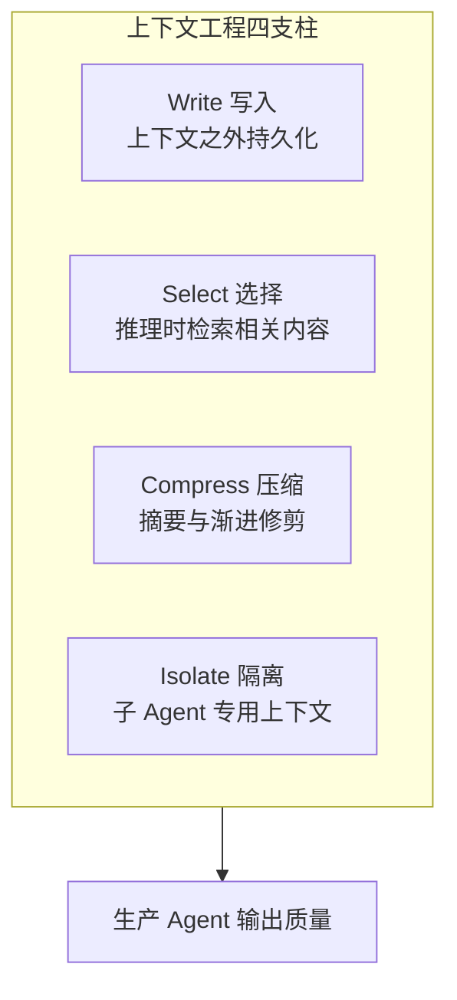
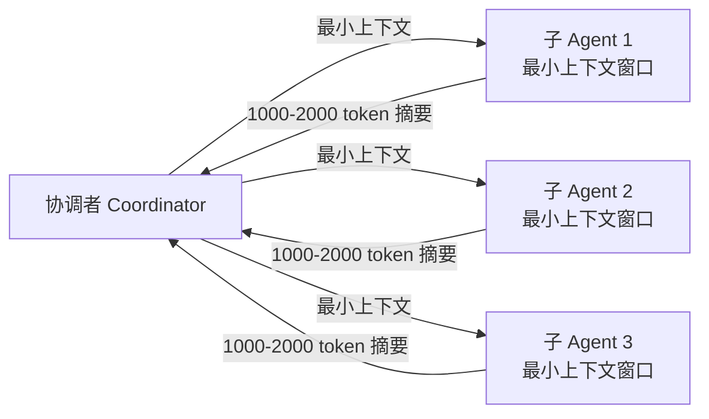
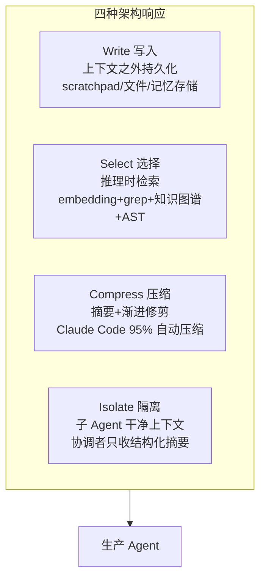
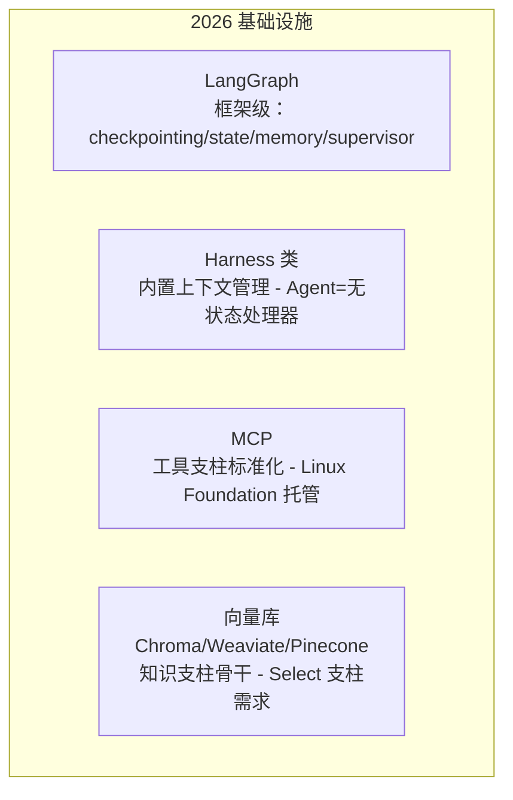

# Prompt 与 Context：提示工程到上下文工程

> 一句话摘要：2025 年 Karpathy 和 Shopify CEO 同时说"真正该叫的名字是 Context Engineering（上下文工程）"。2026 年，生产级 Agent 的差距不在 prompt 措辞，而在上下文管理——ACE 系统用小模型+好上下文打败大模型+差上下文；同一信息换个结构呈现，准确率能掉 34 个百分点。本篇讲提示工程 vs 上下文工程、四根支柱、四大退化模式、四种架构响应。

---

## 1. 背景：为什么 Prompt 不再是主角

### 1.1 一个关键的行业转向

2025 年 6 月，Andrej Karpathy 在 X 上发了一段话，重新框定了整个行业怎么看待 AI 产品开发。同一周，Shopify CEO Tobi Lütke 说得更直白：

> **"Context Engineering 更准确地描述了核心技能：为任务提供所有必要上下文的艺术，让 LLM 能够合理地解决它。"**

这个框架留下来了。2026 年，能交付可靠生产 Agent 的团队，不是赢在"聪明的 prompt 措辞"，而是赢在**把上下文当作被编译、被管理的资源**。这门学科现在有名字、有基准，做和不做的团队之间差距已经可以量化。

### 1.2 为什么 Prompt Engineering 的框架错了

Prompt engineering 的心智模型——"输入一句话，调出更好输出"——对单轮聊天和零样本分类有用。**但它在 Agent 面前撑不住**：Agent 跑几小时、遍历几千次工具调用、跨上下文重置保持一致推理。

| 维度 | Prompt Engineering | Context Engineering |
|---|---|---|
| 作用单位 | 句子级（改措辞） | 系统级（管上下文窗口） |
| 覆盖范围 | 一条指令 | 系统指令+检索文档+对话历史+工具 schema+记忆+子 Agent 摘要 |
| 生命周期 | 单轮 | 整个 Agent 任务生命周期 |
| 心智模型 | 静态输入→输出 | 上下文是编译产物 |

> 上下文工程包含所有进入模型上下文窗口的东西：静态系统指令、动态检索的文档、对话历史、工具 schema、记忆输出、子 Agent 摘要。每一个都是杠杆。**任何一个没管好，性能崩塌——不是模型差，是坏输入在规模上产生坏输出。**

---

## 2. 核心内容一：四根支柱（Four Pillars）

成熟的生产上下文工程框架收敛到四个支柱：

### 2.1 为什么四根支柱都要管

关键发现：**每根支柱都和其他支柱交互**。

- 工具 schema 膨胀 → token 成本上升 + 推理退化。**伯克利 Function-Calling 排行榜数据：每个被测模型在工具更多时表现更差，无一例外。** Llama 3.1 8B 用 46 个工具时完全失败，同样的基准用 19 个就成功。
- 系统指令模糊 → Agent 被迫从检索知识里猜约束 → 不一致。
- 记忆过时 → 污染检索相关性。

Anthropic 的指导原则：**"Minimalism is the discipline"——极简才是纪律。**

---

## 3. 核心内容二：生产数字到底说了什么

### 3.1 上下文管理的量化差距

| 数据 | 数字 | 来源 |
|---|---|---|
| ACE 系统（Agentic Context Engineering） | 通过同时优化离线（系统 prompt）和在线（Agent 记忆）上下文，带来巨大提升 | arXiv |
| ACE 用开源小模型 | 匹配 AppWorld 排行榜顶级生产 Agent | 同一小模型+好上下文=顶级表现 |
| 上下文腐烂（context rot） | GPT-4o 准确率暴跌 34 个百分点——同一信息、不同结构 | Chroma 研究 |
| 多轮 vs 单轮 | 标准任务拆到多轮对话后性能平均下降明显 | Microsoft + Salesforce 研究 |
| Manus 生产 Agent | 消费约海量 token，压缩架构约 100:1，全信息可恢复 | Manus 生产环境 |

**关键结论：上下文管理弥补了原本需要更贵模型才能弥补的能力差距。**

### 3.2 隔离上下文的惊人数字

Anthropic 自己的研究系统：用**并行的子 Agent + 隔离上下文窗口**，每个子 Agent 只拿到子任务所需的最小上下文，向协调者返回 1,000-2,000 token 摘要。

- 总 token 成本增加了 15 倍
- 但结果仍是 **90% 的净收益**

**这就是上下文工程的复利：花 15 倍的 token 换 90% 的质量提升。**

---

## 4. 核心内容三：上下文退化的四大失败模式

长跑 Agent 不会优雅失败。上下文退化是隐蔽的，而且会**叠加**。生产团队已经归类出四种失败模式：

### 4.1 幻觉滚雪球（Hallucination Snowballing）

一次幻觉在后续轮次被重复、被当作既定事实引用，产生级联错误。一旦 Agent 在多轮交互中跑偏，注意力机制会**强化错误方向**而不是纠正它。

### 4.2 模式复制（Pattern Repetition）

超过约 100,000 token 后，Agent 从"综合新解法"转向"复现上下文里早先出现的历史模式"。Gemini 2.5 生产环境持续观察到。**更多历史并不总是更好的历史。**

### 4.3 信息过载（Information Overload）

**多余或边缘相关的数据，比数据不足更可靠地降低输出质量。** 具体性胜过全面性——反直觉，但想想注意力怎么在 token 间分配就明白了。

### 4.4 矛盾信息（Contradictory Information）

同一上下文窗口里的矛盾信息导致推理脱轨。多 Agent 系统尤其常见——子 Agent 带着不一致假设返回摘要。

### 4.5 第五个结构性缺陷：Lost in the Middle

学术文献记录的经典问题：Transformer 注意力呈 U 形曲线——**模型强烈注意窗口开头和结尾，系统性地低估中间信息**。把关键指令放长上下文中间 ≈ 没放。

---

## 5. 核心内容四：四种架构响应

LangChain 生产框架把解法组织成四类：**Write / Select / Compress / Isolate**——已成为事实上的行业标准。

### 5.1 Write：上下文之外持久化

最好的生产 Agent 维护**结构化外部草稿区**——文件、记忆存储、进度笔记——它们跨上下文重置存活。

> Anthropic 双 Agent harness 模式（长任务）：第一个会话生成一个"brief"工件；**之后每个会话开工前先读它**。光压缩不够——Agent 需要结构化工件跨会话维持连贯。

### 5.2 Select：推理时检索

Windsurf 生产检索栈：embedding 搜索 + grep + 知识图谱 + AST 解析，组合效果比任何单一方法好约 3 倍。Factory.ai 观察到底层问题：**"如果你没有语义理解，向量相似性就是垃圾进垃圾出"**——代码语义检索需要图遍历和 AST 分析，不只是向量相似度。

### 5.3 Compress：摘要与渐进修剪

- **Claude Code**：上下文容量到 95% 自动压缩
- **Cognition（Devin）**：用微调模型专做上下文摘要——长软件工程任务的精确信息保留需要**模型专门化**，不是通用摘要

### 5.4 Isolate：跨子 Agent 分区

把信息分到专门子 Agent，每个干净上下文窗口，协调者收结构化摘要而非原始转录。这就是 Anthropic 90% 提升背后的模式，也是复杂工程任务的真实管理方式：**清晰接口、最小表面积、显式交接。**

---

## 6. 系统 Prompt 架构：一门独立的工程学科

### 6.1 关键概念："Right Altitude"（正确高度）

Anthropic 指南提出"right altitude"概念：系统 prompt 必须**具体到能指导行为，但不过度到变成脆弱的规则树**；**通用到能允许启发式判断，但不退化成语录**。

两种失败模式都会让生产可靠性崩塌，只是机制不同：
- 过度具体 → 规则树脆弱，一遇边界情况就崩
- 过度模糊 → 变成正确的废话，没有约束力

### 6.2 生产实践模式

从系统 prompt 是"静态配置"→ 当作**版本化、可测试、结构化工件**，这是 Agent 团队工程成熟度的清晰标志。

| 模式 | 做法 |
|---|---|
| 版本化 | system prompt 进 git，像代码一样 review |
| 可测试 | 用 eval 集验证 prompt 变更，不靠感觉 |
| 结构化 | 分层组织：角色/任务/约束/风格，不写一坨 |
| 最小化 | 每加一句问：删掉会影响什么？ |

---

## 7. 2026 基础设施格局

工具生态围绕四支柱组织起来：

| 层 | 代表 | 角色 |
|---|---|---|
| 框架 | LangGraph + LlamaIndex | checkpointing、state schema、长期记忆、多 Agent supervisor（2026 主流生产组合） |
| Harness | 通用 Agent harness | 自动压缩对话历史；把 Agent 当无状态处理器，SDK 管理上下文生命周期 |
| 工具接入 | MCP | Anthropic 2024 末发布，2025-12 捐赠 Linux Foundation，Anthropic/Block/OpenAI/Google/Microsoft/AWS/Cloudflare 背书 |
| 知识 | Chroma / Weaviate / Pinecone | 更好的过滤、混合搜索、元数据感知检索——正好对应 Select 支柱需求 |

---

## 8. 一句话总结 + 5W 速记卡 + 自测三问

### 8.1 一句话总结

> **2025 年 Karpathy 和 Tobi Lütke 一起把行业话语从 Prompt Engineering 改成了 Context Engineering。2026 年数据证明：Agent 能力更多由上下文管理决定，而不是模型选择——ACE 用小模型+好上下文追平顶级生产 Agent；同一信息换结构准确率掉 34 个点。四支柱 Write/Select/Compress/Isolate + 四大退化模式 + 四种架构响应，构成 2026 上下文工程的完整地图。系统 prompt 从"静态配置"升级为"版本化工件"。**

### 8.2 5W 速记卡

| W | 内容 |
|---|---|
| **What** | 管理进入上下文窗口的一切：系统指令+检索+历史+工具 schema+记忆+子 Agent 摘要 |
| **Why** | 生产 Agent 差距在上下文管理不在模型（ACE 小模型追平顶级；34 点准确率崩塌） |
| **Who** | Karpathy（2025-06 定名）、Anthropic（right altitude）、LangChain（四支柱）、Manus/Devin/Windsurf（实践） |
| **When** | 2025-06 定名，2026 成为独立工程学科 |
| **How** | 四支柱：Write 持久化 / Select 检索 / Compress 压缩 / Isolate 隔离 |

### 8.3 自测三问

1. Prompt engineering 和 context engineering 的区别？（句子级 vs 系统级）
2. 上下文退化四大失败模式？（幻觉滚雪球/模式复制/信息过载/矛盾信息 + lost in the middle）
3. Anthropic 90% 净收益怎么来的？（隔离子 Agent，15 倍 token 换质量）

---

## 下篇预告

上下文工程里提到"隔离子 Agent 换来 90% 净收益"——但多 Agent 不是越多越好。什么时候该拆、怎么编排、subagent 和 delegate 的区别是什么？

下一篇：[多 Agent 与 Subagent](12_多Agent与Subagent.md)——何时用 / 何时不用，编排模式与协调成本。

> 本系列阅读路径：篇 0 [系列导读](0_系列导读-全景.md) → 篇 1-3（地基+生态）→ 篇 4-7 四问拆法 → 篇 8 端到端 → 篇 9 Harness → 篇 10 MCP → 本篇 Prompt 与 Context → 篇 12-13 工程化收官

---

## 📌 数据与事实声明

本文核心数据（ACE 系统、34 点上下文腐烂、100K 模式复制、Manus 100:1 压缩、Anthropic 90% 净收益、伯克利 Function-Calling 排行榜）来自 2026-04-10 行业深度综述（agentmarketcap.ai），原始出处为 arXiv、Chroma、Microsoft/Salesforce 研究与各公司生产实践。截至 **2026-08-17**，具体以原始论文与官方文档为准。

## 📚 参考资料

| 类型 | 标题 | 来源 |
|---|---|---|
| 行业文章 | Context Engineering vs Prompt Engineering in 2026（2026-04-10） | agentmarketcap.ai/blog/2026/04/10/context-engineering-vs-prompt-engineering-2026 |
| 行业文章 | Context Engineering vs Prompt Engineering（2026） | atlan.com/know/context-engineering-vs-prompt-engineering |
| 行业文章 | Context Engineering vs Prompt Engineering: Key Differences（2026） | internative.net/insights/blog/context-engineering-2026 |
| 论文 | ACE: Agentic Context Engineering（arXiv） | arxiv.org（Agentic Context Engineering） |
| 官方文档 | Anthropic Prompt Engineering 指南 | docs.anthropic.com/en/docs/build-with-claude/prompt-engineering |
| 官方文档 | Anthropic Context Engineering 文档 | docs.anthropic.com/en/docs/build-with-claude/context-engineering |
| 开源项目 | LangGraph（四支柱框架级实现） | github.com/langchain-ai/langgraph |
| 论文 | Lost in the Middle（Liu et al., 2023） | arxiv.org/abs/2307.03172 |