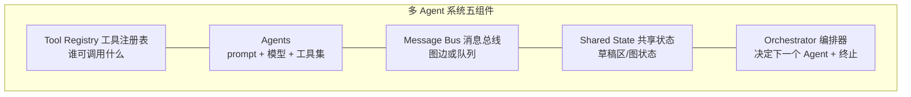
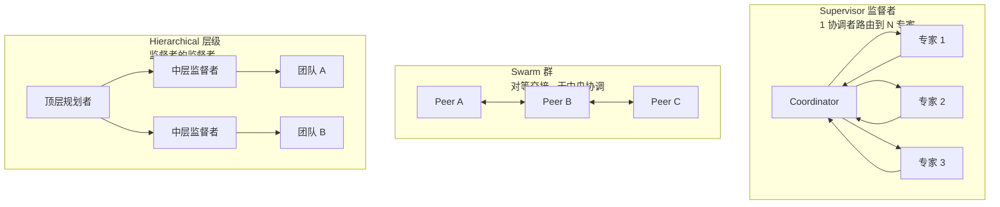
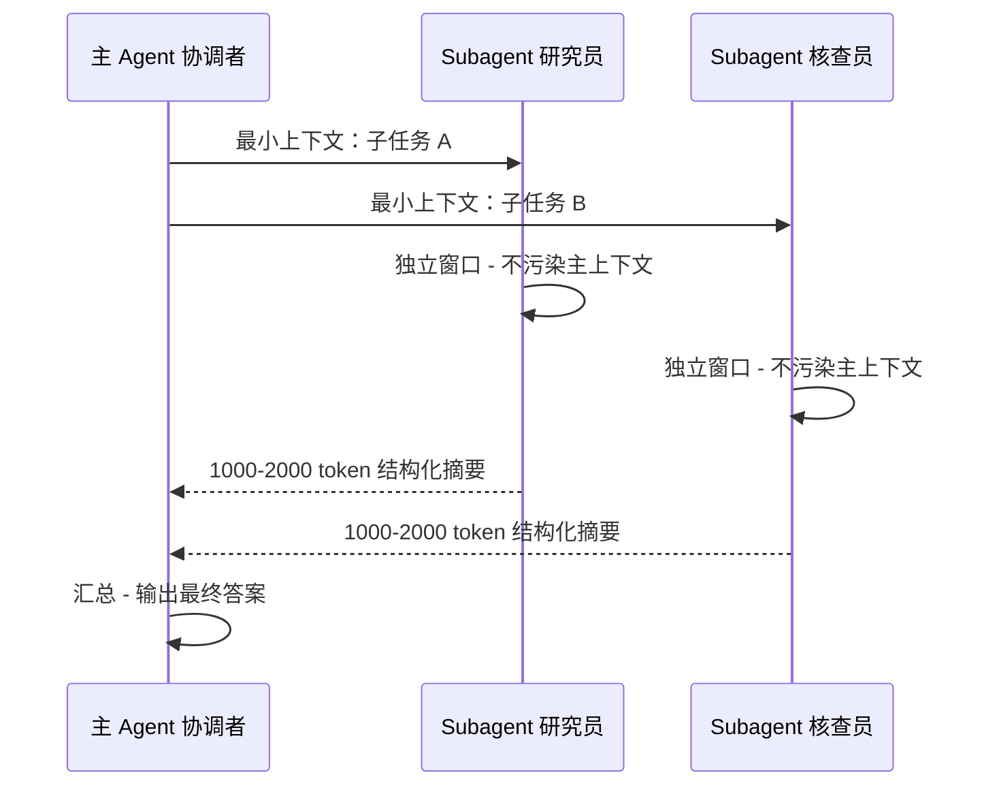

# 多 Agent 与 Subagent：何时用、何时不用

> 一句话摘要：2026 年多 Agent 是被过度开方的架构——生产团队 60-70% 的"多 Agent 需求"其实一个带并行工具的 Agent 就够。什么时候真该拆：工作能分解成使用不同 prompt/模型/工具集的专家角色。编排六大模式（supervisor/hierarchical/swarm/blackboard/sequential/hybrid），token 成本乘数从 2.4× 到 7.1×，五大生产失败模式，以及"先单 Agent 基线，再按测量拆分"的铁律。

---

## 1. 背景：多 Agent 是 2026 最被过度开方的架构

### 1.1 一个反直觉的开场

> "The interesting question isn't whether you can wire three agents into a graph. You can, in an afternoon. The interesting question is whether you should."
> —— 2026 生产指南开篇

多 Agent 系统（Multi-Agent System，MAS）：**两个或更多 LLM 驱动的 Agent 交换消息、共享工作区、调用工具，共同完成一个任务**。每个 Agent 有自己的 prompt、自己的工具集、常常还有自己的模型选择，以及明确的交接方式。

2026 年，这是应用 AI 里被过度开方的形状。生产团队的共识正在反转：**能不多 Agent 就不多 Agent。**

### 1.2 定义与五组件

任何多 Agent 系统，无论什么框架，都归结为五个组件：

**团队第一次搭建最容易搞错的**：消息总线和共享状态的区别。
- LangGraph：图定义边（总线），类型化 state 对象在节点间传递（状态）——**分离**
- CrewAI：融合在 Crew 对象里——方便，但难查"谁看到了什么"
- AutoGen：group-chat 单缓冲——前 3 个 Agent 好理解，第 7 个是观测噩梦

> 选框架的标准：**半夜 3 点你想怎么调试，就选哪个分离方式**，不是看哪个落地页漂亮。

---

## 2. 核心内容一：什么时候该用多 Agent

### 2.1 三连判断（生产团队的铁律）

**判断一：默认单 Agent + 并行工具调用。** 找上门的 10 个多 Agent 需求里，6-7 个用**一个写好的 Agent + 并行工具调用**更好——架构简单、成本低、trace 是一棵树不是一张图、失败模式是团队都认识的。

**判断二：真该拆的标志 = 专家角色确实用了不同的 prompt/模型/工具集。**

| 真拆分（值得） | 假拆分（不值得） |
|---|---|
| 研究员跑 Sonnet + 网页搜索工具 | "planner Agent"和"coder Agent"用同一模型同一工具 |
| 事实核查跑 Opus + 无工具 | 只是 system prompt 略有不同 |
| 写手跑 Sonnet + 风格指南 | 换个 prompt 就能当两个用 |

**判断三：先单 Agent 基线，再分解。** 这是最被低估的一条：

> **Premature multi-agent decomposition is the new premature microservices.**（过早多 Agent 分解 = 新时代的过早微服务）

正确顺序：**先发单 Agent → 埋点测量 → 找到真实的质量/延迟瓶颈 → 只在测量说拆分有帮助的地方拆。**

### 2.2 单 Agent 的极限在哪

单 Agent + 并行工具能覆盖绝大多数场景。什么时候单 Agent 真的撞墙：

| 单 Agent 撞墙信号 | 说明 |
|---|---|
| 上下文窗口装不下完整任务 | 长任务 plan 超过一个窗口（罕见，长上下文模型缓解了） |
| 需要真正的并行探索 | 深度研究：N 个独立子问题并行查（延迟是产品核心） |
| 角色差异巨大且互不干扰 | 研究员/核查/写手：prompt、模型、工具全不同 |
| 不同团队拥有不同 Agent | 跨部门系统，各自发布节奏（blackboard 场景） |

---

## 3. 核心内容二：六大编排模式

### 3.1 模式全景

### 3.2 六模式对比

| 模式 | 协调者 | 最适合 | Token 成本 | 可调试性 | 主要失败模式 | 默认框架 |
|---|---|---|---|---|---|---|
| **Supervisor** | 单个中央规划者 | 异构专家 | 子 Agent 线性 + 监督者上下文增长 | 高（一棵 trace 树） | 监督者上下文 OOM | LangGraph |
| **Hierarchical** | 监督者的监督者 | 单个监督者窗口装不下任务 | 最高（2 层 7 个 7.1×） | 中 | 层级上下文叠加 | LangGraph |
| **Swarm** | 无（对等交接） | 天然并行研究 | 广播时二次方 | 低（交接图） | 无限交接循环 | OpenAI Agents SDK |
| **Blackboard** | 共享黑板 + 前置条件 | 长异步跨团队服务 | 取决于写读频率 | 低-中 | 黑板冲突 | 自定义/Temporal |
| **Sequential** | 无（固定链） | 确定性步骤 | 最低（3 个 2.4×） | 高（线性） | 前一步失败级联 | CrewAI |
| **Hybrid** | 混合 | 真实生产系统 | 看组合 | 中-高 | 模式漂移成四不像 | 组合 |

**数据规律（2026 生产实测）**：
- **Supervisor 赢得大约 4/5 的客户选型**
- Swarm 只在"任务真并行 + 子任务不需要彼此中间输出 + 有硬终止规则"时上位
- 纯 Swarm 在 2026 生产环境很罕见（研究类除外）
- 实际生产系统大多是 Hybrid：supervisor-plus-pipeline（路由灵活性 + 流程确定性）或 supervisor-plus-swarm（深度研究）

### 3.3 Hybrid 的陷阱

> Hybrid 是真实生产系统的常态，但要**在代码里显式保留两种模式的边界**。悄悄漂移成"第四种模式的 hybrid-of-hybrids"的系统，无法推理。

深度研究产品（Claude Research、OpenAI Deep Research、Perplexity Research）全部收敛到同一个 supervisor-plus-swarm 形状：
- 规划者（顺序 + 有状态，要单 Agent）
- 研究步骤（天然并行，要 swarm）
- 写作者（顺序 + 有状态，要单 Agent）

**三分之一的开源克隆会踩的坑**：让 worker 也做后续规划——一旦发生，trace 就不可读了。

---

## 4. 核心内容三：Subagent 机制与隔离

### 4.1 Subagent 是什么

Subagent（子 Agent）= 主 Agent 按需生成的、拥有**独立上下文窗口**的专门 Agent。它拿到的上下文最小化——只含子任务所需——完成后向协调者返回**结构化摘要**（通常 1,000-2,000 token），自己的原始转录不回流。

### 4.2 为什么值得（篇 11 的 90% 案例展开）

Anthropic 研究系统实测：**并行子 Agent + 隔离上下文窗口**
- 总 token 成本增加 **15 倍**
- 结果仍是 **90% 净收益**

这是上下文工程"隔离支柱"（Isolate）的实现机制。隔离的收益：
1. 主 Agent 上下文不被子任务污染（不长篇大论塞进窗口）
2. 子 Agent 可以并行（延迟收益）
3. 每个子 Agent 用最适合自己的模型（便宜的干粗活，贵的干细活）

### 4.3 Subagent 的适用边界

| 适合用 Subagent | 不适合 |
|---|---|
| 深度研究（并行子查询） | 简单两步操作（直接串行调用） |
| 长文档分章处理 | 短任务（隔离开销 > 收益） |
| 需要不同模型的子任务 | 强依赖彼此中间输出的任务 |
| 主上下文宝贵（长任务） | 上下文很宽裕的单轮任务 |

---

## 5. 核心内容四：协调成本——单位经济学杀手

### 5.1 Token 成本乘数（2026 实测）

> **最常见的预算错误：把多 Agent 成本当成 Agent 调用之和。它不是。**

监督者在每次路由决策时都看到所有子 Agent 的输出 + 原任务 + 自己的运行计划。到第 3 轮，监督者的输入上下文 = 子 Agent 说过的一切之和——**每轮监督者决策都在为这个上下文付费**。

| 架构 | Token 成本乘数（vs 单 Agent 基线 1.0×） |
|---|---|
| 单 Agent + 并行工具（基线） | 1× |
| Sequential 流水线 3 Agent | 2.4× |
| Supervisor 3 子 Agent | 3.6× |
| Swarm 4 对等 6 交接 | 4.2× |
| **Supervisor 5 子 Agent** | **5.8×** |
| Hierarchical 2 层 7 Agent | 7.1× |

> 任何超过 sequential 的架构至少 2×；成本随 Agent 数线性增长 + 监督者上下文增长的额外项。**如果定价模型吸收不了 4-6× 的乘数，你还没有多 Agent 产品——你只有需要成本工程的实验原型。**

### 5.2 四个机械降本杠杆（生产系统全部拉满）

1. **监督者上下文用滚动摘要**，不用完整历史
2. **子 Agent 强制返回结构化 JSON**，不要自由散文
3. **每个角色钉最便宜的胜任模型**（Haiku 类路由，Sonnet 类干活，Opus 类规划）
4. **硬轮次上限**（MAX_TURNS），跑飞前止损

---

## 6. 五大生产失败模式（没人提醒你的）

### 6.1 Token 预算跑飞（Hockey Stick 曲线）

真实 audit trace：第 1 轮输入 2k token → 第 6 轮 38k → 第 12 轮 110k，监督者还不决定停。

**检测**：按每次运行 token 数告警（典型设置：工作负载中位数 5 倍）。
**预防**：每轮把最老 N 条消息替换成一段摘要块（`summary_of_turns_1_to_5`）+ 硬 MAX_TURNS=12。组合效果：99 分位运行成本降一个数量级，质量几乎无损。

### 6.2 角色碰撞（Role Collision）

两个 prompt 重叠的 Agent 趋同成同一种回答风格。trace 特征：Agent A 400 字，Agent B 410 字几乎一样的措辞，监督者聚合器拼接后给用户 800 字冗余。

**预防**：每个角色契约写一句"必须做 X 且必须不做 Y"（system prompt 内）+ 运行后自动 diff 检查高 token 重叠。

### 6.3 上下文窗口 OOM（静默截断 = 假幻觉）

200k 窗口的监督者第 9 轮传 205k，API 静默丢掉前 5k——恰好包含用户原始指令。系统自信地给出跑题答案，用户报告"幻觉"，实际是**原始 prompt 被静默遗忘**。

**预防**：记录每次模型调用的输入 token 数，超窗口 4/5 告警；监督者钉最长上下文模型；最老 8 轮外的全丢进摘要块；**原任务描述作为不可协商的 system message 永远在输入头部重注入**。

### 6.4 无限交接循环（最坏的）

Swarm 里两个对等 Agent 互不认可，来回交接。没有硬终止规则 → 循环到 token 预算报警，一次请求烧掉一百次正常查询的成本。

**检测**：每次运行数交接次数，超过阈值告警（通用上限 12）。
**预防**：第三方仲裁，或硬轮次上限返回"目前最好答案 + 降级置信度标志"。

### 6.5 不可追踪的工具调用（法律/财务噩梦）

Agent 调了个工具，效果没进会话缓冲。trace 显示干净回答，但下游系统（CRM/Stripe/webhook）有一笔 trace 对不上的写入。有团队为重建一次 5-Agent 运行做了什么，花了一整个 sprint——因为财务发现一笔四位数的供应商扣款。

**预防**：`@traced_tool` 装饰器包装每个工具，进出各发一条 OTel span；每晚对账工具侧事件 vs trace 侧事件，差量告警。**投资半个 sprint，第一次被审计问"这系统某次请求干了什么"时就回本了。**

---

## 7. 可观测性与 Eval：Agent 系统的三件套

### 7.1 Trace 栈三选

| 工具 | 场景 | 特性 |
|---|---|---|
| Langfuse | 自托管/数据主权 | open-core，单 Postgres 自托管，多供应商中立 |
| LangSmith | 已在 LangChain 生态 | 零配置接入，eval 最强势，SaaS 默认 |
| Inspect AI | 监管/审计场景 | UK AISI 开源，eval 原语最严谨，可进监管提交 |

### 7.2 Eval 三层（多数团队低估）

| 层 | 测什么 | 典型规模 |
|---|---|---|
| 单 Agent 单元 eval | 研究员引用真实来源？写手命中格式？ | 50-200 例/层 |
| 交接 eval | 给定输入，监督者路由对专家了吗？ | 同上 |
| 全系统 eval | 整个图在留出集上产出正确答案吗？ | 同上 |

节奏：**每次 prompt 变更 + 每次框架升级全量跑；每周 50-100 例真实（脱敏）输入做生产 canary**。只有真实流量能暴露两类问题：测试集没覆盖的长尾输入格式 + 上下文窗口压力下的突现监督者行为。

---

## 8. 一句话总结 + 5W 速记卡 + 自测三问

### 8.1 一句话总结

> **多 Agent 不是越多人越好：10 个需求里 6-7 个一个带并行工具的 Agent 就够。真该拆的标志是专家角色确实用不同 prompt/模型/工具集。六大模式（supervisor 赢 4/5 选型）、成本乘数 2.4×-7.1×、五大失败模式（token 跑飞/角色碰撞/窗口 OOM/无限交接/不可追踪调用）。铁律：先发单 Agent 基线 → 埋点测量 → 只在测量说拆分有帮助的地方拆——过早多 Agent 分解就是新时代的过早微服务。**

### 8.2 5W 速记卡

| W | 内容 |
|---|---|
| **What** | 两个以上 LLM Agent 协作完成任务（prompt+模型+工具集+交接） |
| **Why** | 专家角色差异大（不同 prompt/模型/工具）或需要真并行 |
| **Who** | LangGraph / CrewAI / AutoGen / OpenAI Agents SDK / Anthropic SDK / Temporal |
| **When** | 2023 概念成型，2025-2026 生产化，2026 转向"先单 Agent" |
| **How** | 六模式编排 + Subagent 隔离 + 成本杠杆 + trace/eval 三件套 |

### 8.3 自测三问

1. 什么时候真该拆多 Agent？（专家角色用不同 prompt/模型/工具集）
2. Supervisor 5 子 Agent 的成本乘数？（5.8×——监督者每轮为全部上下文付费）
3. "过早多 Agent 分解 = 新时代的什么"？（过早微服务——先单 Agent 基线再测量拆分）

---

## 下篇预告

从篇 1 的"LLM 是什么"到篇 12 的"多 Agent 编排"，14 篇系列走到收官。最后一篇把全景串起来。

下一篇：[收官与能力地图](13_收官与能力地图.md)——5 年演进 + 六层技术栈能力地图 + 选型决策。

> 本系列阅读路径：篇 0 [系列导读](0_系列导读-全景.md) → 篇 1-3（地基+生态）→ 篇 4-7 四问拆法 → 篇 8 端到端 → 篇 9 Harness → 篇 10 MCP → 篇 11 Prompt → 本篇多 Agent → 篇 13 收官

---

## 📌 数据与事实声明

本文核心数据（六模式对比、token 成本乘数 2.4×-7.1×、五大失败模式 trace 案例、eval 三层规模、Anthropic 90% 净收益）来自 2026-05-17 生产指南（paiteq.com）与 2026-04-10 上下文工程综述（agentmarketcap.ai，原始出处 Anthropic/arXiv/Chroma/Microsoft/Salesforce）。框架矩阵为 2026 年生产团队选型实践。截至 **2026-08-17**，具体以官方文档与原始论文为准。

## 📚 参考资料

| 类型 | 标题 | 来源 |
|---|---|---|
| 行业文章 | Multi-agent orchestration patterns: a 2026 production guide（2026-05-17） | paiteq.com/blog/multi-agent-orchestration-patterns |
| 行业文章 | 6 Multi-Agent Orchestration Patterns for Production（2026） | beam.ai/agentic-insights/multi-agent-orchestration-patterns-production |
| 行业文章 | Context Engineering vs Prompt Engineering in 2026（2026-04-10） | agentmarketcap.ai/blog/2026/04/10/context-engineering-vs-prompt-engineering-2026 |
| 开源项目 | LangGraph（supervisor/层级编排） | github.com/langchain-ai/langgraph |
| 开源项目 | OpenAI Agents SDK（swarm/并行） | github.com/openai/openai-agents-python |
| 开源项目 | AutoGen（group-chat 研究原型） | github.com/microsoft/autogen |
| 开源项目 | CrewAI（sequential 流水线） | github.com/crewAIInc/crewAI |
| 开源项目 | Langfuse（自托管 trace） | github.com/langfuse/langfuse |