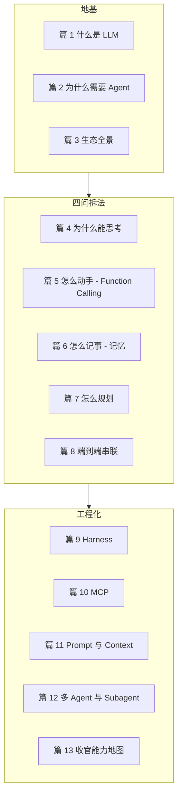
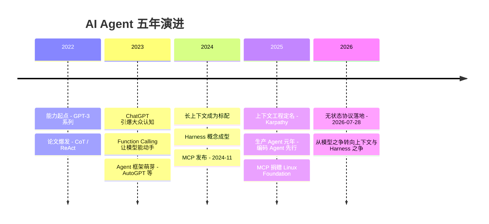
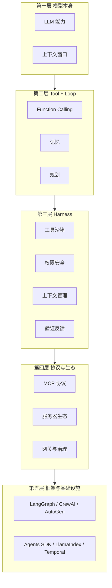
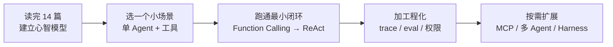

# 收官与能力地图：从 AI 是什么到 Agent 工程化

> 一句话摘要：14 篇收官。这一篇把全景串起来：2022-2026 五年演进（能力翻番 + 主角从模型变 Agent）、5 层架构能力地图（模型/Tool+Loop/Harness/协议/框架）、2026 选型决策（LangGraph/CrewAI/AutoGen/Agents SDK/MCP 怎么选）、读者行动清单（读完能做什么）。生态数据全部 2026-08-17 gh CLI 当天实测。

---

## 1. 全景回顾：我们走过的 14 篇

### 1.1 系列地图

**阅读路径**：地基（1-3）→ 四问拆法（4-8）→ 工程化（9-13）。

### 1.2 每篇一句话

| 篇 | 一句话 | 核心概念 |
|---|---|---|
| 1 | LLM 是什么 | 预测下一个 token 的概率模型 |
| 2 | 为什么需要 Agent | 模型不可写 → 用工具补 |
| 3 | 生态全景 | 2026 六大玩家 + 三流派 |
| 4 | 为什么能思考 | 推理/规划机制 |
| 5 | 怎么动手 | Function Calling：模型表达工具调用 |
| 6 | 怎么记事 | 记忆：短期/长期/向量 |
| 7 | 怎么规划 | ReAct / Plan-and-Execute / Reflexion / ToT |
| 8 | 端到端 | 一个请求走完六层 |
| 9 | Harness | 从模型到生产的所有基础设施 |
| 10 | MCP | 工具的 USB-C（2026 无状态化） |
| 11 | Prompt 与 Context | 上下文工程：四支柱/四退化/四响应 |
| 12 | 多 Agent | 何时用/何时不用，六模式五失败 |
| 13 | 收官 | 5 年演进 + 能力地图 + 选型决策（本文） |

---

## 2. 五年演进：2022-2026

### 2.1 三个拐点

### 2.2 主角的转移

| 阶段 | 主角 | 行业焦点 |
|---|---|---|
| 2022 | 模型能力 | 参数/榜单/能力边界 |
| 2023-24 | 模型 + Prompt | 提示工程、长上下文 |
| 2025 | Agent 应用 | 编码 Agent、生产化、Harness |
| 2026 | **Agent 工程化** | 上下文管理、无状态协议、治理层 |

> **2026 的核心判断**：Agent 能力更多由上下文管理决定，而不是模型选择。ACE 用小模型+好上下文追平顶级生产 Agent；同一信息换结构准确率掉 34 个点（篇 11）。**选型顺序：先管好上下文，再想换模型。**

---

## 3. 能力地图：5 层架构全景

### 3.1 五层总览（与系列导读一致）

### 3.2 各层能力清单（学完 14 篇你应该掌握）

| 层 | 能力 | 对应篇 |
|---|---|---|
| **L1 模型** | 知道模型是概率预测器；知道模型不懂今天/算不了精确数学；会选模型 | 1, 2 |
| **L2 Tool+Loop** | 会给模型 Function Calling 工具；理解记忆分层；会用 ReAct 规划 | 4-7 |
| **L3 Harness** | 知道工具沙箱/权限/上下文管理/验证反馈五大部件；能设计 Harness 边界 | 9, 11 |
| **L4 协议生态** | 理解 MCP 三角色 + 原语；知道 2026 无状态化；会接 MCP Server | 10 |
| **L5 框架** | 会选框架（LangGraph vs CrewAI vs SDK）；理解编排模式；知道治理层 | 12, 13 |

---

## 4. 2026 选型决策：模型 / 框架 / Harness

### 4.1 生态实测数据（2026-08-17 gh CLI 当天拉取）

| 项目 | Stars | 定位 |
|---|---|---|
| LangChain | 144,448 | 集成生态最广，快速换模型 |
| awesome-mcp-servers | 92,502 | MCP 服务器精选清单 |
| MCP Servers（官方） | 89,651 | 官方参考服务器 |
| AutoGen | 60,483 | 对话式多 Agent（Microsoft） |
| CrewAI | 57,234 | 角色/task crew 最易上手 |
| LangGraph | 39,905 | 有状态图 + checkpointing |
| OpenAI Agents SDK | 28,733 | OpenAI 原生 swarm/并行 |
| LlamaIndex | ~48K | RAG 优先（文档检索） |
| Semantic Kernel | ~28K | 企业 C#/Java/Python 一致 |

### 4.2 框架选型矩阵（2026-08 更新版）

| 场景 | 推荐 | 理由 |
|---|---|---|
| 有状态长任务 + 人审 | **LangGraph** | checkpointing + 人类中断一等公民 |
| 集成生态最广 | **LangChain** | 130K+ 集成，模型换得快 |
| 角色化团队最易懂 | **CrewAI** | role/task 词汇半天上手 |
| 对话式多 Agent 实验 | **AutoGen / Microsoft Agent Framework** | group-chat 模式 |
| RAG 为核心 | **LlamaIndex** | 索引原语最强 |
| 企业 SDK 一致 | **Semantic Kernel** | C#/Python/Java 统一 |
| 简单单 Agent + 并行工具 | **Agents SDK** | 层更低，可包进 LangGraph |
| 长流程跨天 + 崩溃恢复 | **Temporal** | 耐久工作流运行时（非纯框架） |

### 4.3 治理层：2026 的新命题

> **框架决定 Agent 怎么规划、怎么调工具；控制面（Agent Control Plane）决定危险操作在派发前是否被授权。** 如果 Agent 会碰钱/碰生产系统/碰敏感数据——两个都要。

| 层 | 回答的问题 | 谁负责 |
|---|---|---|
| 框架层 | 怎么循环、怎么调工具 | LangGraph/CrewAI 等 |
| **控制面** | 能不能执行这个危险动作 | 策略引擎/审批流/审计日志 |

2026 的关键教训：**框架不会替你拦危险动作**。政策-前-派发（policy-before-dispatch）、显式人类审批状态、审计证据——这些都要在框架外面自己建。

---

## 5. 读者行动清单：读完能做什么

### 5.1 从"看懂"到"能跑"三步

### 5.2 72 小时行动清单

| 时间 | 动作 | 产出 |
|---|---|---|
| Day 1 | 用 Agents SDK（或 LangChain）跑一个带 2 个工具的单 Agent | 最小闭环：模型 → 工具 → 答案 |
| Day 2 | 加 ReAct 循环 + 上下文压缩（滚动摘要） | 长任务不炸上下文 |
| Day 3 | 加 trace（Langfuse）+ 10 条 eval 用例 | 可观测、可回归 |

### 5.3 学习路径建议（按兴趣）

- 想做**产品**：框架层 → 直接 LangGraph/CrewAI 起项目
- 想做**基础设施**：Harness/协议层 → MCP Server 作者 + 控制面
- 想做**算法**：模型层 → 上下文工程 + 推理机制深入

---

## 6. 一句话总结 + 5W 速记卡 + 自测三问

### 6.1 一句话总结

> **五年演进：模型能力 → Prompt → Agent → Agent 工程化。2026 的主角是上下文管理与 Harness：ACE 证明小模型+好上下文能追平大模型+差上下文，34 点准确率崩塌和 5.8× 成本乘数都在提醒——架构与上下文才是决定成败的杠杆。能力地图五层（模型/Tool+Loop/Harness/协议/框架）你已走完；接下来 72 小时跑通最小闭环，然后按测量拆分。**

### 6.2 5W 速记卡

| W | 内容 |
|---|---|
| **What** | 14 篇系列收官：演进 + 能力地图 + 选型 + 行动清单 |
| **Why** | 把碎片概念连成可用的工程能力地图 |
| **Who** | 从零开始的 AI/Agent 学习者 |
| **When** | 2026-08 收官（五年版图 2022-2026） |
| **How** | 5 层架构 + 实测选型矩阵 + 72 小时行动 |

### 6.3 自测三问

1. 2022-2026 主角怎么转移的？（模型 → Prompt → Agent → Agent 工程化）
2. 5 层架构从底到顶是什么？（模型/Tool+Loop/Harness/协议/框架）
3. 框架和治理层的分工？（框架管怎么调，控制面管能不能调）

---

## 系列完结

**从零开始认识 AI 系列 · 14 篇全部完成。** 从"LLM 是什么"到"Agent 工程化"，你已建立完整认知地图。后续可进入 L2 特性层（单点深入）或 L4 整合层（跨主题决策）。

> 本系列阅读路径：篇 0 [系列导读](0_系列导读-全景.md) → 1-12 → 本篇收官。

---

## 📌 数据与事实声明

本文生态 star 数据（LangChain 144,448 / awesome-mcp 92,502 / MCP Servers 89,651 / AutoGen 60,483 / CrewAI 57,234 / LangGraph 39,905 / OpenAI Agents SDK 28,733）为 **2026-08-17 gh CLI 当天实测**。框架选型矩阵参考 2026-08 更新的框架对比（cordum.io）与 2026-05 生产指南（paiteq.com）。五年演进时间线基于公开资料整理。截至 **2026-08-17**。

## 📚 参考资料

| 类型 | 标题 | 来源 |
|---|---|---|
| 行业文章 | AI Agent Frameworks Comparison 2026（2026-08 更新） | cordum.io/blog/ai-agent-frameworks-comparison |
| 行业文章 | Multi-agent orchestration patterns: a 2026 production guide（2026-05-17） | paiteq.com/blog/multi-agent-orchestration-patterns |
| 行业文章 | Context Engineering vs Prompt Engineering in 2026（2026-04-10） | agentmarketcap.ai/blog/2026/04/10/context-engineering-vs-prompt-engineering-2026 |
| 行业文章 | MCP Just Went Stateless（2026-08-12） | kdpisda.in/mcp-2026-07-28-stateless-spec |
| 开源项目 | LangChain / LangGraph / CrewAI / AutoGen / OpenAI Agents SDK | github.com（2026-08-17 实测 star） |
| 官方文档 | Model Context Protocol 规范 | modelcontextprotocol.io |