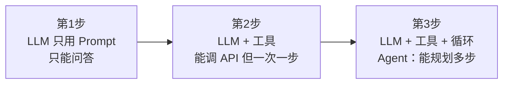

# 为什么需要 Agent：从"只会续写"到"能干活"

> 一句话摘要：LLM 是"大脑"，不是"身体"——它只会生成文本，不会查库、不会发请求、不会操作电脑。**Agent = LLM + 工具 + 循环**：让模型自己决定"下一步做什么"，做一步、看结果、再决定，直到任务完成。这就是从"能说"到"能干"的跨越。

---

## 1. 背景：LLM 的 4 个"不能"回顾

上一篇我们讲了 LLM 的能力边界——它强在语言和推理，但有 4 个"不能"：

| 不能 | 说明 | 后果 |
|---|---|---|
| **不知道今天发生什么** | 训练数据有截止时间 | 问"今天股价"答不上来 |
| **算不了精确数学** | 它在"猜"下一个词 | 大数乘法会出错 |
| **记不住昨天的对话** | 每次调用都是独立的 | 上次说过的它不记得 |
| **不能自主行动** | 只能输出文本 | 让它"发邮件"它只能写内容 |

**单靠 LLM，你得到的是一个"超级打字机"**——你问它答，仅此而已。

它不会：
- 自己打开浏览器查资料
- 自己调数据库取数
- 自己发 HTTP 请求
- 自己写文件并保存

这些"不会"，就是 Agent 存在的全部理由。

**本篇任务**：讲清从"只会续写的 LLM"到"能干活的 Agent"中间发生了什么——三步演进、关键区分（Workflow vs Agent）、以及什么时候真的需要它。

---

## 2. 核心内容：从 LLM 到 Agent 的三步演进



### 第一步：LLM 只用 Prompt（只能问答）

```
用户: 查一下今天北京天气
LLM: 对不起，我的训练数据有截止时间，无法获取实时天气。
```

这是最原始的形态。模型只能基于训练数据回答，遇到需要实时信息、外部操作的问题就无能为力。

**能力**：问答、写作、翻译、代码生成
**局限**：不能获取新信息、不能执行操作

### 第二步：LLM + 工具（能调 API，但一次一步）

```
用户: 查一下今天北京天气
LLM: 我需要调用天气 API。
系统: 帮你调了 → {温度: 28°, 天气: 晴}
LLM: 今天北京 28 度，晴天。
```

给模型加了**工具**（Tool）——把函数暴露给模型调用。模型通过 Function Calling 输出"我要调 weather 工具，参数是 北京"。

**能力**：能获取实时信息、能执行单个操作
**局限**：只能"一步"——这次查完就结束了。如果任务是"查北京和上海两地天气并对比"，它没法自动连续做

### 第三步：LLM + 工具 + 循环（Agent）

```
用户: 帮我对比北京和上海的天气，推荐一个更适合旅游的城市

循环开始：
第 1 轮: LLM → "先查北京" → 调 weather(北京) → 得到结果
第 2 轮: LLM → "再查上海" → 调 weather(上海) → 得到结果
第 3 轮: LLM → "对比两个结果" → 输出推荐
循环结束
```

加了**循环**（Agent Loop）：`观察 → 思考 → 行动 → 观察`，让模型自己决定每一步做什么，根据中间结果调整下一步。

**这就是 Agent**——一个套了工具和循环的 LLM。它能：
- 自己拆解多步任务
- 每步根据结果决定下一步
- 出错时自己调整路线

### 三个关键词一句话

| 概念 | 一句话 |
|---|---|
| **Tool（工具）** | 暴露给模型调用的函数（查天气、搜网页、发消息） |
| **Agent Loop（循环）** | 观察→思考→行动→观察，让模型多步干活 |
| **Agent** | LLM + 工具 + 循环，能自主完成多步任务 |

**本质**：Agent 不是新的模型，是**工程组合**——同一个 LLM，套上不同的工具和循环，就能干不同的事。

---

## 3. 关键概念：Workflow vs Agent

初学者最容易混淆的两个词：Workflow 和 Agent。它们都是"LLM + 多步调用"，但有一个根本区别：

| 维度 | Workflow（工作流） | Agent（智能体） |
|---|---|---|
| **决策者** | 人（写死流程） | 模型（自己决定下一步） |
| **路径** | 固定：A → B → C → D | 动态：根据中间结果变 |
| **本质** | 脚本（可预测） | 自主（不可完全预测） |
| **出错处理** | 写死重试逻辑 | 模型自己调整路线 |
| **调试难度** | 低（流程可见） | 高（决策不可见） |
| **适合** | 步骤固定、可预测 | 路径不固定、需多工具配合 |

### 什么时候用 Workflow

```
需求: 每天凌晨把数据库报表生成 PDF 发到邮箱
→ 流程完全固定，没有任何需要"思考"的分支
→ 用 Workflow：定时触发 → 查库 → 生成 → 发送
```

**Workflow 是确定的、可预测的、好调试的**。能用 Workflow 解决的问题，不要用 Agent——Agent 的不可预测性在这里是缺点不是优点。

### 什么时候用 Agent

```
需求: 帮用户分析一份 50 页的行业报告，提炼关键结论并做成 PPT
→ 没有固定流程：先读哪章？哪些数据重要？PPT 怎么组织？
→ 用 Agent：模型自己规划"先读目录→重点章节→提取数据→生成 PPT"
```

**Agent 适合"任务路径不固定、需要模型判断"的场景**——没有标准答案的活。

### 一个容易踩的坑

> **把 Agent 当万能药**。很多人一上来就上 Agent，结果简单任务反而更不稳定——模型决策有随机性，同样的输入可能走不同路径。

**正确姿势**：任务能写死流程就用 Workflow，只有流程真不确定才上 Agent。**能简单就不复杂，是工程第一原则。**

---

## 4. 现实判断：Agent 不是银弹

### 4.1 什么时候不需要 Agent

- 单轮问答（直接用 LLM）
- 固定流程的任务（用 Workflow）
- 对确定性要求极高的场景（金融交易、医疗诊断——不能接受模型随机决策）

### 4.2 什么时候值得用 Agent

- 任务需要多步、且路径不固定
- 需要多个工具配合（查数据 + 分析 + 生成 + 发送）
- 中间结果会影响后续决策（比如"根据查到的数据决定下一步查什么"）

### 4.3 成本考量（容易被忽略）

```
Agent 一次任务 ≈ 模型被调用 5-20 次（每步一次）
普通聊天一次 = 模型调用 1 次
→ Agent 的 token 成本是普通聊天的 5-20 倍
```

**这是 Agent 工程的现实**：能力提升有代价。所以：
- 能一步解决的，不要让模型绕圈
- 该设上限的（最大循环次数、token 上限），必须设——否则模型可能死循环烧钱

### 4.4 可靠性现状

- Agent 的**成功率**取决于：模型推理能力 + 工具质量 + 任务复杂度
- 简单任务（1-3 步）Agent 已经很好用
- 复杂任务（10+ 步）成功率明显下降，需要 Eval（评测）和 Trace（追踪）来兜底——这是后面篇 7（Harness）的内容

---

## 5. 一句话总结 + 5W 速记卡

### 5.1 一句话总结

> **Agent = LLM + 工具 + 循环。LLM 是大脑，工具是手脚，循环让它们配合起来干活。但 Agent 不是银弹——能写死流程的任务用 Workflow 更稳，只有路径不确定的任务才值得上 Agent。**

### 5.2 5W 速记卡

| W | 内容 |
|---|---|
| **What** | LLM + 工具 + 循环，能自主完成多步任务 |
| **Why** | LLM 只会"说"不会"做"，需要工具和循环补上 |
| **Who** | 需要多步任务自动化的开发者/产品 |
| **When** | 任务路径不固定、需要多工具配合时 |
| **How** | 观察 → 思考 → 行动 → 观察（Agent Loop） |

### 5.3 自测三问

1. Agent 和 LLM 的区别是什么？（多了工具 + 循环）
2. Workflow 和 Agent 的根本区别？（决策者：人 vs 模型）
3. 什么时候不该用 Agent？（流程能写死时）

---

## 下篇预告

Agent 有了（LLM + 工具 + 循环），但市面上有几十种 Agent 产品/框架，它们有什么区别？谁适合什么场景？

下一篇：[Agent 生态与版图](3_Agent生态与版图.md)——8 大角色 + 5 大框架，一张图看清整个生态。

> 本系列阅读路径：篇 0 [系列导读](0_系列导读-全景.md) → 篇 1 [什么是 LLM](1_什么是LLM.md) → 本篇（为什么需要 Agent）→ 篇 3 Agent 生态与版图 → 篇 4-7 四问拆法（思考/动手/记事/规划）→ 篇 8 端到端串联

---

## 📌 数据与事实声明

本文为 L1 入门层概念篇（LLM 局限与 Agent 补位逻辑），截至 **2026-08-17**。AI 领域迭代极快，Agent 能力边界随模型与框架演进，以官方文档为准。

## 📚 参考资料

| 类型 | 标题 | 来源 |
|---|---|---|
| 论文 | ReAct: Synergizing Reasoning and Acting in Language Models（Yao et al., 2022） | arxiv.org/abs/2210.03629 |
| 官方文档 | OpenAI Agents SDK | openai.github.io/openai-agents-python |
| 行业文章 | What Is an Agentic Harness? The 2026 Guide（2026-07-02） | techycamp.com/blog/what-is-an-agentic-harness-the-2026-guide |
