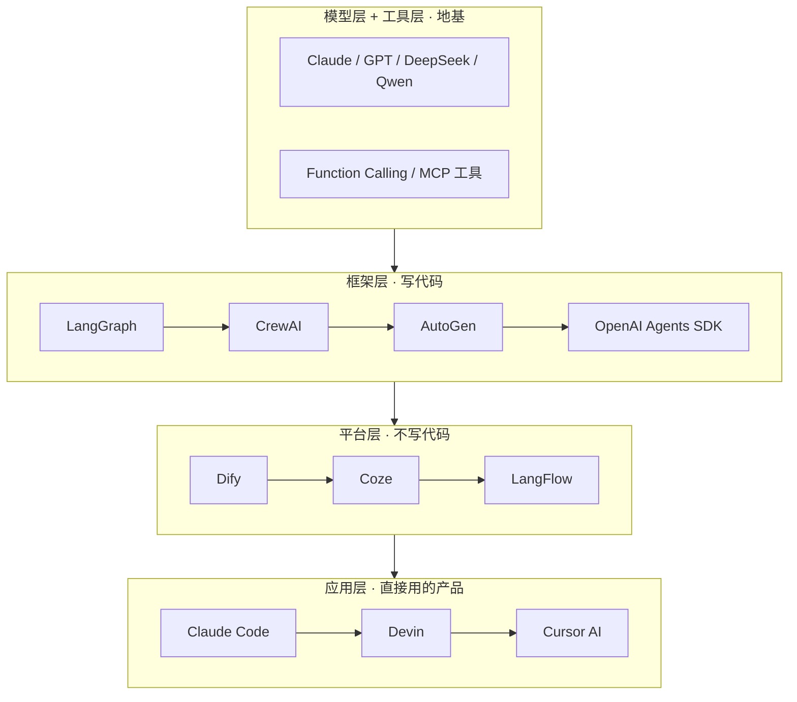

# Agent 生态与版图：8 大角色 + 5 大框架，一张图看清整个生态

> 一句话摘要：Agent 不是单一产品，是一个生态——上游有模型和工具，中游有框架和平台，下游有直接能用的应用。**看懂这个生态的 4 层结构，你就知道每个新名词属于哪一层、解决什么问题**，不会再被各种框架绕晕。

---

## 1. 背景：为什么需要生态视角

上一篇我们讲了 Agent 是什么——LLM + 工具 + 循环。道理很简单，但一到实际选型就懵了：

- LangChain 和 LangGraph 什么关系？
- Dify 和 Coze 有什么区别？
- CrewAI、AutoGen、OpenAI Agents SDK 都做多 Agent，选哪个？
- Claude Code 到底算 Agent 还是工具？

**问题根源**：Agent 领域的概念爆炸——每家公司推自己的框架，每个框架发明自己的黑话。你埋头学两周 LangChain，抬头发现大家都在聊 MCP 了。

**解法**：不按"产品"记，按"层"记。**生态是分层的，每个新名词先问它是哪一层、解决什么问题，再决定要不要学。**

**本篇任务**：给你一张 Agent 生态的全景地图——4 层结构 + 8 大角色 + 5 大框架对比。读完你能自己判断任何新产品的生态位置。

---

## 2. 核心内容：Agent 生态的 4 层结构



### L1 模型层 + 工具层（地基）

- **模型**：Claude / GPT / DeepSeek / Qwen 等——Agent 的大脑
- **工具**：Function Calling（模型原生工具调用）+ MCP（工具标准化协议）

这一层是"地基"——没有足够强的模型，上面的都是空中楼阁。选模型看三件事（篇 1 讲过）：推理能力、上下文长度、工具调用稳定性。

### L2 框架层（写代码的）

给你编程接口，把模型包装成 Agent。代表：LangGraph / CrewAI / AutoGen / OpenAI Agents SDK。

- **优点**：灵活、可定制、可控
- **代价**：要编程、要自己处理很多细节（状态管理、重试、错误处理）

### L3 平台层（不写代码的）

拖拽式搭建 Agent。代表：Dify / Coze / LangFlow。

- **优点**：上手快、可视化、适合快速验证
- **代价**：定制空间小、复杂逻辑难表达
- **注意**：严格说它们不只是"框架"——把 L2-L5 都打包了，这是它们上手快的原因

### L4 应用层（直接用的产品）

开箱即用的 Agent 产品。代表：Claude Code（终端编码 Agent）、Devin、Cursor AI。

- 普通用户不需要理解底层，直接用
- 但**想理解原理，仍然要从 L1-L2 学起**

### 生态地图的核心价值

```
看到一个新产品 → 问三个问题：
1. 它属于哪一层？（模型/框架/平台/应用）
2. 它解决这一层的什么问题？
3. 它的上游是谁、下游是谁？
```

答出这三个问题，你就不会被任何新名词绕晕。

---

## 3. 8 大角色拆解（谁在生态里干什么）

| # | 角色 | 干什么 | 代表 |
|---|---|---|---|
| 1 | **模型提供商** | 训练和提供 LLM | OpenAI / Anthropic / DeepSeek / 阿里 Qwen |
| 2 | **框架开发者** | 提供编程框架 | LangChain / CrewAI / AutoGen 团队 |
| 3 | **平台运营商** | 提供拖拽平台 | Dify / Coze / LangFlow |
| 4 | **Agent 应用** | 直接面向用户的产品 | Claude Code / Devin / Cursor |
| 5 | **工具提供商** | 提供可调用工具 | MCP Server 生态（GitHub/数据库/浏览器） |
| 6 | **编排服务** | 多 Agent 协调/任务分发 | 各类 orchestrator 服务 |
| 7 | **观测评估** | Trace / Eval / 质量监控 | LangSmith / Langfuse / Ragas |
| 8 | **基础设施** | 沙箱/计算/向量库/部署 | E2B / Docker / Milvus / Pinecone |

**一句话理解**：模型提供商造大脑，框架/平台帮组装，应用层直接卖成品，工具/观测/基础设施是配件。**你写的 Agent 大概率横跨 2-6 这几个角色**——用框架组装模型、接工具、上观测。

---

## 4. 5 大框架对比（选型视角）

| 维度 | LangGraph | CrewAI | AutoGen | OpenAI Agents SDK | LangChain |
|---|---|---|---|---|---|
| **定位** | 图状态机编排 | 角色扮演多 Agent | 对话式多 Agent | 轻量多 Agent | 全家桶（早期） |
| **编程门槛** | 中高 | 低 | 中 | 低 | 中 |
| **多 Agent** | 支持 | 主打 | 主打 | 支持 | 支持 |
| **状态控制** | 精细 | 简单 | 灵活 | 简单 | 一般 |
| **学习曲线** | 陡（图模型） | 平缓 | 中等 | 平缓 | 平缓 |
| **适合** | 复杂生产流程 | 快速多角色 | 协商式协作 | 轻量接入 | 传统 LLM 应用 |

### 选型建议（实用派）

```
想验证想法 → 平台层（Dify/Coze/LangFlow）拖一个，别写代码
要深度定制 → LangGraph（复杂流程/多状态/精细控制）
快速多角色 → CrewAI（角色+任务抽象，简单直接）
轻量接入   → OpenAI Agents SDK（新项目首选）
协商式协作 → AutoGen（Agent 之间反复讨论）
```

**一个容易犯的错**：以为选了框架就搞定所有层。不是的——用 LangGraph 写 Agent，记忆要自己接向量库、工具要自己写、观测要自己接 LangSmith/Langfuse。**框架是胶水，不是全家桶。**

---

## 5. 一句话总结 + 5W 速记卡

### 5.1 一句话总结

> **Agent 生态分 4 层：模型/工具（地基）→ 框架（写代码）→ 平台（不写代码）→ 应用（直接用）。看到任何新产品，先问"它是哪一层、解决什么问题"，再决定要不要学。**

### 5.2 5W 速记卡

| W | 内容 |
|---|---|
| **What** | 模型/框架/平台/应用四层 + 8 大角色构成的生态 |
| **Why** | 概念爆炸，按层记忆才能不被绕晕 |
| **Who** | 模型商/框架商/平台商/应用商/工具商等 8 类角色 |
| **When** | 2023 年 Agent 概念兴起，2024-2026 生态快速成型 |
| **How** | 看层 → 看角色 → 看框架对比 → 选型 |

### 5.3 自测三问

1. 一个新产品进来，你第一反应问什么？（哪一层/解决什么问题）
2. LangChain 和 LangGraph 是什么关系？（LangGraph 是 LangChain 团队出的图编排框架，定位不同）
3. 为什么"选了框架不等于搞定所有层"？（框架是胶水，记忆/工具/观测要自己接）

---

## 下篇预告

生态看完了，现在深入 Agent 内部。为什么一个"只会预测下一个词"的模型，会表现出"思考"？

下一篇：[Agent 为什么会"思考"](4_Agent为什么会思考.md)——CoT / ReAct 推理原理，四问拆法第一篇。

> 本系列阅读路径：篇 0 [系列导读](0_系列导读-全景.md) → 篇 1 [什么是 LLM](1_什么是LLM.md) → 篇 2 [为什么需要 Agent](2_为什么需要Agent.md) → 本篇（生态版图）→ 篇 4-7 四问拆法（思考/动手/记事/规划）→ 篇 8 端到端串联

---

## 📌 数据与事实声明

本文涉及的所有框架、仓库、URL 信息截至 **2026-08-17**（GitHub 数据实测验证）。AI 领域迭代极快，所有观点和工具链每 3-6 个月更新一次。具体版本号、star 数、API 以官方文档为准。

## 📚 参考资料

| 类型 | 标题 | 来源 |
|---|---|---|
| 开源项目 | LangGraph（Agent 编排框架） | github.com/langchain-ai/langgraph |
| 开源项目 | CrewAI（多角色 Agent 框架） | github.com/crewAIInc/crewAI |
| 开源项目 | AutoGen（微软多 Agent 框架） | github.com/microsoft/autogen |
| 开源项目 | OpenAI Agents SDK | github.com/openai/openai-agents-python |
| 开源项目 | LangChain（LLM 应用框架） | github.com/langchain-ai/langchain |
| 开源项目 | LangFlow（可视化 Agent 平台） | github.com/langflow-ai/langflow |
| 开源项目 | MCP Servers（工具生态） | github.com/modelcontextprotocol/servers |
