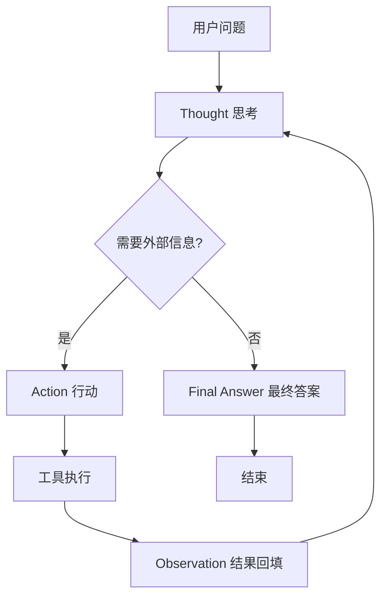
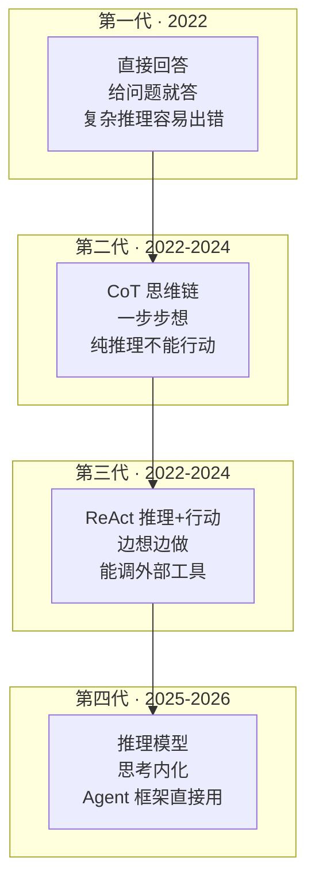

# Agent 为什么会"思考"：CoT 与 ReAct 推理原理

> 一句话摘要：所谓 Agent 的"思考"，是一场精心设计的**文本接龙**——模型每生成一段，代码就解析、执行、回填，循环往复。Chain-of-Thought（CoT）让模型"一步步想"，ReAct 让模型"边想边做"。拆开看没有任何黑魔法，全是工程。

---

## 1. 背景：最底层的问题

这是四问拆法的第一篇。四问是：为什么会"思考" / 怎么"动手" / 怎么"记事" / 怎么"规划"。

**最底层的问题**：一个只会"预测下一个 token"的模型，怎么表现出"思考"？

```
LLM 的本质：给定文本 → 预测下一个词
输入："2 + 2 = "
输出："4"（概率 0.9）
```

这看起来和"思考"毫无关系。但 2022 年一篇论文改变了一切——它发现了一个朴素的事实：

> **你让模型"一步步想"，它就真的会一步步想，而且准确率比直接给答案高得多。**

这就是 Chain-of-Thought（思维链）。

---

## 2. 核心内容一：CoT（思维链）——让模型"一步步想"

### 2.1 论文来源（已验证）

| 项 | 内容 |
|---|---|
| 论文 | Chain-of-Thought Prompting Elicits Reasoning in Large Language Models |
| 作者 | Jason Wei 等（Google） |
| arXiv | 2201.11903（2022-01 提交） |
| 核心发现 | 提示词里给"逐步推理"的示例，模型推理准确率大幅提升 |

### 2.2 什么是不带 CoT 的提问

```
Q: 一个篮子里有 5 个苹果，拿走 2 个，还剩几个？
A: 3 个。
```

模型直接给答案。对简单问题没问题，但遇到复杂推理就会"跳步"出错。

### 2.3 什么是 CoT 提问

```
Q: 一个篮子里有 5 个苹果，拿走 2 个，还剩几个？
A: 篮子开始有 5 个苹果。拿走了 2 个。
   5 - 2 = 3。所以还剩 3 个苹果。
```

模型被引导输出**中间推理步骤**。论文数据：在 GSM8K（数学应用题基准）上，540B 参数模型只用 8 个 CoT 示例就达到了当时的 SOTA——**超过微调过的 GPT-3 + verifier**。

### 2.4 CoT 的关键限制

**CoT 只能在"脑子里"推演，不能跟外部世界交互。**

- 算 24 点 ✅（纯推理）
- 查今天股价 ❌（需要外部信息，模型知识停在训练数据）

这个限制，就是 ReAct 出现的原因。

---

## 3. 核心内容二：ReAct（推理 + 行动）——让模型"边想边做"

### 3.1 论文来源（已验证）

| 项 | 内容 |
|---|---|
| 论文 | ReAct: Synergizing Reasoning and Acting in Language Models |
| 作者 | Shunyu Yao 等（Princeton / Google） |
| arXiv | 2210.03629（2022-10 提交，ICLR 2023） |
| 核心贡献 | 推理轨迹（reasoning trace）和行动（action）交替生成，互相增强 |

### 3.2 ReAct 的核心机制

ReAct = Reasoning + Acting。让模型交替输出两种内容：

```
Thought:  模型的推理（像 CoT 一样想）
Action:   模型决定调哪个工具（输出行动指令）
Observation: 工具返回的结果（回填给模型继续想）
```



### 3.3 一次真实的 ReAct 循环（完整示例）

**场景**：用户问"特斯拉现在的股价比上周涨了多少？"

模型收到的 prompt（每次循环都在变长）：

```
你是一个助手。你可以使用以下工具：
search: 搜索互联网。输入：搜索关键词。
calculator: 计算器。输入：数学表达式。

使用以下格式：
Question: 用户的问题
Thought: 你现在的想法
Action: 工具名
Action Input: 工具的输入
Observation: 工具返回的结果
...（这个 Thought/Action/Observation 可以重复多次）
Final Answer: 最终答案

开始！

Question: 特斯拉现在的股价比上周涨了多少？
Thought: 我需要先查特斯拉现在的股价。
Action: search
Action Input: 特斯拉 股价
```

模型生成到这里**会自动停下**（训练时学到了"生成到 Action Input 就该停"）。你的代码解析出 `search` 和"特斯拉 股价"，去调搜索 API，把结果拼回文本：

```
Observation: 特斯拉当前股价 $248.50，上周收盘价 $232.10。
Thought:
```

模型继续生成：

```
Thought: 我知道了当前股价和上周股价，需要计算涨幅。
Action: calculator
Action Input: (248.50 - 232.10) / 232.10 * 100
```

再执行，再拼：

```
Observation: 7.07
```

最后模型输出：

```
Final Answer: 特斯拉股价比上周上涨了约 7.07%。
```

**看明白了吗**——所谓"思考"，就是模型每生成一步，你的代码解析、执行、回填，模型接着想。循环终止条件是模型自己输出 Final Answer，或者撞到最大循环次数。

### 3.4 CoT vs ReAct 对比

| 维度 | CoT（思维链） | ReAct（推理+行动） |
|---|---|---|
| 思考 | ✅ 输出推理步骤 | ✅ 输出推理步骤 |
| 行动 | ❌ 不能调用外部 | ✅ 交替输出行动 |
| 实时信息 | ❌ 知识停在训练数据 | ✅ 能查外部 |
| 防幻觉 | ❌ 可能一本正经胡说 | ✅ 用工具结果纠正 |
| 代表场景 | 数学/逻辑推理 | 问答/决策/操作 |

**一句话**：CoT 是"想"，ReAct 是"想 + 做"。ReAct 是 CoT 的增强版——保留了推理，补上了与外部世界的交互。

---

## 4. 关键机制：循环怎么终止 + 为什么死循环

### 4.1 循环终止的两个条件

```
条件 1：模型输出 Final Answer（正常结束）
条件 2：达到最大循环次数（强制结束）
```

第二个条件是**保命绳**——模型可能一直不输出 Final Answer，或者工具一直返回它不想要的结果，它就一圈一圈转下去。

### 4.2 死循环风险（生产必读）

```
❌ 场景：模型反复调同一个失败的工具
   第 1 轮：调 search → 超时
   第 2 轮：再调 search → 超时
   ... 一直循环，Token 哗哗烧

✅ 对策（生产环境必选项）：
   - 最大循环次数（如 10 次）
   - Token 上限（如 50K）
   - 工具调用超时（如 30s）
   - 连续失败自动降级（如 3 次失败换简单模式）
```

**这是 Agent 工程和聊天应用最大的区别**：聊天一次调用，Agent 一次任务可能是 10+ 次调用，每一环都可能挂。上限不是可选项，是必选项。

### 4.3 2026 年的现状：从 ReAct 到推理模型

- 2022-2024：ReAct 是主流范式（几乎所有框架的默认循环）
- 2025-2026：**推理模型（reasoning models）** 兴起——模型内部自带"思考"（如 extended thinking / reasoning tokens），外部不再需要显式 CoT 提示
- 但 ReAct 的"思考 + 行动"框架**仍然是 Agent 循环的基础**——只是"思考"从外部提示变成了模型原生能力

**推理能力演进层次**：



---

## 5. 一句话总结 + 5W 速记卡 + 自测三问

### 5.1 一句话总结

> **Agent 的"思考" = 一场文本接龙：CoT 让模型"一步步想"，ReAct 让它"边想边做"（Thought → Action → Observation 循环）。模型输出什么，代码就解析、执行、回填什么。循环有终止条件，生产必须有上限。**

### 5.2 5W 速记卡

| W | 内容 |
|---|---|
| **What** | CoT（思维链）+ ReAct（推理+行动） |
| **Why** | 让"预测下一个词"的模型表现出推理能力 |
| **Who** | Wei et al. (Google, 2022) / Yao et al. (Princeton, 2022) |
| **When** | CoT 2022-01 / ReAct 2022-10 / 2026 已演进到推理模型 |
| **How** | 提示词引导 → Thought/Action 交替 → 工具结果回填 → 循环 |

### 5.3 自测三问

1. CoT 和 ReAct 的本质区别？（ReAct 多了"行动"——能调外部工具）
2. ReAct 循环怎么终止？（Final Answer / 最大循环次数）
3. 生产环境必须设什么？（循环上限 + Token 上限 + 超时）

---

## 下篇预告

Agent 会"思考"了（CoT/ReAct），但它怎么"动手"？怎么把"我要查天气"变成一次真实的 API 调用？

下一篇：[Agent 怎么"动手"](5_Agent怎么动手.md)——Function Calling 原理：从文本协议到结构化 JSON，四问拆法第二篇。

> 本系列阅读路径：篇 0 [系列导读](0_系列导读-全景.md) → 篇 1-3（地基+生态）→ 本篇（为什么会思考）→ 篇 5 怎么动手 → 篇 6 怎么记事 → 篇 7 怎么规划 → 篇 8 端到端串联

---

## 📌 数据与事实声明

本文涉及的论文信息（CoT / ReAct）已通过 arXiv 原始页面验证（2201.11903 / 2210.03629），截至 **2026-08-17**。AI 领域迭代极快，具体模型能力和框架实现以官方文档为准。

## 📚 参考资料

| 类型 | 标题 | 来源 |
|---|---|---|
| 论文 | Chain-of-Thought Prompting Elicits Reasoning in Large Language Models（Wei et al., 2022） | arxiv.org/abs/2201.11903 |
| 论文 | ReAct: Synergizing Reasoning and Acting in Language Models（Yao et al., 2022, ICLR 2023） | arxiv.org/abs/2210.03629 |
