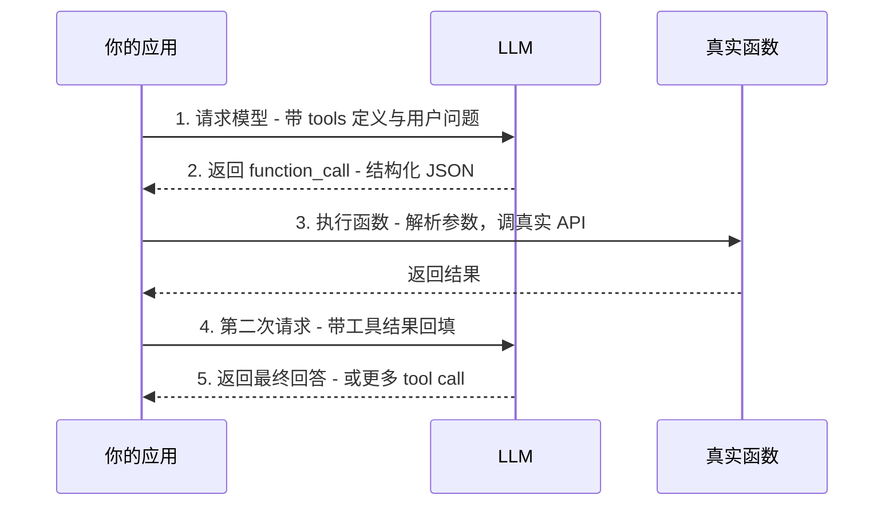

# Agent 怎么"动手"：Function Calling 原理与完整调用流程

> 一句话摘要：Agent 会"思考"了（CoT/ReAct），但它怎么"动手"调工具？答案是 **Function Calling（工具调用）**——把函数的 JSON Schema 告诉模型，模型输出结构化的调用指令，你的代码执行、回填、循环。这是四问拆法的第二问。

---

## 1. 背景：思考之后，怎么动手

上一篇讲了 Agent 为什么会"思考"——ReAct 循环里模型输出 `Action`，但有个关键问题没讲：

**模型输出的 Action 怎么变成一次真实的 API 调用？**

```
模型说: Action: search
模型说: Action Input: 特斯拉 股价
```

这只是一段文本。你的代码怎么知道：
- 调哪个函数？（search？calculator？send_email？）
- 传什么参数？（"特斯拉 股价" 是关键词还是别的字段？）
- 结果怎么传回给模型？

**Function Calling 就是解决这个问题的**——把"模型想调工具"从**文本协议**升级成**结构化协议**。

```mermaid
flowchart TD
    subgraph 旧时代[第一代 · 文本协议]
        A1[模型输出自然语言<br/>'帮我查一下天气'] --> A2[代码用正则/关键词解析<br/>脆弱、易错、不通用]
    end
    subgraph 新时代[第二代 · Function Calling]
        B1[模型输出结构化 JSON<br/>{"name":"get_weather","args":{...}}] --> B2[代码直接解析执行<br/>稳定、通用、无歧义]
    end
    旧时代 --> 新时代
```

---

## 2. 核心内容一：Function Calling 是什么

### 2.1 官方定义（2026-08-17 验证）

> **Function Calling（也叫 Tool Calling）**：给模型访问外部功能和数据的能力——模型可以用 JSON Schema 定义的函数接口，与你的应用系统交互。
>
> —— OpenAI 官方文档（developers.openai.com/api/docs/guides/function-calling）

### 2.2 核心机制：JSON Schema 驱动

**第一步：你把工具描述给模型**（每个函数一个 JSON Schema）

```json
{
  "type": "function",
  "name": "get_weather",
  "description": "Retrieves current weather for the given location.",
  "parameters": {
    "type": "object",
    "properties": {
      "location": {
        "type": "string",
        "description": "City and country e.g. Bogota, Colombia"
      },
      "units": {
        "type": "string",
        "enum": ["celsius", "fahrenheit"],
        "description": "Units the temperature will be returned in."
      }
    },
    "required": ["location", "units"],
    "additionalProperties": false
  },
  "strict": true
}
```

关键字段：

| 字段 | 作用 |
|---|---|
| `name` | 函数名（模型据此选择调谁） |
| `description` | **最重要的字段**——告诉模型什么时候该用这个工具、怎么用 |
| `parameters` | JSON Schema，定义参数结构、类型、必填项 |
| `strict` | 严格模式（2025+ 新特性），强制模型输出完全符合 schema |

**第二步：模型输出结构化调用**（不是自然语言，是 JSON）

```
模型返回:
{
  "type": "function_call",
  "name": "get_weather",
  "arguments": "{\"location\":\"Beijing\",\"units\":\"celsius\"}"
}
```

**第三步：你的代码直接解析执行**

```python
# 伪代码：解析模型输出，执行对应函数
if item.type == "function_call":
    args = json.loads(item.arguments)
    result = get_weather(**args)   # 执行真实函数
    messages.append({"role": "tool", "content": result})  # 回填给模型
```

### 2.3 为什么比"文本协议"强

| 维度 | 文本协议（旧） | Function Calling（新） |
|---|---|---|
| 输出格式 | 自然语言 | 结构化 JSON |
| 解析方式 | 正则/关键词猜测 | 直接 json.loads |
| 参数传递 | 模糊、易错 | Schema 约束、类型明确 |
| 多工具选择 | 难（靠猜） | 模型原生能力（从工具列表选） |
| 稳定性 | 差（换个说法就崩） | 好（格式锁死） |

---

## 3. 核心内容二：完整调用流程（官方五步）

OpenAI 官方文档定义了 tool calling 的五个高层步骤：



### 一次真实流程（完整示例）

**用户**：今天北京天气怎么样？

```
第 1 步: App → Model
  {
    "model": "gpt-5.6",
    "tools": [get_weather 的定义],   ← 把工具告诉模型
    "input": [{"role":"user","content":"今天北京天气怎么样？"}]
  }

第 2 步: Model → App（收到 tool call，不是答案）
  {
    "type": "function_call",
    "name": "get_weather",
    "arguments": "{\"location\":\"Beijing\",\"units\":\"celsius\"}"
  }

第 3 步: App 内部执行
  weather = get_weather(location="Beijing", units="celsius")
  → 返回 "晴，28°C"

第 4 步: App → Model（把结果回填）
  {
    "type": "function_call_output",
    "call_id": "...",
    "output": "晴，28°C"
  }

第 5 步: Model → App（最终回答）
  "北京今天晴天，28 度，适合出门。"
```

**注意**：第 5 步模型可能不直接给答案，而是再输出一个 function_call（比如"顺便查下明天"）——那就回到第 3 步继续循环。**这就是 Agent Loop 的"动手"环节。**

---

## 4. 关键机制：生产必知

### 4.1 三个容易翻车的地方

| 翻车点 | 场景 | 对策 |
|---|---|---|
| **格式错** | 模型输出 JSON 不合法 | strict 模式 + 解析兜底（解析失败让模型重试） |
| **参数错** | 模型传了 schema 外的参数 | `additionalProperties: false` + 校验 |
| **超时/失败** | 工具本身挂了 | 超时 + 重试 + 错误信息回填给模型让它换招 |

### 4.2 2026 年新特性（时效验证）

| 特性 | 说明 | 什么时候用 |
|---|---|---|
| **strict mode** | 强制输出严格符合 schema，杜绝格式错误 | 生产环境默认开 |
| **tool search** | 工具太多时延迟加载（gpt-5.4+ 支持），模型需要时才加载 | 几十个工具的场景 |
| **多工具并行** | 模型一次返回多个 tool_call | 需要同时查多个数据时 |

### 4.3 推理模型注意点（2026 新坑）

> 用推理模型（如 GPT-5 系列）时，模型返回的 **reasoning（思考过程）也必须回传给模型**——只回传 tool output 会导致后续推理错乱。

这是 2025-2026 推理模型时代新增的坑，老教程里没有。

### 4.4 Function Calling vs MCP（预告篇 10）

```
Function Calling: 模型厂商定义的协议（OpenAI/Anthropic 各自实现）
MCP:            开放标准协议（让工具生态 N×M → N+M）
```

简单理解：Function Calling 是"你的模型调你的函数"，MCP 是"任何模型调任何工具"——篇 10 详讲。

---

## 5. 一句话总结 + 5W 速记卡 + 自测三问

### 5.1 一句话总结

> **Function Calling = 把函数接口（JSON Schema）告诉模型，模型输出结构化调用指令（function_call），代码解析执行后回填结果。它把"模型想调工具"从文本协议升级成结构化协议——稳定、通用、无歧义，是 Agent 的"手"。**

### 5.2 5W 速记卡

| W | 内容 |
|---|---|
| **What** | 模型通过 JSON Schema 调用外部函数 |
| **Why** | 文本协议脆弱，结构化协议稳定通用 |
| **Who** | OpenAI / Anthropic / 各模型厂商都实现 |
| **When** | 2023 年 OpenAI 推出，2024-2026 成 Agent 标配 |
| **How** | 定义 tools → 模型输出 function_call → 执行 → 回填 |

### 5.3 自测三问

1. Function Calling 的输出是什么格式？（结构化 JSON，不是自然语言）
2. `description` 字段为什么重要？（决定模型什么时候选这个工具）
3. 生产环境默认要开什么？（strict mode + 超时 + 校验）

---

## 下篇预告

Agent 会"思考"（CoT/ReAct）、会"动手"（Function Calling），但它没有记忆——上次聊过的它全忘了。怎么让它"记事"？

下一篇：[Agent 怎么"记事"](6_Agent怎么记事.md)——短期拼 prompt / 长期向量库 / 写入闸门，四问拆法第三篇。

> 本系列阅读路径：篇 0 [系列导读](0_系列导读-全景.md) → 篇 1-3（地基+生态）→ 篇 4 为什么会思考 → 本篇（怎么动手）→ 篇 6 怎么记事 → 篇 7 怎么规划 → 篇 8 端到端串联

---

## 📌 数据与事实声明

本文的 Function Calling / Tool Calling 信息已通过 OpenAI 官方文档验证（developers.openai.com/api/docs/guides/function-calling），截至 **2026-08-17**。具体模型版本、API 细节以官方文档为准。

## 📚 参考资料

| 类型 | 标题 | 来源 |
|---|---|---|
| 官方文档 | Function calling（OpenAI API 指南） | developers.openai.com/api/docs/guides/function-calling |
