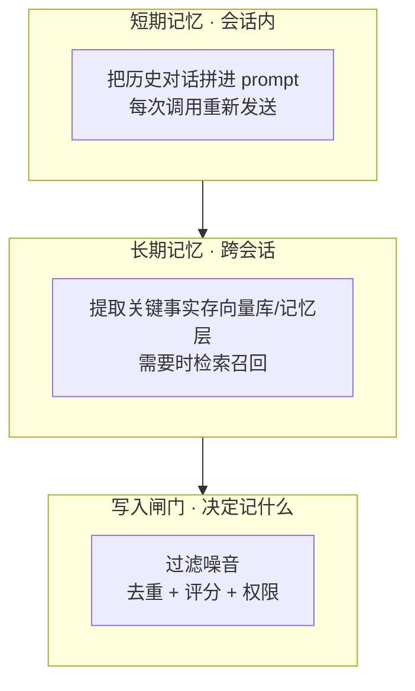
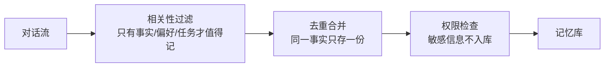

# Agent 怎么"记事"：从短期拼 prompt 到长期记忆库

> 一句话摘要：Agent 天生"健忘"——每次调用都是独立的。让它"记事"靠三个层次：短期记忆（把上下文拼进 prompt）、长期记忆（提取关键事实存向量库/记忆层）、写入闸门（决定什么值得记）。四问拆法第三篇。

---

## 1. 背景：Agent 的"失忆症"

上一篇讲了 Agent 怎么"动手"（Function Calling）。但有个致命问题没解决：

**Agent 每次调用都是独立的，它什么都不记得。**

```
用户：我住在北京，喜欢川菜。
Agent：好的，记住了！

用户：明天给我推荐个吃饭的地方。
Agent：？？？你是谁？你在哪？你喜欢什么？
```

这就是 Agent 的"失忆症"——**模型本身没有状态**，每次调用它"看到"的只有你这次给它的 prompt。

**怎么解决？** 三个层次的"记事"体系：



---

## 2. 核心内容一：短期记忆（把上下文拼进 prompt）

### 2.1 最朴素的实现

```python
# 伪代码：把历史消息全部拼进每次请求
messages = [
    {"role": "system", "content": "你是助手"},
    {"role": "user", "content": "我住在北京"},       # 历史
    {"role": "assistant", "content": "好的记住了"},  # 历史
    {"role": "user", "content": "推荐吃饭的地方"},    # 当前
]
response = llm.chat(messages)
```

**原理**：模型虽然无状态，但你把"历史"作为输入喂给它，它就能"假装记得"。

### 2.2 两个致命问题

**问题 1：Context Window 是有限的**

- 对话越长，历史越多 → 迟早撑爆窗口
- 撑爆的后果：报错 / 截断 / 关键信息被挤掉

**问题 2：Lost in the Middle（中间迷失）**

> 2023 年研究（Liu et al.）发现：模型对**开头和结尾**的信息记忆最好，**中间部分**容易被忽略。2026 年的研究证实：即使 1M token 的新模型，这个问题依然存在。

```
prompt 结构: [系统指令] [历史消息 x 100] [当前问题]
                      ↑ 这段最容易"失忆"
```

**结论**：短期记忆只适合短会话。长会话必须用长期记忆。

---

## 3. 核心内容二：长期记忆（向量库 + 记忆层）

### 3.1 核心思路：不塞历史，存"事实"

与其每次把全部历史塞进 prompt（贵 + 效果差），不如：

```
写入: 从对话中提取关键事实 → 存起来（向量化）
读取: 用户提问时 → 只检索相关的几条 → 拼进 prompt
```

这就是 **RAG（检索增强生成）** 在记忆场景的应用。

### 3.2 2026 年记忆层爆发（时效资料）

2026 年年中，**7 周内 4 家公司推出了托管记忆层**（已验证）：

| 产品 | 状态 | 发布时间 | 定价 |
|---|---|---|---|
| Weaviate Engram | GA | 2026-06-03 | 免费层起，付费 $45/月起 |
| Cloudflare Agent Memory | 私有 beta | 2026-04-13 | beta 期不收费 |
| Microsoft Foundry Memory | 公开预览 | 2026-04-29 | 未公布 |
| Mem0 | GA | 2026-04 | 免费 / $19 / $79 / $249/月 |

**关键发现**：四家的架构惊人一致——

> **异步提取存储（extract-and-store）+ 检索优先召回（retrieval-first recall）+ 刻意不塞 context window。**

这不是巧合，是行业验证过的共识：**"更大的 context window 不能解决遗忘"**。

### 3.3 为什么"更大的窗口"不行（数据）

> LongMemEval 论文（Wu et al., ICLR 2025）：长上下文 LLM 跨会话记忆，准确率掉 **30-60%**。GPT-4o 级别的模型在 LongMemEval 上只有 **30-70%** 准确率。

```
错误直觉：窗口 1M token，全塞进去不就行了？
现实：窗口大 ≠ 记得住。中间迷失 + 检索噪声 + 成本爆炸。
```

**正确做法**：检索一小撮最相关的记忆（比如 5-10 条）拼进 prompt——比全塞更准、更便宜。

### 3.4 选型：向量库 or 记忆层

| 维度 | 自建向量库 | 托管记忆层（2026 新） |
|---|---|---|
| 代表 | Milvus / pgvector / Chroma | Engram / Cloudflare AM / Mem0 |
| 控制力 | 完全可控 | 少（黑盒） |
| 维护成本 | 高（自己管索引/部署） | 低（托管） |
| 上手速度 | 慢（要学向量检索） | 快（SDK 几行接入） |
| 适合 | 深度定制 / 数据敏感 | 快速验证 / 不想运维 |
| 坑 | 索引调参 / 召回质量 | vendor lock-in / benchmark 注水 |

**⚠️ Benchmark 注水警示（2026 实测）**：Mem0 自称 LongMemEval 94.4%，独立复现只有 **57.5%**（差 36.9 分）。**读任何记忆层宣传分数，先问"谁测的、用什么 harness、日志公开吗"。**

---

## 4. 核心内容三：写入闸门（决定记什么）

### 4.1 为什么需要闸门

不是所有对话内容都值得记。无脑全记：

- 存了一堆噪音（"嗯" "好的" "谢谢"）
- 重复内容（同一事实记了 10 遍）
- 隐私内容（用户随口说的不该长期存）

**写入闸门 = 记忆质量的守门员。**

### 4.2 三层过滤



| 过滤层 | 干什么 | 例子 |
|---|---|---|
| **相关性** | 只有"事实/偏好/任务"值得记 | 记"住在北京"，不记"好的" |
| **去重** | 同一事实合并更新 | "喜欢川菜" 覆盖 "喜欢辣" |
| **权限** | 敏感信息不入库 | 密码/身份证/银行卡 不存 |

### 4.3 2026 新趋势：程序化记忆（Procedural Memory）

> Microsoft Foundry 2026 年 Build 大会发布了 **Procedural Memory（程序化记忆）**：记录并审计 Agent 成功执行的任务轨迹，之后复用这些模式，跳过曾经失败的步骤。

**普通记忆（factual）**：记"用户喜欢什么"
**程序化记忆（procedural）**：记"上次怎么成功的"

这是 2026 年记忆领域的新方向——不只记事实，还记"经验"。

---

## 5. 一句话总结 + 5W 速记卡 + 自测三问

### 5.1 一句话总结

> **Agent 记事三层次：短期记忆（拼 prompt，只适合短会话）、长期记忆（提取事实存向量库/记忆层，检索召回）、写入闸门（过滤噪音、去重、权限）。2026 年记忆层爆发，架构共识是"异步写入 + 检索召回 + 不塞窗口"——因为更大的 context window 不能解决遗忘。**

### 5.2 5W 速记卡

| W | 内容 |
|---|---|
| **What** | 短期 prompt 记忆 + 长期向量库/记忆层 + 写入闸门 |
| **Why** | Agent 无状态，不记事就没法跨会话工作 |
| **Who** | Mem0 / Engram / Cloudflare / Foundry（2026 记忆层） |
| **When** | RAG 2020 起，2026 记忆层产品化爆发 |
| **How** | 提取 → 去重 → 存储 → 检索 → 回填 prompt |

### 5.3 自测三问

1. 为什么"窗口够大"不等于"记得住"？（Lost in the Middle + LongMemEval 30-60% 掉点）
2. 长期记忆的写入和读取是两条什么路径？（异步提取存储 vs 检索优先召回）
3. 写入闸门过滤哪三层？（相关性 / 去重 / 权限）

---

## 下篇预告

Agent 会"思考"（CoT）、会"动手"（Function Calling）、会"记事"（Memory）——但它怎么决定"先做什么、后做什么"？复杂任务怎么拆解？

下一篇：[Agent 怎么"规划"](7_Agent怎么规划.md)——ReAct / Plan-and-Execute / Reflexion / ToT 四种规划模式，四问拆法收官。

> 本系列阅读路径：篇 0 [系列导读](0_系列导读-全景.md) → 篇 1-3（地基+生态）→ 篇 4 思考 → 篇 5 动手 → 本篇（记事）→ 篇 7 规划 → 篇 8 端到端串联

---

## 📌 数据与事实声明

本文的记忆层信息（Engram / Cloudflare / Foundry / Mem0）来自 2026 年行业深度调研（Genαi，2026-07-21 更新）；LongMemEval 数据来自 Wu et al. ICLR 2025 论文；Lost in the Middle 来自 Liu et al. 2023 及 2026 年复现研究。截至 **2026-08-17**，具体产品状态与价格以官方文档为准。

## 📚 参考资料

| 类型 | 标题 | 来源 |
|---|---|---|
| 行业文章 | AI Agent Memory in 2026: 4 Launches in 7 Weeks（Genαi, 2026-06-18, 更新 07-21） | genalphai.com/agent-memory-2026-engram-cloudflare-foundry-mem0-compared |
| 论文 | LongMemEval（Wu et al., ICLR 2025） | arxiv.org/abs/2410.10813 |
| 研究 | Lost in the Middle（Liu et al., 2023） | arxiv.org/abs/2307.03172 |
| 官方博客 | Cloudflare Agents that remember（Agent Memory 发布） | blog.cloudflare.com/introducing-agent-memory |
| 开源项目 | Mem0（Agent 记忆层） | github.com/mem0ai/mem0 |
