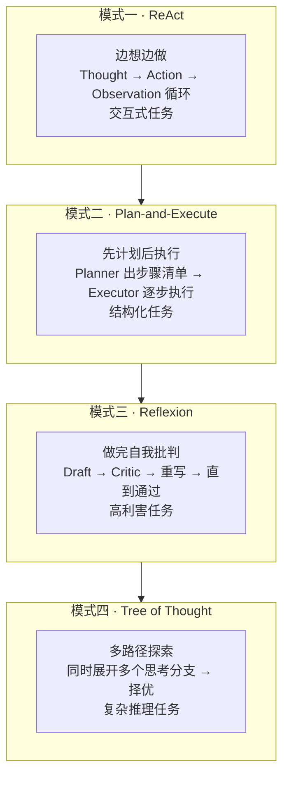
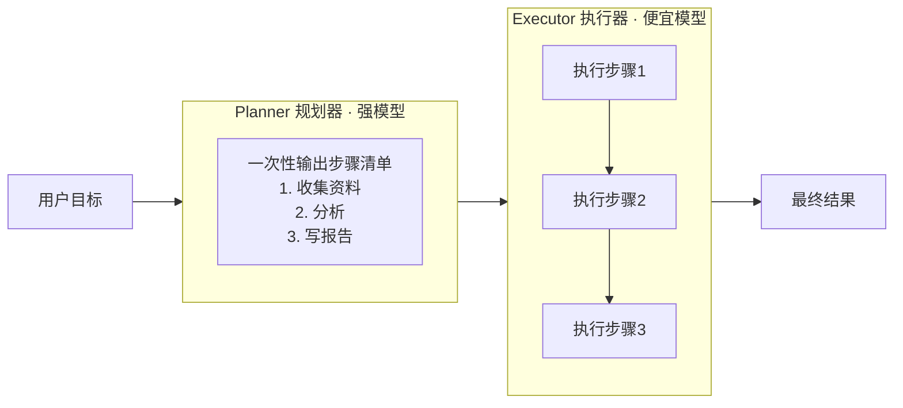
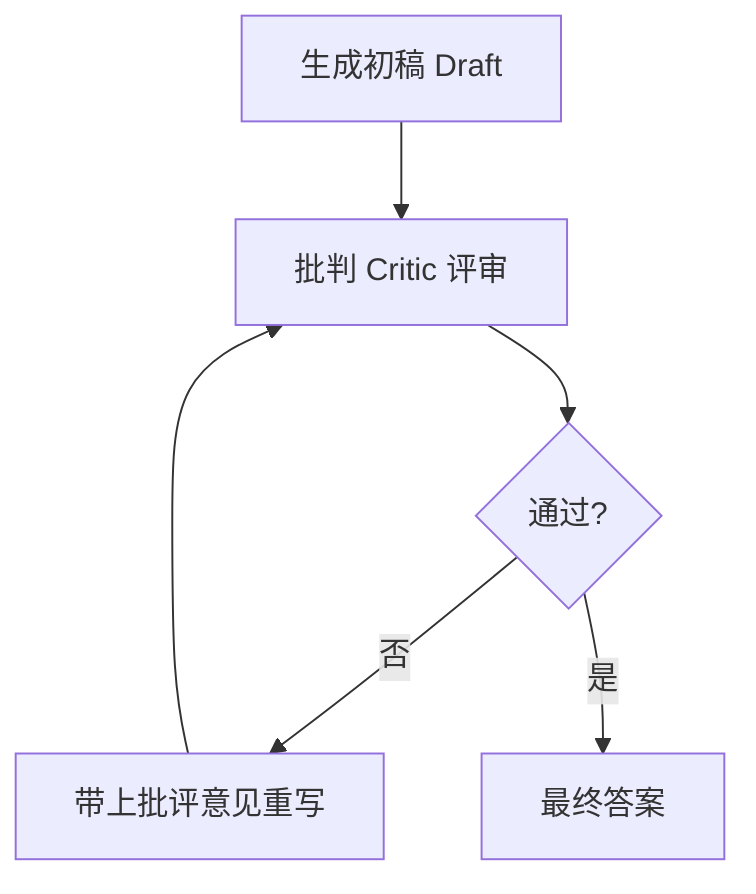
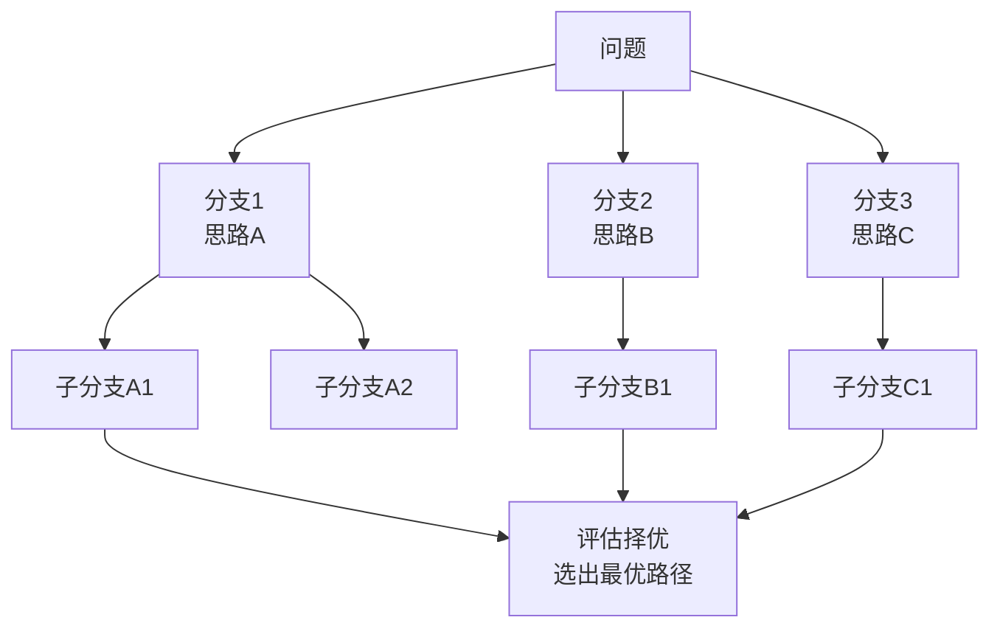
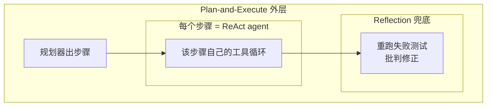

# Agent 怎么"规划"：ReAct / Plan-and-Execute / Reflexion / ToT 四模式

> 一句话摘要：Agent 面对复杂任务时怎么决定"先做什么、后做什么"？答案是四种规划模式——ReAct（边想边做）、Plan-and-Execute（先计划后执行）、Reflexion（做完自我批判）、ToT（多路径探索）。选错模式，成本、延迟、可靠性的差别是"可预测的"。四问拆法收官篇。

---

## 1. 背景：四问的最后一问

四问拆法走完了三问：

```
为什么会"思考"？→ CoT / ReAct（篇 4）
怎么"动手"？    → Function Calling（篇 5）
怎么"记事"？    → Memory 三层次（篇 6）
怎么"规划"？    → 本篇
```

前三问解决了"单步能力"，但真实任务是多步的：

**"帮我调研竞品并写份报告"** 不是一步——要先搜资料、再总结、再写报告、再检查格式。Agent 怎么决定步骤顺序？这就是**规划（Planning）**。

**核心问题**：先计划再执行（Plan-first），还是边做边想（Do-while-think）？

---

## 2. 四种规划模式全景



四种模式的定位：

| 模式 | 一句话 | 论文来源 | 适合 |
|---|---|---|---|
| **ReAct** | 边想边做 | Yao et al. 2022 | 交互式、下一步依赖上一步 |
| **Plan-and-Execute** | 先计划后执行 | Wang et al. 2023 | 结构化、任务形状已知 |
| **Reflexion** | 做完自我批判 | Shinn et al. 2023 | 高利害、有质量信号 |
| **ToT** | 多路径探索 | Yao et al. 2023 | 复杂推理、需要权衡 |

---

## 3. 模式一：ReAct（边想边做）

### 3.1 核心机制

篇 4 已经详细讲过 ReAct 循环。这里从"规划"视角看它的本质：

**ReAct 不做显式计划——每一步的"下一步"由模型根据上一步结果现场决定。**

```
用户: 查一下订单 A123 状态，如果已退款就发邮件给客户
Step 1: Thought(需要查订单) → Action(search_orders A123)
Step 2: Thought(已退款,需要通知) → Action(send_email)
Step 3: 完成
```

**特点**：计划是隐式的、动态的——每步都重新思考。

### 3.2 什么时候用

- 任务**交互式**：下一步真的依赖上一步返回（客服查单→决定是否退款）
- 搜索树**小**、探索**便宜**
- 代表：SWE-agent（Princeton 2024，读文件→跑命令→改代码，编译器报错决定下一步）

### 3.3 关键失败模式：verifier stall（验证卡死）

```
❌ 模型反复调同一个验证工具，每次换个说法
   第 1 次: verify_result("结果正确吗?") → 返回错误
   第 2 次: verify_result("请再检查一次") → 还是错误
   ... 一直循环到预算耗尽

✅ 对策: 单工具调用上限（不只是全局步数上限）
```

### 3.4 ⚠️ 2025-11 真实事故（时效资料）

> **2025 年 11 月，四个 LangChain agent 因为忘了设置 max_steps，跑了 11 天，账单 $47,000。**

`max_steps` 那一行是"区分能用的 agent 和 $47K 账单的分界线"。生产必设：全局步数上限 + 单工具调用上限。

---

## 4. 模式二：Plan-and-Execute（先计划后执行）

### 4.1 核心机制

把"规划"和"执行"拆成两个角色：



**关键特点**：计划**前置**、**一次性**。执行器只跑，不重新规划。

**成本模型**：`1 × 强模型 + N × 便宜模型`——N > 3 时通常优于 ReAct（ReAct 每步都用同一个模型）。

### 4.2 什么时候用

- 任务**结构明确**：步骤顺序基本确定（研究流程、多文档总结、ETL 流水线）
- **成本敏感**：想用便宜模型执行
- 代表：Devin（Cognition 2024，long-horizon 软件任务用 plan-first 架构）

### 4.3 关键失败模式：brittle plan（计划脆弱）

```
❌ 计划在没看到任何工具输出时就定死了
   Step 2 返回了计划者没预料到的结果 → Step 3 已经写错

✅ 对策: re-plan gate（重新规划闸门）
   每 K 步后，或某步输出超出预期时，让 planner 决定是否修订剩余步骤
   （BabyAGI 的核心循环就是这个）
```

---

## 5. 模式三：Reflexion（做完自我批判）

### 5.1 核心机制

生成 → 批判 → 重写 → 直到通过：



**成本**：N 轮 × 每轮 2 次调用。**延迟**：乘以轮数。

### 5.2 什么时候用

- 最终答案错误**代价高**（法律/金融文书、代码生成）
- 有**清晰的质量信号**（测试能跑、schema 能校验、引用能查）
- 宁愿花 3 倍 token 也要做对，而不是快速交付错误结果
- 代表：**AlphaCodium**（2024）——draft → 跑测试 → 反思失败 → 重写，把 GPT-4 从 CodeContests 19% 提到 44%

### 5.3 ⚠️ 关键坑：self-bias（自偏误）

> **Panickssery et al. 2024（LLM Evaluators Recognize and Favor Their Own Generations）**：同一个模型既当起草者又当评审者，会偏向自己的产出——质量闸门变成橡皮图章。

**对策**：
1. 批评者用**不同模型族**（如 GPT 起草、Claude 评审）
2. 或把批判**锚定在外部信号**上（跑测试、schema 校验、引用检查）——这是 AlphaCodium 成功的关键

---

## 6. 模式四：Tree of Thought（多路径探索）

### 6.1 核心机制

ReAct 是**单条路径**（一条道走到黑），ToT 是**多路径并行探索**：



### 6.2 什么时候用

- **复杂推理**：单一思路容易走死（数学证明、谜题、多步决策）
- 有**启发式评估**能力（能判断哪个分支更有希望）
- **代价最高**的模式——同时展开多个分支，token 消耗指数级

### 6.3 实用主义建议

ToT 理论价值高，但生产里**很少用原始形态**——通常被"采样 + 择优"（sample N 次选最好的）或"多 Agent 竞标"替代，效果接近、实现更简单。理解它的思想（多路径 + 评估择优）比实现它更重要。

---

## 7. 怎么选：决策矩阵 + 组合使用

### 7.1 决策矩阵（2026 时效资料）

| 维度 | ReAct | Plan-and-Execute | Reflexion |
|---|---|---|---|
| **延迟** | 不定（取决于步数） | 计划后基本固定 | 乘以轮数 |
| **成本** | 每步一个模型 | 1 强 + N 便宜 | N 轮 × 每轮 2 次调用 |
| **适合** | 交互式/未知深度 | 结构化/成本敏感 | 高利害/有质量信号 |
| **失败模式** | verifier stall | brittle plan | self-bias |

### 7.2 2026 年选型经验法则

> **交互式任务 → ReAct；发现 ReAct 每次都在重新推导同一个计划 → 换 Plan-and-Execute；最终答案质量比耗时更重要 → 外面套 Reflexion。**

### 7.3 生产组合模式（2026 实际形态）



> 2026 年生产级编码助手常见形态：**Plan-and-Execute 外层 + 每步 ReAct 内层 + Reflection 兜底**——四层 span 树，每层有自己的工具。

---

## 8. 一句话总结 + 5W 速记卡 + 自测三问

### 8.1 一句话总结

> **四种规划模式回答"Agent 怎么决定步骤"：ReAct 边想边做（交互式）、Plan-and-Execute 先计划后执行（结构化、省成本）、Reflexion 做完自我批判（高利害）、ToT 多路径探索（复杂推理）。2026 实战：交互式起步选 ReAct，计划重复选 P&E，质量优先套 Reflexion。所有模式必须设循环上限——忘了 max_steps 的代价是 11 天 $47,000。**

### 8.2 5W 速记卡

| W | 内容 |
|---|---|
| **What** | ReAct / P&E / Reflexion / ToT 四种规划模式 |
| **Why** | 单步能力之外，多步任务需要决定步骤顺序 |
| **Who** | Yao 2022/2023 / Wang 2023 / Shinn 2023 |
| **When** | 2022-2023 论文奠基，2026 生产组合使用 |
| **How** | 按任务特征选模式，组合 + 设上限 |

### 8.3 自测三问

1. ReAct 和 Plan-and-Execute 的本质区别？（计划隐式 vs 显式前置）
2. Reflexion 的 self-bias 怎么破？（不同模型族 / 外部信号锚定）
3. 生产环境必设什么上限？（max_steps + 单工具调用上限）

---

## 下篇预告

四问拆法完成——思考、动手、记事、规划都讲完了。现在把它们串起来：一次真实的 Agent 调用，从用户提问到最终回答，到底走完哪些环节？

下一篇：[端到端：一次完整的 Agent 调用流程](8_端到端一次完整的Agent调用流程.md)——一个请求走完四问 + 六层技术栈，每步收到什么、返回什么。

> 本系列阅读路径：篇 0 [系列导读](0_系列导读-全景.md) → 篇 1-3（地基+生态）→ 篇 4-7 四问拆法（思考/动手/记事/规划）→ 本篇收官 → 篇 8 端到端串联

---

## 📌 数据与事实声明

本文的四模式信息来自 2026 年行业深度文章（dev.to，2026-04-18 发布）及论文原始来源（Yao 2022/2023、Wang 2023、Shinn 2023、Panickssery 2024）；$47,000 事故来自 2025-11 真实报道。截至 **2026-08-17**，具体框架实现以官方文档为准。

## 📚 参考资料

| 类型 | 标题 | 来源 |
|---|---|---|
| 行业文章 | ReAct, Plan-and-Execute, or Reflection?（dev.to, 2026-04-18） | dev.to/gabrielanhaia/react-plan-and-execute-or-reflection-355p |
| 论文 | ReAct: Synergizing Reasoning and Acting（Yao et al., 2022） | arxiv.org/abs/2210.03629 |
| 论文 | Plan-and-Solve Prompting（Wang et al., 2023） | arxiv.org/abs/2305.04091 |
| 论文 | Reflexion: Language Agents with Verbal Reinforcement Learning（Shinn et al., 2023） | arxiv.org/abs/2303.11366 |
| 论文 | Tree of Thoughts: Deliberate Problem Solving（Yao et al., 2023） | arxiv.org/abs/2305.10601 |
| 论文 | LLM Evaluators Recognize and Favor Their Own Generations（Panickssery et al., 2024） | arxiv.org/abs/2404.13076 |
| 论文 | AlphaCodium: From Prompt Engineering to Flow Engineering（Ridnik et al., 2024） | arxiv.org/abs/2401.08500 |
