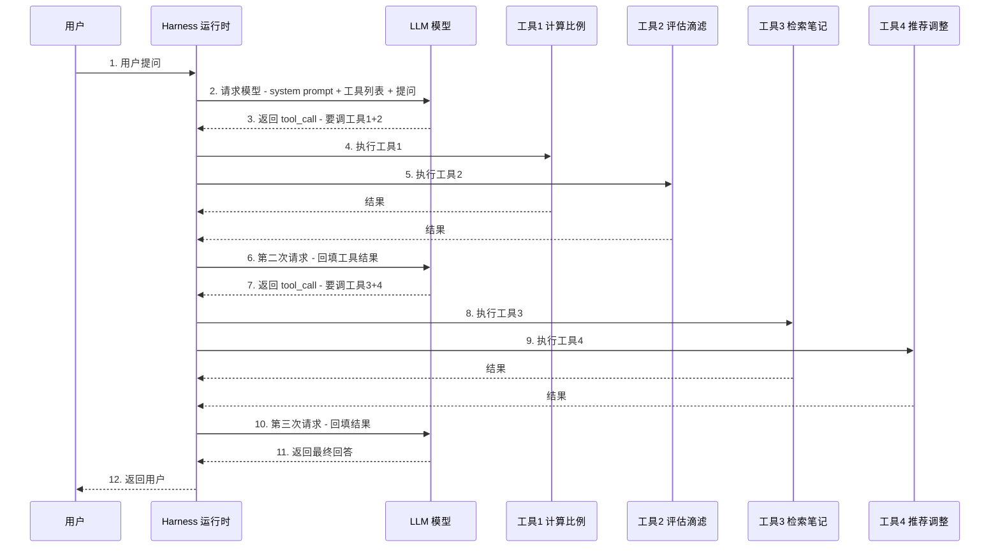

# 端到端：一次完整的 Agent 调用流程

> 一句话摘要：把四问（思考/动手/记事/规划）串起来——一个真实请求从进来到出去，到底走了几轮？每轮 LLM 收到什么、返回什么？用一条真实 Jaeger trace 讲透：1 次请求 → 2 个循环周期 → 4 次工具调用 → 2 次模型调用，55 秒里 35 秒花在了一次"思考"上。

---

## 1. 背景：四问拆完，把它们串起来

前四篇拆开了 Agent 的四个能力：

```
篇 4 为什么会"思考"？ → CoT / ReAct
篇 5 怎么"动手"？    → Function Calling
篇 6 怎么"记事"？    → Memory 三层次
篇 7 怎么"规划"？    → 四种规划模式
```

但真实生产里，这些能力**不是一个个孤立演示**——一个请求要同时用到它们。本篇用一个真实场景，走一遍"从用户提问到最终回答"的完整流程，标注每步用了四问中的哪个能力、走到六层技术栈的哪一层。

**读完你该能回答**：一次 Agent 调用到底花多少钱、多少时间、每一步谁在干什么。

---

## 2. 场景设定

> 用户（2026 年 7 月某日）："我 16g/250g V60，94°C，3:45 滴滤完成，冲出来又酸又淡，怎么调？"

这是一个真实的端到端示例（BrewTrace 手冲咖啡诊断 Agent，2026-07 实测）。任务需要：

- **规划**：先查配方 → 评估滴滤时间 → 查笔记 → 给建议（多步，需规划）
- **思考**：每步看完结果决定下一步（ReAct 式）
- **动手**：调 4 个工具（计算比例/评估时间/检索笔记/推荐调整）
- **记事**：检索配方笔记（RAG 记忆）

一句话：**四问全用上了。**

---

## 3. 完整调用流程：一次请求的旅程



**关键点**：用户只发了一次请求，但 **LLM 被调了多次**——每次工具调用后都要"带着新信息重新想一遍"。这就是 Agent 比普通 API 调用贵的原因。

---

## 4. 真实 Trace：这条请求在监控里长什么样

### 4.1 完整调用树（2026-07 实测）

```
brewtrace.request                              55.2s  ← 整个请求
└── invoke_agent                                43.2s  ← Agent 运行时
    ├── execute_event_loop_cycle                35.2s  ← 第 1 个循环周期
    │   ├── chat                                35.2s  ← LLM 调用 1（842 in / 1363 out tokens）
    │   ├── execute_tool calculate_brew_ratio    6ms   ← 工具调用 1
    │   ├── execute_tool assess_drawdown_time           ← 工具调用 2
    │   ├── execute_tool retrieve_recipe_notes          ← 工具调用 3
    │   └── execute_tool recommend_adjustment           ← 工具调用 4
    └── execute_event_loop_cycle                        ← 第 2 个循环周期（最终答案）
```

### 4.2 这条 trace 回答了几个关键问题

| 问题 | 答案 |
|---|---|
| 这 55 秒花哪了？ | **35 秒在 LLM 调用**（本地 8B 模型），工具调用全部毫秒级 |
| 模型真的调了工具吗？ | trace 里 4 个 execute_tool span 证明：**建议来自规则引擎，不是模型编的** |
| 检索给了模型什么？ | retrieve_recipe_notes 的 span 显示精确的 markdown 片段 |
| 最终回答哪来的？ | 第 2 个循环周期，模型看到工具结果后输出 |

### 4.3 成本与延迟模型

```
用户 1 次请求 = 模型调用 2 次 + 工具调用 4 次 + 事件循环 2 轮
                   ↑ token 成本全在这   ↑ 基本免费但耗时
```

**这是 Agent 与普通 LLM API 的本质区别**：普通调用 1 次模型返回答案；Agent 调用 N 次模型 + M 次工具，直到模型认为任务完成。

---

## 5. 每一步拆解：LLM 收到什么、返回什么

### 5.1 第 1 次模型调用

**收到**（请求体）：
```
system: 你是手冲咖啡诊断专家。必须使用工具，禁止凭空回答。
tools:  [calculate_brew_ratio, assess_drawdown_time,
         retrieve_recipe_notes, recommend_adjustment]  ← 工具定义（JSON Schema）
user:   16g/250g V60，94°C，3:45 滴滤，又酸又淡
```

**返回**（不是答案，是工具调用指令）：
```
tool_calls: [
  {name: "calculate_brew_ratio", args: {dose_g: 16, water_g: 250}},
  {name: "assess_drawdown_time", args: {drawdown_s: 225, method: "v60"}}
]
```

### 5.2 第 1 轮工具执行

Harness 解析 tool_calls → 执行真实函数 → 拿结果：

```
calculate_brew_ratio → {ratio: 15.6, verdict: "合适"}
assess_drawdown_time → {verdict: "stalled", advice: "滴滤过慢"}
```

### 5.3 第 2 次模型调用

**收到**：第 1 次全部消息 + 工具结果（追加进去）

```
user: 16g/250g V60...
assistant: [tool_calls: 上面的]
tool:   {ratio: 15.6, verdict: "合适"}
tool:   {verdict: "stalled"}
```

**返回**：新的 tool_calls（模型看到结果后决定下一步）
```
tool_calls: [
  {name: "retrieve_recipe_notes", args: {topic: "sour thin drawdown"}},
  {name: "recommend_adjustment", args: {defects: ["sour", "thin"], ...}}
]
```

### 5.4 第 3 次模型调用

**收到**：两次工具结果都回填后
**返回**：最终回答（"磨细一档，其他不动"）

**注意**：模型在每次工具结果后都"重新想一遍"——这就是 ReAct 循环（篇 4）+ 工具调用（篇 5）的实战形态。

---

## 6. 生产要点：这次调用里的 5 个坑

### 6.1 模型选择主导工具调用可靠性（2026 实测）

> 同一个任务：qwen3-8B 四工具流程基本每次都走完；**llama3.1-8B 会在开放式提问时跳过工具、直接凭自己的咖啡知识回答**——即使 system prompt 明确禁止。

**启示**：模型能力不行，工具调用就是摆设。选模型时用 eval 量化工具调用成功率，别凭感觉。

### 6.2 强制结构化输出在工具循环末尾会崩

> 小模型在"上下文已包含一长串工具对话"后，强制输出结构化对象（structured_output）**经常失败**。

**两遍法（实测有效）**：
```
第 1 遍: 工具型 Agent 自由文本回答（可靠）
第 2 遍: 无工具的独立 Agent 只做"从回答中提取结构化对象"
代价: 多 1 次短模型调用，换来接近 100% 的可靠性
```

### 6.3 超时与循环上限

```
生产必设（篇 7 教训）：
- 全局步数上限（max_steps）
- 单工具调用上限
- 超时（本地模型 35 秒一次调用是常态）
```

### 6.4 可观测性：Trace 是 Agent 的"黑匣子记录仪"

```
没有 trace，你只知道"agent 答错了"。
有 trace，你能看到：
  - 模型跳过了哪个工具
  - 检索给了模型什么上下文
  - 哪一步吃了延迟
  - 模型在哪一步开始偏离
```

> 2026 标准做法：OpenTelemetry GenAI 语义约定（gen_ai.provider.name / input_tokens / output_tokens），Jaeger 或 Grafana 一个容器搞定，全本地无 API key。

### 6.5 eval 失败 = trace 查询

```
25 个评测用例，agent 实测 20/25（80%）。
5 个失败分类：
  - 2 个：推荐对了，schema 映射丢了（提取 prompt 问题）
  - 1 个：选了规则表第二选择（可辩护但偏离）
  - 2 个：缺数据时模型瞎猜（需要"说不知道"指令）

每个失败都能在 trace 里定位到具体哪步——80% 分数告诉你"不行"，
trace 告诉你"为什么不行、改哪里"。
```

---

## 7. 一句话总结 + 5W 速记卡 + 自测三问

### 7.1 一句话总结

> **一次完整 Agent 调用 = 用户 1 次请求 → N 次模型调用 + M 次工具调用（本例 2+4）→ 直到模型认为完成。四问同时工作：规划决定顺序、思考决定下一步、工具动手、检索记事。真实 trace 显示 55 秒里 35 秒是模型调用——工具免费但模型昂贵，而 trace 让你看清每一分钱花在哪。**

### 7.2 5W 速记卡

| W | 内容 |
|---|---|
| **What** | 1 请求 = N 模型调用 + M 工具调用的循环 |
| **Why** | 模型无状态，每次工具结果后都要重新想 |
| **Who** | Harness 运行时编排（篇 9 详讲） |
| **When** | 2023 起 ReAct 循环成标准，2026 trace 化 |
| **How** | 请求 → 模型 → 工具 → 回填 → 循环 → 完成 |

### 7.3 自测三问

1. 一次 Agent 调用为什么比普通 API 贵？（N 次模型调用 + M 次工具）
2. trace 里哪类 span 最贵？（chat——模型调用，工具全部毫秒级）
3. 强制结构化输出在小模型上崩了怎么办？（两遍法：散文回答 + 独立提取）

---

## 下篇预告

篇 8 里反复出现一个角色——"Harness 运行时"：它负责把工具结果回填给模型、控制循环、管理超时。它到底是什么？

下一篇：[Harness 是什么](9_Harness是什么.md)——从模型到生产的所有基础设施：运行时、循环控制、内存管理、可观测性，Agent 能跑起来的真正原因。

> 本系列阅读路径：篇 0 [系列导读](0_系列导读-全景.md) → 篇 1-3（地基+生态）→ 篇 4-7 四问拆法 → 本篇端到端串联 → 篇 9 Harness → 篇 10 MCP → 篇 11-13 工程化

---

## 📌 数据与事实声明

本文的端到端流程与 trace 数据来自 BrewTrace 实测（john-hodge.com，2026-07-11 发布）：本地 Agent（Strands + Ollama qwen3-8B）+ OpenTelemetry + Jaeger 全本地部署。OpenTelemetry GenAI 语义约定仍为 Development 状态，属性名可能变更。截至 **2026-08-17**，具体框架实现以官方文档为准。

## 📚 参考资料

| 类型 | 标题 | 来源 |
|---|---|---|
| 行业文章 | Tracing a local LLM agent end to end: Strands, Ollama, OpenTelemetry（2026-07-11） | john-hodge.com/blog/strands-ollama-opentelemetry-local-agent-tracing |
| 官方文档 | OpenTelemetry GenAI semantic conventions | opentelemetry.io/docs/specs/semconv/gen-ai |
| 开源项目 | Jaeger v2（OTLP 原生摄入） | github.com/jaegertracing/jaeger |