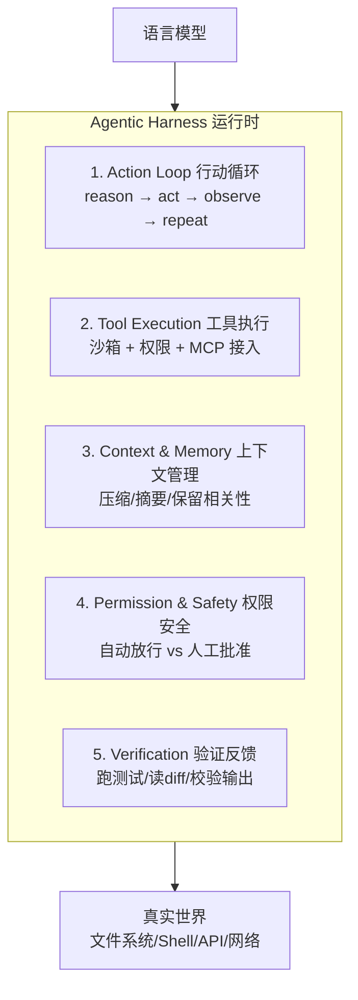
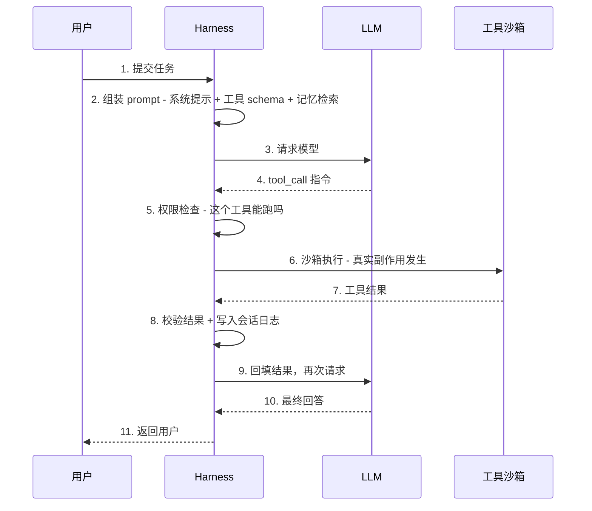
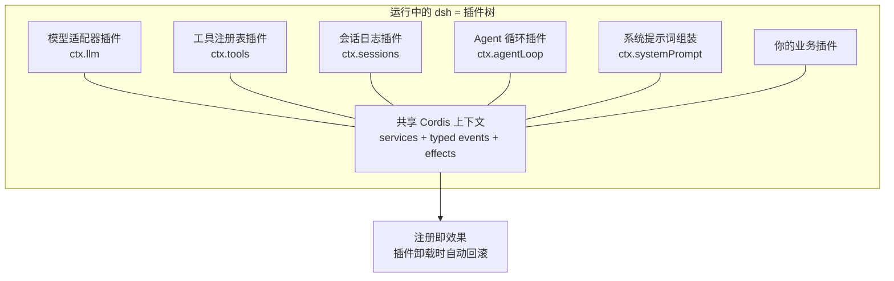
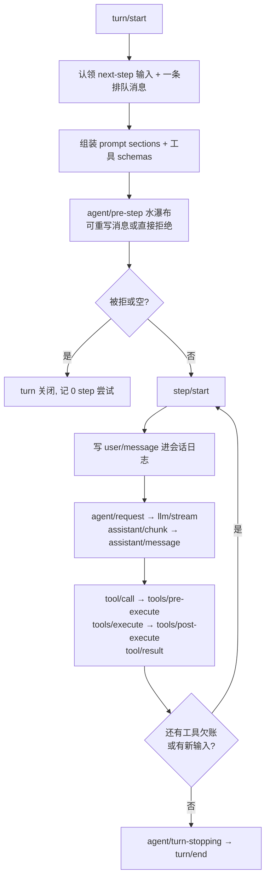
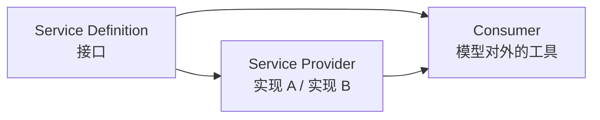

# Harness 是什么：从模型到生产的所有基础设施

> 一句话摘要：模型负责"智力"，Harness 负责"纪律"。它夹在 LLM 与现实世界之间——决定模型能调什么工具、怎么循环、怎么记事、什么操作要人批准、失败怎么恢复。2026 年 8 月，DeepSeek 开源了 DeepSeek Harness（dsh，154K★），用"万物皆插件"的架构把 harness 工程推到了新高度。本篇深度拆解：harness 是什么、五大部件、一次调用里它干了什么、以及 dsh 的插件架构到底怎么设计。

---

## 1. 背景：模型不是 Agent，差的是"纪律"

### 1.1 一个扎心的事实

> "If you've built anything with AI agents in 2026, you've probably hit the same realization everyone else does: the model was never the hard part."
> —— 2026 年 harness 工程文章开篇

Claude、GPT、Gemini 都能"思考"，能规划任务。但把它们变成能干活的东西，难的不是模型——是模型**周围**的一切：

```
模型怎么安全地调工具？
跨 50 步的任务怎么不丢上下文？
命令失败了怎么恢复？
危险操作（删库、发邮件、转账）怎么拦住？
```

这个"周围的一切"有个名字：**Agentic Harness（智能体运行时/框架）**。2026 年它是最重要的 AI 工程概念之一，也是最少被讲透的。

### 1.2 为什么模型本身不是 Agent

**LLM 是无状态的**。给它一个 prompt，它回一段文本，响应一结束它就全忘了。那是聊天机器人，不是 Agent。

要让它干多步的活，必须有一圈基础设施：

| 模型自己不会的 | 谁来干 |
|---|---|
| 执行工具调用（跑命令/改文件/调 API）并把结果喂回来 | Harness |
| 循环"思考→行动→观察"直到目标完成 | Harness |
| 长任务不爆 context window、不丢前面步骤 | Harness |
| 判断哪个动作能自动跑、哪个要人批准 | Harness |
| 一条命令失败不搞死整个任务 | Harness |

**没有一个属于模型，全部属于 harness。**

### 1.3 你可能已经在用 harness 而不自知

Claude Code、OpenAI Codex CLI、Cursor 的 agent mode——底层模型各不相同，但让它们"能用"的，是包在模型外面的那层 harness，不是模型本身。

> 两个 Agent 用**同一个模型**，harness 不同，行为可以天差地别。弱 harness + 强模型 = 不稳、不安全、丢上下文；好 harness + 一般模型 = 能干活。

这就是为什么 2026 年真正值钱的 AI 工程不是 prompt engineering，而是 **harness engineering**——设计循环、权限模型、记忆策略、验证步骤。它是两年前几乎不存在的技能。

---

## 2. 核心内容一：Harness 的定义与五大部件

### 2.1 一句话定义

> **Agentic Harness 是夹在语言模型和真实世界之间的运行时——它决定模型能调哪些工具、执行什么权限、如何管理跨步骤的上下文与记忆，并让模型持续循环朝向目标，而不是回答一次就停。**

模型提供智力，harness 提供纪律。**The model provides intelligence. The harness provides discipline.**

### 2.2 五大部件全景



### 2.3 逐部件拆解

**部件 1：行动循环（Action Loop）**

这是核心控制流，就是篇 4 讲的 ReAct 模式。Harness 的职责是**可靠地跑这个循环几千次**，不静默丢状态：

```python
# 核心循环，剥到本质
while not done:
    thought = model.reason(goal, history)   # 决定下一步
    action  = thought.tool_call             # 例: run_tests() / edit_file()
    result  = run_tool(action)              # 真正执行
    history.append((thought, result))       # 记住发生了什么
    done    = thought.is_final
```

**部件 2：工具执行与沙箱（Tool Execution & Sandboxing）**

工具是 Agent 触碰世界的途径。Harness 真正执行它们，**通常在沙箱或受限环境里**，让一次坏的工具调用造不成真实伤害。这里也是 **MCP（Model Context Protocol）的接入点**——MCP 标准化"工具怎么暴露给模型"，但"这个调用能不能跑"仍然由 harness 强制。

**部件 3：上下文与记忆管理（Context & Memory Management）**

长任务产生的 token 远超一个 context window。好 harness 会压缩旧步骤、摘要不再需要的细节、只保留相关的——让模型在第 100 步还记得第 3 步。

**部件 4：权限与安全层（Permission & Safety）**

Agent 能不能不询问就删目录？能不能推生产？能不能发邮件？**策略住在 harness 里**——可逆、低风险的动作自动放行；破坏性、难撤销的动作停下来问人。

**部件 5：验证与反馈（Verification & Feedback）**

最好的 harness 不让模型自说自话"完成了"——逼它验证：跑测试、读 diff、打真实端点。**会自检的 Agent 比只会说"done"的强太多。**

### 2.4 最小 harness：四个台阶

| 台阶 | 做什么 | 学到什么 |
|---|---|---|
| 1 | 搭循环：模型→执行一个工具→回填结果 | harness 的雏形 |
| 2 | 加护栏：破坏性动作必须显式批准 | 权限设计的 80% |
| 3 | 加上下文压缩：循环超过 ~10 步会撞 context 上限 | 真正的 harness 工程从这里开始 |
| 4 | 加验证：不让 agent 宣布胜利，逼它对照现实检查 | 验证闭环 |

---

## 3. 核心内容二：一次调用中，Harness 到底在干什么

篇 8 的 BrewTrace trace 里，Harness 是那个看不见的"编排者"。现在把它做的事显式拆开：



**注意第 5、6、8 步**——这三步用户完全看不到，但它们是 harness 存在的意义：
- 第 5 步：**权限闸门**（工具白名单、危险动作拦截）
- 第 6 步：**沙箱隔离**（副作用被限制，不炸全系统）
- 第 8 步：**会话日志**（"模型可见即已记录"，可回放、可审计）

篇 8 里那 55.2 秒的请求，除去 35 秒模型调用，剩下的都是 harness 在跑这三步。

---

## 4. 核心内容三：DeepSeek Harness（dsh）深度拆解 ★

### 4.1 一句话介绍（官方）

> DeepSeek Harness（`dsh`）是由 DeepSeek AI 开发的开源 agent harness。它采用**一切皆插件**的架构，由 Cordis 驱动。目前处于开发者预览阶段，正在快速迭代。

**硬数据（2026-08-18 gh CLI 实测）**：

| 指标 | 值 |
|---|---|
| GitHub stars | 154,360★（已超 LangChain 144K） |
| 授权 | MIT |
| 语言 | TypeScript / Node.js |
| 运行方式 | `npx @deepseek-ai/dsh web`（Web UI 默认 3080 端口） |
| 阶段 | developer preview（会有破坏兼容的变更） |
| 生态 | 插件清单仓库 7,972★、桌面端 12,491★、橙皮书 |

### 4.2 核心架构：万物皆插件

**这是 dsh 与其他 harness 最本质的区别。**



**没有特权核心**。模型适配器、工具注册表、会话日志、甚至 agent 循环本身——**全部是插件**，全部可以从配置替换。你想扩展 dsh，不是在核心上打补丁，而是把插件挂到别的插件旁边。

### 4.3 Cordis：五个想法看懂底层框架

Cordis 是 dsh 底层 vendored 的插件框架，五个核心概念：

| 概念 | 含义 |
|---|---|
| **插件 = 实现 Service 的对象** | 函数（带 inject/apply）或 Service 子类 |
| **上下文 = 服务的仓库** | 服务在 ctx 上声明稳定的 key（ctx.tools / ctx.llm），别的插件**按 key 找服务，不 import 具体实现** |
| **inject 声明依赖** | 插件声明需要的服务，等它们存在才加载——加载顺序由依赖表达，不是手工 boot 排序 |
| **类型化事件通信** | emit（观察）/ waterfall（包装）/ parallel（扇出）/ serial（顺序）四种派发模式 |
| **注册是可逆效果** | prompt section、工具 schema、适配器全部通过 ctx.effect() 安装，插件卸载时**确定性地回滚** |

**水瀑布语义（Waterfall）**：`ctx.waterfall` 是"around 中间件"。监听者拿到 `(...args, next)`，调 `next()` 把（可能被包装过的）结果传给下一个服务，不调则短路。策略型监听者可以直接短路拥有决策权，观察型监听者必须委托。

### 4.4 一次调用的官方流程：Turn 与 Step

dsh 官方定义了 **step = 一次模型请求 + 它调的工具**；**turn = 零或多个 steps**（从第一个输入被认领开始，到无欠账关闭）。



关键设计：
- `turn/*`、`step/*`、`user/message`、`assistant/*`、`tool/*` 是**持久会话事件**（追加式日志）
- `agent/pre-step`、`agent/request`、`llm/stream`、`tools/*` 是**水瀑布扩展点**——监听者必须调 next() 委托
- 输入从**一个 inbox** 到达；注入的上下文在 inbox 里等着，直到别的消息唤醒

### 4.5 会话日志：模型的记忆即审计

> **Model-visible means logged（模型可见即已记录）**——这是 dsh 的运行时不变式。

会话日志是模型看到上下文的**唯一来源**：
- `deriveMessages()` 从日志投影模型历史
- 原始 `assistant/chunk` 事件保留回放保真度
- Fork、恢复、转录、遥测、持久化全部从这个流派生

**凡是进模型请求的东西，必须能从日志重建。** 所以加一个新的模型可见输入，就要求一个新的会话事件类型——从机制上保证"模型看到的一切都可审计"。

### 4.6 Capability Seams：一次替换，改变整个产品

**Seam（接缝）= 可替换能力**，三个角色：

```
Service Definition（接口声明）→ Service Provider（实现）→ Consumer（使用者，通常是模型对外的工具）
```



Seams 是为什么**换一个 provider 就改变整个产品**：
- 文件系统与子进程 provider 共享同一执行世界——把它们指向远程沙箱，Bash/PTY/LSP 跟着一起搬，**不需要为每个 provider 分叉**
- Subagent provider 在同一接口后千差万别：从全新子 agent 到另一个产品里的委托 turn

### 4.7 扩展点地图：新行为放哪里（官方）

| 目标 | 机制 |
|---|---|
| 加模型提供商 | 在 `ctx.llm` 注册适配器 |
| 加模型可用能力 | 注册 `ctx.tools`，schema 自动进 prompt 组装 |
| 给单个会话不同能力集 | 组合 agent preset |
| 加 shell 执行 | 注册 `ctx.shell` 后端 |
| 加后台任务 | 注册 `ctx.jobs`，`job_*` 工具收集/停止 |
| 拦截请求/工具/turn | 用 `agent/*` 或 `tools/*` 事件 |
| 加模型可见上下文 | `agent.inject()`，落进下一次请求 |
| 加 UI/编辑器集成 | 驱动 `ctx.agents`，从 `session/event` 渲染 |
| 加持久会话状态 | 扩展 `SessionEventMap`，从日志渲染回放 |
| Fork 活跃会话 | `ctx.sessions.fork(source, boundary?, child?)` |
| 把注册限定到单个 agent | 用该 agent 的 `agent.ctx` |

**这张表的本质**：dsh 把 harness 的每个能力都变成了"注册行为"，而不是"改核心行为"。这是插件架构的终极形态。

---

## 5. 深度对比：dsh vs 传统 Harness 设计

### 5.1 设计哲学对比

| 维度 | 传统 harness（LangGraph/CrewAI 等） | DeepSeek Harness |
|---|---|---|
| 核心结构 | 有核心框架 + 扩展点 | **没有特权核心，全部是插件** |
| 扩展方式 | 继承/回调/注册 | **挂插件 + 效果自动回滚** |
| 事件系统 | 各有各的 | 统一类型化事件（emit/waterfall/parallel/serial） |
| 依赖管理 | 手动排序 | **inject 声明式依赖** |
| 会话模型 | 各有实现 | **追加式会话日志 = 唯一事实源** |
| 可审计性 | 视实现而定 | **"模型可见即已记录"运行时不变式** |
| 语言 | 多语言 | TypeScript/Node |

### 5.2 为什么"万物皆插件"是更强的抽象

传统 harness 的问题：**核心是神圣的**。你想改工具执行策略？改循环？改记忆？要么 fork，要么在补丁层挣扎。插件化 harness 的问题：**没有核心可打补丁**——你挂一个插件在旁边，注册是效果，卸载时自动回滚。这不是"更灵活"的营销话术，而是工程上更干净的组合模型：**任何一行配置都能被你的 patch 覆盖**。

### 5.3 代价与权衡（trade-off）

| 收益 | 代价 |
|---|---|
| 极致的可组合性 | **学习曲线陡**（要先懂 Cordis） |
| 能力全部可替换 | **稳定性风险**（还在 developer preview，会有破坏兼容变更） |
| 审计即记忆 | 事件模型抽象度高，调试要理解事件流 |
| 生态长在插件上 | 插件质量参差（好在有官方扩展点地图） |

**适合谁**：想深度定制 harness 的团队、愿意付学习成本换长期灵活性的项目。
**不适合谁**：要开箱即用、不想碰事件模型的中小项目——传统框架上手快得多。

---

## 6. Harness 工程：五个生产决策

### 6.1 决策一：循环上限是安全底线

篇 7 讲过 $47,000 事故——四个 agent 忘设 max_steps 跑了 11 天。**循环上限是 harness 的第一行安全代码**：全局步数上限 + 单工具调用上限 + 超时。

### 6.2 决策二：权限模型决定信任边界

> 可逆、低风险 → 自动放行；破坏性、难撤销 → 停下来问人。

好 harness 的权限不是"全给"或"全不给"，而是**按动作可逆性分级**。dsh 自带 approval policy 插件；Claude Code 的权限系统也是同一逻辑。

### 6.3 决策三：上下文策略是成本与质量的平衡

- 全塞 → 贵 + 中间迷失（篇 6）
- 压缩 → 省但丢细节
- 检索 → 准但要有好的索引

好 harness 会**组合**：旧步骤摘要 + 近期原文 + 相关记忆检索。

### 6.4 决策四：验证必须是对照现实，不是模型自评

篇 7 的 self-bias 研究：同一模型自评会橡皮图章。harness 的验证层要锚定**外部信号**——测试跑通、diff 检查、schema 校验、真实端点探测。

### 6.5 决策五：可观测性用 trace，不用日志堆

2026 标准：OpenTelemetry GenAI 语义约定 + trace 树。篇 8 的 55 秒 trace 证明——**失败 eval = 一条可查的 trace**，而不是一行日志。

---

## 7. 踩坑清单

| 坑 | 症状 | 对策 |
|---|---|---|
| 忘设循环上限 | 账单爆炸（$47K 案例） | max_steps + 单工具上限 |
| 权限一刀切 | 危险操作没人拦 | 按可逆性分级，破坏性动作必须批准 |
| 上下文全塞 | 贵 + 中间迷失 | 压缩/摘要/检索组合 |
| 验证靠模型自评 | 橡皮图章 | 锚定外部信号（测试/diff/schema） |
| 插件质量没把关 | 行为诡异 | 查插件来源，看扩展点是否按官方地图挂载 |
| 裸接 API 没有 harness | 无法循环/无法审计 | 先搭最小循环（四个台阶） |

---

## 8. 一句话总结 + 5W 速记卡 + 自测三问

### 8.1 一句话总结

> **Harness 是模型与真实世界之间的运行时：行动循环、工具沙箱、上下文管理、权限安全、验证反馈五大部件，负责把"会说话的模型"变成"能干活且可信的 Agent"。2026 年 DeepSeek Harness 用"万物皆插件 + 追加式会话日志 + 可逆效果"把 harness 工程推向新高度——没有特权核心，任何能力都能从配置替换。模型负责智力，harness 负责纪律。**

### 8.2 5W 速记卡

| W | 内容 |
|---|---|
| **What** | 夹在 LLM 与现实之间的运行时（五大部件） |
| **Why** | 模型无状态，循环/工具/权限/记忆/验证都需要人管 |
| **Who** | Claude Code / Codex CLI / Cursor / DeepSeek Harness |
| **When** | 2023 概念成型，2026 harness 工程成为独立技能 |
| **How** | 循环 + 沙箱 + 上下文 + 权限 + 验证，插件化或传统化 |

### 8.3 自测三问

1. harness 五大部件是哪五个？（循环/工具沙箱/上下文/权限/验证）
2. dsh 的"万物皆插件"和传统框架的"核心+扩展点"本质区别？（没有特权核心，注册即效果，卸载自动回滚）
3. "Model-visible means logged" 是什么意思？（模型可见的一切必须能从会话日志重建——审计即记忆）

---

## 下篇预告

Harness 管"工具怎么执行"，但工具本身怎么接入？dsh 的扩展点地图里提到 MCP——2026 年工具接入的 USB-C 标准。

下一篇：[MCP 协议与生态](10_MCP协议与生态.md)——为什么说 MCP 是"工具的 USB-C"，协议怎么工作，生态现状。

> 本系列阅读路径：篇 0 [系列导读](0_系列导读-全景.md) → 篇 1-3（地基+生态）→ 篇 4-7 四问拆法 → 篇 8 端到端 → 本篇 Harness → 篇 10 MCP → 篇 11-13 工程化

---

## 📌 数据与事实声明

本文的 DeepSeek Harness 信息来自官方仓库（github.com/deepseek-ai/deepseek-harness，154,360★，2026-08-18 实测）及官方架构文档（docs/architecture.md、docs/cordis-primer.md、docs/agent-lifecycle.md）；harness 概念框架来自 2026 年行业文章（techycamp.com，2026-07-02）。dsh 处于 developer preview，架构可能变更。截至 **2026-08-17**，具体实现以官方文档为准。

## 📚 参考资料

| 类型 | 标题 | 来源 |
|---|---|---|
| 开源项目 | DeepSeek Harness（dsh，一切皆插件） | github.com/deepseek-ai/deepseek-harness |
| 官方文档 | dsh Architecture（插件树/事件/扩展点地图） | github.com/deepseek-ai/deepseek-harness/blob/main/docs/architecture.md |
| 官方文档 | Cordis Primer（插件框架五概念） | github.com/deepseek-ai/deepseek-harness/blob/main/docs/cordis-primer.md |
| 官方文档 | Agent Turn & Step Lifecycle（时序图） | github.com/deepseek-ai/deepseek-harness/blob/main/docs/agent-lifecycle.md |
| 开源项目 | Cordis（dsh 底层插件框架） | github.com/cordiverse/cordis |
| 论文 | A Programming Paradigm for Spatiotemporal Composability | github.com/cordiverse/paper |
| 行业文章 | What Is an Agentic Harness? The 2026 Guide（2026-07-02） | techycamp.com/blog/what-is-an-agentic-harness-the-2026-guide |
| 行业文章 | Tracing a local LLM agent end to end（2026-07-11） | john-hodge.com/blog/strands-ollama-opentelemetry-local-agent-tracing |