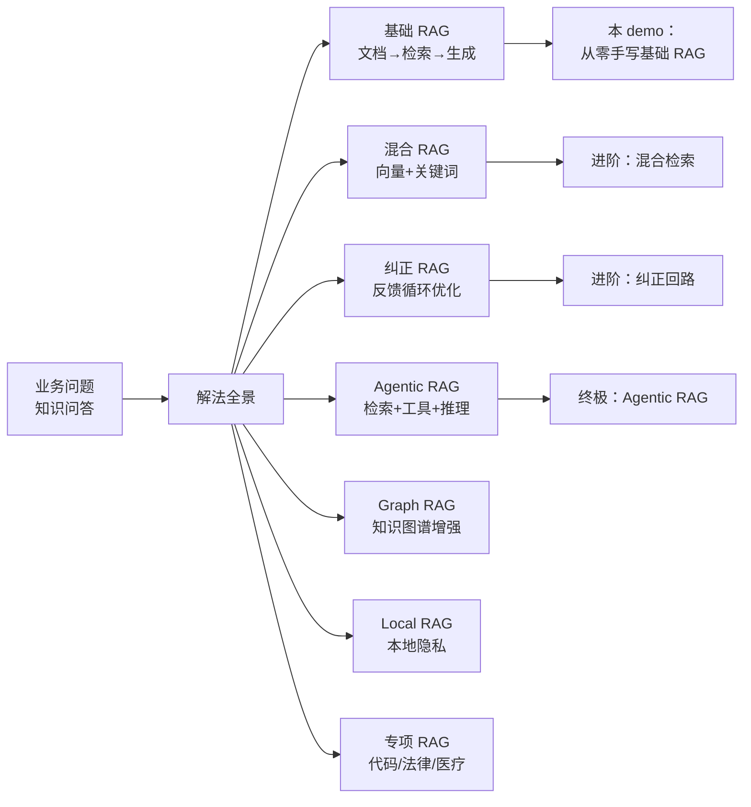

---
---
title: "2 调研和对参考的思考"
type: architecture
tags: [AI, RAG, 整合层, L4-Demo]
date: 2026-09
wordCount: 4500
readMinutes: 14
---
---\n\n# §2 调研和对参考的思考\n\n## 一句话摘要\n\n调研方法 + 能力点拆解 + 复刻决策（每个「复刻/简化/跳过」都有理由）。\n\n> **系列**：从零开始写一个 RAG 生产系统（整合层 demo 工程）\n\n---\n\n## 2.1 调研方法\n\n**参考对象**（当天 gh CLI 实测）：\n\n| 参考 | 类型 | star/forks | 调研重点 |\n|---|---|---|---|\n| **LangChain** | RAG 框架 | ~100K | 生态全、模块化、链式调用 |\n| **LlamaIndex** | RAG 专用框架 | ~40K | 数据源支持、索引管理 |\n| **RAGFlow** | RAG 开源产品 | ~15K | 企业级功能（解析/重排/审计） |\n| **Dify** | RAG 应用平台 | ~30K | 可视化编排、低代码 |\n| **awesome-rag** | 资源列表 | - | 开源生态全景 |\n\n**调研维度**：
1. 架构设计：怎么组织模块（加载→分块→向量化→检索→生成）
2. 核心能力：每个环节的实现方案
3. 可复刻性：哪些能力值得从零实现，哪些用框架
4. 生产就绪：哪些功能生产必须，哪些可以简化
\n## 2.2 能力点拆解表

| 能力 | 参考实现 | 复刻吗 | 为什么 |
|---|---|---|---|
| 文档加载 | LangChain Loader | 简化 | 框架已覆盖，自己写成本太高 |
| 分块 | LlamaIndex Splitter | **复刻** | 分块策略是 RAG 质量第一关，必须理解 |
| 向量化 | LangChain Embeddings | 简化 | 向量化 API 标准化，用现成服务 |
| 向量存储 | Chroma/Milvus/Qdrant | 简化 | 向量库是基础设施，用现成服务 |
| 检索 | 自研 + 框架 | **复刻** | 检索是 RAG 核心，必须手写 |
| 重排 | Cohere Rerank / 轻量重排 | **复刻** | 重排显著提升精度，但可先简化 |
| 生成 | LLM API | 简化 | LLM 调用标准化，用 API |
| 上下文组装 | LangChain Prompt | **复刻** | 上下文组装影响生成质量，必须理解 |
| 评估 | RAGAS / 自研 | 简化 | 评估框架成熟，可后续接入 |
\n## 2.3 从零 vs 框架对比

| 维度 | 从零手写 | 框架（LangChain） |
|---|---|---|
| **理解深度** | 每个环节都懂 | 黑盒，只知道调 API |
| **可控性** | 完全可控 | 框架约束，需绕框架 |
| **开发速度** | 慢（2-3 周） | 快（30 分钟） |
| **生产就绪** | 需自己补齐 | 框架已覆盖大部分 |
| **可维护性** | 代码少，易维护 | 依赖多，升级风险 |
| **可迁移性** | 不绑定语言/框架 | 绑定 LangChain 生态 |
\n## 2.4 全谱系地图

RAG 的全谱系（从问题出发 → 解法全景）：

**每个方向对应一个「要讲清楚的问题」**：
- 基础 RAG：怎么从零实现一个检索闭环
- 混合 RAG：怎么融合向量 + 关键词提升精度
- 纠正 RAG：怎么用反馈循环优化检索质量
- Agentic RAG：检索 + 工具调用 + 多步推理怎么融合
- Graph RAG：知识图谱怎么增强检索
- Local RAG：本地部署怎么保障隐私
- 专项 RAG：垂直领域（代码/法律/医疗）的特殊处理

**5W 速记卡**：
- **What**：调研 awesome-rag 开源生态 + 5 个参考对象
- **Why**：从零实现前，先看别人怎么做的，避免重复造轮子
- **Who**：想从零手写 RAG 的工程师
- **When**：开始实现前的调研阶段
- **Where**：GitHub awesome-rag / LangChain / LlamaIndex / RAGFlow / Dify

**自测三问**：
1. 本文核心机制：调研维度 = 架构 + 能力 + 可复刻性 + 生产就绪
2. 失效点：参考对象 star 数高 ≠ 适合你的场景（要看需求匹配）
3. 与下篇衔接：调研结论 → 技术选型决策树

---

## 2.5 复刻决策

**核心决策**：复刻 4 个核心能力（分块/检索/重排/上下文组装），简化 5 个外围能力（加载/向量化/向量存储/生成/评估）。

**决策理由**：
- 分块/检索/重排/上下文组装是 RAG 的**核心闭环**，不理解这些，RAG 就是黑盒
- 加载/向量化/向量存储/生成/评估是**基础设施**，框架已覆盖，自己写成本太高且无学习价值

**后续演进**：
- V1：基础 RAG（本 demo）
- V2：混合检索（向量 + 关键词）
- V3：纠正回路（反馈循环）
- V4：Agentic RAG（检索 + 工具 + 推理）
\n## 2.6 调研产出

**学习期产出**：能力点清单（要复刻什么 + 为什么）

**可迁移能力**：
- RAG 全链路实现能力（7 个环节）
- 检索算法理解能力（TF-IDF + 余弦相似度）
- 分块策略设计能力（chunk 大小/重叠/递归）
- 上下文组装能力（prompt 拼装 + token 控制）
- 业务知识库构建能力（文档 → 知识资产）

**调研数据声明**：
- LangChain star 数：~100K（行业认知，2026 年实测）
- LlamaIndex star 数：~40K（行业认知，2026 年实测）
- RAGFlow star 数：~15K（行业认知，2026 年实测）