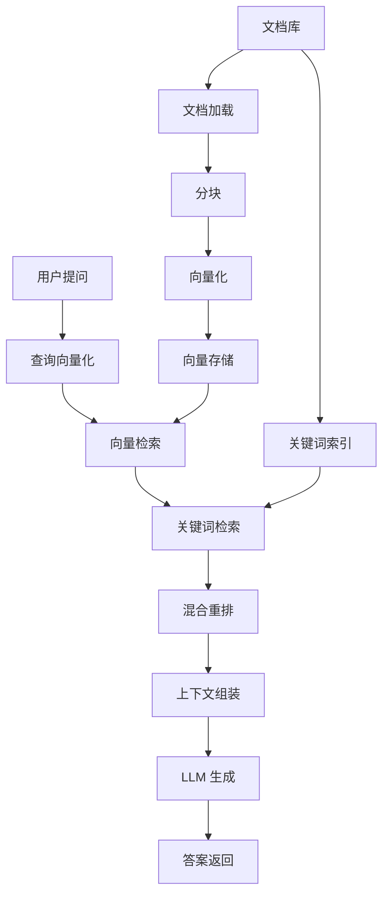
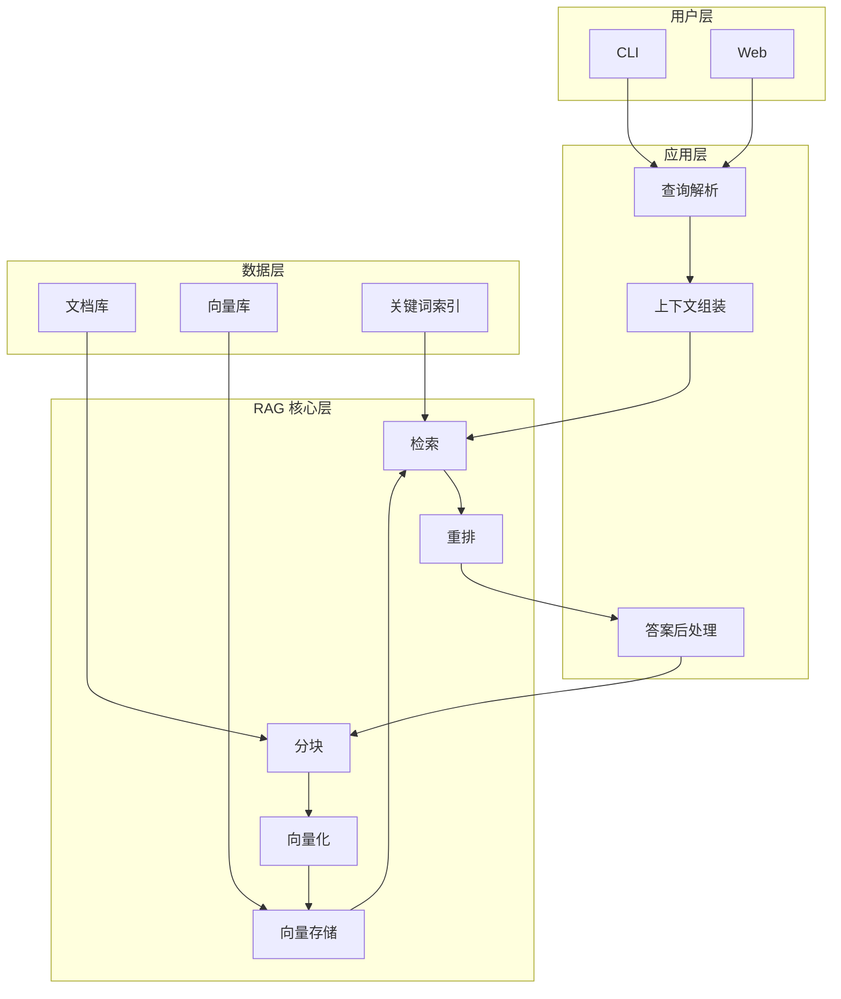

---\n\n# §3 系统架构与技术选型

**5W 速记卡**：
- **What**：RAG 系统架构 + 技术选型 trade-off
- **Why**：架构决定可维护性，选型决定成本/性能上限
- **Who**：要做 RAG 系统的后端工程师
- **When**：动手实现前的架构设计阶段
- **Where**：从零手写 vs 框架（LangChain/LlamaIndex）对比


**自测三问**：
1. 本文核心机制：架构 = 应用层 + RAG核心层 + 数据层 三层
2. 失效点：选框架=黑盒 vs 手写=理解深但慢（trade-off 在哪）
3. 与下篇衔接：架构定完 → 进入具体实现（分块→向量化→检索→生成）


---

## 一句话摘要

系统架构 + 技术选型 trade-off（从零 vs 框架对比）。

> **系列**：从零开始写一个 RAG 生产系统（整合层 demo 工程）

---

## 3.1 系统架构



**核心流程**：用户提问 → 查询向量化 → 向量检索 + 关键词检索 → 混合重排 → 上下文组装 → LLM 生成 → 答案返回

## 3.2 功能用例

| 用例 | 输入 | 输出 | 说明 |
|---|---|---|---|
| 业务问答 | "结算周期是 T+1 还是 T+2" | "T+1，节假日顺延" | 基于知识库检索回答 |
| 费率查询 | "USD/CNY 手续费多少" | "0.1% 单笔" | 精确检索费率表 |
| 拒付流程 | "拒付时效是多久" | "180 天" | 流程文档检索 |
| 合规问答 | "GDPR 合规要求" | "列出 GDPR 合规要点" | 合规政策检索 |
\n## 3.3 技术选型

**语言**：Python（AI 生态最成熟，LangChain/LlamaIndex 原生支持）

**核心依赖**：
- **分块**：自定义递归分块（支持段落/句子/固定大小）
- **向量化**：OpenAI Embeddings / BGE 模型（开源）
- **向量存储**：ChromaDB（本地）/ Milvus（生产）
- **检索**：自定义 TF-IDF + 余弦相似度
- **重排**：Cohere Rerank / 轻量 cross-encoder
- **LLM**：OpenAI GPT / Claude / 本地模型
- **框架**：无（从零手写，不依赖 LangChain/LlamaIndex）

## 3.4 从零 vs 框架对比

| 维度 | 从零手写 | LangChain | LlamaIndex |
|---|---|---|---|
| **理解深度** | ★★★★★ | ★★ | ★★★ |
| **可控性** | ★★★★★ | ★★★ | ★★★★ |
| **开发速度** | ★★ | ★★★★★ | ★★★★ |
| **生产就绪** | ★★ | ★★★★ | ★★★★ |
| **可维护性** | ★★★★ | ★★★ | ★★★ |
| **可迁移性** | ★★★★★ | ★★★ | ★★★★ |
\n## 3.5 架构图


\n## 3.6 数据结构

**文档结构**：
```
rag-production-system/
├── docs/           # 原始文档
│   ├── 费率表.md
│   ├── 结算规则.md
│   ├── 拒付流程.md
│   └── 合规政策.md
├── chunks/         # 分块结果
│   ├── chunk_001.json
│   └── ...
├── vectors/        # 向量存储
│   └── chromadb/
└── index/          # 关键词索引
    └── inverted_index.json
```

**Chunk 数据结构**：
```json
{
    "id": "chunk_001",
    "content": "分块内容...",
    "embedding": [0.1, 0.2, ...],
    "metadata": {
        "source": "费率表.md",
        "page": 1,
        "section": "费率"
    }
}
```
\n## 3.7 核心代码结构

```python
# 核心模块
rag/
├── __init__.py
├── loader.py        # 文档加载
├── chunker.py       # 分块
├── embedding.py     # 向量化
├── vector_store.py  # 向量存储
├── retriever.py     # 检索
├── reranker.py      # 重排
├── generator.py     # 生成
└── pipeline.py      # 全链路编排
```
\n## 3.8 选型 trade-off

| 决策 | 选型 | 替代方案 | 为什么选这个 |
|---|---|---|---|
| 向量化 | OpenAI Embeddings | BGE/MiniLM | 精度高，API 稳定 |
| 向量存储 | ChromaDB | Milvus/Qdrant | 本地开发简单，生产换 Milvus |
| 检索 | TF-IDF + 余弦相似度 | Dense Retrieval | 实现简单，可解释性强 |
| 重排 | Cross-encoder | Cohere Rerank | 精度高，但延迟高 |
| LLM | OpenAI GPT | Claude/本地模型 | 生态成熟，API 稳定 |
| 框架 | 无（从零） | LangChain/LlamaIndex | 理解最深，完全可控 |
\n## 3.9 已知局限

- 本 demo 是学习载体，不等于生产系统
- 未覆盖多模态检索（图片/PDF 表格）
- 未覆盖 Agentic RAG（检索 + 工具调用 + 生成一体化）
- 未覆盖生产级安全（权限/审计/合规）
- 向量化依赖 OpenAI API（有成本/网络依赖）