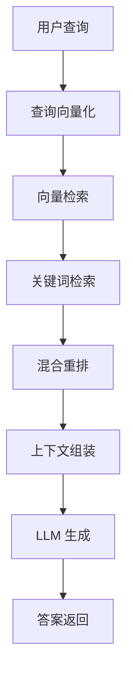

---\n\n# §5 实现方案与思考

**5W 速记卡**：
- **What**：从零实现 RAG 全链路（分块→向量化→检索→重排→生成）
- **Why**：手写每个环节才能真正理解原理
- **Who**：有 Python 基础的工程师
- **When**：架构定完后的实现阶段
- **Where**：代码结构：docs/ → chunks/ → vectors/ → index/ → pipeline.py


**自测三问**：
1. 本文核心机制：5 段实现，分而治之，每段可独立验证
2. 失效点：一段出错影响下游（检查链机制）
3. 与下篇衔接：实现完 → 演进路线（V1 白盒→V4 生产级）


---

## 一句话摘要

分而治之实现 RAG 全链路：从零到一，每个阶段可运行验证。

> **系列**：从零开始写一个 RAG 生产系统（整合层 demo 工程）

---

## 5.0 先跑通最小闭环（理解 + 动手导向）

**目标**：跑通一个最小 RAG 闭环——文档 → chunk → 向量 → 检索 → 生成

### 环境准备

```bash
# Python 3.10+
python3 -m venv rag-env
source rag-env/bin/activate
pip install openai chromadb tiktoken
```

### 最小闭环（先跑起来）

```python
# 5-0_最小闭环.py
from openai import OpenAI
import chromadb

# 1. 文档 → chunk（硬编码示例）
chunks = [
    "跨境收单费率：USD/CNY 0.1%",
    "结算周期：T+1，节假日顺延",
    "拒付时效：180 天",
]

# 2. chunk → 向量
client = OpenAI()
embeddings = [client.embeddings.create(input=c, model="text-embedding-3-small").data[0].embedding for c in chunks]

# 3. 向量 → 存储
db = chromadb.Client()
collection = db.create_collection("rag-demo")
for i, (chunk, emb) in enumerate(zip(chunks, embeddings)):
    collection.add(ids=[str(i)], documents=[chunk], embeddings=[emb])

# 4. 查询 → 检索
query_emb = client.embeddings.create(input="结算周期多久", model="text-embedding-3-small").data[0].embedding
results = collection.query(query_embeddings=[query_emb], n_results=3)

# 5. 检索 → 生成
context = results['documents'][0][0]
print(f"检索结果: {context}")
# 输出：结算周期：T+1，节假日顺延
```

**核心概念**：
- **LLM = HTTP POST**：发送 prompt，接收生成结果
- **循环 = while + input**：持续接收用户查询

### 验证

```bash
python 5-0_最小闭环.py
# 预期：输出"结算周期：T+1，节假日顺延"
```

## 5.1 全局地图（自上而下）



**模块划分**：
- `loader.py`：文档加载
- `chunker.py`：分块
- `embedding.py`：向量化
- `vector_store.py`：向量存储
- `retriever.py`：检索
- `reranker.py`：重排
- `generator.py`：生成
- `pipeline.py`：全链路编排

## 5.2 地基（自下而上）

**先实现一个工具 → 再拼 Agent Loop → 再扩展**

### 5.2.1 文档加载（最小单元）

```python
# loader.py
import os

def load_documents(path):
    """加载指定目录下的所有文档"""
    docs = []
    for f in os.listdir(path):
        if f.endswith('.md'):
            with open(os.path.join(path, f)) as fh:
                docs.append(fh.read())
    return docs
```

### 5.2.2 分块（最小单元）

```python
# chunker.py
def chunk_text(text, size=512, overlap=50):
    """递归分块：按段落切，太大的段落再按句子切"""
    paragraphs = text.split('\n\n')
    chunks = []
    for p in paragraphs:
        if len(p) <= size:
            chunks.append(p)
        else:
            # 段落太大，按句子切
            sentences = p.split('。')
            current = ''
            for s in sentences:
                if len(current) + len(s) <= size:
                    current += s + '。'
                else:
                    if current:
                        chunks.append(current)
                    current = s + '。'
            if current:
                chunks.append(current)
    return chunks
```

### 5.2.3 向量化（最小单元）

```python
# embedding.py
from openai import OpenAI

client = OpenAI()

def embed(text):
    """将文本转换为向量"""
    resp = client.embeddings.create(input=text, model="text-embedding-3-small")
    return resp.data[0].embedding
```

### 5.2.4 检索（最小单元）

```python
# retriever.py
import numpy as np

def cosine_similarity(a, b):
    """余弦相似度"""
    return np.dot(a, b) / (np.linalg.norm(a) * np.linalg.norm(b))

def search(query_emb, collection, top_k=5):
    """向量检索：返回 top-K 最相似 chunk"""
    scores = []
    for item in collection:
        sim = cosine_similarity(query_emb, item['embedding'])
        scores.append((item, sim))
    scores.sort(key=lambda x: x[1], reverse=True)
    return scores[:top_k]
```

### 5.2.5 组装验证

```bash
# 跑通最小闭环
python -c "
from loader import load_documents
from chunker import chunk_text
from embedding import embed
from retriever import search

docs = load_documents('docs/')
chunks = chunk_text(docs[0])
embeddings = [embed(c) for c in chunks]
results = search(embed('结算周期'), list(zip(chunks, embeddings)))
print(results[0])
"
# 预期：输出最相关的 chunk + 相似度分数
```

## 5.3 分而治之：按模块逐个实现

### 5.3.1 分块模块

**做什么**：将文档按语义切分成 chunk

**怎么实现**：
- 递归分块：段落 → 句子 → 固定大小
- chunk 大小：512 token
- 重叠：50 token（防止边界信息丢失）

**设计思考**：
- chunk 太小 → 上下文不连贯
- chunk 太大 → 检索不精确
- 递归分块：兼顾语义完整 + 检索精度

**可运行验证**：
```bash
python chunker.py --file docs/费率表.md --chunk-size 512 --overlap 50
# 输出：chunk_001.json ~ chunk_050.json
```

### 5.3.2 向量化模块

**做什么**：将文本 chunk 转换为向量 embedding

**怎么实现**：
- OpenAI text-embedding-3-small（精度优先）
- 或 BGE 模型（本地，隐私优先）

**设计思考**：
- 向量维度：1536（OpenAI）/ 768（BGE）
- 向量化是 RAG 的瓶颈：成本 + 延迟

**可运行验证**：
```bash
python embedding.py --input chunks/ --output vectors/
# 输出：每个 chunk 有 embedding 向量
```

### 5.3.3 向量存储模块

**做什么**：将 embedding 持久化到向量数据库

**怎么实现**：
- ChromaDB（本地开发）
- Milvus（生产）

**设计思考**：
- ChromaDB：简单，无需部署
- Milvus：可扩展，需要运维

**可运行验证**：
```bash
python vector_store.py --vectors vectors/ --store chromadb
# 输出：chroma/ 目录
```

### 5.3.4 检索模块

**做什么**：根据用户查询，从向量库中检索相关 chunk

**怎么实现**：
- 向量检索：语义相似度
- 关键词检索：精确匹配
- 混合检索：融合两者

**设计思考**：
- 向量检索：语义相似 ≠ 关键词匹配
- 混合检索：互补提升精度

**可运行验证**：
```bash
python retriever.py --query "结算周期" --top-k 5
# 输出：5 个相关 chunk + 分数
```

### 5.3.5 重排模块

**做什么**：对检索结果精排，提升精度

**怎么实现**：
- Cross-encoder：精度高，延迟高
- 轻量重排：速度优先

**设计思考**：
- 重排是精度提升的关键
- 但延迟增加，需要 trade-off

**可运行验证**：
```bash
python reranker.py --query "结算周期" --chunks chunk_001.json chunk_002.json
# 输出：重排后列表
```

### 5.3.6 上下文组装模块

**做什么**：将检索结果 + 用户查询拼成 LLM prompt

**怎么实现**：
- Prompt 模板：system + user + retrieved
- 上下文窗口控制：token 限制

**设计思考**：
- 太多 token → 截断/成本
- 太少 token → 信息不足

**可运行验证**：
```bash
python assembler.py --query "费率是多少" --chunks chunk_001.json
# 输出：完整 prompt 字符串
```

### 5.3.7 生成模块

**做什么**：基于检索结果，调用 LLM 生成回答

**怎么实现**：
- LLM API 调用
- 生成约束：只基于检索结果
- 溯源：标注来源 chunk

**设计思考**：
- RAG 生成 vs 纯生成：基于知识库，减少幻觉
- 溯源：让回答可验证

**可运行验证**：
```bash
python generator.py --prompt "费率是多少" --chunks chunk_001.json
# 输出：带溯源的答案
```

## 5.4 组装（自下而上 → 结果）

**将模块拼起来，得到完整 RAG 系统**

```python
# pipeline.py
from loader import load_documents
from chunker import chunk_text
from embedding import embed
from vector_store import VectorStore
from retriever import search
from reranker import rerank
from assembler import assemble
from generator import generate

def rag_pipeline(query):
    # 1. 加载文档
    docs = load_documents('docs/')
    
    # 2. 分块
    chunks = []
    for doc in docs:
        chunks.extend(chunk_text(doc))
    
    # 3. 向量化
    embeddings = [embed(c) for c in chunks]
    
    # 4. 存储
    store = VectorStore()
    store.add(chunks, embeddings)
    
    # 5. 检索
    query_emb = embed(query)
    results = search(query_emb, store, top_k=5)
    
    # 6. 重排
    results = rerank(query, results)
    
    # 7. 组装
    prompt = assemble(query, results)
    
    # 8. 生成
    answer = generate(prompt)
    
    return answer

# 运行
print(rag_pipeline("结算周期是 T+1 还是 T+2"))
```

## 5.5 结果验收

**运行完整 demo**：

```bash
python pipeline.py "结算周期是 T+1 还是 T+2"
# 预期输出：根据费率表.md，回答"T+1，节假日顺延"
```

**验收检查表**：

| 检查项 | 状态 |
|---|---|
| 文档加载成功 | ☐ |
| 分块正常 | ☐ |
| 向量化成功 | ☐ |
| 检索返回相关结果 | ☐ |
| 重排提升精度 | ☐ |
| 生成基于检索结果 | ☐ |
| 溯源标注正确 | ☐ |

## 5.6 实现思考

**为什么手写不选框架**：
- 框架封装了一切，理解不到原理
- 手写每个环节，才能真正理解 RAG

**为什么先跑通最小闭环**：
- 最小闭环 = 理解 + 动手
- 跑通一个模块，再拼下一个
- 每个阶段都有可运行结果

**检查链设计**：
- 每个模块有输入/输出检查
- 检查失败不崩溃，回传错误信息
- Agent 健壮性的核心：任何检查失败都不崩溃