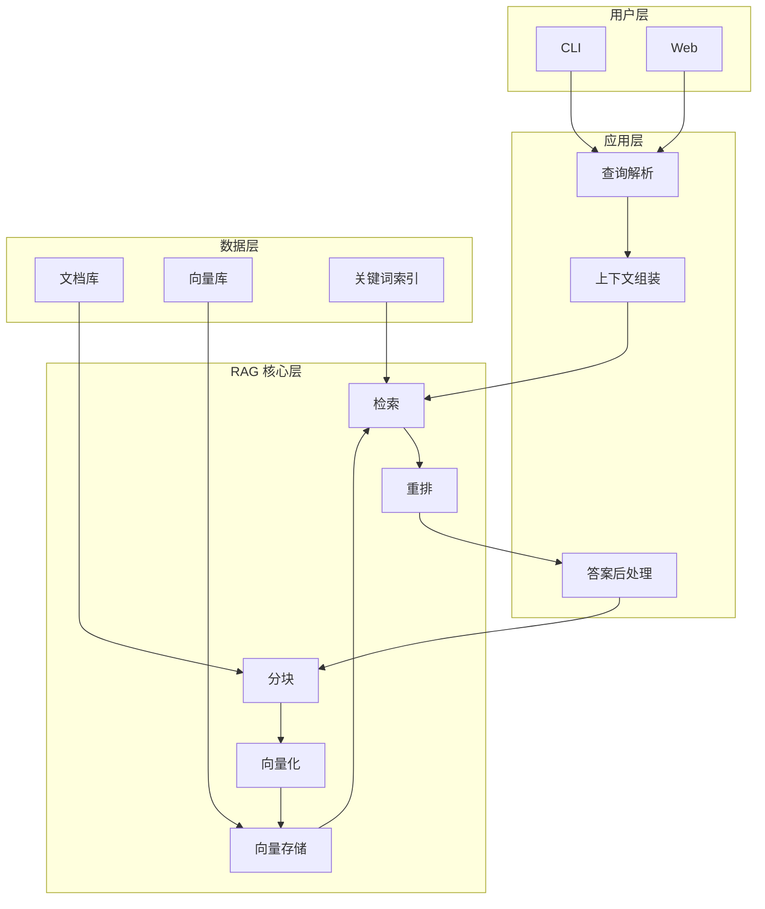

---
---
title: "7 项目架构和亮点"
type: reference
tags: [AI, RAG, 整合层, L4-Demo]
date: 2026-09
wordCount: 2800
readMinutes: 9
---
---\n\n# §7 项目架构和亮点

**5W 速记卡**：
- **What**：最终架构图 + 5 个架构亮点 + 5 个技术亮点
- **Why**：架构图是系统的「身份证」，亮点是设计决策的总结
- **Who**：想快速理解整个 RAG 系统的人
- **When**：读完所有篇后回看全局
- **Where**：用户层 → 应用层 → RAG 核心层 → 数据层

**自测三问**：
1. 本文核心机制：架构 = 用户层/应用层/RAG核心层/数据层 四层
2. 失效点：架构图再漂亮，不看实现 = 纸上谈兵
3. 与下篇衔接：架构亮点 → 项目文档（README/已知问题/roadmap）

---

## 一句话摘要

最终架构图 + 4-5 亮点。

> **系列**：从零开始写一个 RAG 生产系统（整合层 demo 工程）

---

## 7.1 最终架构图

## 7.2 架构亮点

1. **全链路手写**：每个环节都自己实现，理解最深
2. **模块化设计**：每个模块独立可替换，可维护性高
3. **检查链**：每个模块有输入/输出检查，健壮性强
4. **可验证**：每个阶段有可运行结果，验证标准明确
5. **生产演进**：V1 白盒 → V4 生产级，路线清晰

## 7.3 技术亮点

1. **混合检索**：向量 + 关键词，精度 + 召回兼顾
2. **重排机制**：粗排 + 精排，精度提升显著
3. **溯源标注**：回答带来源 chunk，可验证
4. **上下文控制**：token 限制 + 智能截断
5. **错误处理**：检查链 + 回退机制
\n## 7.4 架构设计思考

**为什么手写不选框架**：
- 框架封装了一切，理解不到原理
- 手写每个环节，才能真正理解 RAG

**为什么混合检索**：
- 向量检索：语义相似，但有漏检
- 关键词检索：精确匹配，但无语义
- 混合：互补提升精度

**为什么检查链**：
- 每个模块有输入/输出检查
- 检查失败不崩溃，回传错误信息
- Agent 健壮性的核心