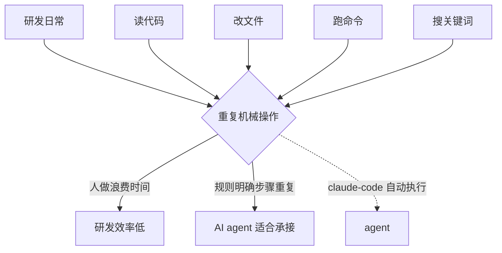
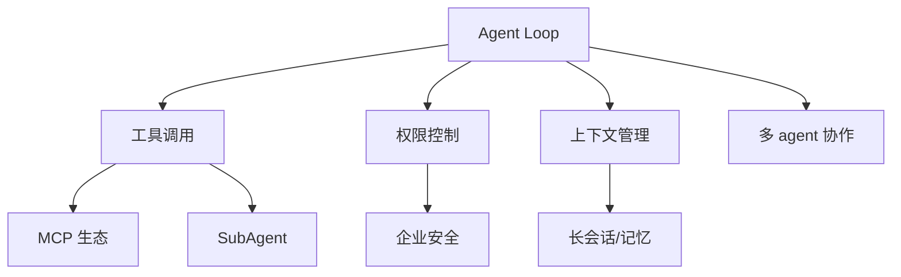

# §1 为什么写：从零复刻 claude-code 的价值论证

> **系列**：从零开始写一个 claude-code-cli（整合层 demo 工程）

---

## 1.1 思考：为什么值得做这个 demo

后端工程师的一天，大量时间耗在**重复的机械操作**上：读代码找 bug、改文件、跑命令、搜关键词、在多个文件间跳转——这些操作有个共同特征：**规则明确、步骤重复、人做浪费**。

AI 编程助手（claude-code 为代表）的出现，正是为了解决这个问题：**让 agent 代替人执行这些重复操作**。claude-code 作为其中的标杆产品，GitHub star 数达到 **142,809**（2026-08-24 gh CLI 当天实测），是开发者工具领域最成功的开源产品之一。

但**大多数人只是"用"它，不理解"它怎么工作"**。本 demo 的价值在于：**把 claude-code 的核心能力从零实现一遍**——不是用第三方框架（LangChain / LangGraph），而是**手写 Agent Loop、手写工具调用、手写权限控制**。



**为什么值得做**：理解一个系统的最高效方式，是从零把它实现一遍。读 100 篇介绍文章，不如自己写一个 Agent Loop。

## 1.2 价值：学了有什么用 / 能用到哪

从零复刻 claude-code 能获得的**可迁移能力**：

1. **Agent Loop 实现能力**：ReAct 循环（Reason → Act）是几乎所有 agent 的核心，学会手写后，任何 agent 项目都能快速上手
2. **工具调用设计能力**：怎么定义工具 Schema、怎么让 LLM 选择工具、怎么校验参数——这是 agent 工程化的基础
3. **权限控制设计能力**：5 层权限防御（工具白名单 / 目录边界 / 命令黑名单 / 危险操作拦截 / 人工确认）——生产级 agent 的必备
4. **上下文管理能力**：怎么压缩长对话、怎么跨会话记忆——解决 token 成本 + 体验问题
5. **CLI 工程能力**：交互式终端程序怎么设计（参数解析 / 流式输出 / 中断处理）

这套能力**不绑定语言**——理解了原理，Python 能写、Java 能写、任何语言都能写（本系列代码用子目录隔离多实现，后续补 Java 版）。

## 1.3 ROI：值得花时间学吗

**投入**：约 2-3 周业余时间（含调研 + 实现 + 文档）。

**产出**：
- 一个**能运行的 CLI agent**（麻雀虽小五脏俱全）
- 对 Agent 工程化的**完整认知**（不是碎片知识）
- 一套**可复用的实现模式**（后续任何 agent 项目直接套）
- 一篇**完整的 wiki**（沉淀给未来的自己和读者）

**对比**：用框架（LangChain/LangGraph）几小时能跑通一个 agent demo，但原理是黑盒——Agent Loop 为什么这么转、工具调用怎么路由、权限怎么拦截，全靠框架封装。从零实现要花 2-3 周，但每个环节的「为什么」都变成自己的认知。

**ROI 判断**：作为后端工程师，agent 工程化是 2026 年最值得投入的技术方向之一。**2-3 周换一个核心能力认知，ROI 为正。** 而且这套理解是「一次投资、永久复用」——面试能讲原理，工作能选型，遇到问题能排查。

## 1.4 技术风向标：这个技术现在处于什么趋势

**AI 编程助手赛道 2026 年现状**（2026-08-24 gh CLI 当天实测）：

| 产品 | 类型 | GitHub star |
|---|---|---|
| **LangChain** | agent 开发框架 | 144.9K |
| **claude-code** | 终端 agentic coding | 142.8K |
| **Codex CLI** | OpenAI 终端 agent | 116.3K |
| **Cursor** | IDE 内 agent | 商业化成功 |
| **GitHub Copilot** | IDE 补全 + agent | 最广泛用户基础 |

**趋势判断**：**从"补全工具"走向"自主 agent"**——2025 年 Copilot 还是补全为主，2026 年所有厂商都转向"让 agent 自己执行任务"。**Agent Loop + 工具调用是核心技术**，学这个方向不会过时。

**全谱系视野**（agent 工程化的生态地图）：



## 1.5 为什么学 / 为什么写

**为什么学**：
- 后端工程师转型 AI 工程化的**最短路径**——agent 是 LLM 落地的核心形态
- 面试加分：能讲清楚"agent 怎么工作"比"用过 LangChain"更有说服力
- 工作实用：日常写代码可以用自己实现的 agent 自动化重复任务

**为什么写**：
- **费曼学习法**：能写出来 = 真理解了。写 wiki 的过程就是深挖原理的过程
- **沉淀资产**：这篇 wiki + 代码是长期资产，未来复用
- **帮助他人**：市面上讲 agent 原理的文章很多，但"从零手写一个"的完整教程很少

## 1.6 能用来干什么：实际应用场景

**这个 demo（麻雀虽小五脏俱全）能做什么**：
- 用自然语言让 agent 读取 / 修改 / 搜索本地代码库
- 让 agent 执行 bash 命令（受限白名单）
- 作为学习工具：展示一个最小可用的 agent 是什么结构

**扩展后能做什么**（参考生产版）：
- 自动化代码 review（让 agent 读 diff 给意见）
- 自动化测试生成
- 自动化 git 工作流（commit / PR）
- 接入 MCP 生态扩展任意工具

## 1.7 行业影响 + 商业价值

**行业影响**：claude-code 142.8k star 证明——**"终端里的 agent"是开发者工具的新范式**。它改变了开发者的工作方式：从"手动敲命令"到"告诉 agent 做什么"。这个范式正在被所有大厂跟进（OpenAI Codex / Google Jules / Cursor）。

**商业价值**：
- claude-code 本身是 Anthropic 商业化产品（订阅制）
- 整个 agent 编程赛道 2026 年估值数百亿美元
- **工具调用的稳定性 / 权限安全 / 上下文管理**是商业化的核心技术壁垒

## 1.8 目标人群 + 发展趋势

**目标人群**：
- 想理解 agent 工程化原理的**后端工程师**（本 demo 的核心读者）
- 想从"用 agent"进阶到"写 agent"的开发者
- 面试准备者（agent 原理是高频考点）

**发展趋势**：
- 2026-2027：agent 从"单任务"走向"多 agent 协作"（SubAgent / Agent Teams）
- 上下文管理成为核心（100k+ token 会话的压缩 / 记忆）
- MCP 协议成为工具调用的事实标准
- **权限安全**成为企业采用的硬门槛

## 1.9 技术成熟度（Gartner Hype Cycle 视角）

**AI 编程助手处于"爬坡期（Slope of Enlightenment）"**：
- 已经过了 2024-2025 的炒作期（无数 agent 框架涌现）
- 2026 年进入收敛期：LangChain / AutoGen 等框架逐渐让位给"产品级 agent 工具"（claude-code / Codex CLI）
- **核心技术（Agent Loop / 工具调用 / 权限）已经成熟**——学的是稳定内核，不是易变的外壳

## 1.10 职业影响

**对后端工程师（我）的职业帮助**：
- **面试**：能讲"agent 怎么工作"（工具调用 → Agent Loop → 权限 → 上下文）——这是 2026 年后端面试的高频深挖方向
- **工作**：日常开发可以自己写小 agent 自动化（代码生成 / review / 文档）
- **转型**：AI 工程化是后端工程师的自然延伸方向——后端能力（并发 / 存储 / 安全）+ agent 能力 = 完整 AI 应用工程师

## 1.11 衔接：与姊妹系列的关系

本系列是 agent 能力面的第一块，后续有姊妹系列补齐第二块：

```
claude-code-cli 系列 = agent 骨架（本系列）
├── Agent Loop（ReAct）
├── 工具调用（6 工具）
├── 权限控制（5 层）
└── 会话管理

payment-rag-agent 系列 = agent + 知识检索（姊妹系列）
├── 复用 agent 骨架的思路
├── 新增 RAG 能力：知识库 → 检索 → 组装 → 生成
└── 业务场景：跨境收单支付问答
```

**两个系列合起来 = 完整的 agent 能力面**：一个会动手（工具调用），一个会查资料（RAG 检索）。都是「理解运作 + 提高动手能力」的 demo 定位。

## 1.12 一句话总结

**claude-code 代表了 2026 年最重要的开发者工具范式，从零实现它 = 完整理解它——用 2-3 周换一个核心能力认知，值得。**

---

## 📌 数据与事实声明

本文涉及的 GitHub star 数（claude-code 142.8K / Codex 116.3K / LangChain 144.9K）为 2026-08-24 gh CLI 实测数据，会随时间变化。行业影响与趋势判断（agent 编程赛道、MCP 协议地位、权限安全门槛）是基于公开资料的行业通用认知，非特定公司内部数据。实际业务中请以最新官方资料为准。

## 📚 参考资料

| 类型 | 标题 | 来源 |
|---|---|---|
| 开源项目 | claude-code（终端 agentic coding） | github.com/anthropics/claude-code |
| 开源项目 | Codex CLI（OpenAI 终端 agent） | github.com/openai/codex |
| 开源项目 | LangChain（agent 开发框架） | github.com/langchain-ai/langchain |
| 官方文档 | Anthropic Claude Code 文档 | docs.anthropic.com/en/docs/claude-code |
| 官方博客 | Agentic coding 范式（Anthropic） | anthropic.com/news |
