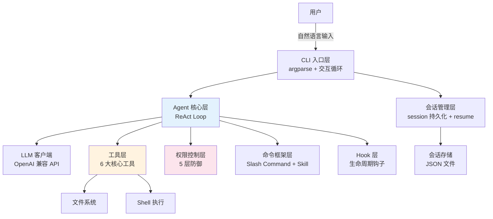
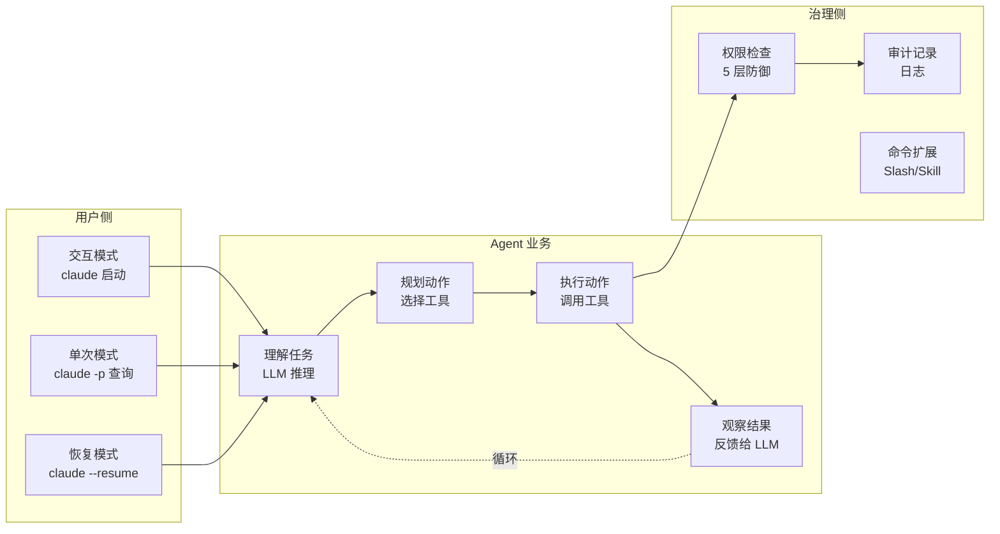
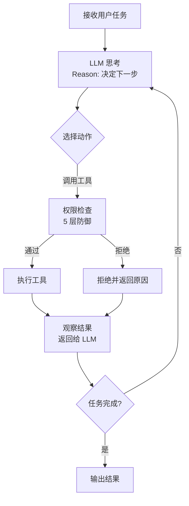
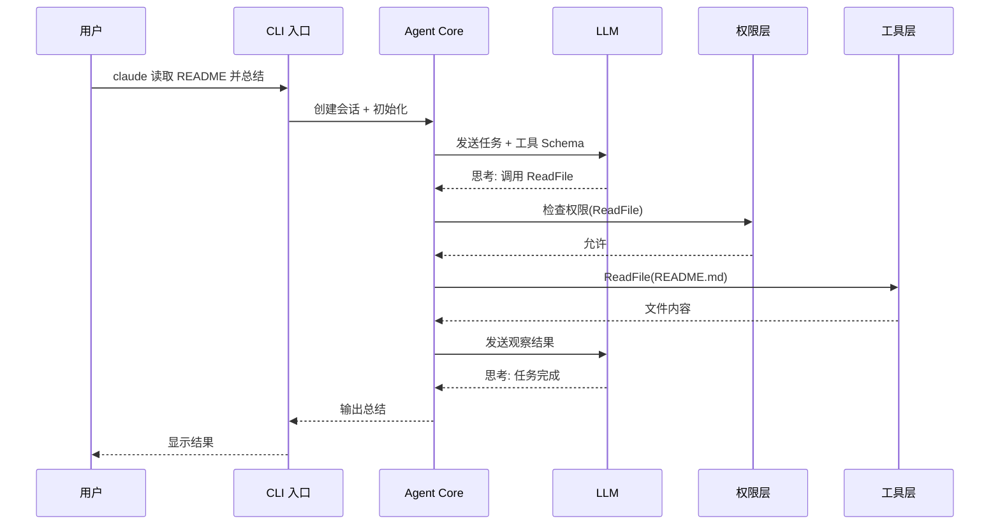
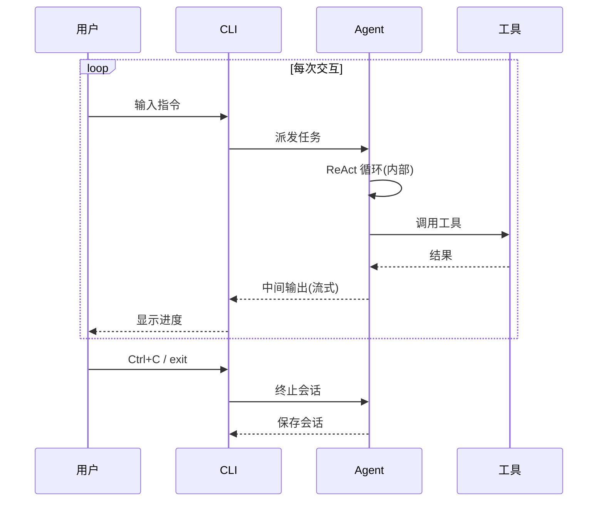
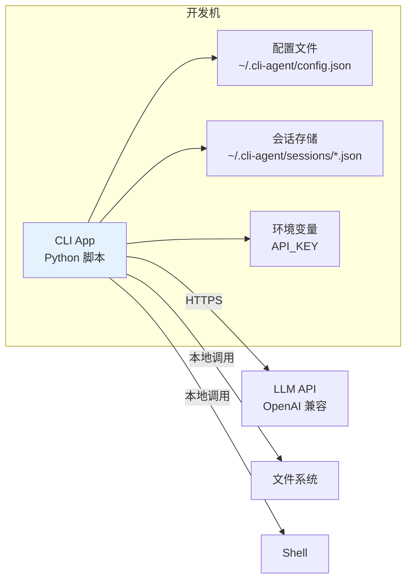

# §3 系统架构与技术选型

> **系列**：从零开始写一个 claude-code-cli（整合层 demo 工程）
> **调研数据**：2026-08-19 当天实测（gh CLI star 数）
> **定位**：这是本 demo 的**重点篇**——架构设计决定了后面所有实现。讲清每个模块为什么这么设计——像做架构评审一样，但保持通俗易懂。

---

## 3.1 系统架构总览



### 为什么这么分层？

**一句话**：把"agent 该做什么"（业务逻辑）和"agent 怎么做"（技术细节）分开——这是经典的分层架构思想，也是生产级 agent 的基本形态。

**每一层的职责边界**（想清楚边界，后面实现才不会乱）：

| 层 | 职责 | 不做什么 | 通俗理解 |
|---|---|---|---|
| **CLI 入口层** | 接用户输入，分发任务 | 不碰业务逻辑 | 前台接待员 |
| **会话管理层** | 记住"聊到哪了" | 不决定怎么做任务 | 聊天记录本 |
| **Agent 核心层** | 决定"下一步做什么" | 不关心具体工具实现 | 项目经理 |
| **LLM 客户端** | 调用大模型 | 不决定业务逻辑 | 外包大脑 |
| **工具层** | 执行具体操作 | 不决定"该不该做" | 各工种工人 |
| **权限控制层** | 检查"能不能做" | 不执行操作 | 安全保安 |
| **命令框架层** | 处理特殊命令 | 不参与主循环 | 快捷键面板 |
| **Hook 层** | 生命周期钩子 | 不参与核心决策 | 事件通知器 |

**为什么"核心层"这么突出？**——Agent 核心（ReAct Loop）是**唯一有决策权**的层。其他层都是被它调用的"资源"。这就是"**控制反转**"的思想：LLM（大脑）在中心，所有能力（工具/权限/会话）围绕它服务。

**通俗比喻**：想象一个**项目经理（Agent 核心）**——
- 他接到任务（用户输入）
- 他调用外包大脑（LLM）想方案
- 他指挥工人（工具层）干活
- 工人动手前要过保安（权限层）
- 干完活他会记笔记（会话层）
- 全程有摄像头（Hook 层）记录

**这个分层在生产级（claude-code）也一样**——只是工人更多（MCP 工具）、保安更严（企业策略）、笔记更智能（自动记忆）。**理解了 demo 的分层，就理解了生产版的骨架。**

## 3.2 业务架构



### 业务逻辑详解

**三种入口模式**（对应 claude-code 真实用法）：

| 模式 | 触发 | 适用场景 | 通俗理解 |
|---|---|---|---|
| **交互模式** | `cli` 直接启动 | 日常使用（连续对话）| 打开聊天窗口 |
| **单次模式** | `cli "任务"` | 快速问一句 | 发一条消息就走 |
| **恢复模式** | `cli --resume` | 接着上次聊 | 翻聊天记录继续 |

**核心业务循环**（A1 → A2 → A3 → A4 → 回到 A1）：
```
理解任务（LLM 想）→ 规划动作（LLM 决定调哪个工具）
→ 执行动作（调工具）→ 观察结果（回传 LLM）→ 循环
```

**关键认知：这个循环是**有状态的**——每轮的结果都影响下一轮决策。所以"会话管理层"必须存在（保存中间状态）。这是 agent 与传统 API 调用最大的区别：**传统 API 是无状态问答，agent 是有状态循环**。

## 3.3 核心流程

### 3.3.1 Agent Loop 主循环（流程图）



### ReAct 模式深度解读

**ReAct = Reason + Act（思考 + 行动）**——这是 agent 的核心机制，也是本 demo 最重要的概念。

**通俗理解**：像人做事的自然过程——
```
你被要求"帮我查一下这个项目的版本号"
→ 你想（Reason）：需要先找到配置文件
→ 你做（Act）：用 Glob 找 *.toml
→ 你看结果（Observe）：找到了 pyproject.toml
→ 你想：读它
→ 你做：ReadFile(pyproject.toml)
→ 你看：里面有 version = "0.1.0"
→ 你想：任务完成了
→ 你回答：版本号是 0.1.0
```

**为什么这个循环是"agent 的灵魂"？**

1. **自主性**：LLM 不需要人告诉每一步做什么——它自己决定下一步
2. **可观察**：每一步都有迹可循（思考/行动/结果）——这是后面 Eval/Trace 的基础
3. **可终止**：max_steps 限制——防止 LLM 陷入死循环（真实教训：LLM 会反复调同一工具）
4. **可扩展**：加新工具 = 让 LLM 多一个选择，循环逻辑不变

**为什么需要 max_steps？**——真实案例：LLM 面对"读取一个很大的文件"，可能反复 ReadFile 同一个路径，因为文件太大被截断，它不知道已经读过了。**限制步数 = 保护资源 + 强制收敛。**

**终止条件设计**（设计思考）：
- **LLM 说"完成"**（不返回工具调用）→ 正常结束
- **达到 max_steps** → 强制结束（提示"任务未完成，可能太复杂"）
- **用户中断**（Ctrl+C）→ 立即结束（保存会话）

### 3.3.2 端到端时序图（一次任务完整链路）



**时序图解读**：一次"读取并总结"任务，经历了 8 次交互（用户→CLI→Agent→LLM→权限→工具→LLM→用户）。**每一步都是独立、可审计的**——这就是后面 trace 的基础。

## 3.4 交互设计（交互图）



### 交互设计三要点

**1. 流式输出**——agent 的思考/工具调用过程实时显示（不是等全部完成）

**为什么流式？**——用户体验 + 可观察性。
- 用户能看到"agent 正在做什么"（读文件/执行命令），建立信任
- 如果卡住，用户能判断"它卡在工具调用"还是"卡在 LLM"
- 生产级（claude-code）同样流式显示——这是 agent 类工具的标配

**2. 中断处理（Ctrl+C）**——保存会话退出（不丢上下文）

**中断处理 = 优雅退出**。生产级还要处理：kill -9（强杀）、崩溃恢复（session 自动保存）。demo 先做 Ctrl+C 保存。

**3. 权限提示**——需要人工确认的操作在终端提示

**权限提示是"人机协作"的关键**——agent 不该什么都自己做，高风险操作要人确认。这个交互设计直接影响安全性（详见权限层）。

## 3.5 数据结构设计

### 会话（Session）

```python
@dataclass
class Session:
    id: str              # UUID
    created_at: str      # 创建时间
    messages: list[Message]  # 消息列表
    cwd: str             # 工作目录
    model: str           # 使用的模型

@dataclass
class Message:
    role: str            # user / assistant / tool
    content: str         # 内容
    tool_calls: list | None  # 工具调用记录
```

**为什么 messages 是核心？**

**LLM 是无状态的**——它不记得之前说过什么。**消息列表 = LLM 的记忆**：
- 每次调用 LLM，把**全部 messages** 传给它（它才能"记得"上下文）
- 工具调用的结果也存进 messages（role=tool）——这样 LLM 能"看到"工具执行结果
- 这就是"上下文管理"的基础（第 5 章实现）

**通俗理解**：messages 就像一个**对话记录本**——每轮对话、每个工具结果都记在本子上。LLM 每次回答前都翻一遍本子，才能"记得"之前聊到哪。

### 工具（Tool）

```python
@dataclass
class Tool:
    name: str            # 工具名 (ReadFile)
    description: str     # 描述（给 LLM 看）
    parameters: dict     # JSON Schema 参数定义
    handler: callable    # 执行函数
```

**为什么 Tool 要带 description + parameters？**

**LLM 怎么知道用哪个工具？**——靠**工具描述**！LLM 每次循环都会收到所有工具的"说明书"（name + description + parameters），然后自己决定用哪个。

**所以工具描述 = 给 LLM 看的 API 文档**：
- description 写得好，LLM 才选得对（"读取文件内容" vs "修改文件内容"）
- parameters 写得好，LLM 才传得对参数（path 是字符串，required 必填）
- 这就是"**工具即函数**"思想——把能力暴露成 LLM 可调用的函数签名

### 权限配置

```python
@dataclass
class PermissionConfig:
    allowed_tools: set      # 工具白名单
    allowed_dirs: list      # 目录边界
    blocked_commands: set   # 命令黑名单
    require_confirm: set    # 需人工确认的操作
```

**为什么权限是"配置"而不是"代码"？**

**权限策略应该可配置、可调整**——不改代码就能加黑名单/改边界。这是"策略与实现分离"思想：
- 开发时：工具白名单全开（方便调试）
- 使用时：收紧权限（保护环境）
- 生产时：企业策略（claude-code 支持设置文件）

## 3.6 部署架构



### 部署形态分析

**本地 CLI（单机）**：
- **配置**：`~/.cli-agent/` 下（配置 + 会话 + 日志）——用户目录，不污染项目
- **LLM 远程调用**：唯一外部依赖（API）——需要网络 + API Key
- **无服务端**：demo 是纯客户端（生产版 claude-code 同样形态）

**为什么无服务端？**

**agent CLI 的本质 = 本地工具 + 云端大脑**：
- 本地：文件操作 / 命令执行 / 会话存储（快、安全、离线可用）
- 云端：LLM 推理（唯一需要网络的）

这个形态的好处：
1. **隐私**：代码/文件不出本地（只发必要内容给 LLM）
2. **简单**：无需部署服务器（个人使用零运维）
3. **可扩展**：生产版加企业网关（claude-code 有 examples/gateway）——只是多了中间层

**生产版差异**（有依据）：claude-code 支持 `--cloud` 云会话、`--teleport` 远程恢复——**把"本地 CLI"扩展到"云上会话"**。但核心形态不变（本地工具 + 云端大脑）。

## 3.7 功能用例（输入 → 处理 → 输出）

| # | 功能用例 | 输入 | 处理 | 输出 |
|---|---|---|---|---|
| 1 | **读取并总结** | `cli "读取 README 并总结"` | LLM 选 ReadFile → 读文件 → LLM 总结 | 总结文本 |
| 2 | **搜索代码** | `cli "找出所有处理支付的函数"` | LLM 选 Grep → 搜索 → 返回结果 | 匹配行 + 分析 |
| 3 | **修改文件** | `cli "给 main.py 加个日志"` | LLM 选 EditFile → 编辑 | 修改确认 |
| 4 | **执行命令** | `cli "运行测试"` | LLM 选 Bash → 执行（权限检查）| 命令输出 |
| 5 | **恢复会话** | `cli --resume` | 读 session JSON → 恢复上下文 | 继续对话 |
| 6 | **技能执行** | `cli "/review"` | Slash Command → 预置 prompt → LLM | Review 报告 |
| 7 | **权限拒绝** | `cli "删除所有文件"` | Bash 工具 → 黑名单拦截 | 拒绝 + 原因 |

### 功能用例的架构师解读

**这 7 个用例覆盖了 agent 的全部核心能力**：
- 用例 1-4 = 工具调用（读/搜/改/执行——agent 的"四肢"）
- 用例 5 = 会话管理（记忆——agent 的"笔记"）
- 用例 6 = 命令扩展（预置技能——agent 的"快捷方式"）
- 用例 7 = 权限控制（安全——agent 的"保安"）

**为什么"权限拒绝"也是一个功能用例？**——它验证了**安全机制真实生效**。生产级 agent 最怕的不是"功能少"，而是"**该拒绝的没拒绝**"（prompt injection 攻击）。所以权限拒绝是**必测用例**。

## 3.8 技术选型与 trade-off

### 3.8.1 语言选型：为什么选 Python

**核心决策：Python 3 为主版本（demo），Java 生态说明（不写代码）**

**为什么选 Python**（决策理由）：

| 维度 | Python 3 | 理由 |
|---|---|---|
| **AI 生态成熟度** | ✅ 绝对主流 | openai-python 31,412⭐ / langchain 144,619⭐——agent 教程/示例/库都是 Python 第一 |
| **开发速度** | ✅ 快 | 脚本式 + 动态类型，demo 逻辑聚焦 agent 核心，不分散在语言特性 |
| **CLI 交互** | ✅ 简单 | argparse + input()，几十行能跑通交互循环 |
| **依赖最小** | ✅ 少 | 核心只用标准库 + requests，学习负担最小 |
| **流式处理** | ✅ 自然 | generator / yield 天然支持 LLM 流式输出 |
| **学习目标** | ✅ 聚焦 | demo 目的是"理解 agent 逻辑"，Python 让逻辑最清晰 |

**为什么"生态"是第一考量？**

选语言本质是选**生态**——你要解决的问题（LLM 调用 / agent 循环 / 工具扩展）在哪个语言里**有最多现成方案、最多人踩过坑、最多资料**？

**Python 在 AI 生态的统治地位**（2026-08-19 实测）：
- OpenAI SDK：31,412⭐（Python）vs 1,505⭐（Java）——**21 倍差距**
- LLM 框架：langchain 144,619⭐（Python）vs langchain4j 12,916⭐（Java）——**11 倍**
- 意味着：Python 出问题，Google 一搜全是答案；Java 可能要翻英文文档

**Java 生态现状**（说明，不写代码）：

| 维度 | Java 17 | 现状 |
|---|---|---|
| **AI 生态** | ⚠️ 较小 | openai-java 1,505⭐ / langchain4j 12,916⭐ / spring-ai 9,325⭐ |
| **趋势** | 📈 增长 | Spring AI 在 Java 企业市场增长，但落后 Python 约 10 倍 |
| **CLI** | ⚠️ 较重 | picocli 可用，但交互式终端处理不如 Python 顺手 |
| **并发** | ✅ 强 | 虚拟线程 / 线程池——多工具并发调用强于 Python（GIL）|
| **部署** | ⚠️ 重 | JVM + 构建（Maven/Gradle），分发成本高 |
| **适用** | ✅ 企业 | Java agent 适合企业系统集成（Spring AI + 已有 Java 栈）|

**为什么 demo 不用 Java**：
- 学习目标 = agent 逻辑，Python 最聚焦
- Java 版会多 ~50% boilerplate（类定义 / 依赖 / 构建），分散注意力
- AI 生态 Python 第一，示例/调试资料最多

**Java 什么时候该选**：
- 企业已有 Java 技术栈（Spring 体系）
- 需要与 Java 服务深度集成
- 高并发工具调用（虚拟线程优势）
- 团队 Java 技能为主

**结论**：**demo 用 Python（聚焦学习），Java 是生产场景的合理选择（生态在增长）**——架构设计（§3.1-3.7）语言无关，未来可移植 Java。

### 3.8.2 其他技术选型

| 决策点 | 选择 | 替代 | 为什么 | 点评 |
|---|---|---|---|---|
| **CLI 框架** | argparse（stdlib）| typer/click | demo 减少依赖 | 生产用 typer（自动补全/更友好）|
| **LLM SDK** | requests 直调 OpenAI 兼容 API | openai SDK | 减少依赖 + 理解 API 本质 | 生产用 SDK（重试/流式/类型）|
| **LLM 提供商** | OpenAI 兼容（可切换 Anthropic）| 单一厂商 | demo 灵活 | 生产多云（Bedrock/Vertex）|
| **会话存储** | JSON 文件 | SQLite / Redis | demo 简单 | 生产 SQLite（并发安全）|
| **模型** | 默认 gpt-4o-mini 级 | 高配模型 | demo 成本低 | 生产按需 + 成本监控 |
| **构建** | 纯脚本 + requirements.txt | pip 包 | demo 简单 | 生产打包发布 |

### trade-off 的本质

**所有技术选型都是"学习优先 vs 生产优先"的权衡**：

```
学习优先（demo）          生产优先（claude-code）
├─ 手写（理解本质）        ├─ 框架（效率）
├─ 零依赖（减少负担）      ├─ 生态（功能）
├─ 简单方案（跑通即可）    ├─ 健壮方案（容错/并发/安全）
└─ 单提供商（快速验证）    └─ 多云（企业可用）
```

**这不是"demo 偷懒"**——是**刻意设计**：用最简单方案讲清核心机制，把生产复杂度留到"你知道要什么"之后再引入。**过早引入生产级复杂度 = 学习负担爆炸。**

---

## 小结

**§3 架构设计的核心结论**：
1. **分层架构**：8 大模块，职责清晰（Agent 核心 = 决策中心，其他 = 资源）
2. **ReAct 循环**：agent 的灵魂——有状态循环 vs 无状态问答
3. **工具描述即 API**：LLM 靠 description + parameters 选择工具
4. **消息列表即记忆**：LLM 无状态，messages 补足上下文
5. **Python 主选**：生态第一（21 倍差距），学习聚焦
6. **trade-off = 学习优先**：简单方案讲清核心，生产复杂度留给后续

**架构设计好了，§5 实现就是"照图施工"**——这就是"先设计后实现"的价值：架构想清楚了，写代码只是翻译。
