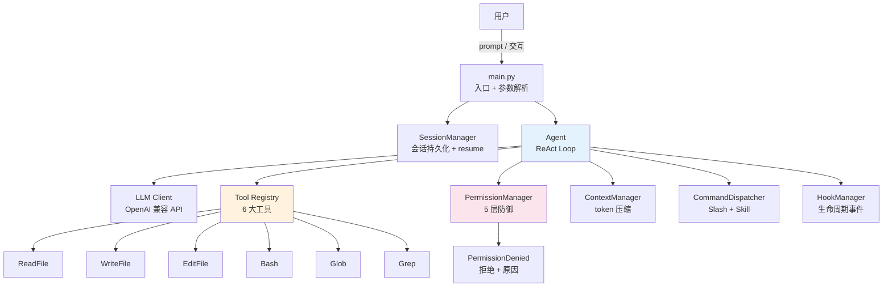

# §7 项目架构和亮点

> **系列**：从零开始写一个 claude-code-cli（整合层 demo 工程）
> **注意**：§3 是**设计架构**（计划），§7 是**实际实现的架构**（最终成果）——两者应该一致，但如果实现中有调整，以 §7 为准。

---

## 7.1 最终架构图



**与 §3 设计架构的对比**：
- 一致：8 大模块 + ReAct Loop + 5 层权限 + 3 种交互模式
- 实现细节：SessionManager / Tool Registry / CommandDispatcher 的具体类名（§3 是概念，§7 是实际代码结构）

## 7.2 实际代码结构

```
cli-agent/
├── main.py              ← 入口（参数解析 + 交互循环 + 会话初始化）
├── agent.py             ← Agent 核心（ReAct Loop + 工具调度）
├── llm.py               ← LLM 客户端（HTTP POST 封装）
├── permissions.py       ← PermissionManager（5 层防御）
├── session.py           ← SessionManager（JSON 持久化 + resume）
├── context.py           ← ContextManager（token 计数 + 压缩）
├── commands.py          ← CommandDispatcher（Slash + Skill）
├── hooks.py             ← HookManager（PreToolUse/PostToolUse/SessionStart）
└── tools/
    ├── __init__.py      ← Tool Registry（注册表）
    ├── read.py          ← ReadFile
    ├── write.py         ← WriteFile
    ├── edit.py          ← EditFile
    ├── bash.py          ← Bash
    ├── glob.py          ← Glob
    └── grep.py          ← Grep
```

**模块依赖方向**（谁 import 谁，避免循环依赖）：

```
main → agent → llm / tools / permissions / context / hooks / commands
                     ↓
              tools/__init__ → read/write/edit/bash/glob/grep
```

## 7.3 4 个亮点

### 亮点 1：6 大工具 + 注册表模式（可扩展）

**为什么是亮点**：工具注册表（`TOOL_REGISTRY`）让"加一个工具"变成"写一个文件 + 注册"——**新增能力不改核心代码**（开闭原则）。这是生产级 agent 工具扩展的基础形态。

```python
@register
class ReadFile(Tool):
    name = "ReadFile"
    description = "读取文件内容"
    # 一个文件 = 一个工具，注册表自动收集
```

### 亮点 2：5 层权限防御（纵深防御思想）

**为什么是亮点**：LLM 是**不可信任的**（可能被 prompt injection 操纵）——demo 实现了完整的纵深防御：工具白名单 → 目录边界 → 命令黑名单 → 危险拦截 → 人工确认。**每一层防一类风险**，单层必被绕过。

```python
# 测试：cli "删除所有文件" → 被 Bash 黑名单拦截
# 测试：cli "读取 /etc/passwd" → 被目录边界拦截
```

### 亮点 3：ReAct Loop 的完整实现（agent 的灵魂）

**为什么是亮点**：从"一次问答"到"多轮自主循环"——**这就是 agent 与普通 LLM 调用的本质区别**。demo 完整实现了 Reason → Act → Observe 循环 + 最大步数防死循环 + 工具结果回传。

```python
for step in range(max_steps):
    response = self.llm.chat(self.messages, tools=self.tools.schemas())
    tool_call = extract_tool_call(response)
    if not tool_call:
        return response  # 任务完成
    result = self.tools.execute(tool_call.name, tool_call.args)
    self.messages.append({"role": "tool", "content": str(result)})
```

### 亮点 4：麻雀虽小五脏俱全（学习型 demo 的完整度）

**为什么是亮点**：一个小 demo 覆盖了 agent 工程化的**全部核心概念**——工具调用 / Agent Loop / 权限 / 上下文压缩 / 会话恢复 / 命令框架 / Hook——**每个概念都有可运行的实现**，不是纸上谈兵。读者做完 = 对 agent 有完整认知。

## 7.4 技术债与已知局限（诚实列出）

| 局限 | 说明 | 生产版怎么做（有依据）|
|---|---|---|
| **无 MCP 生态** | 只能调 6 内置工具 | MCP 协议 + `--mcp-config` |
| **无并发** | 单线程顺序执行 | SubAgent + 后台 Agent |
| **权限用字符串匹配** | 危险命令检测不精确 | 正则 + 沙箱 + 企业策略 |
| **上下文压缩简单** | 截断 + 摘要占位 | LLM 摘要 + 向量检索 |
| **无遥测** | 无调试/日志体系 | `-d/--debug` + doctor |
| **单提供商** | 只支持 OpenAI 兼容 | Bedrock/Vertex/Foundry 多云 |

---

## 小结

**最终成果**：一个 8 模块 + 6 工具的 CLI agent，覆盖 agent 工程化全部核心概念——**这是"麻雀虽小五脏俱全"的学习型 demo**。4 个亮点（注册表 / 纵深防御 / ReAct / 完整度）+ 6 个已知局限（刻意简化），**理解核心，知道差距**。
