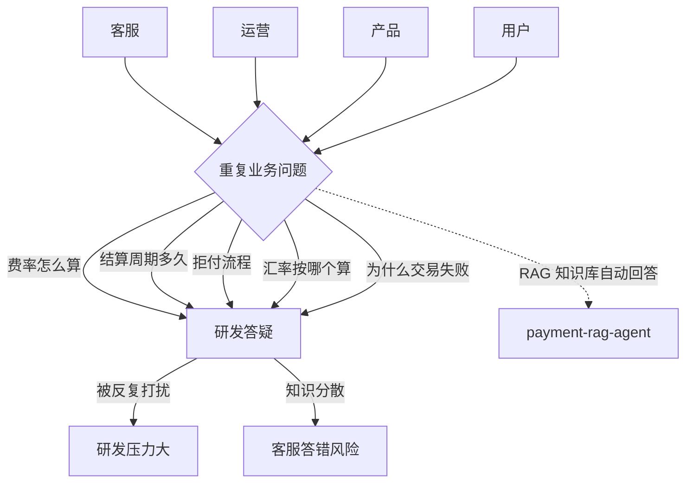
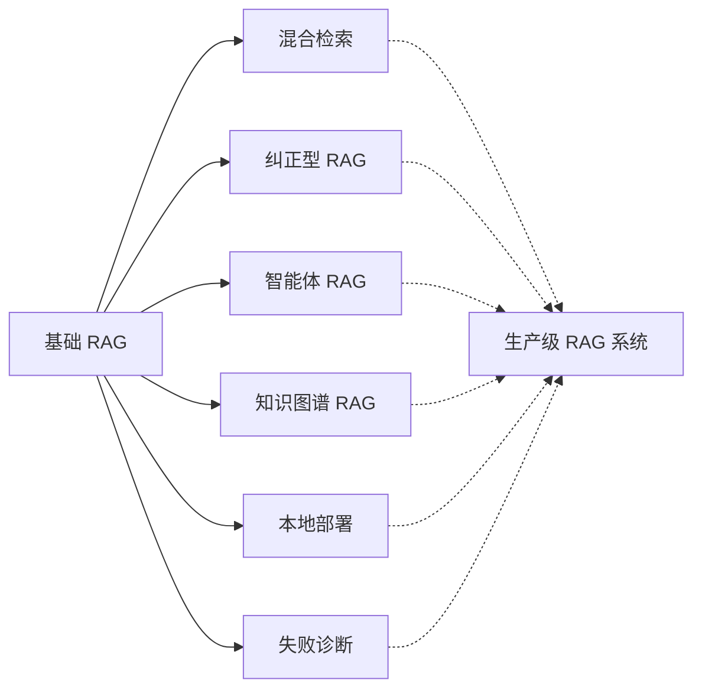

# §1 为什么写：跨境收单支付业务问答 RAG 的价值论证

> **系列**：从零开始写一个 payment-rag-agent（整合层 demo 工程）

---

## 1.1 思考：为什么值得做这个 demo

跨境收单支付是 2026 年最典型的「业务知识密集型」行业之一：费率怎么算、结算周期多久、拒付流程是什么、汇率按哪个算、为什么交易失败——**客服、运营、产品、用户四类角色每天都在问重复的业务问题**。

这些问题的共同特征是：

1. **高频重复**：同一个「结算周期是 T+1 还是 T+2」每天被问几十次
2. **知识面宽**：费率/结算/拒付/汇率/合规政策，横跨业务多个模块
3. **更新快**：费率调整、结算规则变更、监管政策更新，知识库要跟上
4. **答错有代价**：支付场景下回答错误（说错费率、说错结算时间）会直接引发客诉甚至合规风险

而现实中，这些重复问答的压力最终落在**研发和人工客服**身上——客服不懂技术细节要问研发，研发被反复拉去答疑，双方都被消耗。



**本 demo 的价值在于**：用 RAG（检索增强生成）从零搭一个「跨境收单支付业务问答」agent——**把业务知识沉淀成知识库，让 agent 自动回答四类角色的重复问题**。不是用 LlamaIndex / LangChain 框架调包，而是**手写分块、手写 TF-IDF 向量化、手写余弦相似度检索、手写上下文组装**，理解 RAG 的每一个环节。

**为什么值得做**：RAG 是 2026 年 AI 应用最核心的落地技术之一，而「业务知识问答」是 RAG 最典型的应用场景。理解一个系统的最高效方式，是从零把它实现一遍——读 100 篇 RAG 介绍，不如自己写一个检索闭环。

## 1.2 价值：学了有什么用 / 能用到哪

从零复刻一个 RAG agent 能获得的**可迁移能力**：

1. **RAG 全链路实现能力**：文档加载 → 分块 → 向量化 → 存储 → 检索 → 重排 → 生成，7 个环节每个都能讲清原理
2. **检索算法理解能力**：TF-IDF 怎么算、余弦相似度怎么衡量「相关」——传统信息检索（IR）的核心，也是向量检索的基石
3. **分块策略设计能力**：chunk 大小、重叠、递归分块——检索质量的第一道关卡
4. **上下文组装能力**：怎么把检索结果拼进 prompt、怎么控制 token 成本、怎么让 LLM 基于知识库回答而非幻觉
5. **业务知识库构建能力**：把散落的业务文档（费率表/结算规则/拒付流程）变成可检索的知识资产

这套能力**不绑定语言**——理解了原理，Python 能写、Java 能写、任何语言都能写（本系列代码用子目录隔离多实现，后续补 Java 版）。

## 1.3 ROI：值得花时间学吗

**投入**：约 2-3 周业余时间（含调研 + 实现 + 文档）。

**产出**：
- 一个**能运行的支付业务问答 agent**（麻雀虽小五脏俱全）
- 对 RAG 的**完整认知**（不是碎片知识：分块/向量/检索/生成全打通）
- 一套**可复用的实现模式**（后续任何知识库问答项目直接套）
- 一篇**完整的 wiki**（沉淀给未来的自己和读者）

**对比**：用框架（LlamaIndex/LangChain）30 分钟能跑通一个 RAG demo，但原理是黑盒——分块为什么这么切、检索为什么返回这些、上下文怎么组装，全靠框架封装。从零实现要花 2-3 周，但每个环节的「为什么」都变成自己的认知。

**ROI 判断**：作为后端工程师，RAG 是 AI 应用落地绕不开的技术。**2-3 周换一个核心能力认知，ROI 为正。** 而且这套理解是「一次投资、永久复用」——面试能讲原理，工作能选型，遇到问题能排查。

## 1.4 技术风向标：RAG 现在处于什么趋势

**RAG 生态 2026 年现状**（2026-08-23 gh CLI 当天实测）：

| 项目 | 定位 | GitHub star |
|---|---|---|
| **awesome-llm-apps** | 100+ AI agents + RAG 应用集 | 134K |
| **RAGFlow** | 开源的 RAG 引擎（深度文档理解） | 89K |
| **anthropic-cookbook** | Anthropic 官方示例库 | 52K |
| **LlamaIndex** | 领先的文档 agent + RAG 框架 | 51.8K |
| **FAISS** | Meta 向量检索库 | 40.8K |
| **GraphRAG** | 微软知识图谱 RAG | 35.6K |
| **openai-agents-python** | OpenAI 官方 agent 框架 | 28.9K |
| **pgvector** | PostgreSQL 向量扩展 | 22.7K |

**趋势判断**：**RAG 已经从「概念验证」走向「生产标配」**——几乎所有 LLM 应用（客服问答、知识库检索、企业搜索）都在用 RAG。同时生态在分化出多个演进方向：基础 RAG → 混合检索 → 纠正型 RAG → 智能体 RAG → 知识图谱 RAG → 本地部署，每个方向都是独立的技术栈。

**全谱系地图**（本系列的生态视野）：



**本系列定位**：基础 RAG 写深（从零实现），6 个演进方向在 §6/§10 点到——先理解地基，再看生态怎么长。

## 1.5 为什么学 / 为什么写

**为什么学**：
- 后端工程师做 AI 应用落地的**最短路径**——RAG 是知识类场景的默认解法
- 面试加分：能讲清楚「RAG 的检索原理」比「我用过 LangChain」更有说服力
- 工作实用：业务知识问答（费率/结算/拒付/汇率 FAQ）是支付行业真实存在的需求

**为什么写**：
- **费曼学习法**：能写出来 = 真理解了。写 wiki 的过程就是深挖原理的过程
- **沉淀资产**：这篇 wiki + 代码是长期资产，未来复用
- **帮助他人**：市面上讲 RAG 原理的文章很多，但「从零手写一个 + 真实业务场景」的完整教程很少

## 1.6 能用来干什么：实际应用场景

**这个 demo（麻雀虽小五脏俱全）能做什么**：
- 用自然语言问「结算周期是多久」「拒付流程是什么」「费率怎么算」，agent 从知识库检索答案回答
- 作为学习工具：展示一个最小可用的 RAG 是什么结构
- 作为业务原型：把费率表/结算规则/拒付流程文档喂进去，立刻得到一个业务问答机器人

**扩展后能做什么**（参考生产版）：
- 客服工作台集成：客服输入问题，agent 给出带来源的答案
- 运营/产品自助查询：业务规则自查，不用追着研发问
- 用户端 FAQ 机器人：标准问题自动回答，人工只处理异常
- 接入向量数据库（pgvector/FAISS）支撑百万级知识文档

## 1.7 行业影响 + 商业价值

**业务知识问答是支付行业的真实痛点**：

- **研发侧**：被反复拉去答疑，打断开发节奏——「这个费率为什么这么算」一天被问 5 次
- **客服侧**：知识分散在多个文档/群聊/老员工脑子里，新客服上手慢、答错率高
- **合规侧**：支付行业回答需可溯源——「为什么这笔拒付」「结算延迟原因」要给依据，不能凭印象

**商业价值**：一个准确的业务知识问答 agent 能直接降低答疑人力成本、缩短新客服培训周期、减少因答错引发的客诉。**这不是 Demo 才有的价值，是真实行业需求。**

## 1.8 目标人群

- **想理解 RAG 原理的后端工程师**（本系列从零实现，不依赖框架）
- **想做知识库问答/客服机器人的人**（业务场景参考：支付/金融/电商通用）
- **准备 AI 相关面试的开发者**（RAG 是高频面试题，本系列讲透原理）

## 1.9 成熟度：这个技术成熟了吗

RAG 技术栈已经**生产可用**：

- **框架成熟**：LlamaIndex（51.8K★）、RAGFlow（89K★）等生产级方案
- **基础设施成熟**：FAISS（40.8K★）、pgvector（22.7K★）、Milvus 等向量库
- **生态活跃**：awesome-llm-apps 134K★、25 个 RAG 教程、2 天前还在更新

**但「会用框架」和「理解原理」是两回事**。本系列从零实现，就是为了补上原理这一课——框架帮你封装了分块/检索/组装，但你得知道它封装了什么、为什么这么封装。

## 1.10 职业：对后端工程师的价值

- **AI 时代后端的新能力**：RAG 是把 LLM 接进业务系统的核心手段，后端工程师是落地的主力
- **架构视野**：懂 RAG 原理才能做技术选型（用框架还是自研、用哪种向量库、要不要混合检索）
- **差异化竞争力**：大量工程师停留在「调框架 API」，能讲清原理 + 能动手实现的人稀缺

## 1.11 衔接：与 claude-code-cli 系列的关系

本系列是「从零开始写一个 claude-code-cli」的**姊妹系列**：

```
claude-code-cli 系列 = agent 骨架
├── Agent Loop（ReAct）
├── 工具调用（6 工具）
├── 权限控制（5 层）
└── 会话管理

payment-rag-agent 系列 = agent + 知识检索
├── 复用 agent 骨架的思路
├── 新增 RAG 能力：知识库 → 检索 → 组装 → 生成
└── 业务场景：跨境收单支付问答
```

**两个系列合起来 = 完整的 agent 能力面**：一个会动手（工具调用），一个会查资料（RAG 检索）。都是「理解运作 + 提高动手能力」的 demo 定位。

## 1.12 一句话总结

**RAG 是 AI 应用落地的核心能力，跨境收单支付业务问答是它的典型场景——从零写一个 payment-rag-agent，理解检索增强的每一个环节，让知识库自动回答业务问题，减轻研发和客服的重复答疑压力。**

---

## 📌 数据与事实声明

本文涉及的 GitHub star 数（LlamaIndex 51.8K / RAGFlow 89K / GraphRAG 35.6K / FAISS 40.8K / pgvector 22.7K / anthropic-cookbook 52K / openai-agents-python 28.9K / awesome-llm-apps 134K）为 2026-08-23 gh CLI 实测数据，会随时间变化。业务场景描述（四类角色高频提问、研发答疑压力）是行业通用认知，非特定公司内部数据。实际业务中请以最新官方资料为准。

## 📚 参考资料

| 类型 | 标题 | 来源 |
|---|---|---|
| 开源项目 | awesome-llm-apps（100+ AI agents + RAG apps） | github.com/Shubhamsaboo/awesome-llm-apps |
| 开源项目 | RAGFlow（开源的 RAG 引擎） | github.com/infiniflow/ragflow |
| 开源项目 | LlamaIndex（文档 agent + RAG 框架） | github.com/run-llama/llama_index |
| 开源项目 | FAISS（Meta 向量检索库） | github.com/facebookresearch/faiss |
| 开源项目 | GraphRAG（微软知识图谱 RAG） | github.com/microsoft/graphrag |
| 开源项目 | pgvector（PostgreSQL 向量扩展） | github.com/pgvector/pgvector |
| 官方文档 | RAG 指南（Anthropic） | docs.anthropic.com/en/docs/build-with-claude/rag |
| 官方文档 | Retrieval-Augmented Generation（arXiv, Lewis et al., 2020） | arxiv.org/abs/2005.11401 |
