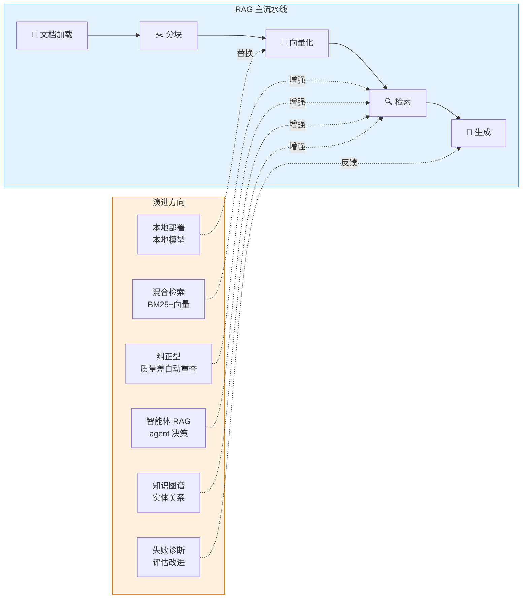

# §2 调研和对参考的思考

> **系列**：从零开始写一个 payment-rag-agent（整合层 demo 工程）
> **调研数据**：2026-08-23 当天实测（gh CLI + GitHub 仓库 + 官方文档）

---

## 2.1 调研方法

**调研对象**（RAG 生态全景）：
1. **awesome-llm-apps**（Shubhamsaboo/awesome-llm-apps，134K★）——100+ AI agents + RAG 应用集，rag_tutorials 下 25 个 RAG 教程覆盖全谱系
2. **RAGFlow**（infiniflow/ragflow，89K★）——生产级 RAG 引擎
3. **LlamaIndex**（run-llama/llama_index，51.8K★）——文档 agent + RAG 框架
4. **GraphRAG**（microsoft/graphrag，35.6K★）——知识图谱 RAG 路线
5. **FAISS**（facebookresearch/faiss，40.8K★）——向量检索库
6. **pgvector**（pgvector/pgvector，22.7K★）——PostgreSQL 向量扩展
7. **anthropic-cookbook**（anthropics/anthropic-cookbook，52K★）——官方 RAG 示例

**调研方式**：
- gh CLI 当天实测 star 数（2026-08-23）
- GitHub 看仓库结构 + rag_tutorials 目录全景
- 官方文档看 RAG 架构（分块/检索/组装的标准做法）
- 对照本系列业务场景（跨境收单支付问答）筛选可复用能力

## 2.2 RAG 生态怎么工作（拆解）

### 2.2.1 RAG 的 7 环节标准流水线

**从 LlamaIndex / RAGFlow / anthropic-cookbook 的共识中拆解出 RAG 标准流水线**：

| 环节 | 解决什么问题 | 常见实现 |
|---|---|---|
| **文档加载** | 把 PDF/Word/Markdown 变成纯文本 | PyPDF / Unstructured / pypdf |
| **分块** | 长文档切成检索粒度（LLM 上下文有限） | 递归字符分块 / 语义分块 / 父子分块 |
| **向量化** | 文本 → 向量（语义编码） | OpenAI Embedding / 本地模型 / TF-IDF |
| **存储** | 向量怎么存、怎么查 | FAISS / pgvector / Milvus / Chroma |
| **检索** | 怎么找到最相关的 chunk | 向量相似度 / BM25 关键词 / 混合检索 |
| **重排** | 粗排结果再精排（可选） | Rerank 模型 / 交叉编码器 |
| **生成** | 检索结果 + 问题 → 回答 | LLM 调用 + 上下文组装 |

### 2.2.2 生态全景（awesome-llm-apps rag_tutorials 25 个教程的分类）

**把 25 个 RAG 教程按技术方向归类**（本系列的生态地图）：

| 技术方向 | 代表教程 | 核心思路 |
|---|---|---|
| **基础 RAG** | rag_chain / rag-as-a-service / local_rag_agent | 最小闭环：加载→分块→向量→检索→生成 |
| **混合检索** | hybrid_search_rag / local_hybrid_search_rag | 关键词（BM25）+ 向量双路融合，互相补短 |
| **纠正型 RAG** | corrective_rag | 检索结果质量差 → 自动换路/重查/回退 |
| **智能体 RAG** | agentic_rag_gpt5 / autonomous_rag / agentic_rag_with_reasoning | 检索决策交给 agent（多跳、多工具）|
| **知识图谱 RAG** | knowledge_graph_rag_citations | 实体关系图谱 + 检索，GraphRAG 路线 |
| **本地部署** | deepseek_local_rag_agent / qwen_local_rag / llama3.1_local_rag | 本地模型 + 本地向量库，不调 API |
| **专项** | rag_failure_diagnostics_clinic / vision_rag / multimodal_agentic_rag | 失败诊断 / 多模态 |

**关键洞察**：RAG 生态已经从「一条流水线」分化成「多条演进路线」——基础 RAG 是地基，其他方向都是在某个环节上做增强（检索增强/决策增强/图谱增强）。

### 2.2.3 生产级 RAG（RAGFlow / LlamaIndex 怎么做）

**RAGFlow 的深度文档理解**（89K★，生产级代表）：
- 版面分析（表格/图片/公式结构化提取）
- 分块策略可配置（父子分块、语义分块）
- 混合检索（BM25 + 向量）
- 引用溯源（答案带来源 chunk）

**LlamaIndex 的文档 agent 化**（51.8K★，框架代表）：
- QueryEngine 封装检索+组装
- Agent 化：LLM 自主决定查哪个索引、怎么组合多源
- 数据连接器生态（50+ 数据源）

**GraphRAG 的知识图谱路线**（35.6K★，微软）：
- 文档 → 实体抽取 → 知识图谱构建
- 社区检测 → 层次化摘要
- 检索时走图谱路径而非纯向量

### 2.2.4 本系列的技术起点：TF-IDF + 余弦相似度

**为什么先学 TF-IDF 而不是直接上 Embedding**：

| 维度 | TF-IDF + 余弦（本系列起点） | Embedding API（向量化） |
|---|---|---|
| 原理 | 词频统计 + 向量夹角，纯数学 | 神经网络语义编码 |
| 语义理解 | ❌ 同义词不识别（「轿车」≠「汽车」）| ✅ 语义相近向量相近 |
| 依赖 | 零外部依赖（标准库可写） | 调 API / 本地模型 |
| 成本 | 0 | 按 token 计费 |
| 适合 | 入门理解、小知识库 | 生产级、大知识库 |
| 学习价值 | 讲透「检索」的本质 | 工业标准 |

**结论**：本系列用 TF-IDF 讲透检索原理，Embedding 放 §10 trade-off 对比——先懂原理，再上工业方案。

## 2.3 能力点拆解表（复刻决策）

**从 RAG 生态拆解能力点，决定本 demo 复刻什么**：

| # | 能力 | 参考实现 | 我们复刻吗 | 为什么 |
|---|---|---|---|---|
| 1 | **RAG 7 环节闭环** | RAGFlow / LlamaIndex 流水线 | ✅ **复刻** | 核心能力，本 demo 主线 |
| 2 | **文档加载** | pypdf / Unstructured | ✅ **复刻（简化）** | 只支持 Markdown/纯文本（demo 知识库是 .md 文档）|
| 3 | **分块策略** | 递归字符分块（LangChain 思路）| ✅ **复刻** | 核心能力，chunk 大小/重叠可配置 |
| 4 | **向量化** | TF-IDF（零依赖）| ✅ **复刻** | 讲透检索原理；Embedding 放 trade-off |
| 5 | **向量存储 + 检索** | FAISS / pgvector | ✅ **复刻（内存版）** | 余弦相似度纯 Python 实现 |
| 6 | **重排** | Rerank 模型 | ⚠️ **简化** | 讲概念，demo 做简单粗排（不做独立重排模型）|
| 7 | **上下文组装 + 生成** | LLM 调用 + prompt 模板 | ✅ **复刻** | 核心能力，requests 调 LLM |
| 8 | **引用溯源** | RAGFlow 答案带来源 | ✅ **复刻** | 支付业务可溯源是刚需 |
| 9 | **检索评估** | RAGAS / 人工评估 | ⚠️ **简化** | 做简单召回率评估（不引框架）|
| 10 | **混合检索** | hybrid_search_rag | ❌ **不写（演进篇点到）** | §6 演进讲，demo 不做双路 |
| 11 | **知识图谱** | GraphRAG | ❌ **不写（trade-off 点到）** | 复杂度高，§10 对比 |
| 12 | **Agent 化检索** | agentic_rag | ❌ **不写（演进篇点到）** | §6 演进讲，demo 保持简单 |

**复刻原则**：
- **核心闭环全复刻**（7 环节）——理解 RAG 运作的最低完整度
- **检索用 TF-IDF**（零依赖，讲原理），框架/向量库放 trade-off
- **引用溯源复刻**——业务场景（支付问答）可溯源是刚需
- **演进方向点到为止**——混合/纠正/图谱/agentic 在 §6/§10 讲，demo 不做

## 2.4 业务场景调研：跨境收单支付问答的知识面

**业务知识库覆盖范围**（对齐行业通用认知，脱敏）：

| 知识域 | 典型问题 | 为什么需要 RAG |
|---|---|---|
| **费率与定价** | 交易费率怎么算？货币转换费多少？| 费率规则多版本、按产品/地区不同 |
| **结算周期** | 结算 T+1 还是 T+2？提现多久到账？| 结算规则随渠道/产品变化 |
| **拒付与争议** | 拒付流程是什么？争议怎么处理？| 流程长、步骤多、客服常问 |
| **汇率** | 结算汇率按哪个？定价汇率怎么算？| 汇率规则专业、用户易误解 |
| **交易异常** | 为什么交易失败？退款多久到账？| 原因多（风控/额度/通道）、排查链路长 |
| **合规政策** | 哪些商户不能接？限额是多少？| 政策更新快、答错有合规风险 |

**为什么这场景适合 RAG（对照 RAG 三个痛点）**：
- **知识更新快** → LLM 训练数据滞后，RAG 用最新知识库回答 ✅
- **防幻觉** → 支付场景答错费率/结算时间 = 客诉，RAG 基于文档回答 ✅
- **可溯源** → 合规要求答案有依据，RAG 带来源 chunk ✅

---

## 📌 数据与事实声明

本文涉及的 GitHub star 数（awesome-llm-apps 134K / RAGFlow 89K / LlamaIndex 51.8K / GraphRAG 35.6K / FAISS 40.8K / pgvector 22.7K / anthropic-cookbook 52K）为 2026-08-23 gh CLI 实测数据，会随时间变化。RAG 7 环节流水线、分块/检索/组装标准做法是行业通用认知（来自 LlamaIndex/RAGFlow/anthropic-cookbook 公开文档）。业务知识面（费率/结算/拒付/汇率/交易异常/合规）是跨境收单行业通用分类，非特定公司内部数据。实际业务中请以最新官方资料为准。

## 📚 参考资料

| 类型 | 标题 | 来源 |
|---|---|---|
| 开源项目 | awesome-llm-apps · rag_tutorials 25 教程 | github.com/Shubhamsaboo/awesome-llm-apps/tree/main/rag_tutorials |
| 开源项目 | RAGFlow（生产级 RAG 引擎） | github.com/infiniflow/ragflow |
| 开源项目 | LlamaIndex（文档 agent + RAG 框架） | github.com/run-llama/llama_index |
| 开源项目 | GraphRAG（微软知识图谱 RAG） | github.com/microsoft/graphrag |
| 开源项目 | FAISS（Meta 向量检索库） | github.com/facebookresearch/faiss |
| 开源项目 | pgvector（PostgreSQL 向量扩展） | github.com/pgvector/pgvector |
| 官方文档 | RAG 指南（Anthropic） | docs.anthropic.com/en/docs/build-with-claude/rag |
| 论文 | Retrieval-Augmented Generation（Lewis et al., 2020） | arxiv.org/abs/2005.11401 |
| 开源项目 | corrective_rag 教程 | github.com/Shubhamsaboo/awesome-llm-apps/tree/main/rag_tutorials/corrective_rag |
