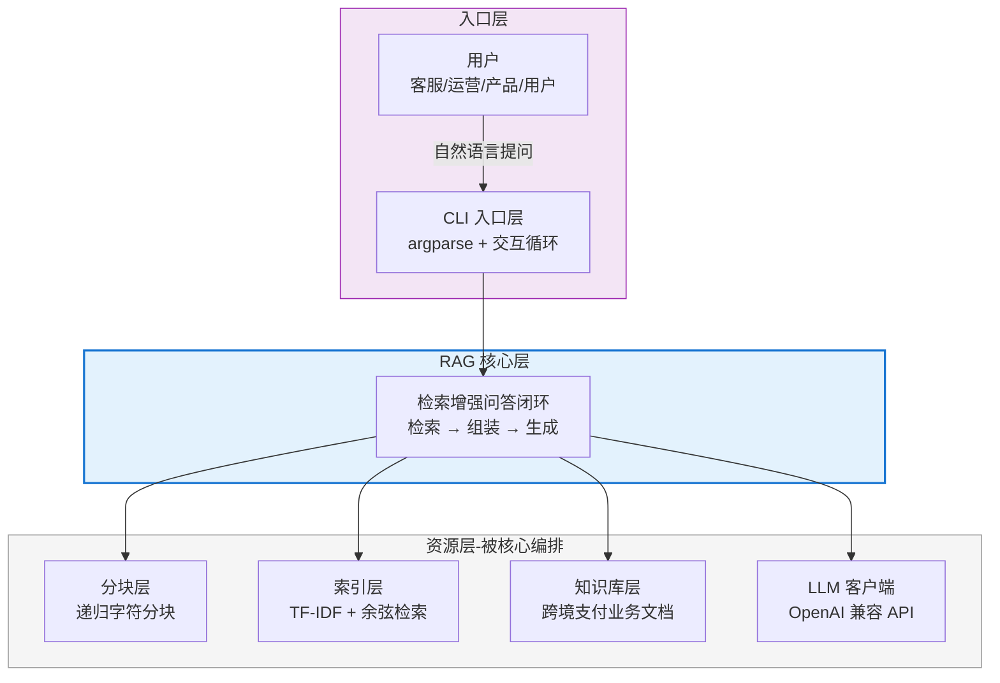
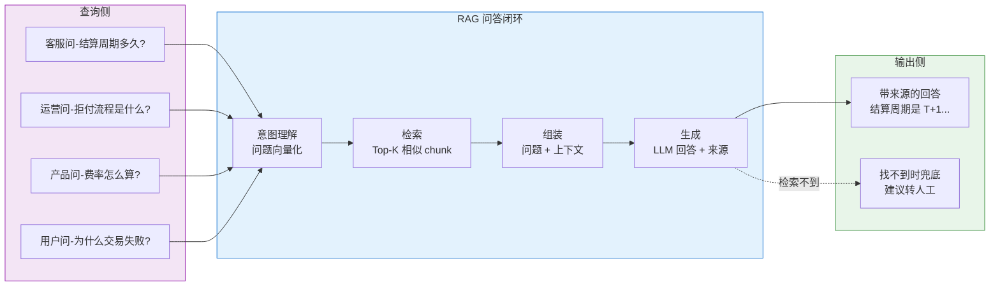
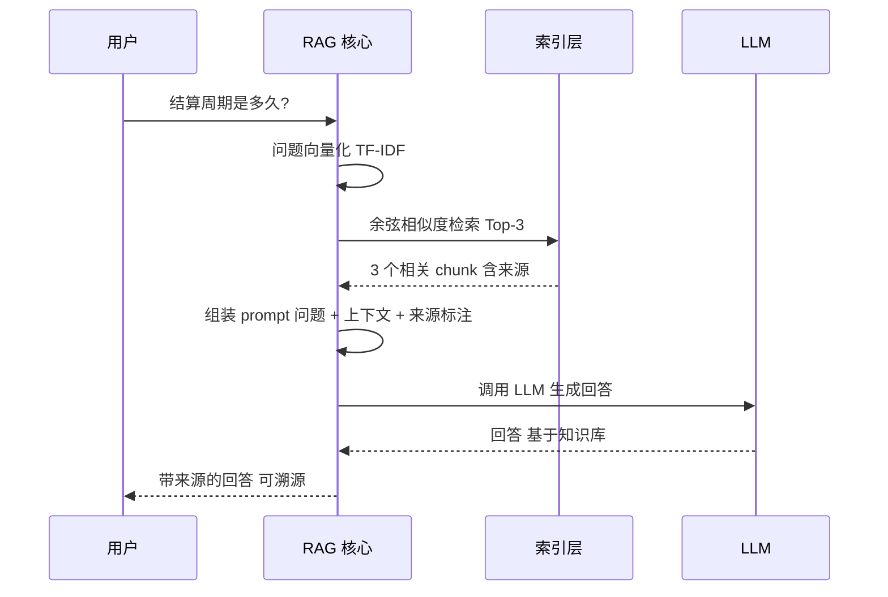
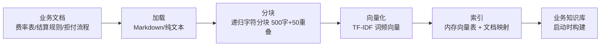
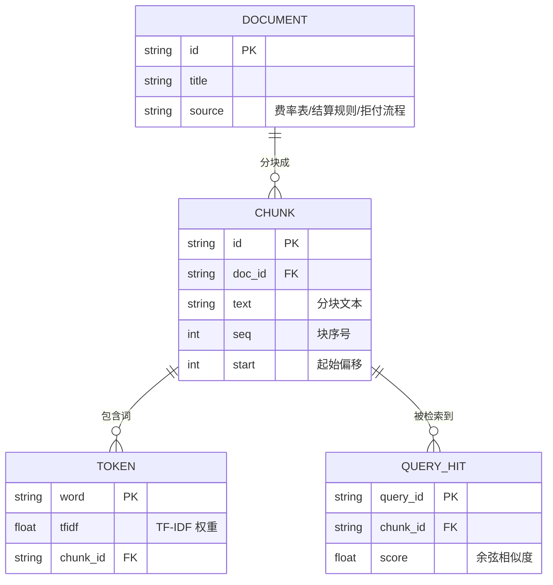
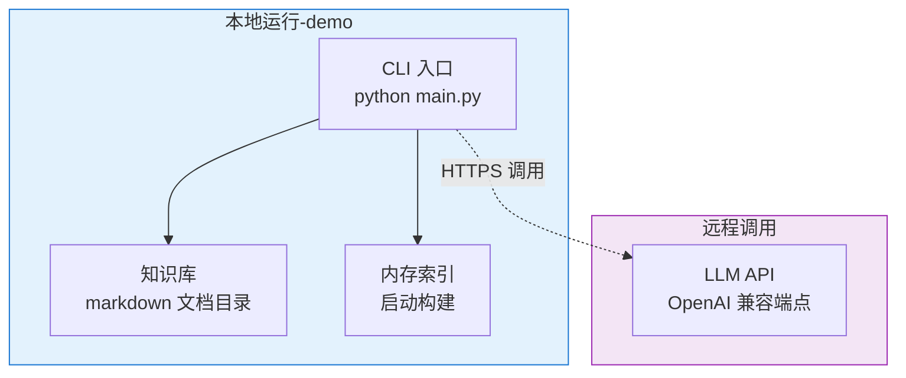

# §3 系统架构与技术选型

> **系列**：从零开始写一个 payment-rag-agent（整合层 demo 工程）
> **调研数据**：2026-08-23 当天实测（gh CLI star 数）
> **定位**：这是本 demo 的**重点篇**——架构设计决定了后面所有实现。讲清每个环节为什么这么设计——像做架构评审一样，但保持通俗易懂。

---

## 3.1 系统架构总览

**这张图只表达「分层结构」（谁在上层、谁依赖谁），不表达调用时序（时序在 3.2）。**

三层一句话：
- **入口层**（顶层）：接用户提问，转发给核心层——不碰业务逻辑
- **RAG 核心层**（中层，高亮）：唯一的编排者——决定检索什么、怎么组装、让谁生成
- **资源层**（底层）：被核心层调用的「能力」——分块/索引/知识库/LLM 各司其职，不知道全局

### 为什么这么分层？

**一句话**：把「RAG 该做什么」（检索增强问答）和「RAG 怎么做」（分块/向量化/检索/生成）分开——这是经典的分层架构思想，也是生产级 RAG 系统的基本形态。

**每一层的职责边界**（想清楚边界，后面实现才不会乱）：

| 层 | 职责 | 不做什么 | 通俗理解 |
|---|---|---|---|
| **CLI 入口层** | 接用户提问，分发任务 | 不碰检索/生成逻辑 | 前台接待员 |
| **RAG 核心层** | 编排闭环：检索 → 组装 → 生成 | 不关心分块/索引细节 | 项目经理 |
| **LLM 客户端** | 调用大模型生成回答 | 不决定检索策略 | 外包大脑 |
| **分块层** | 长文档切成检索粒度 | 不做向量化 | 切菜师傅 |
| **索引层** | 文本 → 向量 → 相似度检索 | 不生成回答 | 图书管理员 |
| **知识库层** | 存跨境支付业务文档 | 不决定用什么文档 | 资料室 |

**为什么「RAG 核心层」这么突出？**——它是**唯一有编排权**的层。查询来了，它决定：检索什么 → 拿几段 → 怎么组装 prompt → 让 LLM 生成。这就是「**编排（Orchestration）**」的思想：RAG 核心在中心，各环节（分块/索引/LLM）都是被它调用的「资源」。

**通俗比喻**：想象一个**项目经理（RAG 核心）**——
- 他接到提问（用户输入）
- 他让图书管理员（索引层）查资料
- 查到的资料他组装成 prompt
- 他交给外包大脑（LLM）写回答
- 回答他要附上「资料来源」（可溯源）

**这个分层在生产级（RAGFlow / LlamaIndex）也一样**——只是图书管理员更强（混合检索/向量库）、切菜更智能（语义分块）、资料室更大（百万级文档）。**理解了 demo 的分层，就理解了生产版的骨架。**

## 3.2 业务架构（查询链路）

### 一次问答的完整链路（时序图）

### 业务逻辑详解

**四类角色提问 → 同一个 RAG 闭环**——这是本 demo 的核心价值：客服/运营/产品/用户的问题虽然不同，但走的都是「检索 → 组装 → 生成」这条链路。知识库更新了，所有角色的答案一起更新。

**兜底策略**：检索不到相关内容时（相似度低于阈值），不硬答（避免幻觉），输出「建议转人工」——这是支付业务问答的合规底线。

## 3.3 数据架构（知识库怎么存）

### 文档摄入链路

### 数据模型（erDiagram）

**关键设计**：
- **文档 → 分块 → 词向量** 三级结构：文档是知识单元，分块是检索单元，词是匹配单元
- **来源可溯源**：每个 chunk 记录 doc_id + 序号——回答时能反查「这句话来自哪份文档」
- **内存索引**：demo 用内存向量表（启动时构建），生产换 FAISS/pgvector（§10 对比）

## 3.4 功能用例（Function Use Case）

| # | 用例 | 输入 | 处理 | 输出 |
|---|---|---|---|---|
| 1 | **知识库问答** | "结算周期是多久？" | 检索 → 组装 → 生成 | 带来源的回答 |
| 2 | **知识库构建** | 业务文档目录 | 加载 → 分块 → 向量化 → 建索引 | 可检索的知识库 |
| 3 | **检索不到兜底** | 无关问题 | 相似度低于阈值 | "建议转人工" |
| 4 | **来源溯源** | 任意回答 | 反查 chunk → 文档 | 回答 + 来源标注 |
| 5 | **知识库增量更新** | 新增文档 | 追加分块 → 增量索引 | 更新后的知识库 |
| 6 | **检索评估** | 测试问题集 | 召回率计算 | 评估报告 |

## 3.5 技术选型（核心 trade-off）

### 3.5.1 从零实现 vs 用框架（LlamaIndex/LangChain）

| 维度 | 从零实现（本 demo） | 框架（LlamaIndex 51.8K★） |
|---|---|---|
| **学习价值** | 每个环节原理透（分块/向量/检索/组装）| 黑盒，原理靠框架封装 |
| **代码量** | 300-500 行 | 50 行能跑 |
| **可控性** | 完全可控（改分块/检索/组装任意环节）| 受框架 API 约束 |
| **依赖** | requests 唯一 | 框架 + 一堆传递依赖 |
| **生产可用性** | demo 级 | 生产级 |
| **适合** | 理解原理 / 教学 / 面试 | 快速落地 / 生产 |

**为什么本 demo 选从零**：目标是「理解 RAG 怎么运作」——用框架 30 分钟能跑，但原理一片黑。从零实现要 2-3 周，但每个环节的「为什么」都变成自己的认知。**这是学习 demo，不是产品。**

### 3.5.2 TF-IDF vs Embedding API（检索方式）

| 维度 | TF-IDF（本 demo） | Embedding API |
|---|---|---|
| **原理** | 词频统计 + 逆文档频率，纯数学 | 神经网络语义编码 |
| **语义理解** | ❌ 同义词不识别（「轿车」≠「汽车」）| ✅ 语义相近向量相近 |
| **依赖** | 零外部依赖（标准库）| 调 API / 本地模型 |
| **成本** | 0 | 按 token 计费 |
| **中文效果** | 分词敏感（需分词处理）| 好（模型已学中文语义）|
| **适合** | 入门理解 / 小知识库 | 生产级 / 大知识库 |

**为什么本 demo 选 TF-IDF**：零依赖讲透「检索」本质（余弦相似度原理），且对齐 Java demo 的成熟思路。Embedding 放 §10 trade-off 详细对比。

### 3.5.3 全谱系选型（RAG 各方向怎么选）

| 技术方向 | 选不选 | 为什么 |
|---|---|---|
| **基础 RAG**（本 demo）| ✅ 选 | 最小闭环，理解运作 |
| **混合检索**（BM25+向量）| ⚠️ §6 演进 | 提高召回，但复杂度上升 |
| **纠正型 RAG** | ⚠️ §6 演进 | 检索质量反馈，生产进阶 |
| **智能体 RAG** | ⚠️ §6 演进 | 多跳检索，复杂场景 |
| **知识图谱 RAG**（GraphRAG）| ❌ §10 对比 | 实体关系挖掘，成本高 |
| **本地部署** | ❌ §10 对比 | 数据隐私场景才需要 |

## 3.6 部署架构

**部署形态**：CLI 工具本地跑，知识库本地存，只有 LLM 调用走远程 API。零服务端依赖——这是学习 demo 的最小部署形态。生产演进（Web 服务/向量库/多用户）放 §6。

---

## 📌 数据与事实声明

本文涉及的 GitHub star 数（LlamaIndex 51.8K★）为 2026-08-23 gh CLI 实测数据，会随时间变化。RAG 分层架构、TF-IDF 与 Embedding 对比、混合检索等是行业通用认知（来自 LlamaIndex/RAGFlow/anthropic-cookbook 公开文档）。分块参数（500 字 + 50 重叠）是本 demo 的初始配置示例，实际需按文档类型调优。业务场景描述（四类角色提问）是行业通用认知，非特定公司内部数据。

## 📚 参考资料

| 类型 | 标题 | 来源 |
|---|---|---|
| 开源项目 | LlamaIndex（文档 agent + RAG 框架） | github.com/run-llama/llama_index |
| 开源项目 | RAGFlow（生产级 RAG 引擎） | github.com/infiniflow/ragflow |
| 开源项目 | GraphRAG（微软知识图谱 RAG） | github.com/microsoft/graphrag |
| 官方文档 | RAG 指南（Anthropic） | docs.anthropic.com/en/docs/build-with-claude/rag |
| 官方文档 | Mermaid 图表语法（v11.16） | mermaid.nodejs.cn/intro/syntax-reference.html |
