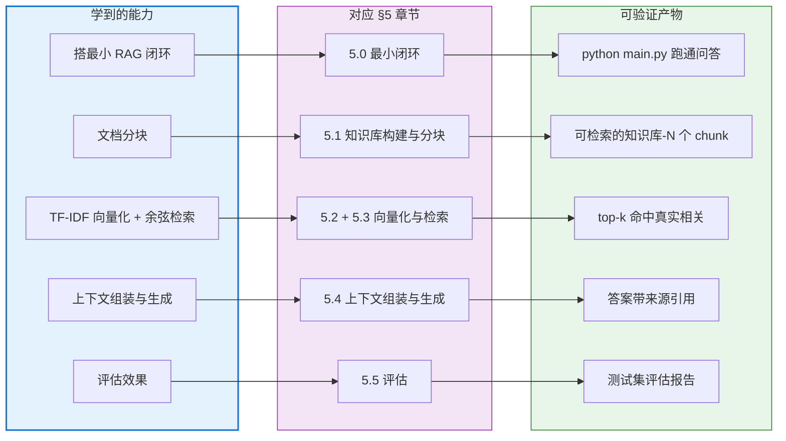

# §4 可以学会什么

> **系列**：从零开始写一个 payment-rag-agent（整合层 demo 工程）
> **定位**：读完 wiki + 代码 + 四件套，你能获得的能力清单——每项能力都有「能做什么 / 理解什么 / 可验证标准」，对照 §5 实现章节逐项落地。

---

## 读完这个 demo（wiki + 代码），你能获得的能力

### 能力 1：能搭一个最小 RAG 闭环（知识库 → 检索 → 生成）

- **能做什么**：从零写出「知识库 → 检索 → 生成」三段式闭环，用最少 2 个文件跑通——输入一个业务问题，输出一个引用知识库内容的答案。
- **理解**：RAG 为什么是「检索 + 生成」两步而不是一步？为什么检索必须在前、生成在后？为什么生成阶段要把检索结果拼进 prompt，而不是直接把问题丢给 LLM？这三问答清楚了，就理解了 RAG 区别于「纯 LLM 问答」的根本。
- **可验证**：`python main.py "结算周期是多久？"` 能返回答案，且答案内容来自知识库而不是模型凭空发挥。

**对应 §5.0 最小闭环**：这是整个 demo 的地基——先跑通，再拆细节。

### 能力 2：能讲清并实践文档分块（chunking）

- **能做什么**：把业务文档（费率说明 / 结算规则 / 拒付流程）切成粒度合适的 chunk，建出可检索的知识库。
- **理解**：为什么不能把整篇文档丢给检索？块太大——检索命中后上下文塞不下、精确度下降；块太小——语义被切断、上下文割裂。「500 字 + 50 重叠」这种初始参数为什么这么定、按什么信号调（文档类型 / 问答粒度 / 命中效果）。
- **可验证**：知识库里有 N 个 chunk，随便指一个能说出「这是什么内容、为什么这么切、切坏了会怎样」。

**分块粒度直觉**：费率说明这类「一条规则一段」的文档，天然按规则切（一个费率条目一个 chunk，问答时命中即答案）；拒付流程这类「步骤型」文档，按步骤段切（回答「拒付需要什么材料」时，能整段命中流程说明）；而「结算周期是多久」这类问答，粒度对齐到「能独立回答一个问题」即可。这个直觉比背参数更重要——分块是「让知识库的结构匹配问答粒度」的设计，不是机械切字。

**对应 §5.1 知识库构建与分块**：分块质量直接决定检索上限——检索再好也救不回切坏的知识库。

### 能力 3：能实现 TF-IDF 向量化 + 余弦相似度检索（纯 Python）

- **能做什么**：不依赖任何向量库和框架，用纯 Python 实现 TF-IDF 向量化 + 余弦相似度检索，输入问题返回 top-k 相关 chunk。
- **理解**：TF 衡量什么（词在文档里出现多频繁）、IDF 衡量什么（词在整个知识库里多稀缺）、为什么「结算」「周期」比「的」「是」重要；余弦相似度怎么把两个词频向量变成 0-1 之间的「相关度分数」。这套传统信息检索（IR）的底层逻辑，是向量检索（Embedding）的基石——懂了 TF-IDF，再看 Embedding 就是「换一种向量化方式」。
- **可验证**：输入「拒付需要提供什么材料？」能返回真正相关的 chunk（而不是返回一堆含「材料」但语义无关的碎片），并且你能徒手算出其中一个分数的来源。

**为什么先学 TF-IDF 再学 Embedding**：Embedding（向量数据库 / 语义检索）是 2026 年工业界的默认解，但它是个「黑盒」——模型把文字变成向量，你只知道相似度分数，不知道为什么。TF-IDF 是「白盒」——每个词贡献多少分，公式写在明面上。先写一遍白盒，再看黑盒就有坐标系：Embedding 解决的正是 TF-IDF 的「同义词不匹配」问题（「拒付」和「chargeback」在 TF-IDF 下零相关，在 Embedding 下相关），而这个差异必须站在 TF-IDF 的基础上才讲得清。这是本 demo 坚持纯 Python 从零实现的原因。

**对应 §5.2 / §5.3 向量化与检索**：从零实现的意义就在这里——每一步都看得见、算得出。

### 能力 4：能组装上下文并生成可溯源回答

- **能做什么**：把检索到的 chunk 组装成 prompt 上下文（指令 + 检索结果 + 用户问题），让 LLM 基于知识库作答，并给出答案的来源引用。
- **理解**：上下文组装为什么有固定结构——指令约束「只依据知识库回答、不知道就说不知道」，检索结果提供事实，问题是任务输入；回答为什么要可溯源（每个答案能指回知识库哪篇文档哪一节）；「上下文约束」怎么缓解 LLM 幻觉——不是消除，而是让模型「有据可依」。
- **可验证**：回答末尾带来源（如「来源：结算规则说明 第 2 节」），故意问知识库没有的问题，模型会「不知道」而不是编造。

**对应 §5.4 上下文组装与生成**：这一步把「检索出来的内容」变成「人话答案」，是用户直接感知质量的环节。

### 能力 5：能评估 RAG 效果（召回率 / 答案质量）

- **能做什么**：准备一组真实业务问题作为测试集，评估检索召回率和答案质量，定位问题出在哪个环节。
- **理解**：召回率衡量「该检索到的有没有检索到」（分块 / 向量化 / 检索三环节的体检）；答案质量衡量「生成的对不对」（组装 / 提示词 / 模型选择的问题）；怎么通过评估结果反推改进点——召回低改分块或检索，答案错改上下文组装或提示词。
- **可验证**：能给出测试集上的评估结果（召回率数字 + 抽样答案评分），并说出 1-2 个基于评估的改进动作。

**评估指标怎么选**：对检索环节，最常用的是召回率@k——「前 k 个结果里，该命中的有没有命中」；对生成环节，答案质量没有标准分数，业界常用「人工抽样打分 + 关键信息点命中检查」（答案里有没有覆盖问题的每个要点）。本 demo 用一组 10-20 条真实业务问题做测试集，就能建立「改了一版分块/检索，效果是变好还是变坏」的对照能力——这是任何 RAG 项目迭代的地基。

**对应 §5.5 评估**：没有评估的 RAG 是「感觉还行」，有评估的 RAG 是「知道哪里不行」——这是从 demo 走向可用的分水岭。

---

## 能力地图：5 项能力 → §5 实现章节 → 可验证产物

> 本图只表达「能力 → 章节 → 产物」的映射关系，不表达实现细节——每一步怎么实现，在 §5 对应章节逐个展开。

---

## 与场景 / 业务的关联

| 能力 | 跨境支付场景（本 demo 业务锚点） | 信贷场景（同一套能力的复用） |
|---|---|---|
| 搭最小闭环 | 客服问答 MVP：费率 / 结算 / 拒付 FAQ 自动答 | 贷款产品 FAQ 自动答（额度 / 利率 / 还款方式）|
| 文档分块 | 费率表 / 结算规则 / 拒付流程文档入库 | 借款协议 / 还款计划 / 合规条款入库 |
| TF-IDF 检索 | 无 GPU、低成本的检索方案（中小团队够用）| 内部知识检索：合规条款快速定位 |
| 上下文组装 | 回答带来源引用——金融问答答错要能追责（合规刚需）| 审核意见引用条款原文，可追溯 |
| 评估效果 | 上线前验证回答准确率，避免答错引发投诉 | 风控问答误答风险控制（答错可能误导决策）|

**为什么这套能力在金融业务里格外值钱**：金融是「答错有代价」的行业。客服答错费率——用户投诉；风控答错规则——可能放错款。RAG 的「检索 + 可溯源」特性正好对冲这个风险：答案有出处、错了能追、改了能测。这就是本 demo 选跨境支付作为业务锚点的原因——不是随便找一个场景，而是找一个「可溯源是刚需」的场景，让每个技术环节都带着业务意义。

**这套能力离开支付/信贷还能去哪**：知识问答的能力组合是可迁移的——法律条款问答（法务知识库）、人力制度问答（HR 自助服务）、运维手册问答（故障排查引导）、产品文档问答（开发者支持）。凡是「文档多、问题重复、回答要靠谱」的场景，都是同一套「分块 → 索引 → 检索 → 组装 → 评估」打法。学的是这套骨架，业务锚点只是第一次实战的载体。

---

## 一句话总结

**做完这个 demo，你从「会用 RAG 工具」变成「能写 RAG 工具」**——核心是分块、向量化、检索、组装、评估五件事，以及「麻雀虽小五脏俱全」的工程判断力。五件事对应五个可验证产物：跑通闭环 → 建好知识库 → 检索命中 → 可溯源回答 → 评估报告。每一项都指向 §5 的一个章节，下一步就动手把它们一个个做出来。

---

## 📌 数据与事实声明

本文的业务场景描述（跨境支付四类角色高频提问）是行业通用认知，非特定公司内部数据。TF-IDF、余弦相似度是信息检索领域的经典算法（业界共识，非本 demo 发明）；分块参数（500 字 + 50 重叠）是本 demo 的初始配置示例，实际需按文档类型和问答粒度调优。「RAG 上下文约束缓解幻觉」是行业通用做法，不是绝对消除——模型仍可能出错，评估与人工兜底不可省略。

## 📚 参考资料

| 类型 | 标题 | 来源 |
|---|---|---|
| 论文 | Retrieval-Augmented Generation for Knowledge-Intensive NLP Tasks（Lewis et al., 2020）| arxiv.org/abs/2005.11401 |
| 论文 | Term-weighting approaches in automatic text retrieval（Salton & Buckley, 1988）| 信息检索经典论文（TF-IDF 起源）|
| 行业文档 | RAG 指南（Anthropic，检索增强生成最佳实践）| docs.anthropic.com/en/docs/build-with-claude/rag |
| 开源项目 | LlamaIndex（文档 agent + RAG 框架，本 demo 的对比参考）| github.com/run-llama/llama_index |
