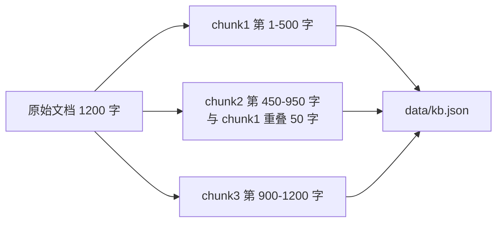

# §5 实现方案与思考·上：从最小闭环到知识库

> **系列**：从零开始写一个 payment-rag-agent（整合层 demo 工程）
> **定位**：带你把 §4 列出的能力一项项做出来。上篇先解决两件事——跑通最小闭环建立「我做到了」的信心，再把业务文档变成可检索的知识库。中篇做向量化与检索（5.3/5.4），下篇做组装、评估与验收（5.5-5.8）。
> **本篇目标**：能运行 `python main.py "结算周期是多久？"` 得到答案，能运行 `python build_kb.py` 把文档切成知识库。理解了「检索是什么」「生成是什么」两个核心概念。

---

## 5.0 先跑通最小闭环（理解 + 动手）

> **目标**：先让 RAG 动起来，建立「我做到了」的信心，再逐步深入。
> **核心**：不是复制粘贴代码，而是**跟着思路自己写一遍**——写的过程 = 理解机制的过程。
> **本 demo 的目标**：理解 RAG 是怎么运作的 + 提高自己的动手能力。

### 5.0.1 环境准备（3 步）

```bash
# 1. 确认 Python 3.10+（demo 用 f-string 等现代语法）
python3 --version

# 2. 建项目目录 + 虚拟环境
mkdir payment-rag-agent && cd payment-rag-agent
python3 -m venv .venv
source .venv/bin/activate

# 3. 装唯一依赖（LLM 调用）+ 配 API Key
pip install requests
export OPENAI_API_KEY="你的key"
```

只依赖 `requests` 一个库——向量化、检索、分块全部用标准库手写。这就是「白盒优先」：先自己实现一遍，理解原理后，再去对比 LlamaIndex 这种框架（那是 §6 的事）。

### 5.0.2 目录结构（心里有数）

**先看整体有哪些文件**（每个文件后面会逐个实现）：

```
payment-rag-agent/
├── data/
│   └── 支付文档.md      ← 原始业务文档（模拟客服知识库，5.2 讲）
├── build_kb.py         ← 知识库构建：文档 → chunk（5.2 实现）
├── build_index.py      ← TF-IDF 向量化（5.3 实现）
├── search.py           ← 余弦相似度检索（5.4 实现）
├── llm.py              ← LLM 客户端：HTTP POST（本篇实现）
├── main.py             ← CLI 入口：检索 + 组装 + 生成（本篇最小版，5.5 完整版）
└── evaluate.py         ← 评估：召回率 / 答案质量（5.6 实现）
```

**理解要点**：这 7 个文件 = 一个 RAG 的全部组成。**每个文件对应一个职责**——这就是「分而治之」：先看清整体，再逐个攻破。本篇先实现 `llm.py`、`main.py`（最小版）、`build_kb.py`，其余文件在中篇和下篇逐个出现。

### 5.0.3 最小闭环：2 个文件跑通

**目标**：先写**最少的 2 个文件**，让「问一个问题 → 得到知识库支撑的答案」跑通——**先动起来，理解 RAG 两个核心概念**。

**第 1 步**：写 `llm.py`——**理解点：LLM 调用就是一个 HTTP POST**

```python
# llm.py
import os, requests

def chat(prompt, messages=None):
    """调用大模型。最小理解：LLM 调用就是一个 HTTP POST。"""
    msgs = messages or [{"role": "user", "content": prompt}]
    resp = requests.post("https://api.openai.com/v1/chat/completions",
        headers={"Authorization": f"Bearer {os.environ['OPENAI_API_KEY']}"},
        json={"model": "gpt-4o-mini", "messages": msgs})
    return resp.json()["choices"][0]["message"]["content"]
```

**动手要点**：自己敲一遍（不是复制）——感受「LLM = 一个 HTTP 接口，传 messages 返回文本」。换成任意 OpenAI 兼容服务（DeepSeek、通义等）只改 base_url 和 model，其余不动。

**第 2 步**：写 `main.py`——**理解点①：检索 = 算相似度；理解点②：生成 = 带上下文的 LLM 调用**

```python
# main.py
import sys
from llm import chat

# 最小知识库：3 条规则，每条 = 一个关键词 → 一段答案（5.2 会升级为完整文档分块）
RULES = [
    ("结算", "跨境收单的结算周期通常是 T+1，遇节假日顺延。"),
    ("拒付", "拒付需要提供交易凭证、发货凭证和客户沟通记录。"),
    ("费率", "跨境交易费率按收单币种和卡组织计算，一般在 1.5%-3%。"),
]

def retrieve(question):
    """最简检索：关键词匹配（5.3/5.4 会升级为 TF-IDF + 余弦相似度）"""
    for keyword, doc in RULES:
        if keyword in question:
            return doc
    return None

def main():
    question = sys.argv[1] if len(sys.argv) > 1 else "结算周期是多久？"
    context = retrieve(question)                 # ① 检索：从知识库找相关内容
    if context is None:
        print("知识库里没有相关内容，请换个问法。")
        return
    prompt = f"""你是跨境收单客服助手，只能根据下面这段资料回答：

{context}

问题：{question}
如果资料里没有答案，就说不知道。"""
    print(chat(prompt))                          # ② 生成：带上下文的 LLM 调用

if __name__ == "__main__":
    main()
```

**动手要点**：看 main 的 3 行骨架——`retrieve(question)` 是检索，拼 prompt 是组装，`chat(prompt)` 是生成。**RAG 的所有版本都是这三步**，后面只是把每一步做得更聪明。

**第 3 步**：跑通（最小闭环完成）

```bash
python main.py "结算周期是多久？"
# → 跨境收单的结算周期通常是 T+1，遇节假日顺延。（LLM 按资料回答）
```

**✅ 最小闭环跑通**——你已经理解了两件事：

1. **检索 = 算相似度**：问题跟知识库哪条最像，就把哪条捞出来（先关键词匹配，5.3/5.4 升级成 TF-IDF + 余弦）
2. **生成 = 带上下文的 LLM 调用**：把「检索到的资料 + 问题」拼进 prompt 再问 LLM，LLM 的答案被资料约束住，不会凭空发挥

### 5.0.4 最小闭环 = 真 RAG 吗？

**是，但骨架很弱**。结构上它已经完整：检索在前、生成在后、答案受上下文约束——这正是 RAG 区别于「纯 LLM 问答」的根本。但检索器是关键词匹配，脆弱得很：

```
python main.py "钱什么时候到账？"
# → 知识库里没有相关内容，请换个问法。
```

同一个意思，换种说法就失灵——「结算」两个字没出现。知识库也只有 3 条硬编码，不是真文档。

**所以后面的章节做两件事**：5.2 把 3 条硬编码升级成真文档知识库（分块）；5.3/5.4 把关键词匹配升级成 TF-IDF + 余弦相似度。**闭环不变，只换检索器**——这就是分而治之的好处：每一块都能独立升级。

---

## 5.1 全局地图（自上而下）

先看整体再深入细节。完整 demo 的数据流：


**模块划分**（每个文件对应图上一步）：

| 文件 | 职责 | 实现章节 |
|---|---|---|
| data/支付文档.md | 原始业务文档（模拟客服知识库） | 5.2 |
| build_kb.py | 文档 → chunk（分块） | 5.2 |
| build_index.py | chunk → TF-IDF 向量 | 5.3 |
| search.py | 余弦相似度检索 top-k | 5.4 |
| llm.py | LLM 客户端（HTTP POST） | 5.0 |
| main.py | CLI 入口：检索 + 组装 + 生成 | 5.0 最小版 / 5.5 完整版 |
| evaluate.py | 评估（召回率 / 答案质量） | 5.6 |

**设计思考：为什么拆成这 5 步？** 对应 §3 架构里的 RAG 三段式——**索引**（分块 + 向量化，把文档变成可比较的数字）、**检索**（相似度，找最相关的块）、**生成**（组装 + LLM，让答案有据可依）。5 步 = 3 段的落地展开，每一步都能独立实现、独立验证，这也是后面几篇的推进顺序：上篇做索引的「分块」，中篇做索引的「向量化」+「检索」，下篇做「生成」+ 评估验收。

---

## 5.2 跨境支付知识库构建与分块

### 5.2.1 业务文档从哪来

RAG 的第一步是「有知识」。真实场景里，知识库 = 产品文档、FAQ、工单沉淀；本 demo 用一份脱敏改写的模拟客服文档 `data/支付文档.md`，覆盖跨境收单四类高频问题：**费率、结算周期、拒付、汇率**。文档长这样：

```markdown
# 跨境收单支付常见问题（示例文档，脱敏改写）

## 结算
跨境收单的结算周期通常是 T+1，遇节假日顺延。结算币种与入账币种不一致时，
按结算日汇率折算，汇率以结算机构当日牌价为准。……

## 拒付
拒付（chargeback）是持卡人向发卡行发起争议后，收单机构被要求退回交易金额。
拒付需要提供交易凭证、发货凭证和客户沟通记录，材料提交时效为 7 个自然日。……

## 费率
跨境交易费率按收单币种和卡组织计算，一般在 1.5%-3%。……
```

> 提示：示例文档为脱敏改写，不含任何真实业务数据。你写 demo 时也可以用自己的业务文档，原则一样。

### 5.2.2 为什么要分块（chunk）

**为什么不把整篇文档直接塞给 LLM？** 两个原因：

1. **上下文超限**：文档几千字，prompt 塞不下，成本也高
2. **相关性稀释**：问「结算周期」，整篇文档只有一小段相关——把无关段落全塞进去，LLM 反而抓不住重点

所以要先**分块**：把长文档切成小块，每块独立编号，检索时按「块」比按「篇」精准——问题通常只跟文档里一小段相关。检索返回最相关的块，只把这一块拼进 prompt。

### 5.2.3 分块规则：500 字 + 50 字重叠

初始参数：**每块 500 字，相邻块重叠 50 字**：



**为什么重叠？** 信息可能横跨切块边界——比如「结算周期 T+1」这句话被切成两半，检索哪一半都不完整。重叠 50 字保证边界处的信息在相邻块里各出现一次，不管问题命中哪一块都能拿到完整上下文。

**看一个真实衔接**：chunk1 结尾是「……按结算日汇率折算」，chunk2 开头重复这 50 字再接后续内容——「结算 + 汇率」这条跨块信息就不会被切断。

### 5.2.4 实现 build_kb.py（关键代码）

```python
# build_kb.py
import json

def chunk_text(text, size=500, overlap=50):
    """长文档切成 500 字一块、相邻重叠 50 字"""
    return [text[i:i+size] for i in range(0, len(text), size - overlap)]

if __name__ == "__main__":
    docs = open("data/支付文档.md", encoding="utf-8").read()
    chunks = [{"id": i, "text": c} for i, c in enumerate(chunk_text(docs))]
    json.dump(chunks, open("data/kb.json", "w", encoding="utf-8"),
              ensure_ascii=False, indent=2)
    print(f"生成 {len(chunks)} 个 chunk")
```

**动手要点**：核心只有一行 `text[i:i+size]`——从 0 开始每 450 字（500-50）取 500 字，天然带重叠。`kb.json` 是后面所有环节的数据源：每块一个 `id` + `text`，检索命中的就是这里的块。

**✅ 可运行结果**：

```bash
python build_kb.py
# → 生成 20 个 chunk（示例文档约 9000 字）
# data/kb.json: [{"id": 0, "text": "..."}, {"id": 1, "text": "..."}, ...]
```

### 设计思考：分块粒度怎么选

500 字是**初始参数**，不是真理。粒度要**对齐问答**：

- 费率类问题：答案就一段规则 → 块可以小（按规则切）
- 流程类问题：答案跨多个步骤 → 块要能装下完整步骤（按流程切）
- 块太小 → 上下文碎片化，答案缺背景；块太大 → 检索命中不精准、prompt 浪费 token

纯按字数切是最朴素的做法，生产上会按标题/段落边界做语义切分。demo 先用固定长度跑通——5.6 评估时，召回率会反过来告诉你这个参数要不要调。**这就是「先跑通、再调优」的工程节奏**。

---

## 小结（本篇完成什么）

你已经拥有了三样东西：

1. **最小闭环**：`python main.py "结算周期是多久？"` 能跑出答案，理解了检索 + 生成两个核心概念
2. **全局地图**：7 个文件、5 步数据流、每步对应哪个章节，心里有数
3. **真知识库**：`python build_kb.py` 把文档切成了 20 个 chunk，`data/kb.json` 就位

但检索器还是关键词匹配，「钱什么时候到账？」依然答不上来。**下一篇（§5 中）就把检索器升级成向量化检索**：5.3 用 TF-IDF 把 chunk 变成向量，5.4 用余弦相似度算出「问题最像哪一块」。闭环不变，检索器变聪明。

---

## 📌 数据与事实声明

本文的业务文档（`data/支付文档.md`）为脱敏改写的模拟客服知识库，覆盖费率、结算周期、拒付、汇率四类跨境收单高频问题，不含任何真实公司内部数据；分块参数（500 字 + 50 字重叠）是本 demo 的初始配置示例，实际需按文档类型和问答粒度调优，属行业通用做法。LLM 调用示例使用 OpenAI 兼容接口（`requests` 直连），可替换任意兼容服务，非本 demo 特有实现。最小闭环中的关键词匹配检索仅用于理解「检索 = 匹配」的本质，不代表生产可用水平。

## 📚 参考资料

| 类型 | 标题 | 来源 |
|---|---|---|
| 论文 | Retrieval-Augmented Generation for Knowledge-Intensive NLP Tasks（Lewis et al., 2020）| arxiv.org/abs/2005.11401 |
| 行业文档 | RAG 指南（Anthropic，检索增强生成最佳实践）| docs.anthropic.com/en/docs/build-with-claude/rag |
| 开源项目 | LlamaIndex（文档 agent + RAG 框架，本 demo 的对比参考）| github.com/run-llama/llama_index |
