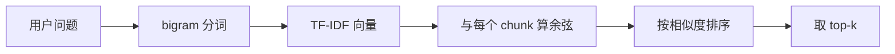

# §5 实现方案与思考·中：向量化与检索

> **系列**：从零开始写一个 payment-rag-agent（整合层 demo 工程）
> **定位**：上篇把业务文档切成了 20 个 chunk，但检索器还是关键词匹配——「钱什么时候到账？」换个说法就失灵。本篇解决这个问题：5.3 用 TF-IDF 把 chunk 变成向量，5.4 用余弦相似度算出「问题最像哪一块」。闭环不变，检索器变聪明。
> **本篇目标**：能运行 `python build_index.py` 得到向量索引，能运行 `python search.py "拒付需要什么材料"` 得到 top-3 命中的 chunk。

---

## 5.3 TF-IDF 向量化（纯 Python）

### 5.3.1 为什么要把文本变成向量

检索的本质是「算相似度」，但**文本不能直接算相似度**——「结算周期是多久」和「钱什么时候到账」都是字符串，怎么比较像不像？

答案是**变成向量**：把每段文本转换成一串数字，用数学方法比较。向量化是检索的地基——这一步做得对不对，直接决定「问题像哪块文档」算得准不准。

### 5.3.2 TF：这个词在文档里有多重要（词频）

**TF（Term Frequency，词频）**：一个词在文档里出现的次数占比。直觉：**出现越多的词越能代表这篇文档**。

```
chunk0（讲结算）：  结算 3 次、汇率 2 次、周期 1 次 → TF 结算 = 3/6 = 0.5
chunk1（讲拒付）：  拒付 3 次、凭证 2 次、材料 1 次 → TF 拒付 = 3/6 = 0.5
chunk2（讲费率）：  费率 3 次、币种 2 次、卡组织 1 次 → TF 费率 = 3/6 = 0.5
```

### 5.3.3 IDF：这个词有多稀有（逆文档频率）

光看 TF 不够——「的」「了」「交易」这种词每篇都有，TF 再高也没区分度。**IDF（Inverse Document Frequency，逆文档频率）**解决这个问题：**一个词在越少的文档里出现，它越稀有、越有区分度**。

```
IDF(词) = ln(总文档数 / 含这个词的文档数 + 1) + 1

结算：只有 chunk0 有 → ln(3/2) + 1 ≈ 1.41
交易：三个 chunk 都有 → ln(3/4) + 1 ≈ 0.71   （稀有度低，权重低）
```

> 为什么 `+1`？防止「所有文档都有这个词」时除数为 0，这是标准平滑处理。

### 5.3.4 TF-IDF：两者相乘

**TF-IDF = TF × IDF**——「在本文档里出现得多」×「在其他文档里出现得少」的词，才真正代表这篇文档：

```
chunk0 的「结算」= 0.5 × 1.41 ≈ 0.71   ← 权重最高，最能代表 chunk0
chunk0 的「交易」= 0.17 × 0.71 ≈ 0.12  ← 哪篇都有，权重很低
```

每个 chunk 的所有词算完 TF-IDF，就得到一个**向量**（一个 `{词: 权重}` 的稀疏字典）——这就是文本的数字形态。

**拿 chunk0 完整走一遍**（微型示例：chunk0 含「结算、汇率、交易」3 个词，全库 3 个 chunk，其中「交易」三个 chunk 都有）：

| 词 | TF | IDF | TF-IDF |
|---|---|---|---|
| 结算 | 2/4 = 0.5 | ln(3/2) + 1 ≈ 1.41 | 0.71 |
| 汇率 | 1/4 = 0.25 | ln(3/2) + 1 ≈ 1.41 | 0.35 |
| 交易 | 1/4 = 0.25 | ln(3/4) + 1 ≈ 0.71 | 0.18 |

「结算」权重最高——**它在本篇出现多，且不是每篇都有**；「交易」每篇都有 → IDF 只有 0.71 → 权重被压到 0.18。**一个词的权重 = 「在本文档多常见」×「在全库多稀有」**，这就是 TF-IDF 的全部直觉。

### 5.3.5 实现 build_index.py（关键代码）

中文分词不引第三方库，用**相邻两字切分（bigram）**——「结算周期」→ `[结算, 算周, 周期]`，简单但能把「结算」「拒付」这类业务词准确切出来：

```python
# build_index.py
import json, math

def tokenize(text):
    """中文按相邻两字切（bigram），英文数字保留"""
    chars = [c for c in text.lower() if c.isalnum()]      # 去标点
    return [chars[i] + chars[i+1] for i in range(len(chars) - 1)]

def tfidf(text, df, n_docs):
    """一行向量化：TF × IDF"""
    words = tokenize(text)
    tf = {w: words.count(w) / len(words) for w in set(words)}       # 词频占比
    return {w: cnt * (math.log(n_docs / (df.get(w, 0) + 1)) + 1)
            for w, cnt in tf.items()}                                # 乘 IDF

# 主流程：读 kb.json → 统计词文档频率 df → 每个 chunk 向量化 → 存 index.json
```

主流程三步（读 `kb.json` → 统计每个词出现在几个 chunk 里 → 每个 chunk 调用 `tfidf()` 得到向量）组装起来，输出 `index.json`：每个 chunk 的 `id`、原文和向量。

**动手要点**：`tfidf()` 返回的向量就是一个普通 dict——`{"结算": 0.71, "汇率": 0.55, ...}`。**向量不是魔法，就是数字**。

**✅ 可运行结果**：

```bash
python build_index.py
# → 向量化完成：20 个 chunk → index.json（含词表 + 每个 chunk 的向量）
```

### 设计思考：为什么先学 TF-IDF，不直接用 Embedding

因为 TF-IDF 是**白盒**：公式可见、能手算、出问题能查——它让你理解「检索 = 数学比较」的本质。Embedding（向量嵌入模型）是**黑盒**：效果更好，但模型把语义压进几百维数字，不好 debug。

学习路径：**白盒跑通 → 再换黑盒**。§6 演进篇会把 TF-IDF 换成 Embedding + 向量数据库，那时你已经知道「换了什么、为什么更好」。生产系统基本都是 Embedding，但 TF-IDF 是理解地基——地基不牢，换什么模型都是糊的。

---

## 5.4 余弦相似度检索

### 5.4.1 余弦相似度原理

有了向量，怎么比「像不像」？**余弦相似度**：两个向量的夹角越小，方向越一致，越相似。

```
cos(A, B) = A·B / (|A| × |B|)
```

直觉理解：把每篇文档的 TF-IDF 向量想象成空间里的一支箭。**问「拒付需要什么材料」**，问题向量化后指向「拒付、材料、凭证」的方向——哪个 chunk 的箭也指向这个方向，谁就跟问题最像：



**看一个具体结果**（示意数值）：

| 候选 chunk | 相似度 | 排名 |
|---|---|---|
| chunk1（拒付）| 0.82 | 1 |
| chunk2（费率）| 0.11 | 2 |
| chunk0（结算）| 0.05 | 3 |

「拒付」bigram 与 chunk1 高度重合 → 0.82 一骑绝尘。**这就是检索：算一遍相似度，排个序，取前面几个**。

0.82 怎么来的？问题「拒付需要什么材料」向量化后指向 `{"拒付": 0.35, "材料": 0.30, "凭证": 0.20, ...}`，chunk1 的向量指向 `{"拒付": 0.41, "凭证": 0.28, "材料": 0.22, ...}`——两个向量在「拒付、凭证、材料」这几个高权重维度上方向一致，余弦算出 0.82。而 chunk0 的向量集中在「结算、汇率」，跟问题几乎没有共同维度，只有 0.05。**相似度高 = 共同的高权重词多**。

### 5.4.2 为什么不用欧氏距离

向量比较最常用的两个指标：欧氏距离（直线距离）和余弦相似度（夹角）。这里选余弦，因为：

- **欧氏距离受文档长度影响**：长文档词频高、向量长，天然距离远——「内容像」但「长度不像」会被冤枉
- **余弦只看方向**：词的比例像不像，跟文档长短无关——检索关心「内容像不像」，用余弦

直觉：两个向量方向越一致越相似，即使一个长一个短。**检索场景选余弦是业界共识**。

### 5.4.3 实现 search.py（关键代码）

```python
# search.py
import json, math, sys
from build_index import tfidf

def cos(a, b):
    """余弦相似度：方向越一致分越高"""
    dot = sum(a.get(w, 0) * b.get(w, 0) for w in set(a) | set(b))
    na = math.sqrt(sum(v * v for v in a.values()))
    nb = math.sqrt(sum(v * v for v in b.values()))
    return dot / (na * nb) if na and nb else 0.0

def search(question, index, k=3):
    """检索主流程：查询向量化 → 逐个算余弦 → 排序取 top-k"""
    qv = tfidf(question, index["df"], index["n_docs"])
    scores = sorted(((cos(qv, c["vec"]), c["id"]) for c in index["chunks"]),
                    reverse=True)
    return scores[:k]
```

**动手要点**：`cos()` 两行核心——分子算「共同方向的分量」，分母做归一化。问题向量化用**同一个 `tfidf()`**（词表必须一致，否则没得比）。

**✅ 可运行结果**：

```bash
python search.py "拒付需要什么材料"
# → [(0.82, 1), (0.11, 2), (0.05, 0)]   ← top-3：chunk1 最相关
```

### 5.4.4 检索的「一系列检查」（都在哪？）

新手以为「向量化 → 算余弦 → 完事」，但**每一步都有检查**——任何一个失败都要优雅处理（返回提示，不崩溃）：

| # | 检查 | 在哪 | 检查什么 | 失败怎么办 |
|---|---|---|---|---|
| ① | **查询预处理** | search() 开头 | 查询是否为空 / 纯标点 | 直接返回空，提示换问法 |
| ② | **向量有效性** | 查询向量化后 | 词表里一个词都没命中 | 返回空，提示换问法 |
| ③ | **空结果检查** | 排序后 | top-k 是否为空 | 返回「知识库无相关内容」 |
| ④ | **阈值检查** | 返回前 | 最高分是否低于阈值 0.1 | 返回「资料不足，无法回答」 |
| ⑤ | **top-k 校验** | 切片前 | k 是否超过 chunk 总数 | 截断为 chunk 总数 |

**关键原则：任何检查失败都不崩溃，而是给出明确提示**——这是 RAG 健壮性的核心。尤其④：**最高分太低说明知识库里根本没有相关答案，宁可说不知道，也不能硬答**——这是 RAG 防幻觉的第一道闸（§5.5 组装时第二道闸是 prompt 约束）。

**看一个被阈值拦下的实际例子**：

```bash
python search.py "股票今天涨了没有"
# → 最高相似度 0.02 < 阈值 0.1 → 返回「资料不足，无法回答」
```

「股票」在词表里根本没出现过（知识库只讲跨境收单），所有 chunk 相似度都接近 0——如果不拦，检索会硬挑一个「最像」的（0.02 的最像 = 瞎猜），LLM 就会拿费率文档硬答股票问题。**阈值是防幻觉的第一道闸，谁拦下都不心疼**。

### 设计思考：top-k 和阈值怎么定

- **k = 3**：答案一般来自 1-2 个 chunk，k=3 留余量（漏检一个也能兜住）
- **阈值 0.1**：低于它视为「查无此答案」。定太松（0.5）好答案被拦，定太紧（0.01）什么都像答案——0.1 是初始值，靠 5.6 评估调优
- **生产演进**：k 和阈值要跟业务绑定——金融问答宁可「说不知道」也不允许编造，阈值会偏严；内部文档检索可以偏松（答错成本低）

---

## 小结（本篇完成什么）

检索器已经从「关键词匹配」升级成「向量化检索」：

1. **向量化**：`build_index.py` 用 TF-IDF（白盒公式）把 20 个 chunk 变成向量，存进 `index.json`
2. **检索**：`search.py` 把问题也向量化，与每个 chunk 算余弦相似度，取 top-3
3. **检查链**：5 个检查（预处理/向量有效性/空结果/阈值/top-k）保证任何失败都优雅返回——**宁可说不知道，不硬答**

上篇的「钱什么时候到账？」现在能答上了——「到账」的 bigram 会指向结算相关的 chunk，跟「结算周期是多久？」命中同一块。

但检索出 top-3 只是中间产物，**答案还没出来**。下篇（§5 下）做最后一段：5.5 把 top-k 组装成 prompt 交给 LLM（带来源约束），5.6 评估召回率与答案质量，5.7-5.8 组装命令级 + 完整验收。

---

## 📌 数据与事实声明

TF-IDF（Salton & Buckley, 1988 经典算法）与余弦相似度为信息检索领域通用方法，非本 demo 发明；5.4.1 的相似度数值（0.82/0.11/0.05）为教学示意值，实际数值取决于文档与分词方式。bigram（相邻两字）分词是教学简化方案，生产环境通常使用 jieba 等分词器或直接使用 Embedding 模型，本 demo 刻意不引第三方分词库以保持白盒可读。阈值 0.1 与 top-k=3 为初始配置，需经 §5.6 评估调优。

## 📚 参考资料

| 类型 | 标题 | 来源 |
|---|---|---|
| 论文 | Term-weighting approaches in automatic text retrieval（Salton & Buckley, 1988）| 信息检索经典论文（TF-IDF 起源）|
| 教材 | Introduction to Information Retrieval（Manning, Raghavan & Schütze）| nlp.stanford.edu/IR-book/ |
| 行业文档 | RAG 指南（Anthropic，检索增强生成最佳实践）| docs.anthropic.com/en/docs/build-with-claude/rag |
