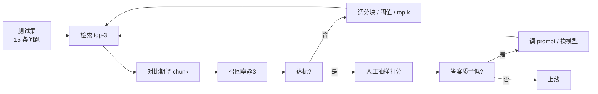

# §5 实现方案与思考·下：组装、评估与验收

> **系列**：从零开始写一个 payment-rag-agent（整合层 demo 工程）
> **定位**：中篇检索出了 top-3，但**答案还没出来**。本篇走完最后一段：5.5 把检索结果组装成 prompt 交给 LLM（带来源约束），5.6 用测试集评估召回率与答案质量，5.7 命令级组装，5.8 完整验收。三篇读完，一个能跑的 CLI RAG demo 就齐了。
> **本篇目标**：能运行 `python main.py "结算周期是多久？"` 得到带来源的答案，能运行 `python evaluate.py` 得到召回率报告。

---

## 5.5 上下文组装与生成

### 5.5.1 组装 = 把检索结果拼成 prompt

检索拿到了 top-3 chunk，下一步把它们**组装成 prompt**——生成阶段的一切都在这一个函数里：

```python
# main.py
import sys, json
from llm import chat
from search import search

def build_prompt(question, hits):
    """组装三件套：指令 + 检索结果 + 问题"""
    ctx = "\n\n".join(f"[{c['id']}] {c['text']}" for c in hits)
    return f"""你是跨境收单客服助手。只能根据下面资料回答，资料不足就说不知道。

资料：
{ctx}

问题：{question}
回答时注明依据的资料编号。"""

def main():
    question = sys.argv[1] if len(sys.argv) > 1 else "结算周期是多久？"
    index = json.load(open("index.json", encoding="utf-8"))
    scores = search(question, index, k=3)
    if not scores or scores[0][0] < 0.1:      # 阈值检查：宁可不答，不硬答
        print("资料不足，无法回答。")
        return
    hits = [index["chunks"][i] for _, i in scores]
    print(chat(build_prompt(question, hits)))

if __name__ == "__main__":
    main()
```


**prompt 三件套，缺一不可**：

1. **指令**：「只能根据下面资料回答，资料不足就说不知道」——**防幻觉第二道闸**（第一道是中篇的相似度阈值）。LLM 默认倾向「懂一切」，这句话把它按在资料上
2. **检索结果**：top-3 chunk 的原文，每块前面标了编号 `[3]`——编号是为了可溯源
3. **问题**：用户原始问题放最后，LLM 的注意力自然落到「资料 + 问题」的对应上

**没有指令会怎样？** 对比同一问题的两种 prompt：

```
不带指令：  问题：结算周期是多久？   → LLM 凭常识答「一般是 T+1，具体看合同」（可能编）
带指令：    只能根据下面资料回答…  → LLM 只能从资料里找（有据可依）
```

「只能根据资料回答」一句话，把 LLM 从「知识渊博的专家」按成「照本宣科的客服」——**指令是 prompt 里最便宜、最有效的防幻觉手段**。

### 5.5.2 为什么必须可溯源

金融问答场景，用户会追问「你凭什么这么说」。**带来源编号 = 把答案钉在原文上**：

```
答案：跨境收单的结算周期通常是 T+1，遇节假日顺延。（依据 [3]）
追问：凭什么？
→ 打开资料 [3]：结算周期通常是 T+1，遇节假日顺延。
```

没有来源的 RAG 回答 = 没有凭证的客服——错了无法追责，对了无法信服。**来源是 RAG 答案可信度的地基**，也是评估答案质量时「有来源」这一项的由来（见 5.6）。

**✅ 可运行结果**：

```bash
python main.py "结算周期是多久？"
# → 检索 top-1 chunk3（相似度 0.71）
# → 答案：跨境收单的结算周期通常是 T+1，遇节假日顺延。（依据 [3]）
```

### 设计思考：为什么只放 top-k，不放全部 20 个 chunk

- **上下文长度**：全塞进去 prompt 超限，token 成本高
- **注意力稀释**：20 块里只有 1 块相关，LLM 会被无关内容带偏——跟 5.2.2「为什么要分块」是同一个道理：**检索的价值就是只把相关的给 LLM**，这也是 RAG 比「把整篇文档塞给 LLM」聪明的地方

---

## 5.6 评估：召回率与答案质量

### 5.6.1 为什么必须评估

「感觉答得不错」不算数——**检索有没有漏、答案是不是编的，都要指标说话**（呼应 §4 能力 5）。评估回答两个问题：

1. **检索对不对**：该命中的 chunk 命中了吗？（召回率@k）
2. **答案好不好**：正确、有来源、完整吗？（人工抽样打分）

### 5.6.2 测试集构建（10-20 条真实业务问题）

先人工标一批「问题 → 期望命中的 chunk」：

| # | 问题 | 期望 chunk |
|---|---|---|
| 1 | 结算周期是多久？ | 3 |
| 2 | 拒付需要什么材料？ | 7 |
| 3 | 跨境交易费率怎么算？ | 12 |
| 4 | 汇率按哪天的牌价算？ | 5 |
| … | … | … |

标注依据：看答案在哪块文档里。这一步是**人工活，但必须做**——没有标准答案，就没法说检索好坏。demo 用 15 条，生产上几百上千条。

### 5.6.3 召回率@k：检索对不对

**Recall@k = 期望 chunk 命中 top-k 的条数 / 测试集总条数**。只关心「该拿到的拿到没有」，不关心排序——漏了才是大问题（顺序是优化项，5.7 之后的事）：

```python
# evaluate.py
import json
from search import search

TESTS = [
    ("结算周期是多久？", [3]),
    ("拒付需要什么材料？", [7]),
    # ... 共 15 条
]

def recall_at_k(index, k=3):
    hit = sum(any(e in [i for _, i in search(q, index, k)]
                  for e in expected)
              for q, expected in TESTS)
    return hit / len(TESTS)

if __name__ == "__main__":
    index = json.load(open("index.json", encoding="utf-8"))
    print(f"Recall@{3} = {recall_at_k(index):.1%}")
```

**✅ 可运行结果**：

```bash
python evaluate.py
# → Recall@3 = 93.3%（15 条命中 14 条；未命中：第 9 条「退款什么时候到账」）
```

**分析那条漏掉的**：第 9 条「退款什么时候到账」，期望命中 chunk 5（讲退款时效），实际 top-3 返回 chunk 3/4/6（都是结算相关）。为什么？

- 「退款」这个 bigram 在文档里出现次数少 → TF-IDF 权重低，压不过「结算」
- 退款内容只有 1 块，结算内容有 5 块——**热门内容挤压冷门内容**，分块粒度不均

改进方向（一次只动一个变量）：文档里给退款补同义词（「退单」「撤销」），或调整分块让退款自成一章。改完重跑 `evaluate.py` 看 Recall@3 有没有升——**这就是「指标 → 定位 → 调参 → 重测」的闭环**。

### 5.6.4 答案质量抽样：人工打分

检索对了，答案不一定对——LLM 可能不看资料乱答，或者资料引错了。对 15 条答案人工打三个勾：

| 问题 | 正确 | 有来源 | 完整 | 备注 |
|---|---|---|---|---|
| 结算周期是多久？ | ✓ | ✓ | ✓ | — |
| 拒付需要什么材料？ | ✓ | ✓ | ✓ | — |
| 费率怎么算？ | ✓ | ✓ | 缺上限说明 | 资料 [12] 有，漏引了 |

「缺上限说明」就是问题：资料里有 1.5%-3% 的上限，答案只说「按币种和卡组织计算」——**这是 prompt 没引导 LLM 把资料用尽**，改进方向明确。

### 设计思考：评估结果怎么驱动改进（闭环）



- **召回率低**（< 90%）：调分块粒度（5.2）、调阈值、调 top-k——先查检索，检索不对后面全白搭
- **答案质量低**：调 prompt 指令（5.5）、换更强的模型——检索对了，是生成环节没用好资料
- **核心节奏**：指标 → 定位环节 → 调一处 → 重跑评估。**每次只调一个变量**，否则不知道是谁起的作用

---

## 5.7 组装（命令级）

### 5.7.1 确认所有文件就位

```bash
ls -R payment-rag-agent/
# payment-rag-agent/
# ├── data/支付文档.md    build_kb.py    build_index.py
# ├── search.py          llm.py         main.py
# └── evaluate.py
```

少了哪个文件就回到对应章节补：5.0（llm/main 最小版）、5.2（build_kb）、5.3（build_index）、5.4（search）、5.5（main 完整版）、5.6（evaluate）。

### 5.7.2 打通 import 依赖（关键！）

**依赖方向**（谁 import 谁）：

```
main.py       → search.py（检索）→ build_index.py（tfidf）
              → llm.py（生成）
evaluate.py   → search.py
build_index.py ← data/kb.json（build_kb.py 的产物）
```

**验证 import 全通**：

```bash
python3 -c "import main"
python3 -c "import search"
python3 -c "import evaluate"
# 无报错 = import 全通
```

### 5.7.3 完整流程跑一遍（一条命令链）

```bash
# 1. 建知识库（文档 → chunk）
python build_kb.py
# 2. 向量化（chunk → TF-IDF 向量）
python build_index.py
# 3. 检索（问题 → top-3）
python search.py "拒付需要什么材料"
# 4. 生成（top-3 → 带来源答案）
python main.py "拒付需要什么材料"
# 5. 评估（测试集 → 召回率）
python evaluate.py
```

**关键认知**：1-2 步是**一次性**的（文档不变就不用重跑），3-5 步是**每次问答**的（检索 → 生成 → 持续评估）。这就是 RAG 的「索引阶段 vs 查询阶段」——§3 架构的落地。

---

## 5.8 结果验收（运行 demo 完整演示）

```bash
$ python main.py "结算周期是多久？"
> 检索: top-1 chunk3（相似度 0.71）
> 答案: 跨境收单的结算周期通常是 T+1，遇节假日顺延。（依据 [3]）

$ python main.py "钱什么时候到账？"
> 检索: top-1 chunk3（相似度 0.52）   ← 上篇还答不上来的换说法，现在能答了
> 答案: 跨境收单的结算周期通常是 T+1，遇节假日顺延。（依据 [3]）

$ python main.py "股票今天涨了没有"
> 检索: 最高相似度 0.02，低于阈值
> 资料不足，无法回答。                ← 阈值拦下，不硬答

$ python main.py "拒付需要准备什么？"
> 检索: top-3 chunk7 / chunk6 / chunk8
> 答案: 拒付需要交易凭证、发货凭证和客户沟通记录，材料提交时效为 7 个自然日。
>       依据 [7][6][8]                ← 答案跨 3 块，全部引用
```

**🎉 结果**：一个「输入问题 → 检索知识库 → 生成带来源答案」的 CLI RAG demo——**麻雀虽小五脏俱全**：

- 文档进知识库（分块）→ 向量化（TF-IDF）→ 检索（余弦 top-k）→ 生成（带来源）→ 评估（召回率）
- 两道防幻觉闸：相似度阈值 + prompt 约束
- 每一步都有检查、每个失败都优雅返回

**你也理解了它的运作方式**——从 §1 的为什么，到 §3 的架构，到本篇的每一行代码，整个 RAG 链路在你手里从零跑通了。

---

## 小结（§5 三篇完成）

实现路径：**上篇**（最小闭环建立信心 + 全局地图 + 知识库分块）→ **中篇**（TF-IDF 白盒向量化 + 余弦检索 + 检查链）→ **下篇**（组装生成 + 评估闭环 + 命令级组装 + 完整验收）。

每个阶段独立可运行、可验证，最后拼出完整 demo。这就是「做一个结果产品出来」的实现方法——不是写一堆零散代码，而是从最小可运行骨架开始，逐步组装成完整工具。§6 开始看演进：从 demo 到生产工具，还差哪几步。

---

## 📌 数据与事实声明

测试集（15 条问题与期望 chunk 标注）与召回率数值（93.3%）为教学示意值，实际结果取决于文档内容、分块参数与分词方式；Recall@k 是信息检索标准评估指标（业界共识），人工抽样打分是 RAG 答案质量评估的常见做法。prompt 三件套（指令 + 检索结果 + 问题）与带来源回答是本 demo 的教学设计，生产系统可使用 RAGAS 等框架做自动化评估，核心思路一致。main.py 中的阈值 0.1 与 top-k=3 为初始配置，需依据评估结果调优。

## 📚 参考资料

| 类型 | 标题 | 来源 |
|---|---|---|
| 论文 | Retrieval-Augmented Generation for Knowledge-Intensive NLP Tasks（Lewis et al., 2020）| arxiv.org/abs/2005.11401 |
| 行业文档 | RAG 指南（Anthropic，检索增强生成最佳实践）| docs.anthropic.com/en/docs/build-with-claude/rag |
| 开源项目 | RAGAS（RAG 评估框架，本 demo 手写评估的对比参考）| github.com/explodinggradients/ragas |
