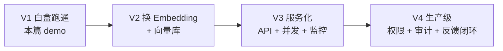

# §6 从 demo 到生产工具的演进之路思考

> **系列**：从零开始写一个 payment-rag-agent（整合层 demo 工程）
> **定位**：§5 做出了能跑的 CLI demo，但它是「麻雀」——单机、单轮、20 个 chunk。本篇回答一个问题：**从 demo 到生产工具，还差哪几步？** 按「能力 → 功能用例 → 技术方案 → 流程区别 → 落地差距」演进链展开，生产参照 RAGFlow 级开源产品。
> **本篇目标**：看清差距在哪、演进路径是什么——不需要做那么复杂，但要知道「生产版有什么、demo 为什么不用做」。

---

## 6.0 演进总览：demo 是骨架，生产是血肉


演进链一句话：**能力决定用例，用例决定方案，方案改变流程，流程决定差距**。

**三个参照物**（定位用的，不是都要做）：

| 参照物 | 是谁 | 定位 |
|---|---|---|
| 我们的 demo | 本篇从零写的 7 个文件 | 学习载体：理解 RAG 运作 |
| 功能完整的开源产品 | RAGFlow（89.2K★）、LlamaIndex（51.9K★）| 中间参照：看「功能完整的 demo」长什么样 |
| 真实生产系统 | 各公司内部知识库问答 | 差距参照：规模/合规/工程化 |

**核心定位**（延续 §5 的目标）：demo 的目标是**理解 + 动手**，不是做出产品——所以差距要了解，但**不需要做那么复杂**。

---

## 6.1 能力差距：demo 能做的 vs 生产要做的

| 维度 | demo（§5 完成）| 生产 |
|---|---|---|
| 问答形式 | 单轮问答 | 多轮对话 + 追问澄清 |
| 检索 | TF-IDF + 线性扫描 | Embedding + 向量库 ANN 索引 |
| 分块 | 固定 500 字 | 语义分块（标题/段落边界）|
| 评估 | 手写召回率 | RAGAS 自动化 + 反馈闭环 |
| 工程化 | CLI 单机 | 服务化 + 并发 + 权限 + 审计 |

看这张表：**每一行都是「同一个功能，换个工程实现」**——问答还是问答、检索还是检索，demo 教你的链路环节一个没变，变的是每个环节的规模级做法。

---

## 6.2 技术方案演进（核心）

### 6.2.1 分块：固定 500 字 → 语义分块

§5 用固定 500 字 + 50 重叠，简单但笨——会把「结算」和「汇率」两个主题硬切进一块。生产按**文档结构**切：标题是章节就按标题切、段落是语义单元就按段落切、重叠自适应（块与块之间衔接处才补重叠）。原理不变（还是「块 = 检索粒度」），切法更聪明。

### 6.2.2 检索：TF-IDF + 余弦 → Embedding + 向量数据库（最大的一步）

**白盒 → 黑盒的迁移，本质没变**：§5 学的「检索 = 算相似度」这个公式还在，Embedding 只是把「词袋向量」（`{"结算": 0.71}`）换成「模型压缩的语义向量」（128-1536 维稠密数字）。换来什么？

- **语义匹配**：TF-IDF 只有词重合才像（「结算周期」和「资金到账时间」没共同词 → 相似度 0）；Embedding 知道它们语义相近
- **向量数据库**（Milvus 45.8K★ / pgvector）：百万 chunk 线性扫描太慢，向量库用 ANN（近似最近邻）索引把「全库扫描」变成「索引查找」，延迟从秒级到百毫秒

**理解锚点**：你已经在 §5 手写过余弦相似度——向量库就是「把这段算得更快、存得更多」的工业化版本。

**看一个最直观的对比**（同一问题两种检索器）：

```
问题：资金什么时候到账？

TF-IDF（§5 的）: 词表里只有「结算」「周期」…和「资金」「到账」零重合 → 相似度 0 → 漏检
Embedding:       「资金到账」与「结算周期」语义相近 → 相似度高 → 命中同一块资料
```

这就是「换 Embedding」带来的质变：**从「词重合才算像」到「语义相近就算像」**。§5 用 TF-IDF 不是白学——你理解了「相似度」是什么，Embedding 只是换了一种更好的相似度算法。

### 6.2.3 生成：单 prompt → 编排

§5 的 `build_prompt` 把 top-3 塞进一个 prompt。生产要做的编排：

- **引用格式**：答案带 chunk 编号（§5 已做）→ 前端渲染成可点击的引用卡片
- **多轮记忆**：用户追问「那拒付呢？」要知道上文在聊结算——会话上下文拼进 prompt
- **拒绝策略**：资料不足 → 不是「说不知道」完事，而是引导「您可以咨询客服或查看文档 X」——生产要的是用户体验，不是裸的拒绝

### 6.2.4 评估：手写召回率 → RAGAS 自动化

§5 手写 Recall@k + 人工打分，生产用 **RAGAS**（15.5K★）这类框架自动化，指标更全：**忠实度**（答案是否忠于资料——防幻觉的量化版）、**相关性**（检索结果是否贴题）、答案质量。原理还是「测试集 + 打分」，只是把人工打分换成 LLM 打分，可以持续跑。

---

## 6.3 流程区别：离线 vs 在线

demo 流程是**一次性**的：`build_kb` → `build_index` → 查询（文档不变就不重跑）。

生产的流程是**持续**的：

```
文档更新 → 增量索引（只重建变更部分，不整库重跑）
用户问答 → 在线检索（向量库 + 缓存）→ 生成
用户反馈 → 点踩/追问进测试集 → 定期重评估 → 驱动调参
```

**关键区别**：demo 的「索引阶段」是教学步骤，生产的「索引阶段」是**持续运转的管道**；demo 的「评估」是一次性检查，生产的「评估」是**反馈闭环**——用户点踩的问题会变成测试集里的一条，下次评估就检验它。

---

## 6.4 落地差距：规模、延迟、成本、合规

| 维度 | demo | 生产 | 差距本质 |
|---|---|---|---|
| 规模 | 20 chunk | 百万级文档 | 向量库 + 分布式 |
| 延迟 | 秒级（线性扫描）| 百毫秒 | ANN 索引 + 缓存 |
| 成本 | 每问必调 LLM | 缓存命中 + 模型分级 | 工程优化 |
| 合规 | 无 | 数据脱敏 + 权限 + 审计 | 金融场景硬要求 |

**合规值得单独说**：知识库 = 数据资产。金融场景里「谁能看费率文档、谁能看拒付材料」是权限粒度问题——demo 的 `data/支付文档.md` 人人可查，生产的文档目录要按角色授权、问答要留审计日志。**这跟算法无关，是工程化的核心壁垒**。

**关键认知：差距不在「会不会」，在「工程化」**——demo 教你的链路每个环节都对，生产只是把每个环节做到规模级。你缺的不是 RAG 知识，是把系统「放大、变快、管得住」的工程能力。

**那 demo 是白做的吗？不是——三样东西可以直接搬进生产**：

1. **prompt 组装思路**：指令约束 + 检索结果 + 问题 + 来源编号——生产编排的核心就是这个骨架
2. **检查链习惯**：§5 的 5 个检索检查 + 阈值 + 优雅失败——生产每个环节照样要检查，只是更多
3. **评估闭环的思维**：「测试集 → 指标 → 定位 → 调参 → 重测」——生产靠这套持续优化

**demo 教你的是「怎么想」，生产只是把「怎么想」放大成「怎么做」**。

---

## 6.5 演进路线图（分 4 阶段）



每阶段「改什么 + 不改什么」：

| 阶段 | 改什么 | 不改什么 |
|---|---|---|
| V1（本篇）| 全链路白盒跑通 | — |
| V2 | 检索换 Embedding + 向量库 | 分块/组装/评估逻辑不动 |
| V3 | CLI 变 API + 并发 + 监控 | 检索与生成逻辑不动 |
| V4 | 权限/审计/反馈闭环 | 核心链路彻底稳定 |

**原则：骨架不动，血肉换新**——每一步只换一个环节，其他环节稳住，出问题好定位。这也是 §5 评估闭环「一次只调一个变量」的工程版。

## 6.6 应用平台层参照：Dify 怎么把 RAG 做成产品

前面参照的是 RAG 引擎（RAGFlow）和框架（LlamaIndex），还有一个生态位不能不知道：**Dify**——应用平台层参照。

Dify（langgenius/dify，2026-08-25 gh CLI 实测 153,448★，当日仍有活跃提交）的定位：Agentic workflows + RAG pipelines + 多模型支持的企业级协作平台。它和 RAGFlow 的分工：RAGFlow 是「RAG 引擎」（把检索做深做精），Dify 是「LLM 应用平台」（把 RAG、Agent、工作流、模型管理、可观测性组装成一个完整产品）。

**技术选型**（仓库实测）：前端 Next.js + TypeScript，后端 Python（api/worker 微服务），模型供应商体系统一接入 OpenAI/Claude/DeepSeek 等数百个模型，插件生态支持 MCP 与 skills，部署支持 Docker 自托管、云、VPC。

**Dify 怎么做 RAG，再到 Agentic RAG**：
- 基础 RAG 三步和 demo 完全一致：**检索 → 增强 → 生成**（官方文档原话）——先从知识库检索，把结果和问题打包给 LLM，再生成。概念上没有任何新东西。
- 区别在「编排」：Dify 用 Workflow（确定性流程）和 Chatflow（对话 + Agent 决策）两张画布，知识库、模型、工具都是画布上的节点，流程是拖出来的。
- Agentic RAG 的关键差异：**检索从「程序固定执行」变成「模型主动决策」**——模型把「检索知识库」当作一次工具调用，自己判断要不要查、查什么、答案不够要不要再查一轮，还能把检索和查数据库、调 API 组合成多步任务。demo 的检索是写死的 if-else（top-3 + 阈值 0.1），Dify 的检索是模型在循环里反复决策的。

**与 demo 的 trade-off**：

| 维度 | 我们的 demo | Dify |
|---|---|---|
| 目标 | 理解原理，白盒可手算 | 快速搭建，交付效率 |
| 检索 | 固定管道：TF-IDF → top-3 → 阈值 | 可编排：混合检索 + 重排 + 元数据筛选 |
| 决策 | 代码 if-else | 模型主动（Agentic） |
| 参数 | 硬编码（阈值 0.1、top-k 3） | 界面可配置 + 版本管理 |
| 评估 | 15 条测试集手动跑 | 标注系统 + 团队协作 |
| 代价 | 慢、单机、无运维 | 黑盒、依赖平台、有学习曲线 |

**差距在哪**：demo 的 6 个已知问题（§8），Dify 全都有答案——混合检索 + 重排解决「换说法答不上」（已知问题 1）、元数据增强检索解决「热门内容挤压冷门」（已知问题 3）、父子检索策略解决分块粒度矛盾（已知问题 2）、标注系统解决评估集单人维护（已知问题 3）、工作空间权限与审计解决合规（已知问题 6）。**我们的差距表就是 Dify 的功能清单**——这不是巧合，生产问题就那么多，谁先解决谁就是产品。

**怎么和 Dify 配合解决实际业务**：
- **demo 学原理，Dify 搭原型**：先用 demo 的白盒把业务跑通（问题集、文档、评估集），再上 Dify 快速搭可交付原型——换 Embedding、加重排都不用重写，画布上拖就行。
- **生产二选一**：业务简单走 Dify 自托管（快），业务复杂走自研（把 demo 的 7 文件按 V2-V4 放大）。
- **评估闭环是桥**：demo 的 15 条测试集可以原样导入 Dify 的评估系统，验证平台换了检索器后准确率不降——评估标准不被平台绑架，谁换引擎都得过同一套题。

一句话：**Dify 告诉你生产级 RAG 的完整形态（编排、可配置、可观测、团队协作），demo 告诉你这些形态背后的原理。** 两个参照物合起来，就是这个生态的全貌——知道生态有多大，才能判断自己站在哪。

---

## 小结

**demo 到生产 = 同一条链路 × 工程化放大**。演进链回头看：能力（单轮问答）→ 功能用例（多轮/辅助工单）→ 技术方案（Embedding + 向量库 + 编排）→ 流程区别（离线一次性 → 在线持续 + 反馈闭环）→ 落地差距（规模/延迟/成本/合规）。

**你现在拥有的**：理解 RAG 运作方式 + 能写白盒实现 + 知道差距在哪。**生产版有什么、为什么不用做那么复杂**——这两件事都清楚了。接下来 §7 回头审视这个 demo 本身：项目架构和亮点，面试时怎么讲这套东西。

---

## 📌 数据与事实声明

star 数为 2026-08-25 通过 GitHub CLI（gh api）实测：RAGFlow 89,203、LlamaIndex 51,858、Milvus 45,777、RAGAS 15,460（仓库已迁移至 vibrantlabsai，原 explodinggradients/ragas）、Dify 153,448。Dify 的 Agentic RAG 描述基于官方文档与仓库信息（2026-08-25 访问），「我们的差距表就是 Dify 的功能清单」为本文对照分析，不代表官方功能承诺。演进路线图（V1-V4）与差距表为本文教学规划，不代表任何真实公司系统。Embedding 与向量数据库为 RAG 生产实践中的行业通用方案，具体选型（Milvus/pgvector 等）需按规模与团队技术栈评估。

## 📚 参考资料

| 类型 | 标题 | 来源 |
|---|---|---|
| 开源项目 | RAGFlow（开源 RAG 引擎，生产级参照）| github.com/infiniflow/ragflow（89.2K★）|
| 开源项目 | LlamaIndex（文档 agent + RAG 框架）| github.com/run-llama/llama_index（51.9K★）|
| 开源项目 | Milvus（向量数据库）| github.com/milvus-io/milvus（45.8K★）|
| 开源项目 | Dify（LLM 应用平台，应用平台层参照）| github.com/langgenius/dify（153.4K★）|
| 开源项目 | RAGAS（RAG 评估框架）| github.com/vibrantlabsai/ragas（15.5K★）|
