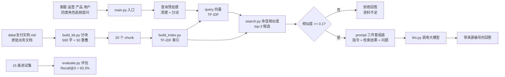

# §7 项目架构和亮点

> **系列**：从零开始写一个 payment-rag-agent（整合层 demo 工程）
> **定位**：前面六篇把 RAG 从「为什么写」到「怎么实现」讲完了，本篇回头审视这个 demo 本身——整体长什么样？架构怎么解读？凭什么值得讲？收拢成一张架构图 + 五个亮点。
> **本篇目标**：能对着最终架构图把「提问 → 带依据回答」的完整链路讲清楚，能讲出 5 个亮点，每个亮点都带可验证的证据。

---

## 7.0 一张图看懂整个 demo

先看最终形态。整个 demo 的完整数据流（这也是给面试官讲的版本）：

一句话版：**四类角色的高频问题进来，先检索知识库，够像就带着依据去生成，不够像就老实说不知道；知识库和评估两条支线分别支撑「答得对」和「证明答得对」。**

这张图不是画出来好看的——它把前面六篇散落的模块图收敛成一张。左半边（分块 → 索引 → 检索）是 §5 上/中篇的核心，右半边（prompt → LLM → 带来源回答）是 §5 下篇的组装，下边支线是 §5 下篇的评估闭环。

## 7.1 七文件三层架构：怎么拆的、为什么这么拆

7 个文件 = 一个 RAG 的全部组成，每个文件只干一件事：

| 文件 | 层 | 职责 | 对应章节 |
|---|---|---|---|
| data/支付文档.md | 知识库 | 原始业务文档（模拟客服知识库） | §5.2 |
| build_kb.py | 知识库 | 分块：500 字 + 50 重叠 → 20 chunk | §5.2 |
| build_index.py | 检索 | TF-IDF 向量化：词频 × 稀有度 | §5.3 |
| search.py | 检索 | 余弦相似度 top-3 + 阈值 0.1 | §5.4 |
| llm.py | 生成 | LLM 调用（就是一个 HTTP POST） | §5.5 |
| main.py | 入口 | 管道组装：检索 → 组装 → 生成 | §5.5 |
| evaluate.py | 评估 | 召回率 + 答案质量 | §5.6 |

架构上值得讲的三点：

1. **依赖单向**：main.py 是唯一入口，往下调用各层；各层之间不互相 import。改 search.py 的排序逻辑，不会影响 build_kb.py 怎么分块——这是「分而治之」的落地：改一处，风险只在一处。
2. **每层可单独替换**：这就是 §6 演进路线的地基。想把 TF-IDF 换成 Embedding，只需要动 build_index.py + search.py，main.py 的组装逻辑一行不用改——因为接口是「query 向量 vs chunk 向量算相似度」，换的是实现，不是契约。
3. **数据流只有 5 步**：提问 → 检索 → 组装 → 生成 → 回答。面试讲这个 demo 时，先讲 5 步主干，再讲每个文件怎么支撑这一步，最后落到「每一步为什么这么设计」——这就是 §7 亮点要展开的。

## 7.2 亮点一：白盒检索——每个数字都能手算

市面上大多数 RAG 教程的第一步是装框架（LlamaIndex 之类）、调一个 Embedding 模型，向量长什么样、相似度怎么算，全在黑盒里。学完能跑，但问一句「为什么这两个 chunk 更像」就答不上来。

这个 demo 反过来：**TF-IDF 手写，余弦相似度手写，每个数字都能手算。** §5 中篇里用「结算周期是多久」做过完整手算——chunk0 里「结算」权重 0.71，「交易」只有 0.18，差距来自 IDF（结算只在 1 个 chunk 出现，稀有度高；交易到处都有，稀有度低）。0.82 的相似度是怎么来的，是把问题向量和 chunk1 向量的高权重维度逐项乘出来加出来的。

白盒的价值不是「不用框架」，而是**先看懂检索器在干什么，再换黑盒时能说出换了什么、为什么更好**。§6 的 Embedding 对比演示就是靠这个基础：TF-IDF 下「资金什么时候到账」和「钱什么时候到账」零重合，Embedding 下语义相近能命中——只有先理解词重合式检索的边界，才看得懂语义检索的价值。

可验证证据：运行 `python build_index.py` 能看到每个词的 IDF；§5 中篇有完整手算表，不用信任何人的「效果不错」，自己算一遍就懂。

## 7.3 亮点二：防幻觉两道闸——最便宜的护栏

大模型会一本正经地胡说，RAG 的任务就是让回答有据可依。这个 demo 装了两道闸，一道在检索后，一道在生成前：

- **第一道：相似度阈值 0.1**。检索结果最高分都低于阈值，说明知识库里没有相关内容——这时候直接拒绝回答。§5 中篇的演示里问「股票今天涨了没有」，最高相似度只有 0.02，系统回答「资料不足」，而不是硬编一个答案。这是从源头掐断幻觉：没有料就不答。
- **第二道：prompt 指令**。「只能根据资料回答，资料不足就说不知道」+ 回答注明依据编号（如「依据 3」）。这是生成层的最后防线：就算检索放进来一点噪音，也要求模型只基于资料说话。

为什么说是「最便宜的护栏」：两道闸加起来不到十行代码，零成本。但它解决的是 RAG 系统最致命的信任问题——答错一次，用户就不再信你。§5 下篇做过对比演示：去掉指令后的回答开始自由发挥，加上指令后明显收敛。这就是「先解决会不会，再解决好不好」的顺序：防幻觉是会不会的底线。

可验证证据：§5 中篇的「股票」拦截演示 + §5 下篇的无指令对比 prompt。

## 7.4 亮点三：评估闭环——用数据证明能干活

demo 很容易停在「看起来能用」——问了几个问题都能答，就宣布完工。这个 demo 多做了一个动作：**建了 15 条测试集，跑评估，得到 Recall@3 = 93.3%（14/15 命中）**。

更难得的是没有停在数字上：漏掉的第 9 条「退款什么时候到账」做了根因分析——「退款」这个 bigram 在文档里权重低，加上热门内容（结算/拒付）挤占了 top-3 名额，冷门问题被挤出去。根因清楚了，改进方向自然清楚：补同义词、调分块策略、或者换语义检索。这就是 §6 路线图 V2「换组件」的直接依据。

评估闭环的意义不只是证明能干活，而是**让改进有方向**。没有评估，换分块参数、换检索器全凭感觉；有评估，每次改动跑一遍测试集，数字告诉你改好了还是改坏了。这也是 §5 中篇「检查链」习惯的延伸——验证不是事后补，而是流程的一部分。

可验证证据：`python evaluate.py` 输出 14/15、Recall@3 = 93.3%。

## 7.5 亮点四：检查链——可迁移的工程习惯

demo 的检索环节内置了一条 5 项检查链（§5 中篇的检索检查清单表）：

| # | 检查 | 查什么 | 失败怎么办 |
|---|---|---|---|
| 1 | 查询预处理 | 问题是否被正常清理分词 | 看原始输入与处理后对比 |
| 2 | 向量有效性 | query 向量是否全零（没有已知词） | 提示换说法，别硬检索 |
| 3 | 空结果 | 检索是否一个 chunk 都没返回 | 直接走「资料不足」 |
| 4 | 阈值 | 最高分是否低于 0.1 | 拒绝回答，不硬编 |
| 5 | top-k | 返回数量是否够 3 条 | 调 k 或查索引完整性 |

这套检查链的价值远超这个 demo：**「一系列检查」是任何代码都该有的习惯**——写每个模块时问自己三句话：这里会怎么挂？我怎么知道它挂了？挂了之后怎么办？§5 中篇的检查链就是这三个问题的答案模板。它可迁移到任何工程：接口调用后查状态码、解析后查空值、落库后查影响行数——同一个套路。

可验证证据：§5 中篇的检查清单表 + 每项检查对应的失败处理。

## 7.6 亮点五：真实业务场景——demo 不是玩具

这个 demo 的问题集不是随便编的：**跨境收单支付的客服、运营、产品、用户四类角色高频提问**——结算周期多久、拒付怎么处理、退款什么时候到账、手续费怎么收。问题来自真实业务场景（§1），知识库文档模拟客服知识库（§5.2），回答要带依据（§5.5）。

为什么这是亮点？因为**技术方案的价值取决于业务场景**。同样的 RAG demo，「宠物问答」和「跨境收单支付问答」讲出来的深度完全不同：后者能讲清楚为什么防幻觉是底线（金融业务答错要赔钱）、为什么带来源可追溯（客服要能核实）、为什么评估闭环重要（准确性是业务 KPI）。业务感是差异化——技术点谁都会背，能把技术取舍和业务约束对上，才是真正理解。

而且场景真实带来一个副作用：**学习动力更足**。对着自己领域的问题调出一个能用的助手，比对着 hello world 调框架有意思得多，也更愿意把 §6 的演进路线走下去。

## 7.7 小结：五个亮点一览

| # | 亮点 | 核心一句话 | 在哪一章 | 可验证证据 |
|---|---|---|---|---|
| 1 | 白盒检索 | 每个数字都能手算，先懂原理再换黑盒 | §5.3 | build_index.py + 手算表 |
| 2 | 防幻觉两道闸 | 没料不答 + 只能根据资料说 | §5.4/§5.5 | 拦截演示 + prompt 对比 |
| 3 | 评估闭环 | 用数据证明能干活，改进有方向 | §5.6 | Recall@3 = 93.3% |
| 4 | 检查链 | 一系列检查习惯可迁移到任何代码 | §5.4 | 5 项检查清单表 |
| 5 | 真实业务场景 | 技术取舍能对上业务约束 | §1/§5.2 | 四类角色问题集 |

**这个 demo 的价值，不是做了一个能跑的问答工具，而是它的每一层都能讲清楚为什么。** 检索层能讲原理（白盒），生成层能讲护栏（两道闸），质量层能讲证据（评估），工程层能讲习惯（检查链），业务层能讲场景（跨境收单）。五个亮点合起来，就是一篇完整的「RAG 我懂」的证明。

下一步 §8 把项目文档补全——README、贡献指南、已知问题、roadmap，让这个 demo 从「代码能跑」变成「项目能交」。

---

## 📌 数据与事实声明

本文内容全部来自本系列前文（§1-§6）的收敛与提炼，无新增调研数据。Recall@3 = 93.3%（15 条测试集命中 14 条）与「股票今天涨了没有」相似度 0.02 等数据均出自 §5 中/下篇的实测演示；最终架构图为教学示意。文中「面试」场景描述为通用求职建议，不涉及任何具体公司。

## 📚 参考资料

| 类型 | 标题 | 来源 |
|---|---|---|
| 系列前文 | §1 为什么写：跨境收单支付业务问答 RAG 的价值论证 | 本系列 1_为什么写.md |
| 系列前文 | §5 实现方案与思考·上：从最小闭环到知识库 | 本系列 5-1_实现方案与思考-上.md |
| 系列前文 | §5 实现方案与思考·中：向量化与检索 | 本系列 5-2_实现方案与思考-中.md |
| 系列前文 | §5 实现方案与思考·下：组装、评估与验收 | 本系列 5-3_实现方案与思考-下.md |
| 系列前文 | §6 从 demo 到生产工具的演进之路思考 | 本系列 6_从demo到生产工具的演进之路思考.md |
