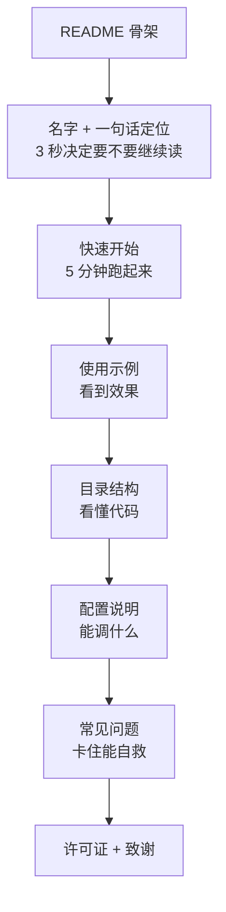
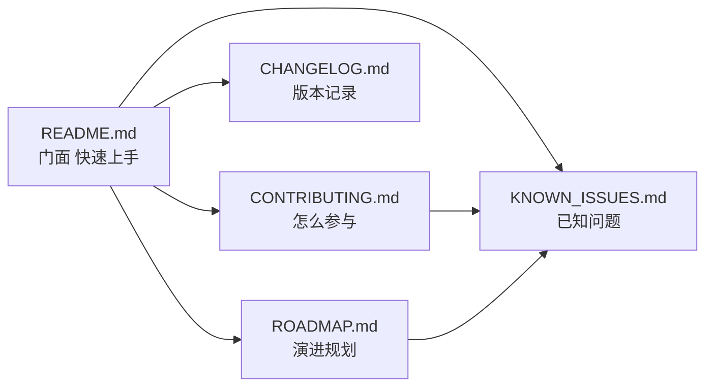

# §8 项目文档建设

> **系列**：从零开始写一个 payment-rag-agent（整合层 demo 工程）
> **定位**：§7 讲完了代码层面的架构和亮点，本篇把视角从代码切到文档——一个能跑的 demo 怎么变成一个能交的项目。README 怎么写、贡献怎么收、问题怎么记、版本怎么规划。
> **本篇目标**：能说出一个项目的文档五件套是什么、每件解决什么问题，能照着清单给任何一个自己的项目补文档。

---

## 8.0 代码能跑 ≠ 项目能交

很多学习 demo 停在这：代码能跑，但只有作者自己看得懂。过了三个月再看，连作者自己都要重新读一遍代码才想起来当时为什么这么写。

文档的价值是三件事：

1. **别人能上手**：给你一份代码，不读文档，光看文件结构也能猜个大概；但「怎么装、怎么跑、API Key 配在哪、常见坑在哪」只有文档知道。README 就是给陌生人的电梯演讲。
2. **自己能复盘**：代码记录的是「怎么做的」，文档记录的是「为什么这么做」。§5 里那些「埋坑 → 填坑」的决策，三个月后只有文档还记得。
3. **面试能讲**：面试官问「这个项目怎么维护」，答「有 README、有已知问题清单、有迭代规划」和答「就我自己跑过」是完全不同的两个印象。文档 = 工程素养的可见证据。

所以本篇给这个 demo 补上项目文档五件套：README、CONTRIBUTING、CHANGELOG、KNOWN_ISSUES、ROADMAP。

## 8.1 README 结构：给陌生人的电梯演讲

README 是项目的门面，也是大多数人读你的项目的第一个（也可能是唯一一个）文件。一个合格的 README 有七个固定部件，每一件回答陌生人的一个问题：

| # | 部件 | 回答的问题 | 本 demo 实例 |
|---|---|---|---|
| 1 | 项目名 + 一句话定位 | 这是什么 | payment-rag-agent：跨境收单支付业务问答 RAG，纯 Python 白盒实现 |
| 2 | 快速开始 | 怎么跑起来 | 3 步：建 venv → pip install requests → python main.py "结算周期是多久？" |
| 3 | 使用示例 | 长什么样 | 终端演示块：提问 + 检索依据 + 带来源回答 |
| 4 | 目录结构 | 代码怎么组织 | 7 文件树，每行注释职责（§5.0.2 的那张图直接复用） |
| 5 | 配置说明 | 需要配什么 | OPENAI_API_KEY 环境变量；相似度阈值 0.1、top-k 3 的可调参数 |
| 6 | 常见问题 | 卡住了怎么办 | 向量全零（换说法）、API 超时（检查 key/网络）、结果不准（跑评估） |
| 7 | 许可证 + 致谢 | 能用吗、感谢谁 | MIT；引用的 API 与框架（§6 参考资料） |

README 的结构用一张图看更清楚——阅读顺序是从上往下，每段解决一个问题：



写 README 的原则就一条：**把读者当成第一次接触这个项目的人**。§5.0 写环境准备时用的语气（3 步 bash 直接复制、每步注释在干什么），就是 README 快速开始该有的样子——我们的 demo 已经把这段写好了，搬到 README 就是现成的。

**坏 README vs 好 README**：

坏版本：`# payment-rag-agent` + `一个 RAG 问答 demo。`——两行字，读者看完要猜一堆问题：怎么装？Python 还是 Node？API Key 配在哪？装完跑什么命令？能用在哪？

好版本：三行快速开始直接复制：

```bash
python3 -m venv .venv && source .venv/bin/activate
pip install requests
python main.py "结算周期是多久？"
```

差别不在字数，在「**读者要不要猜**」。坏 README 的每个字都要读者脑补上下文；好 README 零猜测——每句话都是一个可以直接执行的动作，每段回答一个问题。检查自己 README 的方式：找一个没看过你项目的人，让他只看 README 走到「跑起来」这步，数他问了你几个问题——问的每一个，都是 README 该补的。

## 8.2 贡献指南：让陌生人敢动手

CONTRIBUTING 解决的是「别人想帮你，但不知道怎么帮」的问题。对学习 demo 来说，贡献指南的写法可以轻，但两个机制必须有：

1. **问题模板**：提 issue 必须说清三件事——复现命令（你跑了什么）、实际输出（发生了什么）、期望输出（你期待什么）。这三件事一写，大多数问题自己就定位了一半。本 demo 的模板可以写成：

```text
问题：python main.py "xxx" 返回了空结果
实际输出：…
期望输出：带依据编号的回答
```

2. **改动门槛**：这个 demo 的评估闭环（§5.6）天然就是贡献门槛——**任何检索或分块的改动，必须跑一遍 `python evaluate.py`，Recal l@3 不能低于 93.3%**。这不是形式主义：改动检索器却把准确率从 93.3% 干到 80%，用户没感知到收益，代价却实打实。这条门槛是 §5 中篇「检查链」习惯的团队化版本——每次改动跑一遍验证，数字说话。

贡献指南的其他部分（分支规范、代码风格、PR 流程）可以照标准模板，但「问题模板 + 改动门槛」这两条是灵魂。

## 8.3 已知问题：敢写局限才是真自信

大部分 demo 的 README 只写「能做什么」，不写「不能做什么」。但已知问题清单恰恰是最有说服力的部分——它说明作者清楚边界在哪，而不是没撞到过墙。

这个 demo 的已知问题，全部来自前文的实测：

| # | 已知问题 | 影响 | 现状 | 改进方向 |
|---|---|---|---|---|
| 1 | TF-IDF 词重合局限：换说法就答不上 | 「资金什么时候到账」和「钱什么时候到账」零重合，同义表达检索不到 | 已记录（§5 中实测） | 补同义词表 / 换 Embedding（§6 V2） |
| 2 | 相似度阈值 0.1 是经验值 | 阈值定高会漏答，定低会放噪音 | 按 15 条测试集调的 | 扩大评估集，按查准/查全曲线调 |
| 3 | 评估集只有 15 条 | Recall@3 93.3% 的代表性有限 | 已记录（§5 下） | 扩充到 50+ 条，覆盖四类角色问题 |
| 4 | 单机单进程，无并发 | 一次只能服务一个请求 | demo 定位如此（§6 差距表） | 服务化 + 加缓存（§6 V3） |
| 5 | 依赖外部 LLM API | 有成本、有延迟、有隐私顾虑 | 已记录（§6 差距表） | 私有化部署 / 换本地模型 |
| 6 | 无权限与审计 | 谁都能问，问了不留痕 | 金融生产环境不可接受 | 接入鉴权 + 操作日志（§6 V4） |

写已知问题的原则：**每个问题都要有「影响」和「现状」**——只说「有问题」是抱怨，说清「影响什么、现在怎么处理、将来往哪走」才是工程文档。这 6 条列完，项目的真实边界一目了然：这不是「没做好的产品」，而是「清楚自己到哪一步的 demo」。

## 8.4 后续 roadmap：让演进有节奏

§6 已经讲了演进路线（V1 白盒 → V2 换组件 → V3 服务化 → V4 生产级）和为什么这么演进。本篇的 roadmap 换一个视角：**每次迭代，文档要跟着做什么**——版本不是代码的标签，是「代码 + 文档 + 验证」三件套的集合。

| 迭代 | 目标 | 代码动作 | 文档动作 | 验收标准 |
|---|---|---|---|---|
| V1（当前） | 白盒跑通 | 7 文件最小闭环 | README + 本系列 wiki | main.py 能答 + 评估 93.3% |
| V2 | 换组件 | 检索换 Embedding + 向量库 | CHANGELOG 记录替换依据；KNOWN_ISSUES #1 关闭 | 同义问题命中率上升 |
| V3 | 服务化 | 包成 HTTP 服务 + 并发 | README 加部署章节；ROADMAP 更新 | 多用户并发可用 |
| V4 | 生产级 | 鉴权 + 审计 + 监控 | 已知问题 #6 关闭；补运维文档 | 满足金融场景合规检查 |

roadmap 的作用是**让每一次改动有位置**：V2 关掉已知问题 #1，V4 关掉 #6——每次迭代都在收敛已知问题清单，而不是无限新增功能。这就是「演进有节奏」：代码、文档、问题清单三线同步推进。

还有一个容易犯的错：**roadmap 从 V2 甚至 V4 开始写**。新手很容易在规划里一步到位（直接上 Embedding + 向量库 + 服务化），理由是「反正迟早要做」。但 §6 讲过演进的核心纪律是「一次只调一个变量」——V1 的白盒实现是整个系列的锚点：所有改进（换检索器、加并发、做鉴权）都是「对比 V1 之后的变化」，没有 V1 的基线，V2 改得好不好根本没法判断。所以 roadmap 的 V1 永远要保留，它不是历史包袱，是测量一切的尺子。

## 8.5 文档结构总览：五件套怎么组织

把前面四节收拢成项目的 docs 结构，就是五个文件，各管一件事：



- **README.md**：门面，给陌生人（8.1）
- **CONTRIBUTING.md**：怎么参与，给想帮忙的人（8.2）
- **KNOWN_ISSUES.md**：边界在哪，给使用者（8.3）
- **CHANGELOG.md**：改了什么、为什么改，给复盘者（8.4 的文档动作落点）
- **ROADMAP.md**：往哪走，给决策者（8.4）

五件套的关系一句话：**README 回答「这是什么」，CONTRIBUTING 回答「怎么参与」，KNOWN_ISSUES 回答「边界在哪」，CHANGELOG 回答「怎么走到今天」，ROADMAP 回答「明天干什么」**。五件套齐了，这个项目就从「作者的自留地」变成了「可以交接、可以协作、可以演进的工程」。

这也正是这个系列的初衷——§1 说「从零到一做出一个能用的 agent」，§8 补上最后一块：让它从「能用」到「能交」。下一篇 §9 汇总整个系列的数据与事实、参考资料，给全系列画上句号。

---

## 📌 数据与事实声明

本文 README 七件套、贡献指南、文档五件套为通用项目文档方法论在教学场景的应用，不属于任何真实公司规范。已知问题 6 条均提炼自本系列前文实测记录（§5 中/下、§6 差距表），阈值 0.1 与 Recall@3 93.3% 为 demo 实测值；roadmap 迭代计划为教学规划，不代表任何真实系统。

## 📚 参考资料

| 类型 | 标题 | 来源 |
|---|---|---|
| 系列前文 | §5 实现方案与思考·中：向量化与检索 | 本系列 5-2_实现方案与思考-中.md |
| 系列前文 | §5 实现方案与思考·下：组装、评估与验收 | 本系列 5-3_实现方案与思考-下.md |
| 系列前文 | §6 从 demo 到生产工具的演进之路思考 | 本系列 6_从demo到生产工具的演进之路思考.md |
| 系列前文 | §7 项目架构和亮点 | 本系列 7_项目架构和亮点.md |
