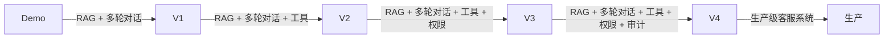

# §10 Trade-off 与生产演进：客服 agent 核心权衡

## 一句话摘要

Trade-off 与生产演进 的核心要点与实践指导。

**5W 速记卡**：
- **What**：客服 agent 5 维 trade-off + 生产演进
- **Why**：每个设计选择都有代价
- **Who**：要做客服 agent 的工程师
- **When**：demo 完成后
- **Where**：生产环境

**自测三问**：
1. 本文核心机制：5 维 trade-off = 回答准确率 vs 误答率 / RAG vs 规则 / 实时性 vs 精度 / 审计 vs 效率 / 可解释性 vs 性能
2. 失效点：trade-off 不当 → 可维护性差
3. 与系列衔接：§10 是收官篇 — 之前所有篇章的 trade-off 汇总

---

## 10.1 Trade-off 总览

| 维度 | 选型 A | 选型 B | 代价 A | 代价 B | 决策点 |
|---|---|---|---|---|---|
| **回答准确率 vs 误答率** | 高准确率 | 低误答率 | 误答多 | 漏答多 | 业务可接受哪种损失？ |
| **RAG vs 规则** | RAG 检索 | 规则匹配 | 慢 | 僵化 | 已知问题 vs 未知问题 |
| **实时性 vs 精度** | 毫秒级 | 高精度 | 精度低 | 延迟高 | 客服要实时 |
| **审计 vs 效率** | 完整审计 | 高效率 | 影响性能 | 审计不全 | 合规要求 |
| **可解释性 vs 性能** | 可解释 | 高性能 | 性能低 | 黑盒 | 客服需要可解释 |

## 10.2 回答准确率 vs 误答率

**这是客服 agent 最核心的 trade-off**——准确率越高，误答越多；误答越少，准确率越低。

| 策略 | 准确率 | 误答率 | 适用场景 |
|---|---|---|---|
| 保守策略 | 高 | 高 | 金融/医疗（漏答代价大） |
| 平衡策略 | 中 | 中 | 电商/支付（可接受一定误答） |
| 激进策略 | 低 | 低 | 内部系统（误答代价大） |

**决策点**：业务可接受哪种损失？
- 金融/医疗：漏答代价大 → 保守策略
- 电商/支付：可接受一定误答 → 平衡策略
- 内部系统：误答代价大 → 激进策略

## 10.3 RAG vs 规则

**RAG 检索 vs 规则匹配**——这是客服 agent 的核心架构决策。

| 维度 | RAG | 规则 |
|---|---|---|
| 速度 | 慢（秒级） | 快（毫秒级） |
| 可解释性 | 低（黑盒） | 高（规则透明） |
| 灵活性 | 高（能处理异常） | 低（规则僵化） |
| 准确率 | 中（LLM 不稳定） | 高（规则明确） |
| 维护成本 | 高（知识库维护） | 低（规则少） |

**本系列组合使用**：RAG 优先 + 规则兜底。

**决策点**：已知问题 vs 未知问题
- 已知问题：RAG 检索（速度快 + 可解释）
- 未知问题：规则匹配（灵活 + 能处理异常）

## 10.4 实时性 vs 精度

**客服要实时**——用户提问需要快速回答。但 RAG 检索要秒级。

| 策略 | 实时性 | 精度 | 适用场景 |
|---|---|---|---|
| RAG 优先 | 低 | 高 | 复杂问题 |
| 规则优先 | 高 | 中 | 简单问题 |
| 混合策略 | 中 | 高 | RAG + 规则 |

**决策点**：客服要实时，但准实时可以容忍
- 实时场景：规则优先
- 准实时场景：RAG 优先
- 混合场景：RAG + 规则

## 10.5 审计 vs 效率

**审计要完整**——每个决策都要留痕。但完整审计影响性能。

| 策略 | 审计完整性 | 性能 | 适用场景 |
|---|---|---|---|
| 完整审计 | 高 | 低 | 合规要求高 |
| 抽样审计 | 中 | 中 | 合规要求中 |
| 不审计 | 低 | 高 | 内部系统 |

**决策点**：合规要求
- 合规要求高：完整审计
- 合规要求中：抽样审计
- 内部系统：不审计

## 10.6 可解释性 vs 性能

**客服需要可解释**——为什么这样回答。但可解释影响性能。

| 策略 | 可解释性 | 性能 | 适用场景 |
|---|---|---|---|
| 可解释 | 高 | 低 | 金融/医疗 |
| 黑盒 | 低 | 高 | 内部系统 |
| 混合 | 中 | 中 | 平衡场景 |

**决策点**：客服需要可解释
- 金融/医疗：可解释
- 内部系统：黑盒
- 平衡场景：混合

## 10.7 生产演进路径

| 版本 | 核心能力 | 适用场景 |
|---|---|---|
| Demo | RAG + 多轮对话 | 验证核心逻辑 |
| V1 | RAG + 多轮对话 + 工具 | 查订单/查费率/查结算 |
| V2 | RAG + 多轮对话 + 工具 + 权限 | L0-L3 + HITL |
| V3 | RAG + 多轮对话 + 工具 + 权限 + 审计 | 完整审计日志 |
| V4 | 生产级客服系统 | 容器化 + K8s + 监控 |

## 10.8 与 §6 演进之路的关系

§6 讲「演进路径」，§10 讲「trade-off 决策」。§6 的每个步骤都对应 §10 的一个 trade-off 维度。

| §6 步骤 | §10 trade-off | 决策点 |
|---|---|---|
| ① RAG 知识库 | RAG vs 规则 | 知识库覆盖度 vs 规则灵活性 |
| ② 多轮对话 | 实时 vs 准确 | 延迟 vs 准确率 |
| ③ 工具调用 | 效率 vs 安全 | 性能 vs 权限控制 |
| ④ 权限分级 | 效率 vs 合规 | 性能 vs 审计 |
| ⑤ 审计日志 | 完整 vs 性能 | 审计完整性 vs 性能 |
| ⑥ 部署 | 成本 vs 可用性 | 成本 vs 可用性 |
| ⑦ 性能 | 延迟 vs 准确率 | 延迟 vs 准确率 |
| ⑧ 可用性 | 成本 vs 可用性 | 成本 vs 可用性 |

---

> **系列**：从零开始写一个客服 agent（整合层 demo 工程）
> **模板**：project-demo-template.md v3.1（§10 = Trade-off 与生产演进）
> **核心原则**：每个关键决策都要讲\"为什么这样选\"——哪怕答案只是\"因为 demo 简单\"。学习型 demo 的 trade-off 与生产型不同。

---

## 📌 数据与事实声明

- 本文的架构图（mermaid）为作者根据业界共识绘制，非来自特定大厂架构
- 调研数据（github star 数）为 2026-09-21 前实测，star 数随时变化

## 📚 参考资料

|| 类型 | 标题 | 来源 |
||---|---|---|
|| 论文 | Retrieval-Augmented Generation for Large Language Models: A Survey | arXiv |
|| 官方文档 | LangChain / LlamaIndex | docs.langchain.com / docs.llamaindex.ai |
|| 系列导航 | AI 域目录 | `docs/ai/index.md` |
|| 开源框架 | NVIDIA NeMo-Guardrails | github.com/NVIDIA/NeMo-Guardrails |
|| 威胁清单 | OWASP Agentic Security Initiative Top 10 | owasp.org |