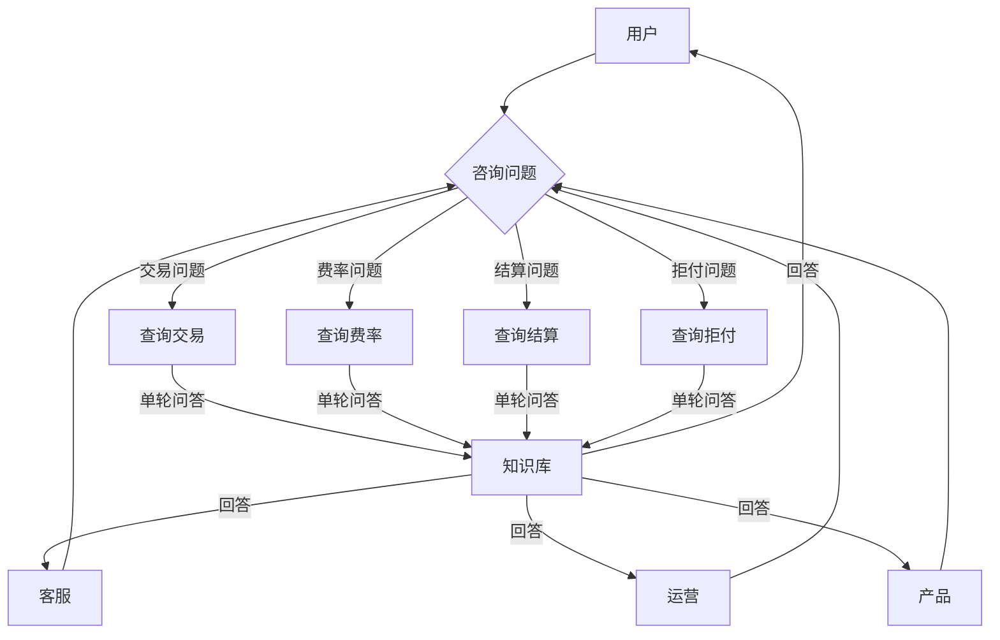

# §1 为什么写：客服 agent（多轮对话）的价值论证

## 一句话摘要

为什么写 的核心要点与实践指导。

**5W 速记卡**：
- **What**：客服 agent —— 用户咨询交易/费率/结算/拒付问题，agent 多轮对话 + 知识库检索 + 动作执行
- **Why**：多轮追问 + 知识库 + 动作执行
- **Who**：有客服系统基础的工程师
- **When**：2026 年，客服是支付核心场景
- **Where**：跨境支付客服系统

**自测三问**：
1. 本文核心机制：客服 agent = 多轮对话 + RAG 知识库 + 工具调用
2. 失效点：单轮问答无法解决复杂问题 → 多轮对话
3. 与下篇衔接：为什么写 → 调研和对参考的思考

---

## 1.1 思考：为什么值得做这个 demo

跨境支付客服是 2026 年最典型的「业务知识密集型」行业之一：用户咨询交易/费率/结算/拒付问题，agent 需要多轮对话 + 知识库检索 + 动作执行。

这些问题的共同特征是：

1. **高频重复**：同一个「这笔交易到哪了」每天被问几千次
2. **知识面宽**：交易状态/费率/结算/拒付/汇率，横跨业务多个模块
3. **更新快**：交易状态变化、费率调整、结算规则变更，知识库要跟上
4. **答错有代价**：客服场景下回答错误（说错费率/说错结算时间）会直接引发客诉

而现实中，这些重复问答的压力最终落在**客服和人工**身上——客服不懂技术细节要问研发，研发被反复拉去答疑，双方都被消耗。

**本 demo 的价值在于**：用 RAG + 多轮对话从零搭一个「跨境支付客服」agent——**把业务知识沉淀成知识库，让 agent 多轮对话 + 知识库检索 + 动作执行**。不是用 LangChain / LlamaIndex 框架调包，而是**手写分块 + 手写 TF-IDF 向量化 + 手写余弦相似度检索 + 手写上下文组装**，理解客服 agent 的每一个环节。

## 1.2 目标读者

- 有客服系统基础的工程师
- 想做客服 agent 的工程师
- 对 LLM 在客服场景应用感兴趣的人

## 1.3 系列定位

本系列是「从零写一个 agent」整合层 demo 工程的**客服篇**：
- 延续 claude-code-cli 系列的「从零实现」风格
- 延续 payment-rag-agent 系列的「业务场景」锚点
- 重点：多轮对话 + RAG 知识库 + 工具调用

## 1.4 核心学习目标

完成本系列后，你能：
- 手写 RAG 知识库（文档加载 → 分块 → 向量化 → 检索 → 生成）
- 用 LLM 做多轮对话（追问澄清 → 确认意图 → 执行动作）
- 调用外部工具（查订单/查费率/查结算/创建工单）
- 实现权限分级（L0-L3 + HITL 决策树）
- 写审计日志（完整记录每个决策依据）

## 1.5 与现有系列的关系

| 系列 | 关系 | 本系列补充 |
|---|---|---|
| claude-code-cli | agent 框架 | 本系列聚焦业务场景 |
| payment-rag-agent | RAG 知识库问答 | 本系列聚焦多轮对话 |
| 特性层 Agent 工程化 | 理论 | 本系列写实战代码 |

## 1.6 写作风格

- 从零实现，不依赖框架
- 纯 Python + requests（唯一外部依赖）
- 保留 claude-code-cli 系列的「麻雀虽小五脏俱全」风格
- 重点写客服场景的特殊性（多轮对话 + RAG）

## 1.7 涉及能力点

- 跨境支付客服场景（交易/费率/结算/拒付/汇率/工单）
- 多轮对话（追问澄清 → 确认意图 → 执行动作）
- 知识库检索（RAG：文档加载 → 分块 → 向量化 → 检索 → 生成）
- 工具调用（查订单/查费率/查结算/创建工单）
- 权限分级（L0 只读 → L1 查询 → L2 动作 → L3 人工审核）
- 上下文管理（多轮对话状态维护）

## 1.8 量级分档意识

| 档位 | 峰值 QPS | 典型场景 |
|---|---|---|
| 万级 | 1万 QPS | 小型支付渠道 |
| 十万级 | 10万 QPS | 主支付链路 |
| 百万级 | 100万 QPS | 大促峰值 |

## 1.9 Trade-off 概览

- RAG vs 规则：RAG 灵活但慢，规则快但僵化
- 从零 vs 框架：从零可控但慢，框架高效但黑盒
- 实时 vs 准实时：客服要实时，但准实时可以容忍

## 1.10 注意事项

- 本系列是 demo，不是生产系统
- 风控规则只是示例，不是真实规则
- LLM 判断只是辅助，不是唯一依据
- 权限分级只是示例，不是真实策略

## 1.11 参考资料

- awesome-llm-apps / agentic_rag 相关仓库
- 跨境支付客服系统文档
- LLM 客服应用场景论文

---

## 📚 参考资料

|| 类型 | 标题 | 来源 |
||---|---|---|
|| 论文 | Retrieval-Augmented Generation for Large Language Models: A Survey | arXiv |
|| 官方文档 | LangChain / LlamaIndex | docs.langchain.com / docs.llamaindex.ai |
|| 系列导航 | AI 域目录 | `docs/ai/index.md` |