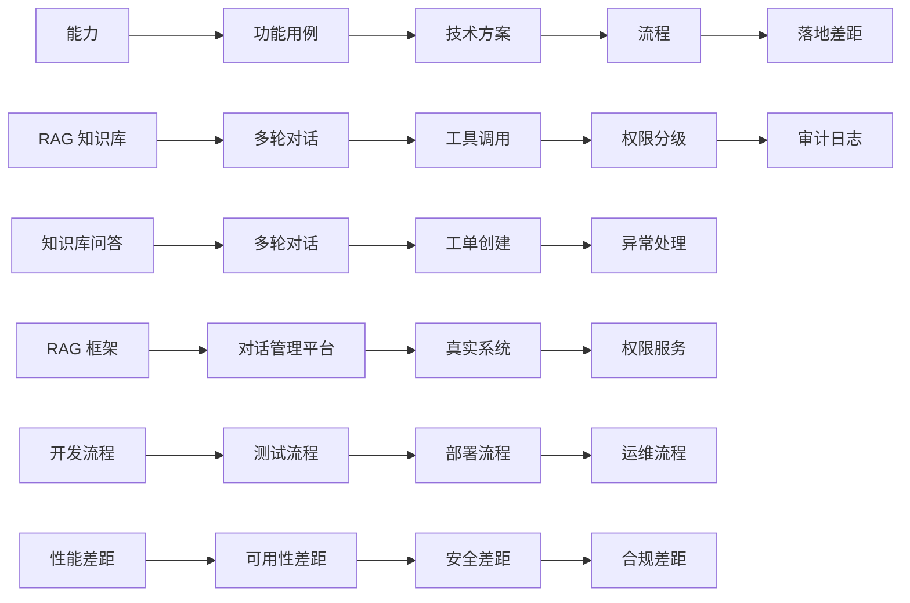

# §6 从 demo 到生产工具的演进之路思考

## 一句话摘要

从 demo 到生产工具的演进之路思考 的核心要点与实践指导。

**5W 速记卡**：
- **What**：客服 agent 从 demo 到生产的演进
- **Why**：demo 和生产差距很大
- **Who**：要做客服 agent 的工程师
- **When**：demo 完成后
- **Where**：生产环境

**自测三问**：
1. 本文核心机制：演进链 = 能力 → 功能用例 → 技术方案 → 流程 → 落地差距
2. 失效点：demo 级代码直接上线 → 生产事故
3. 与下篇衔接：演进之路 → 项目架构和亮点

---

## 6.1 思考：demo 和生产差距在哪

demo 级客服 agent 和生产级客服系统的差距：

| 维度 | demo | 生产 |
|---|---|---|
| RAG 知识库 | 内存向量表 | 向量数据库（Milvus/Pinecone） |
| 多轮对话 | 状态机 | 对话管理平台 |
| 工具调用 | requests mock | 真实系统 + 重试 + 熔断 |
| 权限分级 | 代码 if/else | 权限服务 + 审计服务 |
| 审计日志 | 写文件 | 日志服务 + 合规存储 |
| 部署 | 本地运行 | 容器化 + K8s + 监控 |
| 性能 | 秒级 | 毫秒级 |
| 可用性 | 99% | 99.99% |

**核心差距**：demo 只验证「能不能跑」，生产要验证「能不能用」。

## 6.2 演进链

## 6.3 演进步骤

| 步骤 | 从 demo | 到生产 | 关键改动 |
|---|---|---|---|
| ① RAG 知识库 | 内存向量表 | 向量数据库 | 索引管理 + 实时更新 |
| ② 多轮对话 | 状态机 | 对话管理平台 | 对话管理 + 上下文管理 |
| ③ 工具调用 | requests mock | 真实系统 | 重试 + 熔断 + 限流 |
| ④ 权限分级 | 代码 if/else | 权限服务 | 权限管理 + 审计 |
| ⑤ 审计日志 | 写文件 | 日志服务 | 合规存储 + 检索 |
| ⑥ 部署 | 本地运行 | 容器化 + K8s | 监控 + 告警 + 扩容 |
| ⑦ 性能 | 秒级 | 毫秒级 | 缓存 + 异步 + 并行 |
| ⑧ 可用性 | 99% | 99.99% | 冗余 + 灾备 + 演练 |

## 6.4 落地差距（生产 = 客服系统 + agent 决策）

**生产级客服 agent 的核心挑战**：

1. **RAG vs 规则的边界**——RAG 覆盖知识库查询，规则覆盖固定流程。边界在哪？怎么动态调整？
2. **多轮对话 vs 单轮问答的 trade-off**——多轮对话灵活但复杂，单轮问答简单但僵化。怎么平衡？
3. **可解释性 vs 性能的 trade-off**——客服需要可解释（为什么这样回答），但 LLM 黑盒。怎么兼顾？
4. **审计 vs 效率的 trade-off**——审计要完整记录，但完整记录影响性能。怎么取舍？
5. **合规 vs 创新的 trade-off**——合规要求严格，但创新需要灵活。怎么平衡？

**每个差距都是生产级客服 agent 的必答题**——不是「要不要做」，而是「怎么做 + 什么时候做」。

## 6.5 与 §10 Trade-off 的关系

§6 讲「演进路径」，§10 讲「trade-off 决策」。§6 的每个步骤都对应 §10 的一个 trade-off 维度。

| §6 步骤 | §10 trade-off | 决策点 |
|---|---|---|
| ① RAG 知识库 | RAG vs 规则 | 知识库覆盖度 vs 规则灵活性 |
| ② 多轮对话 | 实时 vs 准确 | 延迟 vs 准确率 |
| ③ 工具调用 | 效率 vs 安全 | 性能 vs 权限控制 |
| ④ 权限分级 | 效率 vs 合规 | 性能 vs 审计 |
| ⑤ 审计日志 | 完整 vs 性能 | 审计完整性 vs 性能 |
| ⑥ 部署 | 成本 vs 可用性 | 成本 vs 可用性 |
| ⑦ 性能 | 延迟 vs 准确率 | 延迟 vs 准确率 |
| ⑧ 可用性 | 成本 vs 可用性 | 成本 vs 可用性 |

---

> **系列**：从零开始写一个客服 agent（整合层 demo 工程）
> **模板**：project-demo-template.md v3.1（§6 = 从 demo 到生产工具的演进之路思考）
> **核心原则**：每个关键决策都要讲\"为什么这样选\"——哪怕答案只是\"因为 demo 简单\"。学习型 demo 的 trade-off 与生产型不同。

---

## 📌 数据与事实声明

- 本文的架构图（mermaid）为作者根据业界共识绘制，非来自特定大厂架构
- 调研数据（github star 数）为 2026-09-21 前实测，star 数随时变化

## 📚 参考资料

|| 类型 | 标题 | 来源 |
||---|---|---|
|| 论文 | Retrieval-Augmented Generation for Large Language Models: A Survey | arXiv |
|| 官方文档 | LangChain / LlamaIndex | docs.langchain.com / docs.llamaindex.ai |
|| 系列导航 | AI 域目录 | `docs/ai/index.md` |