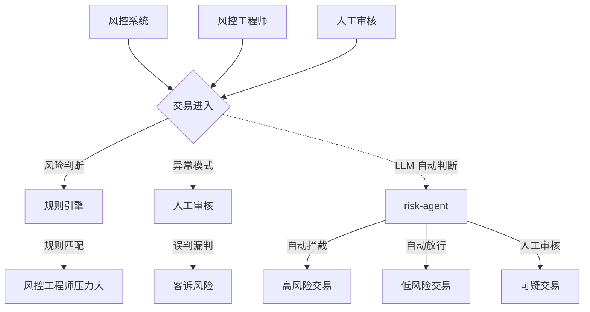

# §1 为什么写：跨境支付风控 agent 的价值论证

## 一句话摘要

为什么写 的核心要点与实践指导。

**5W 速记卡**：
- **What**：风控 agent —— 交易进入风控系统后，agent 自动判断风险等级 + 触发对应动作
- **Why**：规则引擎无法覆盖的异常模式 + 实时决策 + 多轮确认
- **Who**：有支付系统基础的工程师
- **When**：2026 年，风控是支付核心场景
- **Where**：跨境支付风控系统

**自测三问**：
1. 本文核心机制：风控 agent = 规则引擎 + LLM 判断 + 动作执行
2. 失效点：规则引擎无法覆盖的异常模式 → LLM 判断
3. 与下篇衔接：为什么写 → 调研和对参考的思考

---

## 1.1 思考：为什么值得做这个 demo

跨境支付风控是 2026 年最典型的「业务规则密集型」行业之一：交易进入风控系统后，需要判断风险等级 + 触发对应动作（拦截/放行/人工审核）。

这些问题的共同特征是：

1. **高频重复**：同一个「这笔交易有风险吗」每天被问几千次
2. **知识面宽**：风控规则/黑名单/合规政策/交易模式，横跨业务多个模块
3. **更新快**：风控规则调整、合规政策更新、黑名单变动，知识库要跟上
4. **答错有代价**：风控场景下判断错误（该拦截没拦截 / 不该拦截拦截了）会直接引发资金损失或客诉

而现实中，这些重复判断的压力最终落在**风控工程师和人工审核**身上——风控不懂 LLM 要问研发，研发被反复拉去答疑，双方都被消耗。

**本 demo 的价值在于**：用 LLM + 规则引擎从零搭一个「跨境支付风控」agent——**把风控规则沉淀成知识库，让 agent 自动判断风险等级 + 触发对应动作**。不是用 LangChain / LlamaIndex 框架调包，而是**手写规则引擎 + 手写 LLM 判断 + 手写动作执行**，理解风控 agent 的每一个环节。

## 1.2 目标读者

- 有支付系统基础的工程师
- 想做风控 agent 的工程师
- 对 LLM 在风控场景应用感兴趣的人

## 1.3 系列定位

本系列是「从零写一个 agent」整合层 demo 工程的**风控篇**：
- 延续 claude-code-cli 系列的「从零实现」风格
- 延续 payment-rag-agent 系列的「业务场景」锚点
- 重点：风控规则引擎 + LLM 判断 + 多轮确认 + 权限分级

## 1.4 核心学习目标

完成本系列后，你能：
- 手写风控规则引擎（规则匹配 + 例外处理）
- 用 LLM 做风险判断（多轮对话 + 追问澄清）
- 调用外部工具（查黑名单/查交易历史/查合规政策）
- 实现权限分级（L0-L3 + HITL 决策树）
- 写审计日志（完整记录每个决策依据）

## 1.5 与现有系列的关系

| 系列 | 关系 | 本系列补充 |
|---|---|---|
| claude-code-cli | agent 框架 | 本系列聚焦业务场景 |
| payment-rag-agent | RAG 知识库问答 | 本系列聚焦风控决策 |
| 特性层 Agent 工程化 | 理论 | 本系列写实战代码 |

## 1.6 写作风格

- 从零实现，不依赖框架
- 纯 Python + requests（唯一外部依赖）
- 保留 claude-code-cli 系列的「麻雀虽小五脏俱全」风格
- 重点写风控场景的特殊性（规则引擎 + LLM 判断）

## 1.7 涉及能力点

- 跨境支付风控规则引擎（风险等级/规则匹配/例外处理）
- 多轮对话（追问澄清 → 确认风险 → 决策放行/拦截）
- 工具调用（查黑名单/查交易历史/查合规政策）
- 权限分级（L0 只读 → L1 标记 → L2 拦截 → L3 放行人工审核）
- 审计日志（完整记录每个决策依据）

## 1.8 量级分档意识

| 档位 | 峰值 QPS | 典型场景 |
|---|---|---|
| 万级 | 1万 QPS | 小型支付渠道 |
| 十万级 | 10万 QPS | 主支付链路 |
| 百万级 | 100万 QPS | 大促峰值 |

## 1.9 Trade-off 概览

- 规则引擎 vs LLM：规则引擎快但僵化，LLM 灵活但慢
- 从零 vs 框架：从零可控但慢，框架高效但黑盒
- 实时 vs 准实时：风控要实时，但准实时可以容忍

## 1.10 注意事项

- 本系列是 demo，不是生产系统
- 风控规则只是示例，不是真实规则
- LLM 判断只是辅助，不是唯一依据
- 权限分级只是示例，不是真实策略

## 1.11 参考资料

- awesome-llm-apps / agentic_rag 相关仓库
- 跨境支付风控系统文档
- LLM 风控应用场景论文

---

## 📚 参考资料

|| 类型 | 标题 | 来源 |
||---|---|---|
|| 论文 | Retrieval-Augmented Generation for Large Language Models: A Survey | arXiv |
|| 官方文档 | LangChain / LlamaIndex | docs.langchain.com / docs.llamaindex.ai |
|| 系列导航 | AI 域目录 | `docs/ai/index.md` |