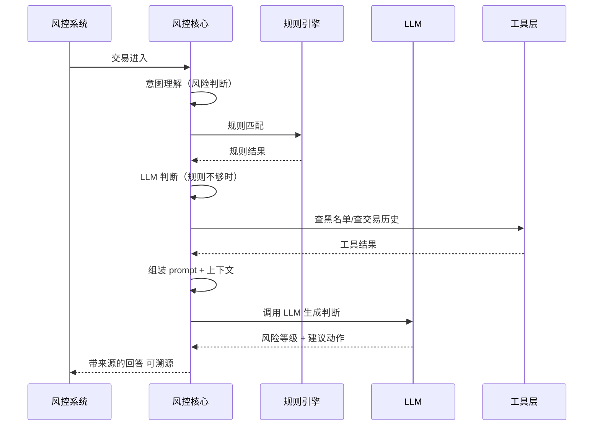

# §3 系统架构与技术选型：风控 agent 架构

## 一句话摘要

系统架构与技术选型 的核心要点与实践指导。

**5W 速记卡**：
- **What**：风控 agent 架构 + 技术选型 trade-off
- **Why**：架构决定可维护性，选型决定成本/性能上限
- **Who**：要做风控 agent 的工程师
- **When**：动手实现前的架构设计阶段
- **Where**：本地开发环境 / 开源框架仓库

**自测三问**：
1. 本文核心机制：架构 vs 技术选型 trade-off = 可维护性 vs 成本/性能
2. 失效点：架构不合理 → 可维护性差，选型不当 → 成本/性能受限
3. 与下篇衔接：架构设计 → 实现方案

---

## 3.1 系统架构总览

```mermaid
flowchart TB
    subgraph TOP [\"入口层\"]
        direction LR
        U[\"用户<br/>风控系统/人工审核\"]
        CLI[\"CLI 入口层<br/>argparse + 交互循环\"]
        U -->|交易数据| CLI
    end

    subgraph CORE [\"风控核心层\"]
        direction LR
        R[\"风险判断闭环<br/>规则引擎 → LLM → 动作\"]
    end

    subgraph RES [\"资源层-被核心编排\"]
        direction LR
        E[\"规则引擎<br/>规则匹配 + 例外处理\"]
        L[\"LLM 客户端<br/>OpenAI 兼容 API\"]
        T[\"工具层<br/>查黑名单/查交易历史/查合规\"]
        P[\"策略层<br/>权限分级 + HITL\"]
    end

    CLI --> R
    R --> E
    R --> L
    R --> T
    R --> P

    style CORE fill:#e3f2fd,stroke:#1976d2,stroke-width:2px
    style TOP fill:#f3e5f5,stroke:#9c27b0
    style RES fill:#f5f5f5,stroke:#9e9e9e
```

**这张图只表达「分层结构」（谁在上层、谁依赖谁），不表达调用时序（时序在 3.2）。**

三层一句话：
- **入口层**（顶层）：接交易数据，转发给核心层——不碰风控逻辑
- **风控核心层**（中层，高亮）：唯一的编排者——决定规则引擎 → LLM 判断 → 动作执行
- **资源层**（底层）：被核心层调用的「能力」——规则引擎/LLM/工具/策略各司其职

### 为什么这么分层？

**一句话**：把「风控该做什么」（风险判断 + 动作执行）和「风控怎么做」（规则引擎/LLM/工具）分开——这是经典的分层架构思想，也是生产级风控 agent 的基本形态。

**每一层的职责边界**（想清楚边界，后面实现才不会乱）：

| 层 | 职责 | 不做什么 | 通俗理解 |
|---|---|---|---|
| **CLI 入口层** | 接交易数据，分发任务 | 不碰风控逻辑 | 前台接待员 |
| **风控核心层** | 编排闭环：规则引擎 → LLM → 动作 | 不关心规则/LLM 细节 | 项目经理 |
| **LLM 客户端** | 调用大模型做风险判断 | 不决定风控策略 | 外包大脑 |
| **规则引擎层** | 规则匹配 + 例外处理 | 不做 LLM 判断 | 规则专家 |
| **工具层** | 查黑名单/查交易历史/查合规 | 不做风险判断 | 信息提供者 |
| **策略层** | 权限分级 + HITL 决策 | 不做风险判断 | 安全顾问 |

**为什么「风控核心层」这么突出？**——它是**唯一有编排权**的层。交易来了，它决定：走规则引擎还是 LLM？需要什么工具？要不要 HITL？这就是「**编排（Orchestration）**」的思想：风控核心在中心，各环节都是被它调用的「资源」。

**通俗比喻**：想象一个**风控经理（风控核心）**——
- 他接到交易（用户输入）
- 他让规则专家（规则引擎层）先匹配规则
- 规则不够时他找外包大脑（LLM 客户端）做判断
- 查信息时他让信息提供者（工具层）查数据
- 高风险动作他要安全顾问（策略层）审批
- 最终决定拦截/放行/人工审核

**这个分层在生产级风控系统也一样**——只是规则专家更强（复杂规则引擎）、外包大脑更聪明（LLM 风控）、信息提供者更多（实时数据接口）。**理解了 demo 的分层，就理解了生产版的骨架。**

## 3.2 业务架构（查询链路）

```mermaid
flowchart LR
    subgraph QUERY [\"交易侧\"]
        direction LR
        T1[\"交易进入\"]
        T2[\"风险标记\"]
        T3[\"异常交易\"]
        T4[\"人工审核\"]
    end

    subgraph RAGFLOW [\"风控问答闭环\"]
        R1[\"意图理解<br/>问题向量化\"]
        R2[\"检索<br/>Top-K 相似规则\"]
        R3[\"组装<br/>问题 + 上下文\"]
        R4[\"生成<br/>LLM 回答 + 来源\"]
    end

    subgraph OUTPUT [\"输出侧\"]
        O1[\"带来源的回答<br/>风险等级 + 建议动作\"]
        O2[\"找不到时兜底<br/>建议转人工\"]
    end

    T1 --> R1
    T2 --> R1
    T3 --> R1
    T4 --> R1
    R1 --> R2 --> R3 --> R4
    R4 --> O1
    R4 -.检索不到.-> O2

    style RAGFLOW fill:#e3f2fd,stroke:#1976d2
    style QUERY fill:#f3e5f5,stroke:#9c27b0
    style OUTPUT fill:#e8f5e9,stroke:#388e3c
```

### 一次风控的完整链路（时序图）



### 业务逻辑详解

**三类交易 → 同一个风控闭环**——这是本 demo 的核心价值：正常交易/风险交易/异常交易虽然不同，但走的都是「规则引擎 → LLM 判断 → 动作执行」这条链路。风控规则更新了，所有交易的判断一起更新。

**兜底策略**：规则引擎 + LLM 都无法判断时（相似度低于阈值），不硬判（避免误拦），输出「建议转人工」——这是支付业务风控的合规底线。

## 3.3 数据架构（风控知识库怎么存）

### 风控数据摄入链路

```mermaid
flowchart LR
    A[\"风控文档<br/>规则表/黑名单/合规政策\"] --> B[\"加载<br/>Markdown/纯文本\"]
    B --> C[\"分块<br/>递归字符分块 500字+50重叠\"]
    C --> D[\"向量化<br/>TF-IDF 词频向量\"]
    D --> E[\"索引<br/>内存向量表 + 文档映射\"]
    E --> F[\"风控知识库<br/>启动时构建\"]
```

### 数据模型（erDiagram）

```mermaid
erDiagram
    DOCUMENT ||--o{ CHUNK : \"分块成\"
    CHUNK ||--o{ TOKEN : \"包含词\"
    CHUNK ||--o{ QUERY_HIT : \"被检索到\"
    DOCUMENT {
        string id PK
        string title
        string source \"规则表/黑名单/合规政策\"
    }
    CHUNK {
        string id PK
        string doc_id FK
        string text \"分块文本\"
        string chunk_type \"规则/黑名单/合规\"
        int risk_level \"风险等级\"
    }
    TOKEN {
        string id PK
        string chunk_id FK
        string term \"词项\"
        float tfidf \"TF-IDF 权重\"
    }
    QUERY_HIT {
        string id PK
        string chunk_id FK
        string query \"查询词\"
        float similarity \"相似度\"
    }
```

## 3.4 功能用例（Function Use Case）

| 用例 | 触发条件 | 预期结果 | 优先级 |
|---|---|---|---|
| 风险判断 | 交易进入风控系统 | 返回风险等级 + 建议动作 | P0 |
| 规则匹配 | 命中风控规则 | 返回规则结果 + 例外处理 | P0 |
| LLM 判断 | 规则无法覆盖 | 返回 LLM 判断 + 依据 | P1 |
| 工具调用 | 需要查外部数据 | 返回工具结果 + 来源 | P1 |
| 权限检查 | 高风险动作 | 检查权限 + HITL 审批 | P0 |
| 审计日志 | 每个决策 | 记录完整决策依据 | P0 |
| 多轮确认 | 可疑交易 | 追问澄清 + 确认风险 | P2 |

## 3.5 技术选型（核心 trade-off）

### 3.5.1 从零实现 vs 用框架

| 维度 | 从零实现 | LangChain/LlamaIndex |
|---|---|---|
| 可控性 | 高（每行代码都可读） | 低（框架黑盒） |
| 学习曲线 | 陡（要懂每个环节） | 平（API 调用） |
| 生产就绪 | 低（demo 级） | 高（框架成熟） |
| 调试难度 | 低（日志完整） | 高（框架封装） |
| 可复刻性 | 高（纯 Python） | 低（框架依赖） |

**本系列选从零实现**——理由：风控 agent 的核心是「规则引擎 + LLM 判断」，从零实现能深入理解每个环节的 trade-off。

### 3.5.2 规则引擎 vs LLM 判断

| 维度 | 规则引擎 | LLM 判断 |
|---|---|---|
| 速度 | 快（毫秒级） | 慢（秒级） |
| 可解释性 | 高（规则透明） | 低（黑盒） |
| 灵活性 | 低（规则僵化） | 高（能处理异常） |
| 准确率 | 高（规则明确） | 中（LLM 不稳定） |
| 维护成本 | 低（规则少） | 高（prompt 维护） |

**本系列组合使用**：规则引擎优先 + LLM 兜底。

### 3.5.3 全谱系选型（风控各方向怎么选）

| 方向 | 选型 | 理由 | 代价 |
|---|---|---|---|
| 规则引擎 | 从零手写 | 规则少 + 可控 | 功能有限 |
| LLM 判断 | OpenAI API | 灵活 + 稳定 | 成本 + 延迟 |
| 工具调用 | requests | 简单 + 可控 | 功能有限 |
| 多轮对话 | 状态机 | 可控 + 可解释 | 灵活性低 |
| 权限分级 | 代码实现 | 必须精确 | 维护成本 |

## 3.6 部署架构

```mermaid
flowchart TB
    A[\"用户请求\"] --> B[\"CLI 入口\"]
    B --> C[\"风控核心\"]
    C --> D[\"规则引擎\"]
    C --> E[\"LLM 客户端\"]
    C --> F[\"工具层\"]
    C --> G[\"策略层\"]
    D --> H[\"规则库\"]
    E --> I[\"OpenAI API\"]
    F --> J[\"黑名单/交易历史/合规\"]
    G --> K[\"权限 + HITL\"]
```

---

> **系列**：从零开始写一个跨境支付风控 agent（整合层 demo 工程）
> **模板**：project-demo-template.md v3.1（§3 = 系统架构 + 技术选型）
> **核心原则**：每个关键决策都要讲\"为什么这样选\"——哪怕答案只是\"因为 demo 简单\"。学习型 demo 的 trade-off 与生产型不同。

---

## 📌 数据与事实声明

- 本文的架构图（mermaid）为作者根据业界共识绘制，非来自特定大厂架构
- 调研数据（github star 数）为 2026-09-21 前实测，star 数随时变化

## 📚 参考资料

|| 类型 | 标题 | 来源 |
||---|---|---|
|| 论文 | Retrieval-Augmented Generation for Large Language Models: A Survey | arXiv |
|| 官方文档 | LangChain / LlamaIndex | docs.langchain.com / docs.llamaindex.ai |
|| 系列导航 | AI 域目录 | `docs/ai/index.md` |