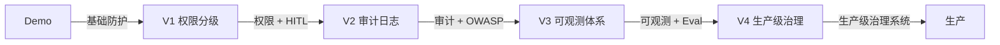

# §10 Trade-off 与生产演进：治理核心权衡

## 一句话摘要

Trade-off 与生产演进 的核心要点与实践指导。

**5W 速记卡**：
- **What**：治理 5 维 trade-off + 生产演进
- **Why**：每个设计选择都有代价
- **Who**：做了风控/客服 agent 的工程师
- **When**：设计治理架构时
- **Where**：风控 agent + 客服 agent

**自测三问**：
1. 本文核心机制：5 维 trade-off = 安全 vs 可用性 / 合规 vs 创新 / 审计 vs 效率 / 可解释性 vs 性能 / 实时 vs 准实时
2. 失效点：trade-off 不当 → 安全事故
3. 与系列衔接：§10 是收官篇 — 之前所有篇章的 trade-off 汇总

---

## 10.1 Trade-off 总览

| 维度 | 选型 A | 选型 B | 代价 A | 代价 B | 决策点 |
|---|---|---|---|---|---|
| **安全 vs 可用性** | 严格治理 | 灵活可用 | 可用性低 | 安全风险高 | 业务可接受哪种风险？ |
| **合规 vs 创新** | 严格合规 | 灵活创新 | 创新慢 | 合规风险高 | 合规要求多高？ |
| **审计 vs 效率** | 完整审计 | 高效率 | 影响性能 | 审计不全 | 合规要求？ |
| **可解释性 vs 性能** | 可解释 | 高性能 | 性能低 | 黑盒 | 风控需要可解释？ |
| **实时 vs 准实时** | 实时 | 准实时 | 延迟高 | 精度低 | 风控要实时？ |

## 10.2 安全 vs 可用性

**这是治理最核心的 trade-off**——治理越严格，可用性越低；可用性越高，安全风险越高。

| 策略 | 安全性 | 可用性 | 适用场景 |
|---|---|---|---|
| 严格治理 | 高 | 低 | 金融/医疗（安全第一） |
| 平衡策略 | 中 | 中 | 电商/支付（可接受一定风险） |
| 宽松策略 | 低 | 高 | 内部系统（可用性第一） |

**决策点**：业务可接受哪种风险？
- 金融/医疗：安全第一 → 严格治理
- 电商/支付：可接受一定风险 → 平衡策略
- 内部系统：可用性第一 → 宽松策略

## 10.3 合规 vs 创新

**合规要求 vs 创新灵活**——这是 agent 治理的常见矛盾。

| 策略 | 合规性 | 创新性 | 适用场景 |
|---|---|---|---|
| 严格合规 | 高 | 低 | 金融/医疗 |
| 平衡策略 | 中 | 中 | 电商/支付 |
| 灵活创新 | 低 | 高 | 内部系统 |

**决策点**：合规要求多高？
- 金融/医疗：合规第一 → 严格合规
- 电商/支付：可接受一定风险 → 平衡策略
- 内部系统：创新第一 → 灵活创新

## 10.4 审计 vs 效率

**审计要完整**——每个决策都要留痕。但完整审计影响性能。

| 策略 | 审计完整性 | 性能 | 适用场景 |
|---|---|---|---|
| 完整审计 | 高 | 低 | 合规要求高 |
| 抽样审计 | 中 | 中 | 合规要求中 |
| 不审计 | 低 | 高 | 内部系统 |

**决策点**：合规要求
- 合规要求高：完整审计
- 合规要求中：抽样审计
- 内部系统：不审计

## 10.5 可解释性 vs 性能

**风控/客服需要可解释**——为什么拦截/为什么这样回答。但可解释影响性能。

| 策略 | 可解释性 | 性能 | 适用场景 |
|---|---|---|---|
| 可解释 | 高 | 低 | 金融/医疗 |
| 黑盒 | 低 | 高 | 内部系统 |
| 混合 | 中 | 中 | 平衡场景 |

**决策点**：风控/客服需要可解释
- 金融/医疗：可解释
- 内部系统：黑盒
- 平衡场景：混合

## 10.6 实时 vs 准实时

**风控要实时**——交易进入风控系统，需要毫秒级判断。但实时判断影响精度。

| 策略 | 实时性 | 精度 | 适用场景 |
|---|---|---|---|
| 实时 | 高 | 低 | 已知风险 |
| 准实时 | 中 | 高 | 未知风险 |
| 混合 | 中 | 高 | 规则 + LLM |

**决策点**：风控要实时
- 实时场景：规则优先
- 准实时场景：LLM 优先
- 混合场景：规则 + LLM

## 10.7 生产演进路径

| 版本 | 核心能力 | 适用场景 |
|---|---|---|
| Demo | 基础防护 | 验证核心逻辑 |
| V1 | 权限分级 + HITL | L0-L3 + HITL |
| V2 | 审计日志 + 可观测 | 完整审计 |
| V3 | OWASP + 红队 | 持续威胁评估 |
| V4 | 生产级治理系统 | 容器化 + K8s + 监控 |

## 10.8 与 §6 演进之路的关系

§6 讲「演进路径」，§10 讲「trade-off 决策」。§6 的每个步骤都对应 §10 的一个 trade-off 维度。

| §6 步骤 | §10 trade-off | 决策点 |
|---|---|---|
| ① 权限分级 | 安全 vs 可用性 | 权限严格 vs 可用性 |
| ② HITL 决策树 | 合规 vs 创新 | 审批严格 vs 创新灵活 |
| ③ 审计日志 | 审计 vs 效率 | 审计完整性 vs 性能 |
| ④ 可观测 | 可解释性 vs 性能 | 可解释 vs 性能 |
| ⑤ OWASP ASI | 实时 vs 准实时 | 实时审计 vs 准实时 |
| ⑥ 部署 | 成本 vs 可用性 | 成本 vs 可用性 |
| ⑦ 性能 | 延迟 vs 准确率 | 延迟 vs 准确率 |
| ⑧ 可用性 | 成本 vs 可用性 | 成本 vs 可用性 |

---

> **系列**：从零写一个 agent：治理篇（整合层高阶）
> **模板**：project-demo-template.md v3.1（§10 = Trade-off 与生产演进）
> **核心原则**：每个关键决策都要讲「为什么这样选」——哪怕答案只是「因为 demo 简单」。学习型 demo 的 trade-off 与生产型不同。

---

## 📌 数据与事实声明

- 本文的架构图（mermaid）为作者根据业界共识绘制，非来自特定大厂架构
- 调研数据（github star 数）为 2026-09-21 前实测，star 数随时变化

## 📚 参考资料

|| 类型 | 标题 | 来源 |
||---|---|---|
|| 论文 | Retrieval-Augmented Generation for Large Language Models: A Survey | arXiv |
|| 官方文档 | LangChain / LlamaIndex | docs.langchain.com / docs.llamaindex.ai |
|| 系列导航 | AI 域目录 | `docs/ai/index.md` |
|| 开源框架 | NVIDIA NeMo-Guardrails | github.com/NVIDIA/NeMo-Guardrails |
|| 威胁清单 | OWASP Agentic Security Initiative Top 10 | owasp.org |