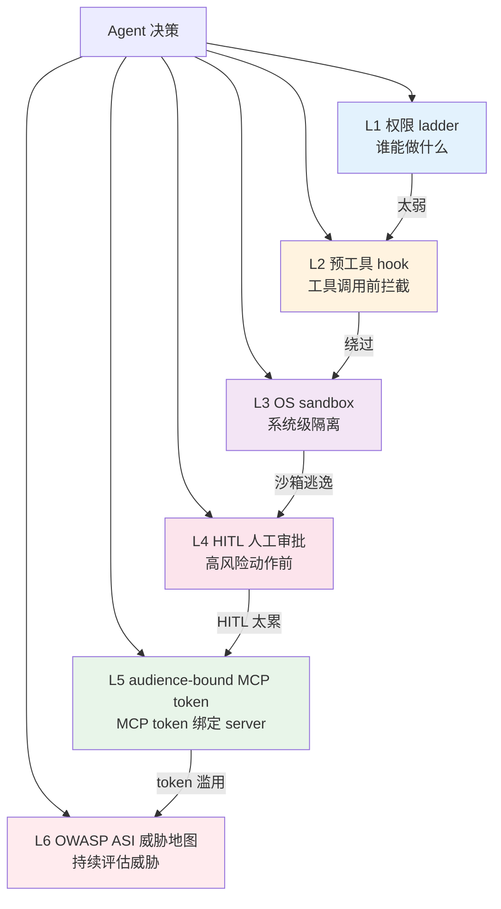
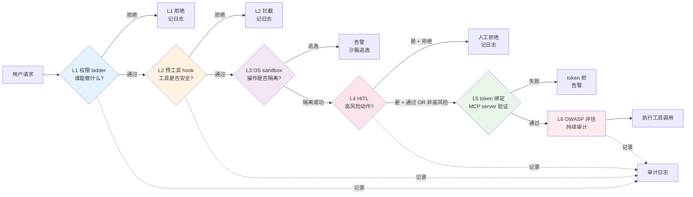

# §2 6 层政策栈全景：治理理论

## 一句话摘要

6 层政策栈全景 的核心要点与实践指导。

**5W 速记卡**：
- **What**：6 层政策栈（权限 ladder / 预工具 hook / OS sandbox / HITL / MCP token / OWASP ASI）
- **Why**：单层防御 = 必被绕过，多层协同 = 纵深防御
- **Who**：做了风控/客服 agent 的工程师
- **When**：设计治理架构前
- **Where**：风控 agent + 客服 agent

**自测三问**：
1. 本文核心机制：6 层政策栈 = L1 权限 + L2 hook + L3 sandbox + L4 HITL + L5 token + L6 OWASP
2. 失效点：只 sandbox 其他不管 → 80% 安全事故
3. 与下篇衔接：6 层政策栈 → 风控 agent 治理架构

---

## 2.1 思考：为什么需要 6 层

**核心问题**：agent 安全为什么不能只靠一层？

答案：单层防御 = 必被绕过。因为 agent 的攻击面动态变化——prompt injection 可以绕过权限控制，sandbox 逃逸可以绕过 hook，LLM 幻觉可以绕过审计。

**6 层政策栈的设计思想**：
- L1 权限 ladder：谁能做什么（基础权限）
- L2 预工具 hook：工具调用前拦截（动作拦截）
- L3 OS sandbox：系统级隔离（环境隔离）
- L4 HITL：高风险动作人工审批（人工决策）
- L5 MCP token：MCP token 绑定 server（认证隔离）
- L6 OWASP ASI：持续评估威胁（持续检查）

**核心口诀**：**单层防御 = 必被绕过，多层协同 = 纵深防御。**

## 2.2 6 层政策栈全景图



## 2.3 L1 权限 ladder（谁能做什么）

**核心**：RBAC + agent 可执行操作分级——把 agent 能做的事按风险分成多级。

| 级别 | 操作 | 风险 | 示例 |
|---|---|---|---|
| **L0 只读** | 查询数据库 / 读取文件 | 低 | 查订单 / 查费率 |
| **L1 写业务数据** | 写数据库 / 发送通知 | 中 | 标记风险 / 创建工单 |
| **L2 外部副作用** | 调外部 API / 发邮件 / 转账 | 高 | 拦截交易 / 冻结账户 |
| **L3 系统级操作** | 删数据 / 改配置 / shell | 极高 | 删数据库 / 改规则 |

**关键原则**：
- agent 默认只能做 L0
- L1+ 必须显式授权
- 任何授权可立即撤销
- 每个权限检查留审计日志

## 2.4 L2 预工具 hook（工具调用前拦截）

**核心**：工具调用前的检查机制——agent 决定调用工具时，先经过 hook 函数检查。

```python
@before_tool_call
def check_tool_call(tool_name, args):
    if tool_name == "delete_record" and not user_authorized("delete"):
        raise PermissionDenied()
    if "ssn" in str(args) and not policy.allow_pii():
        raise PolicyViolation()
    return allow()
```

**典型应用**：NeMo-Guardrails / LangChain Guardrails

## 2.5 L3 OS sandbox（系统级隔离）

**核心**：agent 在隔离环境里运行——即使 agent 被攻击，影响也限制在沙箱内。

- 进程级沙箱：agent 进程权限受限
- 文件系统沙箱：agent 只能访问指定目录
- 网络沙箱：agent 只能访问白名单域名
- Docker 沙箱：agent 在容器里跑（最强隔离）

**典型应用**：Docker / Firecracker / gVisor

## 2.6 L4 HITL 人工审批（高风险动作前）

**核心**：高风险操作前必须人工审批——agent 决定做「高风险动作」时，先暂停，等人工确认。

| 风险等级 | HITL 必要性 | 审批人 | 决策权 |
|---|---|---|---|
| L0 只读 | ❌ 不需要 | - | agent 自动 |
| L1 业务 | ⚠️ 抽样（10%）| 业务 owner | agent 自动 + 事后审计 |
| L2 外部 | ✅ 必审批（实时）| 业务 owner | 人工实时审批 |
| L3 系统 | ✅✅ 双人审批（实时）| 业务 + 技术 owner | 人工双人审批 |

**HITL 5 种降级负担方法**：
1. 批量审批（适合 L1 抽样）
2. 异步审批（适合 L2/L3）
3. 自动审批 + 事后审计（适合 L1）
4. 分级审批（按风险等级）
5. 智能审批（AI 辅助决策）

## 2.7 L5 audience-bound MCP token（MCP token 绑定）

**核心**：MCP token 必须绑定到具体 server URL——防止 token 被滥用 / 跨服务攻击。

```
token 绑定 https://api.example.com/mcp
  → 此 token 只能用于这个 server
  → 不能用于其他 server（即使 token 泄露）
```

**典型应用**：MCP 2026-07 spec 增强

## 2.8 L6 OWASP ASI 威胁地图（持续评估）

**核心**：定期对照 OWASP ASI Top 10 检查 agent——发现新威胁 + 评估已有防护。

- 季度审计：对照 Top 10 检查 agent
- 新威胁响应：OWASP 发布新威胁时立即评估
- 红队演练：模拟攻击测试 agent 防护

## 2.9 6 层协同的「反绕过」设计

**关键洞察**：6 层不是「任意一层防住就行」，而是「一层被绕过，下一层防住」：

- L1 权限太弱 → L2 拦截
- L2 hook 被绕过 → L3 沙箱隔离
- L3 沙箱逃逸 → L4 HITL 拦截
- L4 HITL 太累被绕过 → L5 token 限制爆炸范围
- L5 token 滥用 → L6 持续评估发现

## 2.10 6 层政策栈的请求流



---

> **系列**：从零写一个 agent：治理篇（整合层高阶）
> **模板**：project-demo-template.md v3.1（§2 = 6 层政策栈全景）
> **核心原则**：每个关键决策都要讲「为什么这样选」——哪怕答案只是「因为 demo 简单」。学习型 demo 的 trade-off 与生产型不同。

---

## 📌 数据与事实声明

- 本文的架构图（mermaid）为作者根据业界共识绘制，非来自特定大厂架构
- OWASP ASI Top 10 是 OWASP 2026 年发布的官方威胁清单
- 6 层政策栈基于业界共识（NVIDIA NeMo-Guardrails + LangChain + MCP spec 2026）

## 📚 参考资料

|| 类型 | 标题 | 来源 |
||---|---|---|
|| 官方威胁清单 | OWASP Agentic Security Initiative Top 10（2026）| owasp.org/agentic-security-initiative |
|| 开源框架 | NVIDIA NeMo-Guardrails | github.com/NVIDIA/NeMo-Guardrails |
|| 商业框架 | LangChain Guardrails | langchain.com/guardrails |
|| 官方文档 | MCP 2026 spec | github.com/modelcontextprotocol/specification |