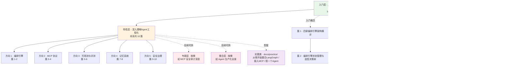

# 深入理解 Agent 工程化特性系列 · 全景导读

> 这是「深入理解 Agent 工程化特性」系列的**第 0 篇全景导读**。
> 本系列共 10 篇 deep-dive，覆盖 Agent 工程化的 5 大方向：编排引擎 / MCP 协议 / 可观测与评测 / 记忆系统 / 安全治理。

---

## 📋 10 篇总览表

| 序号 | 文章 | 方向 | 目标 | 解决什么问题 | 得到什么 | 不能得到什么 |
|---|---|---|---|---|---|---|
| 1 | 四家编排引擎架构横评 | 编排引擎 | 能选 | LangGraph / CrewAI / AutoGen / OpenAI Agents SDK 各自架构怎么设计的？范式漂移逻辑？ | 四家架构对比表 + 范式漂移逻辑 + claude-code 14w star 解读 | 怎么用 LangGraph 写代码、怎么调试 graph |
| 2 | 编排引擎状态管理与选型决策树 | 编排引擎 | 能选 | 4 种场景该选哪个框架？什么时候不该用？状态管理差异？ | 4 场景 × 4 框架决策树 + 不选理由 + 反模式 | 状态管理的具体 API 用法 |
| 3 | MCP 协议设计思想与 spec 演进 | MCP 协议 | 能长 | tools/resources/prompts 三件套为什么这么设计？2024-11 → 2026-07 怎么演进的？ | MCP 设计取舍 + 演进时间线 + vs FC/OpenAPI | 怎么写一个 MCP server 的代码 |
| 4 | MCP 无状态化改造与生态选型 | MCP 协议 | 能活 + 能长 | stateless / ttlMs / MRTR 解决什么问题？生态怎么选型？ | 改造影响 + 生态分层 + MCP vs FC 决策树 + 反模式 | MCP server 部署步骤、客户端接入代码 |
| 5 | Agent 特有的 5 类失败模式与 Eval 三层 | 可观测与评测 | 能活 | Agent 失败和传统应用失败有何不同？怎么评测？ | 5 类失败模式 + Eval 三层适用与局限 | 怎么接入 LangSmith/Langfuse 的 SDK |
| 6 | Trace 设计思想与指标选型决策树 | 可观测与评测 | 能活 | 上线后 agent 变慢/变贵/出错，怎么发现 + 怎么修？采什么指标？ | Trace 三件套设计思想 + 指标选型决策树 + 反模式 | 具体的 trace 实现、告警规则配置 |
| 7 | 记忆系统架构横评：向量 / 图 / episodic / hybrid | 记忆系统 | 能长 | agent 跨 session/跨用户怎么记住？三种记忆模式的设计取舍是什么？hybrid 是不是总是优选？ | 四种记忆范式对比 + MAGMA SOTA 实测 + Mem0/Letta 设计哲学 | 怎么自己实现一套记忆系统、向量库选型对比 |
| 8 | 记忆系统选型决策树与反模式 | 记忆系统 | 能长 | 4 类场景该选哪种记忆架构？什么时候不该自己造记忆系统？什么时候该用图记忆？ | 4 场景 × 4 范式决策树 + 自研 vs 第三方边界 + 反模式 | Mem0/Letta 的具体接入代码、向量库调优 |
| 9 | Agent 安全治理：6 层政策栈与 OWASP ASI Top 10 | 安全治理 | 能活 | agent 越权/泄露/被注入怎么办？6 层政策栈各管什么？OWASP Agentic Top 10 是哪些威胁？ | 6 层政策栈全景（权限/hook/sandbox/HITL/MCP token/OWASP）+ 威胁地图 | 怎么部署 sandbox、policy-as-code 工具选型 |
| 10 | 权限设计与人机协作决策树 | 安全治理 | 能活 | 权限 ladder 怎么设计？什么时候必须 human-in-the-loop？policy-as-code vs policy-as-prompt 怎么选？ | 权限分级模型 + HITL 决策树 + 两种 policy 工程化取舍 + 反模式 | HITL 的具体消息队列实现、policy 规则写法 |

> **表中列说明**：「目标」= 能选 / 能活 / 能长（生产决策 3 大能力）；「不能得到什么」明确指向 `docs/practice/` 独立目录的实践类文章，不在本系列范围。

---

## 一、这个目录讲什么

入门层（从零开始认识AI系列）讲 Agent「是什么、为什么、怎么跑通」；本系列讲「怎么选、怎么避坑、为什么这么取舍」——5 大方向的**机制设计、状态管理、选型决策**，每个方向拆 2 篇，每篇独立完整可读。

不写实践 demo（跑通步骤、接入代码、debug 过程）——那些走 `docs/practice/` 独立目录（参见实践类 SOP）。

---

## 二、5 大方向全景图

---

## 三、10 篇导航表

| 序号 | 主题 | 所属方向 | 重点问题 |
|---|---|---|---|
| 0 | 全景导读（本篇） | — | 目录定位 + 10 篇地图 + 阅读路径 + 维护说明 |
| 1 | 四家编排引擎架构横评 | **方向 1：编排引擎** | LangGraph / CrewAI / AutoGen / OpenAI Agents SDK 四家架构对比 + 范式漂移 |
| 2 | 编排引擎状态管理与选型决策树 | **方向 1：编排引擎** | 状态管理机制对比 + 4 场景选型决策树 + 反模式 |
| 3 | MCP 协议设计思想与 spec 演进 | **方向 2：MCP 协议** | tools/resources/prompts 三件套设计思想 + 2024-11 → 2026-07 演进 |
| 4 | MCP 无状态化改造与生态选型 | **方向 2：MCP 协议** | stateless / ttlMs / MRTR 深读 + vs Function Calling/OpenAPI 决策树 |
| 5 | Agent 特有的 5 类失败模式与 Eval 三层 | **方向 3：可观测与评测** | 幻觉/工具错/循环/规划崩/上下文腐烂 + Eval 三层适用与局限 |
| 6 | Trace 设计思想与指标选型决策树 | **方向 3：可观测与评测** | LangSmith / Langfuse / Arize Phoenix 三大设计思想 + 指标选型 + 反模式 |
| 7 | 记忆系统架构横评：向量 / 图 / episodic / hybrid | **方向 4：记忆系统** | 四种记忆范式对比 + MAGMA SOTA 实测 + Mem0/Letta 设计哲学 |
| 8 | 记忆系统选型决策树与反模式 | **方向 4：记忆系统** | 4 场景 × 4 范式决策树 + 自研 vs 第三方边界 + 反模式 |
| 9 | Agent 安全治理：6 层政策栈与 OWASP ASI Top 10 | **方向 5：安全治理** | 权限 ladder / 预工具 hook / OS sandbox / HITL / MCP token / OWASP ASI |
| 10 | 权限设计与人机协作决策树 | **方向 5：安全治理** | 权限分级模型 + HITL 决策树 + policy-as-code vs policy-as-prompt + 反模式 |

---

## 四、我能得到什么（读完掌握的能力）

**方向 1-2（选型 + 长寿）**：
1. **能选型**：面对 LangGraph / CrewAI / AutoGen / OpenAI Agents SDK，能根据场景给出选型理由（不只"哪个流行"）
2. **能辨机制**：讲清 MCP spec 为什么这么设计（vs Function Calling 的取舍），能预判无状态化改造的影响
3. **能避坑**：识别编排引擎的常见反模式（如"全量 trace = 灾难"），知道什么时候不该用 MCP

**方向 3（生产稳定性）**：
4. **能搭观测体系**：知道 agent 特有的 5 类失败模式，能用 Eval 三层 + Trace 三件套搭起生产可观测体系

**方向 4（长期记忆）**：
5. **能选记忆架构**：面对新场景，能在向量 / 图 / episodic / hybrid 四种范式间做选型，知道什么时候不该自己造记忆系统
6. **能评 SOTA**：能基于 MAGMA/LoCoMo 等 benchmark 判断某种记忆方案是否适合自己的场景

**方向 5（生产安全）**：
7. **能建安全栈**：能搭起 6 层政策栈（权限/hook/sandbox/HITL/MCP token/OWASP），能对照 OWASP ASI Top 10 排查威胁
8. **能定权限边界**：能用权限 ladder + HITL 决策树回答"这个动作该不该让 agent 自己干"

**综合能力**：5 大方向覆盖 agent 从选型 → 接入 → 上线 → 治理 → 长期记忆 → 安全防御的完整生产链路。

---

## 五、我想看哪一篇（3 类阅读路径）

**按方向读**（专题式深度）：
- 想搞懂 Agent 怎么调度 → 篇 1 + 篇 2
- 想搞懂 MCP 怎么用 → 篇 3 + 篇 4
- 想搞懂 Agent 上线后怎么管 → 篇 5 + 篇 6
- 想搞懂 Agent 怎么记住 → 篇 7 + 篇 8
- 想搞懂 Agent 怎么不出事 → 篇 9 + 篇 10

**按问题读**（遇到坑时定位）：
- 「我该选哪个编排框架？」→ 篇 2（决策树）
- 「MCP 和 Function Calling 怎么选？」→ 篇 4
- 「agent 出现幻觉/循环怎么办？」→ 篇 5
- 「trace 该采什么指标？」→ 篇 6
- 「agent 怎么跨 session 记住用户？」→ 篇 8（决策树）
- 「agent 越权调用怎么办？」→ 篇 9（6 层政策栈）
- 「什么动作必须人工审批？」→ 篇 10（HITL 决策树）

**按阶段读**（生产全流程）：
- **生产前（选型）** → 篇 2（编排决策树）+ 篇 4（MCP 决策树）+ 篇 8（记忆决策树）
- **上线中（接入）** → 篇 1（架构横评）+ 篇 3（MCP 设计思想）+ 篇 7（记忆架构横评）
- **已上线（治理）** → 篇 5（失败模式）+ 篇 6（Trace 设计）+ 篇 9（安全栈）+ 篇 10（权限决策）

---

## 📌 维护说明（必读）

> **本目录每新增 / 删除 / 改名一篇文章，必须同步更新 3 处**：
>
> 1. **本导读 § 一 10 篇总览表**（新增则加行，删除则删行）
> 2. **本导读 § 二 5 大方向全景图**（新增文章需在 Mermaid 中体现归属方向）
> 3. **`docs/.vitepress/theme/utils.ts` 的 `titleMap`**（公开文章标题登记）
>
> 不更新 = 文档失真，读者找不到文章。**新增文章前先看这条**。

---

## 📌 数据与事实声明

- 10 篇内容均为 deep-dive 深度（5000-6000 字 / 篇，特性层标准）
- 框架 star 数（anthropics/claude-code 141,912 / microsoft/autogen 60,502 / mem0ai/mem0 63,576 / Nvidia/NeMo-Guardrails 6,970 等）为 2026-08-19 gh CLI 当天实测
- 业界主流 5-6 层分法证据：futureagi 6 大组件 / agentmag 5 大基础设施 / LangChain State of Agent Engineering 4 大支柱 / arxiv 2601.13671 / ampcome 4 核心层
- 实践 demo 全部不放在本目录，走 `docs/practice/` 独立目录
- 与入门层（从零开始认识AI系列）不重叠：入门层讲"是什么"，本系列讲"怎么选/怎么取舍"