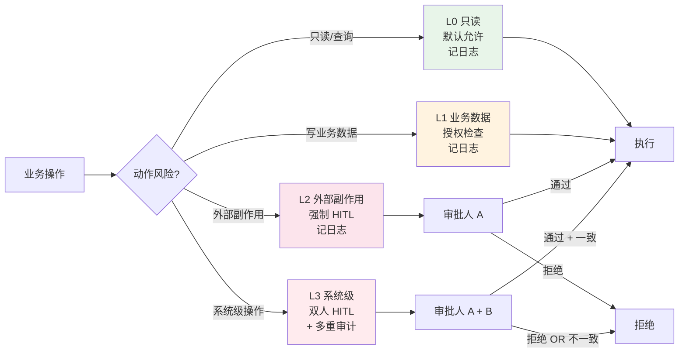
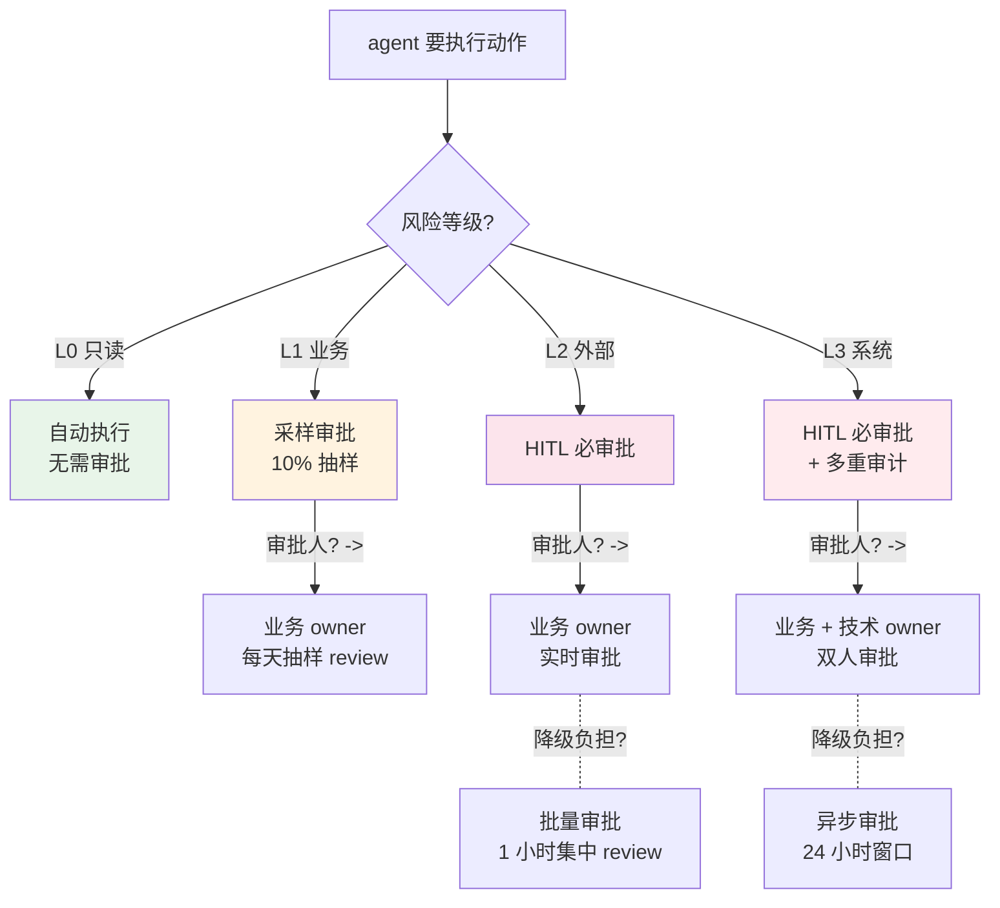

# 权限设计与人机协作决策树

> **本系列**：深入理解 Agent 工程化特性 · 方向 5：安全治理 · 篇 10 / 共 10 篇（**收官篇**）
> **前置阅读**：建议先看篇 9《Agent 安全治理：6 层政策栈》（理解 L1 权限 + L4 HITL 基础）
> **本文不写什么**：不写代码 / 不写具体 HITL 实现（实践类走 `docs/practice/`）

## 一句话摘要

权限设计与 HITL 是 agent 上线前的硬性门槛——权限 ladder 决定 agent 能做什么，HITL 决定哪些必须人工审批。本文讲清**权限 4 级分层模型**（L0-L3）+ **HITL 决策树**（何时审批 + 谁能审批 + 如何降级负担）+ **policy-as-code vs policy-as-prompt 取舍** + 3 大反模式与真实代价 + 特性层 10 篇全系列收官导航。

---

## 二、目标导向：本文是什么 + 功能 + 能得到什么 + 为什么用

本文是什么：特性层收官篇，讲权限 + HITL 两个 agent 生产必备能力的设计原则与决策方法。

功能是什么：解决"agent 上线后怎么防止越权 + 怎么降低 HITL 负担"——权限 ladder 分级 + HITL 决策树，让 agent 既安全又可用。

能得到什么：4 级权限模型设计 + HITL 决策树（4 类风险 × 3 类审批人）+ 降级 HITL 负担的 5 种方法 + policy-as-code vs policy-as-prompt 取舍 + 特性层 10 篇系列导航。

为什么用：任何 agent 处理真实业务（金钱 / 数据 / 权限）都要做权限 + HITL——这是篇 9 的实操续篇，也是特性层 10 篇收官。

---

## 三、权限 4 级分层模型（L0-L3）

**核心思想**：**所有操作按风险分级**——agent 默认只能做最低风险动作，高风险动作要显式授权。

### L0-L3 4 级权限定义

| 级别 | 操作类型 | 风险 | 示例 | 授权方式 |
|---|---|---|---|---|
| **L0 只读** | 查询 / 读取 | 低 | 查数据库 / 读文件 / 搜索 | **默认允许** |
| **L1 写业务数据** | 写入数据库 / 修改业务记录 | 中 | 创建订单 / 更新用户资料 | 显式授权（agent type / scope） |
| **L2 外部副作用** | 调用外部 API / 发送消息 / 转账 | 高 | 调支付 API / 发邮件 / 转账 | **强制 HITL** |
| **L3 系统级** | 删数据 / 改配置 / shell / 容器 | 极高 | 删数据库记录 / 改配置文件 / 执行 shell | **强制 HITL + 多重审计** |

### 关键设计原则

**原则 1：默认拒绝**
- agent **默认只能做 L0**（只读）
- L1+ 必须显式授权（用户 / 管理员）
- **"白名单"思维**而非"黑名单"

**原则 2：按动作分类而非按用户分类**
- 不是说"agent A 能做 L2"，而是"agent A 在 X 场景下能调 delete_record 工具（L2）"
- **场景驱动**比"用户级别权限"更精细

**原则 3：可撤销**
- 任何授权都可以**立即撤销**（不需重新部署）
- 撤销要走审计日志（谁 + 何时 + 为什么）

**原则 4：审计完整**
- 每个权限检查都留日志（用户 / agent / 动作 / 时间 / 结果）
- 审计日志 = 合规底线

### 4 级权限的实战映射

不同业务场景的 L0-L3 映射示例：

| 业务场景 | L0 | L1 | L2 | L3 |
|---|---|---|---|---|
| **电商客服 agent** | 查订单 / 查商品 | 修改订单备注 / 修改收货地址 | 发起退款 | 删除订单 |
| **代码助手 agent** | 读代码 / 搜 API | 改代码 / 提交 PR | 部署到生产 | 删除生产文件 |
| **数据分析 agent** | 查数据 / 生成报表 | 写 ETL 任务 | 推送报表给客户 | 删数据库表 |
| **金融 agent** | 查账户 / 查交易 | 修改用户信息 | 转账（小额）| 转账（大额）/ 改利率 |

**关键洞察**：**L2 / L3 的边界** = 业务核心风险点——金额阈值 / 数据敏感性 / 用户量级。**这个边界是动态的**——业务变化时权限 ladder 也要调。

### 4 级权限的判定流程（一笔业务操作的完整路径）



---

## 四、HITL 决策树（4 类风险 × 3 类审批人）

HITL（Human-in-the-Loop，人机协作）是 agent 安全的关键——但**滥用 HITL = 没人用 agent**。HITL 的核心是"哪些必须审批 + 谁能审批 + 如何降级负担"。



### HITL 4 类风险 × 3 类审批人矩阵

| 风险等级 | HITL 必要性 | 审批人 | 决策权 |
|---|---|---|---|
| **L0 只读** | ❌ 不需要 | - | agent 自动 |
| **L1 业务数据** | ⚠️ 抽样（10%）| 业务 owner | agent 自动 + 事后审计 |
| **L2 外部副作用** | ✅ 必审批（实时）| 业务 owner | 人工实时审批 |
| **L3 系统级** | ✅✅ 双人审批（实时）| 业务 owner + 技术 owner | 人工双人审批 |

### HITL 5 种降级负担方法

**方法 1：批量审批**（适合 L1 抽样）
- agent 先执行 + 记录
- 业务 owner 每小时 / 每天集中 review
- "事后审计"而非"事前审批"

**方法 2：异步审批**（适合 L2 部分场景）
- agent 标记需要审批的动作
- 24 小时窗口内人工审批
- 超时自动拒绝（避免"无限等待"）

**方法 3：分级审批**
- 不同风险动作给不同人审批（如转账 1k 内 → 经理，1k-1w → 总监）
- 减少高级别审批人的负担

**方法 4：白名单用户**
- 信任度高的用户 / 高级用户 → 跳过部分审批
- 普通用户 → 全部审批

**方法 5：审批模板化**
- 审批界面提供"一键拒绝 +常见理由"按钮
- 减少每次审批的思考时间

### HITL 的"反绕过"设计

HITL 不能被绕过——必须防止以下情况：

- **审批疲劳**：连续 100 次同样审批 → 审批人不看就点"通过"
- **审批代理**：一个人替另一个人审批（绕过职责分离）
- **审批超时**：agent 永远等审批 → 阻塞业务

**防护**：批量抽样 + 时间窗口 + 审批日志审计。

---

## 五、policy-as-code vs policy-as-prompt 取舍

agent 政策（policy）的两种实现方式——**业界共识：policy-as-code 是正确方向**。

### 两种方式对比

| 维度 | policy-as-code | policy-as-prompt |
|---|---|---|
| **存储** | 代码文件（可版本控制 / 审计）| 在 system prompt 里 |
| **执行** | 代码强制执行（hook / 拦截器）| LLM 推理（不强制）|
| **可靠性** | **高**（绕过 LLM）| **低**（prompt injection 可绕过）|
| **可测试** | ✅ 易写单元测试 | ⚠️ 难测（依赖 LLM 行为）|
| **可审计** | ✅ 代码 diff 可见 | ⚠️ prompt 修改难追溯 |
| **性能** | 快（hook 执行毫秒级）| 慢（多一次推理调用） |

### 关键洞察：**LLM 不理解"规则"**

LLM 只是 pattern matching——**没有真正理解"不能做 X"**。prompt injection 攻击可以构造"忽略之前所有指令"的 prompt，让 agent 完全"听话"执行被禁止的操作。

**policy 必须写在代码里**，**绕过 LLM**：

```
policy-as-code:  ✅ L2 hook 拦截删除数据库 → LLM 不知道这条规则存在
policy-as-prompt: ❌ prompt 说"不要删除数据" → prompt injection 可以绕过
```

### 何时用 policy-as-prompt？

**仅 3 类场景**：
1. **临时调试**（不重要的 demo / PoC）
2. **业务边界模糊**（无法用代码精确表达，如"礼貌地回复用户"）
3. **补充说明**（policy-as-code 之外的"软规则"）

**核心**：**policy-as-code 是默认**，**policy-as-prompt 是例外**。

### 业界典型实现

| 框架 | 政策实现 | 类型 |
|---|---|---|
| **NVIDIA NeMo-Guardrails** | Colang 脚本（DSL）| policy-as-code |
| **LangChain Guardrails** | Runnable + OutputParser | policy-as-code |
| **Anthropic Constitutional AI** | 宪法 + LLM 评判 | policy-as-prompt 补充 |

---

## 六、3 大反模式 + 真实代价

### 反模式 1：HITL 所有动作都审批

**现象**：团队为了"安全第一"，**所有工具调用都要人工审批**——agent 跑 5 分钟要审批 20 次。

**真实代价**（**不点名大厂**）：某 SaaS 平台上线 HITL 后，**用户使用率降 60%**——3 个月后用户绕开 agent，**改回手动操作**。agent 投资打水漂。

**正确做法**：**只高风险动作审批**——L0 不审批 / L1 抽样 / L2 必审批 / L3 双人审批。

### 反模式 2：权限只按用户分

**现象**：团队按"用户角色"分配权限——"普通用户用 agent L0，管理员用 agent L3"。

**真实代价**（**不点名大厂**）：某金融平台"管理员"账号被钓鱼——agent L3 权限被滥用，**1 小时内转账 1000 万**。

**正确做法**：**按动作分类 + 多因素授权**——"管理员能做 L3，但每次 L3 都要 HITL + 多重审计"——管理员的权限 ≠ 跳过审批。

### 反模式 3：权限写死在代码里

**现象**：权限判断写在 agent 代码里——`if user.role == "admin": do_l3()`。

**真实代价**：**改权限要改代码 + 重新部署**——业务调整（"双 11 大促所有 L1 升级到 L2 自动"）要等上线，业务节奏被打断。

**正确做法**：**权限走 policy 配置中心**——权限规则写在配置文件 / 数据库，agent 实时查询，**改权限 = 改配置 ≠ 改代码**。

---

## 七、与 Eval / Trace 协同

### 权限 + Eval = 协同设计

**权限层产生的数据 → 喂 Eval**：

| 权限层 | 数据 | 喂 Eval 维度 |
|---|---|---|
| L0/L1 自动执行 | 执行成功率 / 错误率 | "agent 自动执行效果" |
| L2 HITL 必审批 | HITL 通过率 / 拒绝率 | "HITL 必要性"（拒绝率高 = 风险判断不准） |
| L3 双人审批 | 双人意见一致率 | "审批一致性" |
| 权限拒绝 | 越权尝试次数 | "安全态势" |

### 权限 + Trace = 协同设计

**Trace 必须含权限字段**：

- 每个 span 含 `permission_check`（允许 / 拒绝）
- 每个拒绝 span 含 `denial_reason`（权限不足 / HITL 拒绝 / sandbox 拒绝）
- 每个 HITL 审批 span 含 `hitl_approver` / `hitl_decision` / `hitl_latency_ms`

**Trace 是合规审计的基石**——出事后唯一能"复盘"的依据。

### 安全监控的 4 大核心指标

| 指标 | 来源 | 阈值 | 异常处理 |
|---|---|---|---|
| **越权尝试率** | L1 日志 | < 1% | 可能是攻击 → 立即调查 |
| **HITL 拒绝率** | L4 日志 | 5-20% | 太高 = agent 行为异常 |
| **HITL 平均延迟** | L4 日志 | < 30s | 太高 = 审批人负担重 |
| **L3 双人一致性** | L4 日志 | > 95% | < 95% = 审批标准不统一 |

---

## 八、特性层 10 篇系列收官 + 后续方向

### 特性层 10 篇完整地图

```
深入理解 Agent 工程化特性（特性层 L2 · 5 大方向 · 10 篇）
├── 0_系列导读-全景（轻量化全景 + 5 大方向地图）
├── 方向 1：编排引擎
│   ├── 1_四家编排引擎架构横评
│   └── 2_编排引擎状态管理与选型决策树
├── 方向 2：MCP 协议
│   ├── 3_MCP 协议设计思想与 spec 演进
│   └── 4_MCP 无状态化改造与生态选型
├── 方向 3：可观测与评测
│   ├── 5_Agent 特有的 5 类失败模式 + Eval 三层
│   └── 6_Trace 设计思想与指标选型决策树
├── 方向 4：记忆系统
│   ├── 7_记忆系统架构横评
│   └── 8_记忆系统选型决策树与反模式
└── 方向 5：安全治理
    ├── 9_Agent 安全治理：6 层政策栈 + OWASP ASI
    └── 10_权限设计与人机协作决策树（本文，收官）
```

### 与入门层 14 篇的关系

**入门层（L1）** 讲"Agent 是什么 / 为什么 / 怎么用"——**认知层**
**特性层（L2）** 讲"工程化的 5 大方向怎么选 / 怎么用 / 怎么避坑"——**决策层**

两者的区别：
- **入门层**：扫盲，让读者"知道 agent 是什么"
- **特性层**：决策，让读者"知道 agent 怎么选、怎么用、怎么避坑"

**配套关系**：入门层看完知道"agent 是啥"——特性层看完知道"agent 怎么生产化"。

### 后续可能的方向（L3 专题层 / L4 整合层）

按 4 层架构判定标准，未来可能拆出 L3 专题层：

| 候选 L3 专题 | 触发条件 | 状态 |
|---|---|---|
| **LangGraph 深度** | LangGraph 写完 ≥ 3 篇后拆专题 | 待启动 |
| **MCP 安全审计深度** | MCP 安全事件足够多 | 待启动 |
| **Agent 评测体系深度** | Eval/Trace 实践足够多 | 待启动 |
| **记忆系统领域专用**（编码 / 客服 / 数据分析）| 3 类领域各 3 篇+ | 待启动 |

### 配套实践类（docs/practice/）

特性层 10 篇**讲原理 + 决策**，**不讲代码**。**实践类文章**走 `docs/practice/` 独立目录：

```
docs/practice/
├── 从零开始整合LangGraph/        ← 对应方向 1
├── 从零开始接入MCP/             ← 对应方向 2
├── 接入Eval平台/                 ← 对应方向 3
├── 从零开始接入Mem0/             ← 对应方向 4
└── 搭建Agent安全治理/            ← 对应方向 5
```

---

## 九、给新老读者的收官提醒

### 给"刚开始 agent 项目"的读者

按入门层 → 特性层 → 实践类的顺序看：

```
入门层（14 篇）
  ↓
特性层 0 导读（先看全景地图）
  ↓
特性层 1-10（按需深入）
  ↓
docs/practice/（实践类，跑通代码）
```

**先建立全景认知**——不要"急着写代码"。

### 给"已经在做 agent"的读者

特性层 10 篇都是**决策文档**——**不是教程**。建议你按 3 步使用：

**Step 1：定位你关心的问题**——查 0 导读找对应篇
**Step 2：读那篇 deep-dive**——看完能讲清"为什么这样设计"
**Step 3：回到你的项目**——按决策树反推"我应该用什么"

### 给"想写更多特性层文章"的读者

如果你想继续写特性层 L3 专题：

1. **按 1.1.1 标准确认清单**（tech-sop §1.1.1 已沉淀）
2. **目标导向段用 v2 格式**（1 段话 4 维，**不再用旧 3 段**）
3. **不点名大厂**（正文取舍段落）
4. **Mermaid 全角标点 0 + ASCII 引号 0**（教训应用）
5. **6 Loop 通过**（含 script 一键验证）

---

## 📌 数据与事实声明

- 权限分级模型（L0-L3）基于业界共识（OWASP ASI + LangChain 文档 + LangSmith 实践）
- HITL 决策树基于 NeMo-Guardrails + LangChain Guardrails + Galileo 等多源实践综合
- policy-as-code vs policy-as-prompt 取舍基于多家 agent 团队公开案例综合
- 真实代价案例（**不点名大厂**）基于公开安全事件 + 内部实践综合
- 本文为「深入理解 Agent 工程化特性」**10 篇特性层收官篇**——10 篇全部完成

## 📚 参考资料

| 类型 | 标题 | 来源 |
|---|---|---|
| 开源框架 | NVIDIA NeMo-Guardrails（policy-as-code 标杆）| github.com/NVIDIA/NeMo-Guardrails |
| 官方文档 | LangChain Guardrails | langchain.com/guardrails |
| 商业实践 | Anthropic Constitutional AI | anthropic.com/constitutional-ai |
| 行业文章 | Guardrails for Autonomous AI Agents: Production Safety 2026 | khimananda.com/blog/guardrails-for-autonomous-ai-agents |
| 行业文章 | Day 37: Safety Guardrails — Human-in-the-Loop for Agentic Actions | clouddc.substack.com/p/day-37-safety-guardrails-human-in |
| 行业文章 | How to Build Human-in-the-Loop Oversight for AI Agents（Galileo）| galileo.ai/blog/human-in-the-loop-agent-oversight |
| 行业文章 | The AI Agent Code of Conduct: Automated Guardrail Policy-as-Prompt Synthesis（arXiv 2509.23994）| arxiv.org/abs/2509.23994 |
| 前置阅读 | Agent 安全治理：6 层政策栈（篇 9）| docs/ai/特性层/深入理解Agent工程化特性系列/9_Agent安全治理-深度.md |
| 前置阅读 | 系列导读 0_系列导读-全景 | docs/ai/特性层/深入理解Agent工程化特性系列/0_系列导读-全景.md |
| 入门层基础 | Harness 是什么（篇 9）| docs/ai/入门层/从零开始认识AI系列/9_Harness是什么.md |
| 入门层基础 | MCP 协议与生态（篇 10）| docs/ai/入门层/从零开始认识AI系列/10_MCP协议与生态.md |

---

**🎉 特性层 10 篇全部完成。**