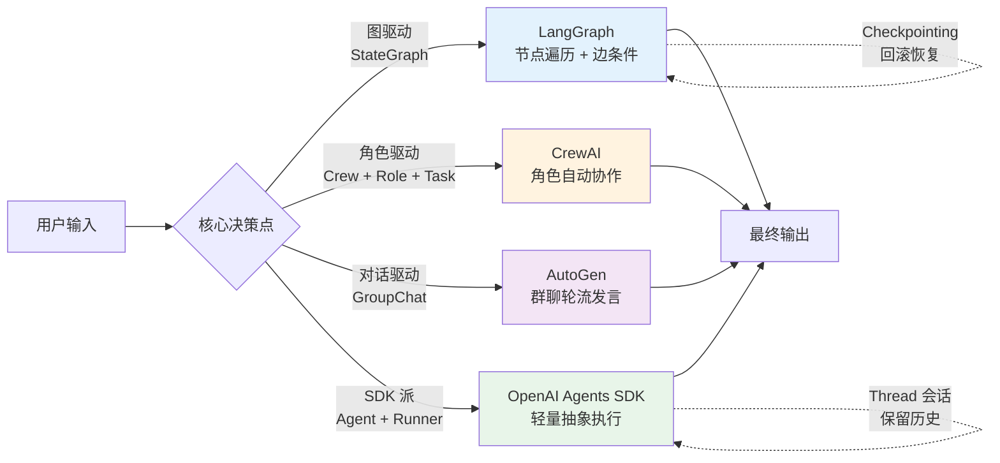
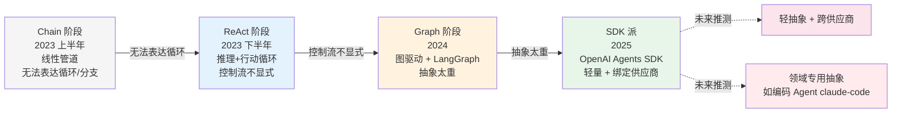

# 四家编排引擎架构横评：从图驱动到 SDK 派的范式漂移

> **本系列**：深入理解 Agent 工程化特性 · 方向 1：编排引擎 · 篇 1 / 共 10 篇
> **本文能给你什么**：4 家主流编排框架（LangGraph / CrewAI / AutoGen / OpenAI Agents SDK）的架构模型对比 + 范式漂移逻辑 + 选型理由
> **本文不写什么**：不写代码 / 不写 API 用法 / 不写 benchmark 性能实测 / 不深入拆解单个框架

## 一句话摘要

Agent 编排框架是 agent 的"操作系统层"——负责调度、状态管理、多 agent 协作。本文从架构模型横评 LangGraph（图驱动）/ CrewAI（角色驱动）/ AutoGen（对话驱动）/ OpenAI Agents SDK（SDK 派），讲清 4 家设计哲学的差异、范式漂移的演进逻辑，以及为什么 claude-code 这种领域专用编码 agent 的 star 数远超任何通用框架。

---

## 一、什么是 Agent 编排框架（轻量科普）

在开始横评之前，先把"编排框架"这个概念固定下来——本文只做轻量定义，**深入拆解单个框架的 API 设计、内部实现、生产配置**留到后续独立专题（如 `LangGraph深度/`、`CrewAI深度/` 等）。

一个 LLM agent 要真正"跑起来干活"，仅靠模型本身是不够的——模型只负责"这一步该怎么思考"，但整个 agent 系统需要回答三个更高层的问题：

1. **调度**：agent 下一步该做什么？该用哪个工具？该调用哪个 LLM？该停下来还是继续？
2. **状态**：跨多步执行的上下文怎么保存？用户输入 / 中间结果 / 工具返回值 / 历史决策怎么管理？出错时怎么回滚？
3. **协作**：多 agent 之间怎么通信？谁负责派活？谁是最终的"决策者"？谁负责汇总结果？

**Agent 编排框架就是回答这三个问题的"操作系统层"**——它把"agent 应该怎么做决策"的逻辑抽象出来，让开发者不用从 0 写调度循环和状态机。

但 4 家主流框架对这 3 个问题的回答方式完全不同——这就是本文要拆的"架构模型差异"。理解了这层差异，选型就不再是"哪个流行选哪个"，而是"哪个抽象适合我的业务"。

---

## 二、本文的作用 + 不写什么

**本文的作用**：帮你在 4 家主流框架间做**架构选型决策**——看完后你能讲清"为什么这个场景该选 LangGraph、那个场景该选 CrewAI、不该选 AutoGen 的是什么场景"。

**本文不写**：
- ❌ **代码示例**——怎么 import / 怎么调用 / 怎么定义 agent，**全部留给实践类文章**（`docs/practice/从零开始整合LangGraph/` 等独立目录）
- ❌ **API 用法对比**——每个框架的函数签名、参数列表、返回值类型不展开
- ❌ **benchmark 性能实测**——延迟、吞吐量、token 消耗等量化对比不在本文范围（评测类文章会涉及）
- ❌ **深入拆解单框架**——比如 LangGraph 的 checkpoint 机制怎么实现、CrewAI 的角色冲突检测算法等，**本文只到"架构层抽象"为止**，深入留专题层
- ❌ **不点名大厂**——正文取舍段落不点名具体公司（业内不同部门场景差异巨大，点名反而误导）；但参考资料段可列官方资料与权威博客

**本文能给你什么**：
1. 4 家框架的**架构模型对比表**（一眼看清抽象层级差异）
2. 范式漂移的**演进逻辑**（理解为什么 SDK 派又回到"轻抽象"）
3. **选型理由**——能讲清"为什么这个场景选这个、不选那个"

---

## 三、四家架构横评表

下表是本文核心——用 5 个维度对比 4 家框架的架构模型：

| 维度 | LangGraph（图驱动） | CrewAI（角色驱动） | AutoGen（对话驱动） | OpenAI Agents SDK（SDK 派） |
|---|---|---|---|---|
| **抽象层级** | 低（节点 + 边可完全控制） | 高（Crew/Role/Task 三件套） | 中（Assistant + GroupChat） | 极低（Agent + Runner，类似函数调用） |
| **核心数据结构** | StateGraph（节点=函数，边=条件） | Crew（团队）+ Role（角色）+ Task（任务） | GroupChat（多 agent 群聊）+ AssistantAgent | Agent（带 instructions/tools 的对象）+ Runner |
| **状态管理** | Checkpointing（每个节点持久化 state，可任意回滚/恢复） | 隐式（任务执行结果在内存，依赖外部存储） | 弱（GroupChat 上下文靠消息历史累积，难恢复） | 会话级（thread 概念，跨 turn 保留消息） |
| **扩展机制** | 自定义节点 / 条件边 / 子图嵌套 | 自定义 Tool / 自定义 Agent 行为 | 自定义 GroupChat 管理器 | 自定义 Tool / 自定义 Handoff（agent 间转交）|
| **核心心智模型** | "图"——像画流程图一样编排 agent | "团队"——像配置一支虚拟团队 | "对话"——像设计多角色对话剧本 | "函数"——agent 像可调用的工具 |

**5 个维度的核心差异一句话总结**：

- LangGraph 是**"控制流优先"**——把 agent 流程画成图，开发者拥有最大控制权，代价是心智负担重
- CrewAI 是**"角色优先"**——抽象成"团队+任务"，最贴近业务直觉，代价是黑盒多、生产调整受限
- AutoGen 是**"对话优先"**——抽象成多角色对话，研究场景灵活，代价是状态不可控、生产化困难
- OpenAI Agents SDK 是**"调用优先"**——抽象成轻量 SDK，OpenAI 官方背书，代价是绑定单一模型供应商

**这一节的目的是让你在"看下面 4 节具体分析"前，先建立全局认知**——下面 4 节会按 4 家分别展开，每家突出"为什么这样设计、解决了什么问题、代价是什么"。

下面这张流程图把 4 家框架的"核心抽象"映射到统一的 agent 执行流程（输入 → 决策 → 执行 → 输出）：



---

## 四、图驱动派：LangGraph

**LangGraph 的核心抽象是 StateGraph**——开发者定义节点（每个节点是一个函数或 agent 调用），用边连接节点，边可以带条件判断。整个 agent 流程就是一张有向图。

**为什么这样设计？**

LangGraph 来自 LangChain 团队，2024 年中推出。它想解决的核心问题是：**前一代 LangChain Chain 的"线性管道"无法表达复杂 agent 行为**——比如循环（agent 反复调用工具直到满足条件）、分支（不同情况走不同路径）、持久化（agent 跑到一半崩了能从断点恢复）。这些需求用 Chain 表达要么很别扭，要么根本做不到。

StateGraph 把 agent 流程变成图，天然支持循环、分支、子图嵌套。配合 **checkpointing** 机制（每个节点执行完自动持久化状态），可以实现：

- 任意节点任意时刻**回滚恢复**
- **human-in-the-loop**：在图的某个边加"中断"，等人工审批后再继续
- **streaming**：边执行边输出节点结果，不用等整个图跑完

**为什么被生产选？**

图驱动的心智负担重（要画图、要设计状态 schema），但**生产化能力最强**——可观测（每步都有 trace）、可调试（可回滚到任意节点）、可扩展（自定义节点是普通函数）。这也是为什么 LangGraph 的 star 数（4 万）虽然不是 4 家最高的，但**生产环境采用率最高**——企业级项目对"可控性"的需求远大于"易上手"。

**代价是什么？**

- 心智负担：开发者必须理解"图"的概念，必须设计状态 schema
- 学习曲线：比 CrewAI / AutoGen 陡
- 调试复杂：图跑错时，要追"哪个节点出错、状态传错了什么"

**业内惯例**（不点名）：很多企业级 agent 平台用 LangGraph 做底层编排引擎，外层封装"角色"概念给业务团队用——本质上是**用图的"可控性"换业务团队的"易用性"**。

---

## 五、角色驱动派：CrewAI

**CrewAI 的核心抽象是 Crew（团队）+ Role（角色）+ Task（任务）三件套**——开发者定义一个虚拟团队，每个角色有自己的 backstory / goal / tools，每个任务分配给某个角色执行，框架自动协调角色间的协作。

**为什么这样设计？**

CrewAI 来自葡萄牙团队，2024 年初推出。它的设计灵感是**人类团队的工作方式**——而不是计算机的控制流。这种抽象对**业务人员**特别友好：你不用懂"图"或"对话流"，只要会描述"我需要一个研究员角色、一个写手角色、一个审核角色"。

**最贴近业务直觉**：

- Role = 团队成员，每个角色有名字、背景故事、目标
- Task = 任务清单，每个任务分配给某个角色，可定义预期输出
- Crew = 团队，定义角色怎么协作（顺序？层级？共识？）

**为什么易上手但有生产坑？**

上手成本极低（10 分钟能跑通一个 multi-agent demo），但**生产化能力有限**：
- 状态隐式：任务执行结果在内存中，没有 checkpointing
- 错误处理弱：某个角色失败时，整个流程怎么回滚？CrewAI 没有给出原生答案
- 黑盒多：角色冲突怎么检测？任务依赖怎么管理？大多需要开发者自己实现

**业内惯例**（不点名）：很多**初创团队和业务 PoC** 喜欢用 CrewAI——因为能快速验证"AI 团队能不能解决我的业务问题"。但一旦进入生产阶段，**大多迁移到 LangGraph 或自研编排**——CrewAI 的"易上手"代价是"生产化困难"。

**适用场景**：业务流程清晰、角色边界明确、对错误容忍度高的场景（如内容创作工作流、研究调研流水线）。**不适用**：需要严格状态管理、需要可观测、需要高可靠性的生产场景。

---

## 六、对话驱动派：AutoGen

**AutoGen 的核心抽象是 AssistantAgent + GroupChat**——每个 agent 是一个独立的"对话者"，多 agent 通过对话协作（GroupChat 管理器决定下一个发言者是谁）。

**为什么这样设计？**

AutoGen 来自微软研究院，2023 年末首发。它的设计灵感是**多角色对话**——很像人类的"圆桌讨论"。这种抽象对**研究场景**特别友好：你设计好每个 agent 的 system prompt，让它们在 GroupChat 里自由对话，观察它们怎么协商、辩论、达成共识。

**研究友好**：
- 可以快速实验不同的 agent 角色配置
- 可以观察 agent 间的协作涌现行为
- 不需要预先设计控制流，让对话自然发生

**为什么难生产化？**

- **状态不可控**：GroupChat 的上下文是消息历史累积，跨多轮后上下文窗口爆炸，性能和成本失控
- **决策非确定性**：GroupChat 管理器决定下一个发言者，但这个决策本身可能不稳定（同一个输入可能选不同的下一个发言者）
- **调试困难**：对话式的失败很难定位（"哪句话导致 agent 走偏了？"）
- **可观测性弱**：不像 LangGraph 那样有清晰的节点 trace

**业内惯例**（不点名）：AutoGen 主要用于**学术研究和实验**——发论文、做 benchmark、快速验证想法。但**生产 agent 系统几乎不用 AutoGen**——它的"灵活"代价是"不可控"，而生产系统最需要的是"可控"。

**适用场景**：多 agent 协作研究、agent 行为实验、教学演示。**不适用**：任何需要 SLA、需要可观测、需要稳定性的生产场景。

---

## 七、SDK 派：OpenAI Agents SDK

**OpenAI Agents SDK 的核心抽象是 Agent + Runner**——Agent 是一个带 instructions / tools / handoffs 的对象，Runner 负责执行 Agent。整套设计非常轻量，开发者写几行代码就能让 agent 跑起来。

**为什么这样设计？**

OpenAI Agents SDK 在 2025 年推出，是**OpenAI 官方背书的轻量框架**。它的设计哲学是**"反 LangGraph 的过度抽象"**——SDK 派认为大多数 agent 场景不需要复杂的图编排，只需要"给 agent 一组工具让它自己决定用哪个"。

**轻量 + 官方背书**：
- 抽象极简（Agent + Runner 两件套）
- 官方支持 trace / guardrails / handoffs（agent 间转交任务）
- 与 OpenAI 模型深度集成（function calling / structured outputs / 多模态）
- 学习曲线极平（懂 Python 就能上手）

**代价是什么？**
- **绑定单一供应商**：虽然是 SDK 形式，但设计思路是为 OpenAI 模型优化的，迁移到 Anthropic / 开源模型会有摩擦
- **抽象能力有限**：复杂控制流（条件分支、循环、子图嵌套）需要自己在 Agent 内部实现
- **生态较新**：相比 LangGraph / AutoGen，第三方集成和社区案例还在积累

**业内惯例**（不点名）：很多团队在**OpenAI 模型是主力 + agent 场景相对简单**时，会首选 OpenAI Agents SDK——用最少的抽象成本拿到 OpenAI 官方的所有能力。但一旦业务复杂化（需要精细控制、需要跨供应商、需要复杂状态管理），会迁移到 LangGraph 或自研。

**适用场景**：agent 逻辑相对简单（几步推理 + 几个工具）、OpenAI 模型是主力、追求快速上线。**不适用**：复杂业务流程、需要跨供应商、需要精细状态控制的场景。

---

## 八、范式漂移逻辑

4 家框架的差异不是偶然——背后是 agent 编排领域的**范式漂移**。从 2023 年到现在，agent 框架走过了 4 个阶段，每个阶段都在"回答上一个阶段没解决的问题"，同时"引入新的代价"。



```
Chain（线性管道）
    ↓ Chain 无法表达循环/分支
ReAct（推理+行动循环）
    ↓ ReAct 控制流不显式，难以调试
Graph（图驱动，LangGraph）
    ↓ Graph 抽象太重，业务团队门槛高
SDK 派（轻抽象，OpenAI Agents SDK）
    ↓ SDK 派绑定供应商，灵活度不够
未来方向（推测）：领域专用抽象 + 可组合的轻抽象
```

**Chain 阶段（2023 上半年）**：

LangChain 早期主推 Chain 抽象——把 LLM 调用、Prompt、输出解析器串成管道（`prompt | llm | parser`）。优点是简单清晰，缺点是无法表达循环（agent 需要反复调用工具直到满足条件）和分支（不同情况走不同路径）。

**ReAct 阶段（2023 下半年）**：

ReAct 论文（Yao et al., 2022）提出"推理 + 行动"循环——LLM 自己决定调用哪个工具、调用几次。LangChain 引入 `AgentExecutor` 抽象支持 ReAct。优点是 agent 终于有了循环能力，缺点是**控制流不显式**——开发者只能看到 agent 的输入输出，看不到"为什么 agent 决定调用这个工具"。

**Graph 阶段（2024）**：

LangGraph 把 agent 流程画成图——开发者可以显式定义节点、边、条件、回滚。优点是**完全可控**，缺点是**抽象太重**——业务团队需要理解图的概念，需要设计状态 schema，心智负担大。CrewAI 在这个阶段推出，定位是"业务团队友好的替代品"——用"角色"代替"图"，用"团队"代替"控制流"。

**SDK 派阶段（2025）**：

OpenAI Agents SDK 重新回归"轻抽象"——Agent + Runner 两件套，类似函数调用。**这是对 LangGraph 过度抽象的反弹**——业界发现大多数 agent 场景不需要复杂的图编排，只需要"给 agent 一组工具让它自己决定"。但 SDK 派的代价是"绑定供应商 + 灵活度不够"。

**未来方向**（不点名推测）：

业界可能会向两个方向分化：
1. **轻抽象 + 跨供应商**：类似 SDK 派但不绑定单一供应商，让 agent 代码能在 OpenAI / Anthropic / 开源模型间无缝切换
2. **领域专用抽象**：为特定领域（编码 Agent、客服 Agent、研究 Agent）设计专用编排框架，把"领域知识"硬编码到框架里

**编码 Agent 已经在走第 2 条路**——claude-code 是典型代表（见下节）。

---

## 九、业内惯例总结：claude-code 14w star 的工程化壁垒

最后讲一个值得深思的现象——claude-code 作为单一编码 agent（不是通用框架），star 数（14.1万）**超过 4 家通用编排框架中任何一家的 2 倍以上**。这是为什么？

**不点名大厂，但讲场景**：通用 agent 框架在生产化上面临三大壁垒，**编码 agent 反而都跨过了**：

### 壁垒 1：工具稳定性

通用 agent 需要"调用任意工具"——但工具的稳定性、错误处理、重试机制都是开发者的负担。**编码 agent 的工具集合是固定的**（读文件、写文件、运行命令、搜索代码）——可以把这些工具的可靠性打磨到极致，每个工具的错误返回、边界情况、组合使用都经过大量生产验证。

**场景类比**：通用框架像"瑞士军刀"——什么都能干但每个功能都不够锋利；编码 agent 像"专业手术刀"——只干一件事但做到极致。

### 壁垒 2：上下文工程

通用 agent 需要在"任意场景"下保持上下文——上下文窗口怎么管理、哪些信息该保留、哪些该压缩、什么时候该重置，**都是开放问题**。**编码 agent 的上下文是结构化的**（文件树 + 当前任务 + 工具调用历史 + 代码片段）——可以设计专门的上下文压缩、摘要、检索机制，**比通用 agent 简单得多**。

### 壁垒 3：评测体系

通用 agent 的输出是开放的——同一个 prompt 可以有无数合理的回答，**怎么评测好坏是个难题**。**编码 agent 的输出是客观的**（代码能不能跑、测试通不通过、lint 有没有警告）——可以建立自动化评测体系，持续回归。

**这 3 大壁垒的本质是：通用性 vs 专业性的 trade-off**——通用框架为了"什么场景都能用"付出了"每个场景都不够好"的代价；编码 agent 为了"只做一件事"换来了"那件事做到极致"的回报。

**对未来 agent 框架的启示**（不点名）：

- **不要试图做一个"万能 agent 框架"**——4 家通用框架的 star 数增长已经在放缓
- **领域专用 agent 是下一个战场**——编码、客服、研究、销售，每个领域都可能诞生自己的"claude-code"
- **编排框架会向"领域专用抽象"演化**——类似 LangGraph 的"图"太通用，不如"为编码场景设计的抽象"或"为客服场景设计的抽象"

---

## 📌 数据与事实声明

- 4 家框架 star 数（langchain-ai/langgraph 40,000 / crewAIInc/crewAI 57,300 / microsoft/autogen 60,507 / openai/openai-agents-python 28,761 / anthropics/claude-code 141,950）为 2026-08-19 gh CLI 当天实测
- 范式漂移时间线（Chain → ReAct → Graph → SDK 派）为业界公开发展史综合
- ReAct 论文：Yao et al., 2022, "ReAct: Synergizing Reasoning and Acting in Language Models"（arXiv:2210.03629）
- 本文为「深入理解 Agent 工程化特性」方向 1 第 1 篇，**深入拆解单框架留到专题层**（后续可开 `LangGraph深度/` `CrewAI深度/` 等独立专题）
- 与入门层（从零开始认识AI系列）不重叠：入门层讲"Agent 是什么"，本篇讲"4 家编排框架架构怎么设计、为什么这么设计"

## 📚 参考资料

| 类型 | 标题 | 来源 |
|---|---|---|
| 论文 | ReAct: Synergizing Reasoning and Acting in Language Models（Yao et al., 2022） | arxiv.org/abs/2210.03629 |
| 开源项目 | LangGraph | github.com/langchain-ai/langgraph |
| 开源项目 | CrewAI | github.com/crewAIInc/crewAI |
| 开源项目 | AutoGen | github.com/microsoft/autogen |
| 开源项目 | OpenAI Agents SDK | github.com/openai/openai-agents-python |
| 开源项目 | Claude Code | github.com/anthropics/claude-code |
| 行业文章 | CrewAI vs LangGraph vs AutoGen vs OpenAgents 框架对比（2026-02-23） | openagents.org/blog/posts/2026-02-23-open-source-ai-agent-frameworks-compared |
| 行业文章 | AI Agent Frameworks Compared（2026-04-22） | pecollective.com/blog/ai-agent-frameworks-compared |
| 行业文章 | Best Multi-Agent Frameworks 2026 Production Readiness（2026-05-02） | gurusup.com/blog/best-multi-agent-frameworks-2026 |
| 行业文章 | LangGraph vs CrewAI vs AutoGen vs OpenAI Agents SDK（2026-03-23） | callsphere.ai/blog/ai-agent-framework-comparison-2026-langgraph-crewai-autogen-openai |