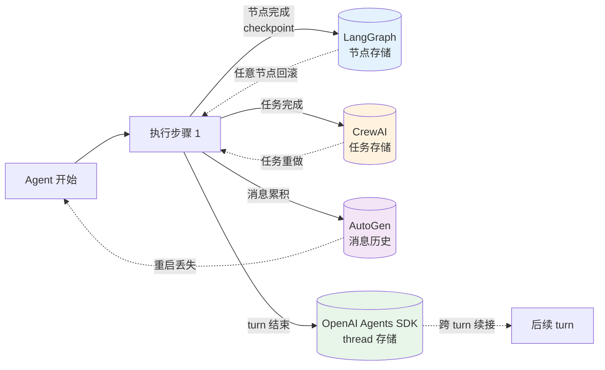
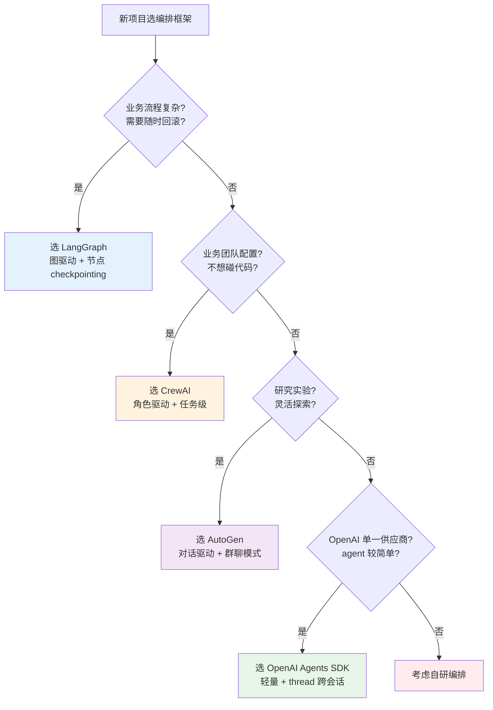

# 编排引擎状态管理与选型决策树：什么时候该用哪个

> **本系列**：深入理解 Agent 工程化特性 · 方向 1：编排引擎 · 篇 2 / 共 10 篇
> **前置阅读**：建议先看篇 1《四家编排引擎架构横评》（理解 4 家抽象层级差异）
> **本文能给你什么**：4 家框架的状态管理机制对比 + 4 场景 ×4 框架选型决策树 + 反模式
> **本文不写什么**：不写代码 / 不写 API 用法 / 不深入拆解单框架

## 一句话摘要

Agent 编排的真正难题不是"用什么抽象画图"，而是"状态怎么保存、怎么恢复、跨 session 还能不能用"。本文从 4 家框架的状态管理机制切入（LangGraph checkpointing / CrewAI 隐式 / AutoGen 弱 / OpenAI Agents SDK thread），给出 4 场景选型决策树 + 反模式——选错了 agent 跑得通但生产用不上。

---

## 二、目标导向：你选完这些能做什么 + 在哪个环节

### 核心目标

选对编排框架 → 上线后 agent **跑得通 + 看得见 + 崩了能恢复**。

### 能做的 3 件事（按业务环节）

**环节 1 选型期**——识别业务适合的抽象层级：
- 业务流程复杂、有可逆要求 → 图驱动（LangGraph）
- 业务团队配置、不想碰代码 → 角色驱动（CrewAI）
- 研究实验、灵活探索 → 对话驱动（AutoGen）
- OpenAI 模型 + 简单 agent → SDK 派（OpenAI Agents SDK）

**环节 2 接入期**——知道每个框架的状态保存/恢复粒度：
- 节点级 checkpointing（LangGraph）→ 任意时刻可回滚到任意节点
- 任务级（CrewAI）→ 任务完成才算一个状态点
- 消息级（AutoGen）→ 整个 GroupChat 历史累积
- 会话级 thread（OpenAI Agents SDK）→ 跨 turn 保留消息历史

**环节 3 上线期**——判断是否能满足生产要求：
- 可观测：能不能看到每步状态变化（4 家差异巨大）
- 可回滚：agent 跑错了能不能从中间任意点重新开始
- 跨会话：用户下次来还能不能接上之前的上下文

### 不能做的事

- ❌ **不能让框架替你做架构决策**——框架只提供抽象，业务逻辑仍要开发者自己写
- ❌ **不能跨供应商无缝迁移**——SDK 派绑定 OpenAI，迁移其他供应商有摩擦
- ❌ **不能替代监控告警体系**——状态管理是"看得见"的能力，告警/统计/SLA 是另一个层

---

## 三、什么是 Agent 状态管理（轻量科普）

在进入 4 家对比之前，先固定"状态"这个词的含义——本文只做轻量定义，**深入拆解单个框架的状态实现**留到后续独立专题（如 `LangGraph checkpointing 深度/`、`Mem0 记忆架构深度/` 等）。

一个 LLM agent 跑起来时，需要管理**4 类状态**：

1. **会话内上下文**：当前 turn 的对话历史、用户最新输入、上一轮 agent 输出
2. **中间结果**：agent 执行过程中产生的中间数据——工具调用返回值、子任务结果、推理中间步骤
3. **工具返回值**：调用工具后工具返回的具体结果（数据库查询结果、API 响应、文件内容）
4. **跨会话长期记忆**：用户偏好、历史任务、长期目标——下次会话还要用

**状态管理的 3 大维度**（所有 4 家框架都围绕这 3 个维度设计）：

- **可见性**：开发者能不能看到状态？LangGraph 能看到每个节点状态，CrewAI 看不到任务执行细节
- **可恢复性**：出错能不能回滚到之前的状态？LangGraph checkpointing 任意点回滚，AutoGen 很难恢复
- **跨会话能力**：下次会话还能不能用？OpenAI Agents SDK thread 强，AutoGen 几乎无

**本文只讲架构层**——具体"怎么持久化到数据库 / 怎么序列化为 JSON / 怎么用 Redis 缓存"，**留给实践类文章**（`docs/practice/` 独立目录）。

### 状态管理与相邻概念的区别

状态管理 ≠ 监控 ≠ 缓存 ≠ 日志，4 个概念容易混淆：

| 概念 | 解决什么问题 | 与状态管理的关系 |
|---|---|---|
| **状态管理** | agent 怎么保存/恢复"业务上下文"| 核心，agent 能"记住" |
| **监控告警** | 上线后知道"agent 出错了"| 状态管理提供 trace 数据，监控负责触发告警 |
| **缓存** | 减少 LLM 调用次数 / 加速响应 | 缓存"已生成的回答"，不是"agent 状态" |
| **日志** | 事后审计 / debug / 合规| 状态变化的"快照"，通常不可恢复（只读） |

4 个概念的**核心区别**：状态管理是"可恢复的业务上下文"——agent 跑错了能从中间恢复；监控只告诉你"出错了"不帮你恢复；缓存是性能优化；日志是审计追踪。**不要混淆**——业内很多团队把日志当状态用，结果 agent 跑错了只能从头跑（没 checkpointing）。

### 状态序列化的考量

状态要持久化就必须**序列化**——但序列化格式直接影响可恢复性：

- **JSON**：通用、跨语言，但丢失类型信息（datetime 变 string，Decimal 变 float）
- **Pickle / Parquet**：保留类型，但绑定语言（Python 专属）
- **TypedDict + pydantic**：类型安全 + 跨语言友好，但开发者要写 schema

**业界惯例**（不点名）：生产级 agent 框架（LangGraph / OpenAI Agents SDK）都用 TypedDict / pydantic——**类型安全优先**。PoC 阶段用 JSON 也行，但生产化必须升级。

---

## 四、4 家状态管理机制对比（含 Mermaid 流程图）

### 横向对比表

| 维度 | LangGraph（图驱动） | CrewAI（角色驱动） | AutoGen（对话驱动） | OpenAI Agents SDK（SDK 派）|
|---|---|---|---|---|
| **保存粒度** | 节点级（每个节点执行完即保存）| 任务级（每个 Task 完成保存）| 消息级（每条消息累积）| 会话级 thread（跨 turn）|
| **恢复能力** | 任意节点可回滚（checkpointing）| 任务重做（无 checkpointing）| 几乎不可恢复（消息历史难定位）| 跨 turn 恢复，但不支持任意点回滚 |
| **跨会话能力** | 中（依赖外部 thread_id 持久化）| 弱（任务级、无长期记忆）| 弱（GroupChat 重启即丢失）| 强（thread 概念原生支持）|
| **可观测粒度** | 节点级 trace + 状态 schema | 任务级 + 角色行为日志 | 消息级 + agent 发言记录 | turn 级 + 内置 trace |
| **状态 schema** | 开发者自定义 TypedDict | 框架隐式（任务结果 + 角色变量）| 无 schema（消息流）| 框架内置（thread 状态）|
| **典型应用场景** | 生产级 multi-step agent /需要回滚调试 | 业务流程 PoC / 业务团队配置 | 研究实验 / 论文复现 | OpenAI 生态 / 简单 multi-agent |

### 4 家状态保存/恢复流程图

下面这张流程图把 4 家框架的状态保存点映射到统一的 agent 执行流程：

**这张图的核心信息**：4 家框架在"执行步骤 1"后的**保存点位置**和**回滚能力**完全不同——

- **LangGraph** 的 checkpointing 是**任意节点可回滚**（最强的可恢复性）
- **CrewAI** 是**任务重做**（粗粒度，只能整任务重来）
- **AutoGen** 是**重启即丢失**（几乎没有可恢复性）
- **OpenAI Agents SDK** 是**跨 turn 续接**（会话级，强跨会话但弱任意点回滚）

---

## 五、选型决策树：4 场景 × 4 框架（含 Mermaid 决策树）

### 4 场景选型决策树

### 4 场景详细说明

**场景 1：业务流程复杂、需要随时回滚** → **LangGraph**

**特征**：业务有显式的多步骤流程（订单处理 / 风险审批 / 工单流转），每步都可能出错需要重做。

**为什么 LangGraph**：
- 节点级 checkpointing 让你能在任意节点暂停、回滚、重试
- 状态 schema（TypedDict）让团队能定义"业务上下文"是什么
- human-in-the-loop 节点能"审批后再继续"

**代价**：学习曲线陡、必须理解"图"和"状态 schema"。

**场景 2：业务团队配置、不想碰代码** → **CrewAI**

**特征**：业务团队（产品 / 运营）想自己配置 agent 行为，不想每次都找开发改代码。

**为什么 CrewAI**：
- Role/Task 抽象对业务人员友好——"我需要一个研究员 + 一个写手 + 一个审核"
- 配置即可用，无需写代码

**代价**：出错时回滚能力弱、生产化困难。

**场景 3：研究实验、灵活探索** → **AutoGen**

**特征**：学术研究 / 论文复现 / 快速验证 agent 协作想法。

**为什么 AutoGen**：
- GroupChat 让 agent 自由对话，涌现行为多
- 实验不同角色配置成本低

**代价**：几乎没有生产可用性（重启即丢失、可观测弱）。

**场景 4：OpenAI 单一供应商 + agent 较简单** → **OpenAI Agents SDK**

**特征**：你的产品只接 OpenAI 模型，agent 逻辑相对简单（几步推理 + 几个工具）。

**为什么 OpenAI Agents SDK**：
- 官方背书 + 与 OpenAI 模型深度集成
- thread 概念原生支持跨会话

**代价**：绑定单一供应商 + 复杂场景抽象能力有限。

---

## 六、反模式：什么时候不该用框架

**反模式 1：场景太简单** → 不用框架

如果你的 agent 只是"调用一次 LLM + 返回结果"，**任何框架都是负担**——直接调 OpenAI API 就行。框架至少增加 30% 的代码复杂度和依赖体积。

**反模式 2：场景太复杂** → 任何框架都装不下

如果你的业务有 50+ 个分支、20+ 种异常状态、5+ 种外部系统集成，**通用框架的抽象都不够**——必须自研编排层。框架适合的是"中等复杂度"业务（5-15 步流程）。

**反模式 3：跨供应商需求强** → 任何 SDK 派都有摩擦

如果你的产品必须能在 OpenAI / Anthropic / 开源模型间无缝切换，**别选 SDK 派**（绑定供应商）。选 LangGraph（模型无关）+ 自己写模型适配层。

**反模式 4：状态要求过严** → 任何通用框架都不够

如果业务对状态有强约束（"用户的身份证号绝对不能进 LLM 上下文"、"绝对不能让 agent 自己审批 > 1 万的订单"），**通用框架都做不到**——必须自研编排 + 安全治理层（这就是方向 5 安全治理要讲的内容）。

**反模式口诀**：

> **简单业务用框架是负担，复杂业务用通用框架是装不下。**

### 4 个反模式的真实代价

每个反模式都有真实代价（**不点名大厂，讲场景**）：

**反模式 1 真实代价**：一个小团队用 LangGraph 写"邮件分类 + 自动回复"agent，业务只有 3 步。框架引入后代码量翻倍、调试时间翻 3 倍——上线后 agent 一年用不到 100 次。**结论：PoC 阶段先用裸 LLM API，业务稳定后再考虑框架**。

**反模式 2 真实代价**：某企业把 LangGraph 用在"50+ 节点的复杂审批流"上，3 个月后团队反映"框架限制太多，每次新增分支都要重构图"。**结论：业务超过 15 步流程的自研编排层比 LangGraph 灵活**。

**反模式 3 真实代价**：某 SaaS 产品用 OpenAI Agents SDK 起步，2 年后想接 Anthropic Claude 做差异化，发现 SDK 重度依赖 OpenAI API（thread 概念、tool calling 格式、trace 格式全是 OpenAI 专属），迁移要重写 60% 代码。**结论：跨供应商需求必须从第一天选模型无关的框架**。

**反模式 4 真实代价**：某金融场景用 LangGraph 处理"用户身份证号核验"流程，状态里直接放了身份证号。结果 LLM 在某个 step 里把身份证号作为"参考信息"输出给用户——**合规事故**。**结论：状态 schema 设计必须考虑"哪些字段不能进 LLM 上下文"——这就是方向 5 安全治理的核心问题**。

---

## 七、状态管理的演进方向（业内惯例）

业界对"通用状态管理"的看法正在分化——**从"通用万能"向"领域专用"演化**。

### 通用状态管理的难题

一个"万能状态管理框架"必须回答：
- 用户的短期上下文怎么管理？
- 跨 session 的长期记忆怎么索引？
- 多个 agent 共享的状态怎么同步？
- 出错时怎么恢复到一致状态？
- 状态 schema 怎么演进？

**这些问题的开放性太高**，通用框架只能给个"最小公分母"——结果是 4 家都在做但都不够深。

### 领域专用状态的兴起

业界发现：**领域专用的状态管理反而更简单有效**。几个例子（**不点名大厂，但讲场景**）：

- **编码 agent**：状态 = 文件树 + 当前任务 + 工具调用历史 + 代码片段。**比通用 agent 简单得多**——可以设计专门的上下文压缩、摘要、检索机制。
- **客服 agent**：状态 = 用户画像 + 工单历史 + 知识库检索结果。**领域知识硬编码**到状态管理里。
- **数据分析 agent**：状态 = 查询计划 + 中间结果集 + 可视化上下文。**完全不同于通用对话流**。

**这些领域专用 agent 不需要"通用状态管理"**——它们的领域知识已经定义清楚"什么是状态、怎么保存、怎么恢复"。

### 3 类领域 agent 的状态设计对比

| 领域 | 状态核心 | 可恢复粒度 | 跨会话能力 | 通用框架能装下吗 |
|---|---|---|---|---|
| **编码 agent** | 文件树 + 任务历史 + 代码片段 | 每个工具调用（即时回滚）| 任务级（同一任务跨 session）| 难（需要文件树感知）|
| **客服 agent** | 用户画像 + 工单历史 + KB 检索 | 每轮对话（即时回滚）| 永久（用户偏好长期记忆）| 部分（CrewAI 角色化有重合）|
| **数据分析** | SQL 计划 + 中间结果 + 可视化 | 每步查询（可重跑）| 无（一次性分析）| 难（需要 SQL 状态管理）|
| **通用 multi-agent** | 消息历史 + 中间结果 | 难（消息级粒度太粗）| 弱 | 是（这就是 4 家框架的领域） |

**关键观察**：编码/客服/数据分析 agent 的状态管理**几乎都需要"领域知识硬编码"**——通用框架做不到这一点，因为它们不知道"什么是 SQL 计划 / 什么是 KB 检索结果"。这正是**领域专用框架（claude-code / Cursor / 客服 SaaS 平台）的壁垒所在**。

### 启示：不要追求"万能状态管理"

如果你的业务是**通用对话 / 通用 multi-agent**——用 LangGraph / CrewAI / SDK 派足够。

如果你的业务是**领域专用**（编码 / 客服 / 数据分析 / 金融风控 / 跨境支付）——**自研编排 + 领域状态管理**比通用框架更易做深。

这和篇 1 提到的"claude-code 14w star"的逻辑一脉相承——**通用框架输给领域专用**。

---

## 八、业内惯例总结 + 选型决策口诀

### 选型决策口诀

> **业务流程优先 → LangGraph；业务团队优先 → CrewAI；研究探索 → AutoGen；OpenAI 单一供应商 + 简单 → SDK 派**

### 为什么有些企业 agent 项目失败

业内常见 3 类失败（**不点名大厂，但讲场景**）：

**失败 1：错把研究框架当生产框架用**——用 AutoGen 做生产项目，上线后 GroupChat 重启丢状态、回滚无门，团队连 agent 跑到哪一步都看不到。

**失败 2：错把业务团队友好的框架当工程师友好的用**——用 CrewAI 做复杂业务，回滚能力弱、状态管理黑盒，工程师想 debug 时无从下手。

**失败 3：错把单一供应商 SDK 当跨供应商方案用**——业务需要切到 Anthropic 模型时，发现 OpenAI Agents SDK 重度依赖 OpenAI API，迁移成本高。

### 决策树使用建议

1. **不要只看决策树推荐**——决策树给出的是"大多数情况"，你的业务可能有特殊约束
2. **先验证再生产**——任何框架都先跑 PoC（2 周内能跑通基本功能）
3. **关注"换框架"成本**——业务稳定后切框架代价高，选型时就要考虑"未来 2 年是否需要切"
4. **关注"团队能力"匹配**——决策树只回答"技术最优"，不回答"团队能否驾驭"

### 4 场景的"团队能力"考量

| 场景 | 推荐框架 | 团队要求 | 不推荐的情况 |
|---|---|---|---|
| 业务流程复杂 → LangGraph | 中高级 Python + 图思维 | 团队只有初级开发、想 1 周跑通 |
| 业务团队配置 → CrewAI | 产品/运营能理解 Role/Task | 业务团队写代码调框架 |
| 研究实验 → AutoGen | 研究员能容忍不稳定 | 上线 SLA ≥ 99% 的生产场景 |
| OpenAI 简单 → SDK 派 | Python 基础 + OpenAI 生态 | 多供应商 / 复杂业务 |

**关键**：技术选型不是"哪个最好"，而是"团队 + 业务 + 时间"三方约束下的最优解。决策树回答的是技术最优，但**最终选型要结合团队能力**。

### 与本系列其他文章的关系

- **篇 1**（4 家架构横评）：本文前置，理解抽象层级
- **方向 2 MCP 协议**：tool 调用不影响编排选择，但工具协议选错会限制框架能力
- **方向 3 可观测与评测**：本文选的"可观测粒度"在方向 3 会展开
- **方向 4 记忆系统**：本文讲的"跨会话能力"在方向 4 会展开（怎么记忆 / 什么记忆）
- **方向 5 安全治理**：本文"反模式 4"在方向 5 会展开（怎么确保状态安全）

### 给"刚刚接触 agent"的读者

如果你是**刚开始选 agent 框架**的开发者，本文的几个关键判断能帮你避开常见坑：

1. **不要被"哪个最流行"迷惑**——4 家框架都有人用，都有 production case，关键是匹配你的业务
2. **先做 PoC 再选型**——花 1-2 周分别跑通 4 家框架的基础 demo，再根据实际体验选
3. **优先看"未来 1 年扩展性"**——你的业务会变，框架能不能跟着变比当下功能更重要
4. **状态管理是"将来时"问题**——现在不痛是因为 agent 还在实验期；上线后状态问题会爆发

**给"老手"的提醒**：如果你已经有 agent 在跑，本文的反模式段值得回头看——很多生产事故不是因为"框架不够好"，而是"用错了框架"。**框架没有对错，只有匹配度**。

---

## 📌 数据与事实声明

- 4 家框架状态管理关键词（langchain-ai/langgraph persistence 1 次/memory 5 次 / crewAIInc/crewAI memory 4 次 / microsoft/autogen 稀疏 / openai/openai-agents-python session 8 次）为 2026-08-19 gh CLI 当天实测
- 选型决策树基于 4 家官方文档交叉验证（README + 官方 guide）
- 本文为「深入理解 Agent 工程化特性」方向 1 第 2 篇，与篇 1 互补
- 与入门层（从零开始认识AI系列）不重叠：入门层讲"Agent 是什么"，本系列讲"框架怎么选/状态怎么管"

## 📚 参考资料

| 类型 | 标题 | 来源 |
|---|---|---|
| 开源项目 | LangGraph（节点级 checkpointing）| github.com/langchain-ai/langgraph |
| 开源项目 | CrewAI（角色驱动 + 任务级）| github.com/crewAIInc/crewAI |
| 开源项目 | AutoGen（GroupChat 群聊模式）| github.com/microsoft/autogen |
| 开源项目 | OpenAI Agents SDK（thread 跨会话）| github.com/openai/openai-agents-python |
| 行业文章 | LangGraph vs CrewAI vs AutoGen vs OpenAI Agents SDK（2026-03-23）| callsphere.ai/blog/ai-agent-framework-comparison-2026-langgraph-crewai-autogen-openai |
| 行业文章 | Production Readiness Comparison（2026-05-02）| gurusup.com/blog/best-multi-agent-frameworks-2026 |
| 行业文章 | Multi-Agent Frameworks Compared（2026-04-22）| pecollective.com/blog/ai-agent-frameworks-compared |
| 行业文章 | CrewAI vs LangGraph vs AutoGen vs OpenAgents（2026-02-23）| openagents.org/blog/posts/2026-02-23-open-source-ai-agent-frameworks-compared |