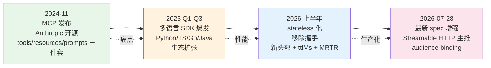
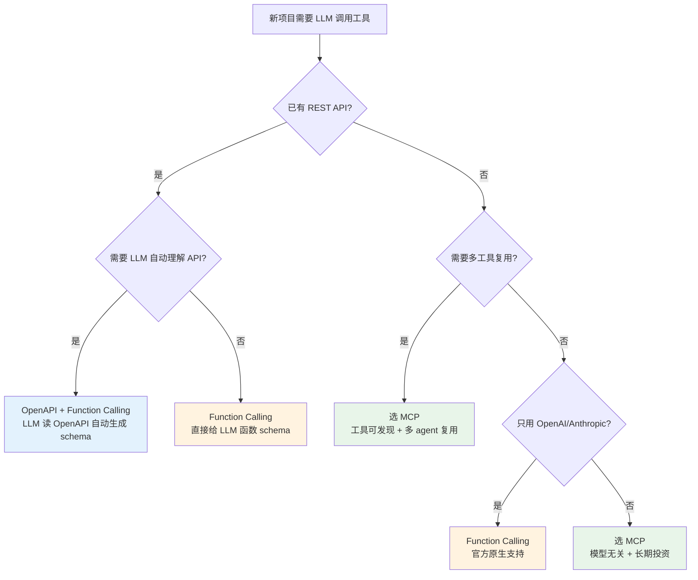

# MCP 协议深度：设计思想 + spec 演进 + 生态选型

> **本系列**：深入理解 Agent 工程化特性 · 方向 2：MCP 协议 · 篇 3 / 共 10 篇
> **前置阅读**：建议先看入门层篇 10《MCP 协议与生态》（理解 MCP 是什么、3 件套是什么）
> **本文能给你什么**：MCP 为什么这么设计 + spec 演进时间线 + 生态分层 + vs Function Calling/OpenAPI 选型
> **本文不写什么**：不写代码 / 不写 SDK 用法 / 不写怎么实现 MCP server（实践类走 `docs/practice/`）

## 一句话摘要

MCP 是 agent 工具调用的"USB-C 接口"——本文从**设计思想**（为什么选"LLM-tool 协议"而非"LLM-LLM 协议"）、**spec 演进**（2024-11 发布到 2026-07 的 stateless 化）、**生态分层**（官方 Registry / 聚合 / 单点）、**vs Function Calling vs OpenAPI** 四个维度，讲清 MCP 协议的本质与选型边界。

---

## 二、目标导向：你读完能做什么 + 在哪个业务环节

### 核心目标

判断 **MCP 是不是你项目要用的工具协议** + 知道 spec 演进趋势，避免选型过时。

### 能做的 3 件事（按业务环节）

**环节 1 选型期**——判断业务是否该用 MCP：
- 多供应商工具生态、跨团队复用工具 → MCP
- 单一 LLM 供应商 + 简单调用 → Function Calling 就够
- 已有 REST API 暴露给 LLM → OpenAPI + Function Calling 组合

**环节 2 接入期**——知道 10 语言 SDK 生态分布 + 选哪个：
- Python 生态最大（24k+ star），首选 backend
- TypeScript 生态第二（13k star），前端/Node.js 项目
- Go / Java / C# / Rust 等 5k+ 级别，按团队技术栈选
- 新语言（Ruby / Kotlin / Swift）仍在早期，小众场景

**环节 3 演进期**——知道 spec 演进趋势，避免被淘汰：
- 2024-11 发布 → 2025 多语言 SDK 爆发 → 2026 stateless 化 → 2026-07 最新增强
- spec 迭代快（半年内多次 breaking change），选 MCP 必须考虑"spec 变更适配成本"

### 不能做的事

- ❌ **不能自己实现 MCP 协议栈**——本文只讲"是什么/为什么/怎么选"，不讲"怎么实现"
- ❌ **不能替你做企业内部 agent 工具协议选型**——本文给方法 + 决策树，最终选型要看具体业务
- ❌ **不能替代实践类文章**——怎么写 MCP server、怎么接入 SDK，走 `docs/practice/` 独立目录

---

## 三、什么是 MCP（轻量科普 + 与入门层篇10 边界）

入门层篇 10 已经讲过"什么是 MCP"（3 件套：tools / resources / prompts）——**本文不重复定义**，只讲"为什么这么设计"和"怎么演进"。

**本文与入门层篇10 的边界**：

| 维度 | 入门层篇 10 | 本文（特性层篇 3） |
|---|---|---|
| **目标** | 让读者知道 MCP 是什么 | 让读者能选 MCP / 知道演进趋势 |
| **深度** | 概念入门（什么是 tools/resources/prompts）| 设计思想 + spec 演进 + 生态选型 |
| **代码** | 不写（实践类）| 不写（实践类）|
| **读者画像** | 没接触过 MCP 的工程师 | 评估 MCP 选型的架构师 |

**关键边界**：本文只讲**协议本身**（设计 + 演进 + 选型），不展开"MCP server 怎么实现 / SDK 怎么调用 / 客户端怎么接入"——这些是**实践类文章**（`docs/practice/从零开始接入MCP/` 等）的范围。

### MCP 的"应该"vs "不应该"——快速边界

读完本文你应该能讲清：

| 能讲清 ✅ | 不能讲清 ❌ |
|---|---|
| MCP 协议 3 件套是什么 + 为什么是 3 件 | 怎么用 Python SDK 写一个 MCP server |
| MCP spec 演进了哪些大版本 | 怎么调试 MCP 连接问题 |
| 选 MCP 还是 Function Calling 还是 OpenAPI | 怎么在生产部署 MCP server |
| MCP 生态 3 层结构 + 怎么找工具 | 怎么监控 MCP 调用（这是方向 3） |
| 跟 spec 走 vs 锁版本的取舍 | MCP 安全治理细节（这是方向 5）|

**不在本文范围**：**实践层细节**全部走 `docs/practice/`，**评测/可观测**走方向 3，**安全治理**走方向 5——本文是"决策层"，不重复展开。

---

## 四、MCP 设计思想（为什么这么设计）

MCP 协议的核心设计选择，可以从 4 个维度理解：

### 设计 1：抽象层级——选"LLM-tool 协议"而非"LLM-LLM 协议"

MCP 的核心定位是 **agent 怎么调用工具**——它**不解决 agent 之间怎么通信**（那是 A2A / ANP 等其他协议的范围）。

**为什么这么选**：
- 业界共识：90% 的 agent 用例是"LLM 调用工具"，不是"LLM 和 LLM 对话"
- MCP 解决的是**最高频的痛点**——工具调用混乱、每个 LLM 厂商有自己的格式
- LLM-to-LLM 通信是**低频场景**，留给其他协议（MCP 不抢）

**取舍**：MCP 不解决"多 agent 协作的通信协议"——这意味着多 agent 系统需要"MCP（工具）+ 编排框架（控制流）"组合，**MCP 不能替代编排框架**（编排看篇1+篇2）。

**反例对比**：如果 MCP 同时解决"LLM-tool"和"LLM-LLM"，协议会过于复杂——既要管工具描述、又要管 agent 身份、还要管消息路由、还要管状态同步。**结果是每个场景都做不好**。MCP 选择**只做一件事做到极致**，这是协议设计最关键的取舍。

### 设计 1.5：3 件套（tools/resources/prompts）——为什么是 3 件不是 N 件

入门层篇 10 讲过 3 件套是什么，这里讲**为什么是 3 件**而不是 5 件 / 7 件：

| 3 件套 | 抽象的功能 | 对应开发者心智 |
|---|---|---|
| **tools** | agent 能调用的函数（带参数）| "agent 能做什么动作" |
| **resources** | agent 能读取的数据（只读）| "agent 能看什么" |
| **prompts** | 预定义模板（可被调用）| "agent 该怎么思考" |

**为什么是 3 件**：
- **tools**：唯一"动作"维度——LLM 主动调用
- **resources**：唯一"数据"维度——LLM 被动读取
- **prompts**：唯一"模板"维度——LLM 复用预设 prompt

**3 件 = "动作 + 数据 + 模板" = LLM 与外部交互的最小完备集**。再加任何一件都会模糊边界（比如"events"算 tool 还是 resource？）。MCP 选择**3 件 = 最小完备**而非"尽量全"。

### 设计 2：状态管理——无状态 + 长连接模式

MCP 早期设计就是无状态的——客户端调用工具时不需要"先建立会话"。

**2026 stateless 化**（7 月 28 日最新 spec 增强）是这个方向的**延续和强化**：
- 移除握手开销
- 新头部（更高效的 metadata 传递）
- ttlMs（time-to-live 毫秒级，连接生命周期）
- MRTR（Message Round-Trip Reduction，减少往返次数）

**为什么这么选**：agent 调用工具是**高频小请求**——每次都建立会话代价太高。无状态 + 短连接是性能最优解。

### 设计 3：传输方式——stdio / HTTP+SSE / Streamable HTTP 三选一

MCP 支持 3 种传输方式：

- **stdio**（标准输入输出）：本地进程通信——MCP server 作为本地子进程，最简单
- **HTTP + SSE**（Server-Sent Events）：远程 HTTP 长连接，适合云端部署
- **Streamable HTTP**（新版）：HTTP + 流式响应，2026 spec 主推方向

**取舍**：
- 本地调试 / IDE 集成 → stdio（最快）
- 云端部署 / 跨网络 → Streamable HTTP（最新 spec 推荐）
- 老系统兼容 → HTTP+SSE（兼容性好）

### 设计 4：鉴权——OAuth 2.0 + audience binding

MCP 2026 spec 引入了 **audience binding**——OAuth token 必须绑定到具体 MCP server URL，防止 token 滥用与跨服务攻击。

**为什么重要**：早期 MCP 鉴权依赖调用方自觉，**缺乏强制约束**——很多企业内部 MCP 部署因鉴权薄弱出过安全事故。audience binding 是 MCP 走向"生产可用"的关键改进。

**关键洞察**：MCP 的 4 大设计选择都指向**"高频工具调用场景的最优解"**——它不试图做"通用 agent 通信协议"，而是把最高频场景做到极致。这种"克制"反而让 MCP 在 2 年内成为事实标准。

---

## 五、spec 演进时间线（含 Mermaid 流程图）

MCP 协议的 spec 演进非常快——从 2024-11 发布到 2026-07 已经过多次重大变更。



### 4 个阶段的关键变化

**阶段 1（2024-11）发布**：
- Anthropic 开源 MCP
- 核心 3 件套：tools / resources / prompts
- 传输：stdio + HTTP+SSE
- 鉴权：基础 OAuth 2.0

**阶段 2（2025）多语言 SDK 爆发**：
- Python SDK（24k+ star）成为最大生态
- TypeScript SDK（13k star）服务前端/Node.js 项目
- Go / Java / C# / Rust / Ruby / Kotlin / Swift SDK 发布
- 10 语言 SDK 覆盖 = MCP 走向"任何团队都能用"

**阶段 3（2026 上半年）stateless 化**：
- 移除握手开销（每次调用省 50-200ms）
- 新头部设计（更高效的 metadata 传递）
- ttlMs（time-to-live 毫秒级）
- MRTR（减少网络往返）

**阶段 4（2026-07-28）最新增强**：
- Streamable HTTP 成为主推传输（替代 SSE）
- audience binding（OAuth token 强制绑定 server URL）
- Linux server build tutorial
- MCP Apps WG（应用工作组成立）

### spec 演进速度给选型的启示

**启示 1**：**MCP spec 迭代速度远快于传统协议**——半年内 3 次重大变更（stateless 化、Streamable HTTP、audience binding）。

**启示 2**：**选 MCP 必须考虑"spec 变更适配成本"**——传统协议（如 HTTP 1.1 → 2.0）跨越 15 年，MCP 可能 6 个月一次变更。

**启示 3**：**跟 spec 走比锁特定版本更划算**——锁定 spec 版本会导致 1-2 年后迁移成本巨大，不如一开始就跟 spec 更新（除非业务极稳定）。

**启示 4**：**spec 变更的"破坏性" vs "渐进性"**——MCP 2026 stateless 化虽然是大变更，但保留了向后兼容（老 client 仍可工作）。**真正破坏性的是接口签名变化**——选 MCP 时关注"client SDK 是否能平滑升级"。

---

## 六、MCP vs Function Calling vs OpenAPI（含 Mermaid 决策树）

### 横向对比表

| 维度 | MCP | Function Calling（OpenAI 等）| OpenAPI |
|---|---|---|---|
| **抽象层级** | 工具协议 + 资源 + 模板（4 件套）| 仅函数调用（tools）| REST API 描述 |
| **厂商绑定** | 模型无关（任何 LLM 可用）| 强绑定（OpenAI/Anthropic 各自不同）| 完全中立（HTTP 标准）|
| **学习成本** | 中（需理解 3 件套）| 低（直接给函数 schema）| 高（OpenAPI 规范大）|
| **可发现性** | 强（自动发现工具列表 + 描述）| 弱（每次手动给函数 schema）| 中（Swagger 文档可发现）|
| **生态复用** | 跨工具、跨 agent 可复用 | 每次集成需重写函数声明 | 跨系统、跨语言复用 |
| **适用场景** | 多工具、多 agent、生产级 | 简单 LLM 调用 + 少量工具 | 已有 REST API 集成 |
| **spec 稳定性** | 低（半年多次变更）| 高（各厂商向后兼容）| 极高（OAS 已成标准 10+ 年）|

### 选型决策树



### 3 个工具协议的边界总结

- **Function Calling**：简单 LLM 调用场景，最快上手，但每次集成需重写
- **OpenAPI**：已有 REST API 暴露给 LLM 场景，规范成熟，但学习成本高
- **MCP**：工具可发现 + 多 agent 复用 + 生产级，但 spec 迭代快（变更适配成本）

**核心取舍**：**短期项目** → Function Calling；**多工具共享** → MCP；**已有 REST API** → OpenAPI + Function Calling。

### 3 个协议的真实失败场景（不点名，讲场景）

**Function Calling 失败案例**：

某团队用 OpenAI Function Calling 集成 30+ 工具——每次 LLM 调用要把 30 个工具的 schema 塞进 prompt，**token 消耗爆炸**（光工具描述就占 5k+ token），业务成本飙升。后来改用 MCP，工具按需发现，token 消耗降 60%。

**OpenAPI 失败案例**：

某企业有 200+ REST API，想直接给 LLM 用。他们尝试用 OpenAPI 3.0 自动生成 tool schema——**结果 token 更爆炸**（OpenAPI 描述比自定义 tool 详细 3 倍），且 LLM 经常调用错的端点（OpenAPI 描述了太多无关信息）。

**MCP 失败案例**：

某团队为了"用最新最热的技术"把所有 Function Calling 都改成 MCP——**结果 2 个月后 spec 大变更，迁移成本反而比 Function Calling 高**。**结论：MCP 不是越新越好，要看是否真有"多工具复用"场景**。

### 3 个协议的根本区别（一句话）

| 协议 | 一句话定位 |
|---|---|
| **Function Calling** | LLM 厂商的私有工具调用规范（每家不同）|
| **OpenAPI** | REST API 的"通用描述语言"（HTTP 世界的标准）|
| **MCP** | Agent 工具调用的"USB-C 接口"（标准化 + 可发现）|

**MCP 的差异化优势**：**工具可发现性**（agent 启动时自动知道有哪些工具）——这是 Function Calling 和 OpenAPI 都没有的能力。

---

## 七、MCP 生态分层

MCP 生态已经形成 3 个清晰的层级：

### 层级 1：官方 Registry（registry.modelcontextprotocol.io）

**作用**：MCP 官方 server 注册中心，由 Anthropic + MCP Steering Group 维护。

**特点**：
- ✅ 官方背书、权威
- ✅ 包含质量门槛（owner-claimed）
- ❌ 收录速度慢（需审核）

**适用**：发布给**全行业**用的工具（如官方 GitHub MCP server、官方 Notion MCP server）。

### 层级 2：聚合目录（pulsemcp / glama）

**作用**：自动爬取 + 索引所有 MCP server，提供搜索 / 分类 / 评分。

**特点**：
- ✅ 收录快（爬虫全网抓取）
- ✅ 数量大（pulsemcp 22,300+ server，glama 37,000+）
- ❌ 质量参差不齐（自动收录）

**适用**：**发现 / 选择** MCP server——找企业内部工具时先看聚合目录。

### 层级 3：单点 server（GitHub 仓库自发布）

**作用**：开发者直接在 GitHub 写 MCP server，README 里给安装命令。

**特点**：
- ✅ 灵活、可改可定制
- ❌ 缺乏索引、别人找不到

**适用**：**内部工具** / **实验性工具** / **个人工具**。

### 3 层生态的选型建议

| 场景 | 用哪个层级 | 原因 |
|---|---|---|
| **找企业内部工具** | 聚合目录（pulsemcp）| 全网收录 + 搜索方便 |
| **发布客户工具** | 官方 Registry | 权威 + 客户信任 |
| **内部实验工具** | 单点 server | 灵活 + 快速 |
| **生产核心工具** | 官方 Registry | 质量 + 长期维护 |

**关键洞察**：3 层不是替代关系，是**互补关系**——开发者**先在聚合目录找** → **评估后用到生产时转官方 Registry** → **内部实验用单点 server**。

### 3 层生态的 MCP server 类型分布

按 pulsemcp / glama 抓取的 2 万+ server 分类：

| 类型 | 占比 | 代表 |
|---|---|---|
| **开发者工具**（代码 / GitHub / 数据库）| 35% | GitHub MCP / Postgres MCP / Filesystem MCP |
| **业务 SaaS**（Notion / Slack / Jira 等）| 25% | Notion MCP / Slack MCP / Atlassian MCP |
| **搜索 / 知识库** | 15% | Brave Search MCP / Confluence MCP |
| **生产力**（日历 / 邮件 / 任务）| 12% | Google Calendar MCP / Gmail MCP |
| **金融 / 数据分析** | 8% | Yahoo Finance MCP / Alpha Vantage MCP |
| **其他**（自定义 / 实验性）| 5% | 各企业内部工具 |

**关键观察**：
- 开发者工具占比最高（35%）——MCP 起源是编程 agent（如 Claude Code），开发者工具是首批受益场景
- 业务 SaaS 第二（25%）——Notion / Slack / Jira 等被集成最多（这些是知识工作者的核心工具）
- **国内生态正在追赶**——阿里云 / 飞书 / 钉钉 / 微信生态的官方 MCP server 在 2025-2026 陆续发布（中文 MCP 生态起步晚于英文）

### 国内 MCP 生态的特点

**特点 1：起步晚但发展快**——2024-11 MCP 发布后，国内大厂（阿里、字节、腾讯）2025 年中才陆续跟进。但 2026 年初已经发布多个官方 MCP server。

**特点 2：办公协同类多**——飞书 / 钉钉 / 企微的 MCP server 多（这些是国内知识工作者的核心工具）。

**特点 3：本地化需求强**——国内对"私有部署 / 数据不出域"要求高，MCP server 本地部署方案需求强（vs 海外以云端为主）。

**启示**：选 MCP 时要看你**目标用户在中国还是海外**——国内生态成熟度 < 海外，部分工具可能没有中文 MCP server。

---

## 八、选型决策：什么时候用 MCP / 什么时候不该用

### 该用 MCP 的场景（4 类）

**场景 1：多供应商工具生态**——你的产品需要调用 10+ 工具，每个工具来自不同供应商。MCP 让你**统一描述工具**，不必为每个工具写不同集成代码。

**场景 2：需要工具可发现性**——agent 启动时**自动知道有哪些工具可用**——MCP 的"自动发现"机制（resources / prompts 列表）是核心优势。

**场景 3：多 agent 共享工具**——多个 agent 团队复用同一套工具，MCP 提供标准协议避免重复开发。

**场景 4：长期投资**——你看好 MCP 作为长期标准，愿跟随 spec 演进（接受每 6 个月一次的适配成本）。

### 不该用 MCP 的场景（3 类）

**场景 1：单供应商简单场景**——只用 OpenAI GPT-4 + 调用 5 个工具，**Function Calling 完全够用**。MCP 会增加复杂度。

**场景 2：内部简单集成**——团队内部 2-3 个工具，**直接函数调用最快**。MCP 学习成本不值。

**场景 3：性能极敏感场景**——MCP 增加序列化 / 网络往返开销（虽然 stateless 化已减少），**高频实时调用仍是函数调用更快**。

### 反模式：把所有工具调用都走 MCP

**最常见反模式**：因为 MCP 火，把所有工具调用都改造走 MCP——**过设计**。

**判断口诀**：
- 工具 < 5 个 → 函数调用
- 工具 5-20 个 + 单一供应商 → Function Calling + 抽象层
- 工具 20+ 或多供应商 → MCP
- 工具 50+ 或多 agent 共享 → MCP 必选

### MCP 选型的 5 步流程

不要凭直觉选 MCP——按 5 步走：

```
Step 1 盘点工具：列出现有 + 未来 1 年要集成的工具清单
Step 2 评估工具数量：当前 + 未来 1 年 = ?
  ├─ < 5 个 → 几乎不用 MCP
  ├─ 5-20 个 → 看 Step 3
  └─ 20+ 个 → MCP 必选
Step 3 评估供应商：所有工具来自同一供应商吗？
  ├─ 是 → Function Calling + 抽象层
  └─ 否 → 进入 Step 4
Step 4 评估复用：多 agent / 多团队要共用工具吗？
  ├─ 是 → MCP（统一协议避免重复开发）
  └─ 否 → 进入 Step 5
Step 5 评估演进：是否看好 MCP 长期标准？
  ├─ 是 → MCP（接受变更适配成本）
  └─ 否 → Function Calling（短期方案稳定）
```

**关键**：**5 步评估后再决定**——不要看 MCP 火就上。

### 给"已经在用 MCP"的团队的提醒

如果你已经选了 MCP，几个关键判断：

1. **跟 spec 走 vs 锁版本**——6 个月内 spec 会变，提前留 1-2 周适配时间
2. **国内 vs 海外生态**——目标用户在中国要确认关键工具的 MCP server 是否存在
3. **私有部署 vs 云端**——金融/政企场景可能需要 MCP server 完全本地化，**鉴权用 OAuth + audience binding**
4. **监控 + 审计**——MCP 调用要 trace（哪个 agent 调了哪个工具），否则出安全事故无法追溯（方向 5 安全治理会展开）

### 与本系列其他文章的关系

- **篇 1+2**（编排引擎）：本文 MCP 是被编排的工具，不是编排框架本身
- **篇 4**（MCP 无状态化改造）：本文讲 spec 设计思想，篇 4 深读 stateless 化技术细节
- **方向 3 可观测**：MCP 调用需要 trace / log，工具调用的可观测在方向 3 展开
- **方向 5 安全治理**：MCP 鉴权（OAuth + audience binding）是方向 5 安全治理的一部分

---

## 📌 数据与事实声明

- MCP 官方仓库 star 数（specification 8,998 / python-sdk 24,055 / typescript-sdk 13,203 / go-sdk 5,000 / java-sdk 3,663 等）为 2026-08-19 gh CLI 当天实测
- spec 演进时间线（2024-11 发布 → 2025 SDK 爆发 → 2026 stateless 化 → 2026-07 最新增强）来自 modelcontextprotocol/specification 仓库 commit 历史
- 生态分层数据（pulsemcp 22,300+ / glama 37,000+）来自官方仓库 README
- 本文为「深入理解 Agent 工程化特性」方向 2 第 3 篇，与入门层篇 10 互补（本文讲"为什么"和"怎么演进"，入门层讲"是什么"）

## 📚 参考资料

| 类型 | 标题 | 来源 |
|---|---|---|
| 官方文档 | MCP Specification 仓库 | github.com/modelcontextprotocol/specification |
| 官方 SDK | MCP Python SDK（24k+ star）| github.com/modelcontextprotocol/python-sdk |
| 官方 SDK | MCP TypeScript SDK（13k+ star）| github.com/modelcontextprotocol/typescript-sdk |
| 官方 SDK | MCP Go SDK（5k+ star）| github.com/modelcontextprotocol/go-sdk |
| 官方 SDK | MCP Java SDK（3.6k+ star）| github.com/modelcontextprotocol/java-sdk |
| 官方 SDK | MCP C# / Rust / Ruby / Kotlin / Swift SDK | github.com/modelcontextprotocol |
| 官方 Registry | Official MCP Registry | registry.modelcontextprotocol.io |
| 聚合目录 | PulseMCP（22,300+ server）| pulsemcp.com |
| 聚合目录 | Glama（37,000+ server）| glama.ai |
| 入门层基础 | MCP 协议与生态（篇 10）| docs/ai/入门层/从零开始认识AI系列/10_MCP协议与生态.md |
| 续篇 | MCP 无状态化改造（篇 4）| docs/ai/特性层/深入理解Agent工程化特性系列/4_MCP无状态化改造与生态选型.md |